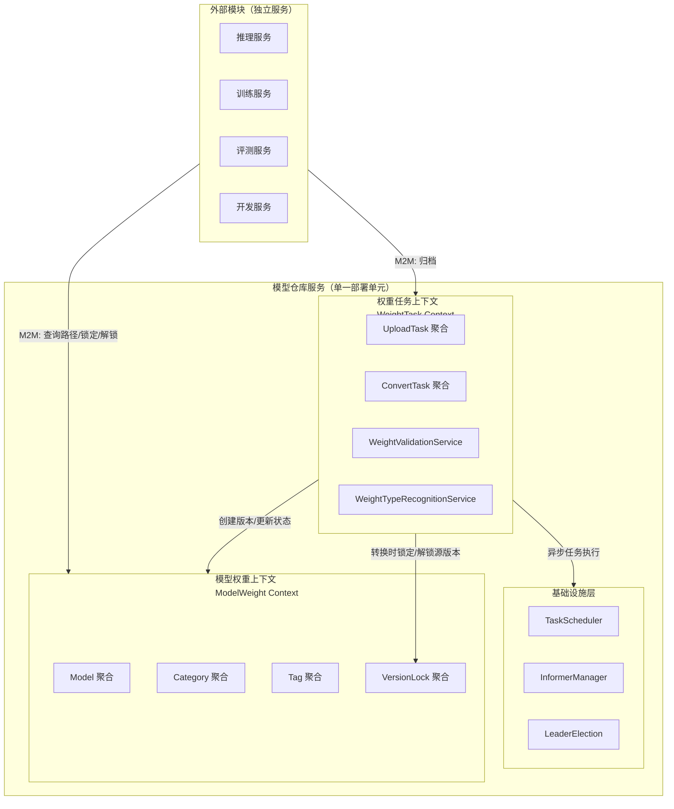
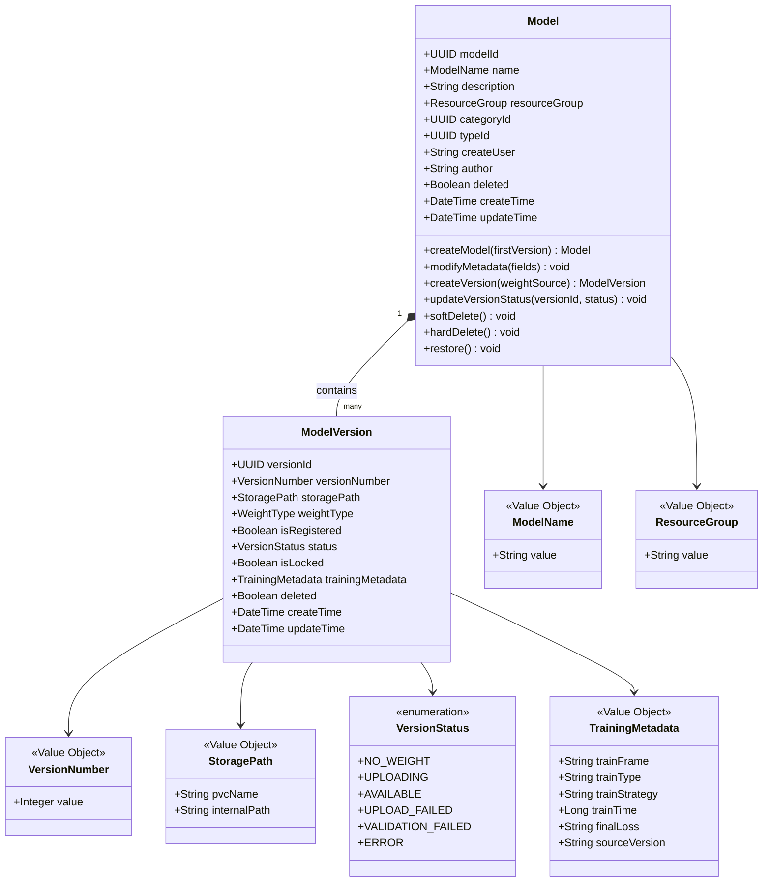
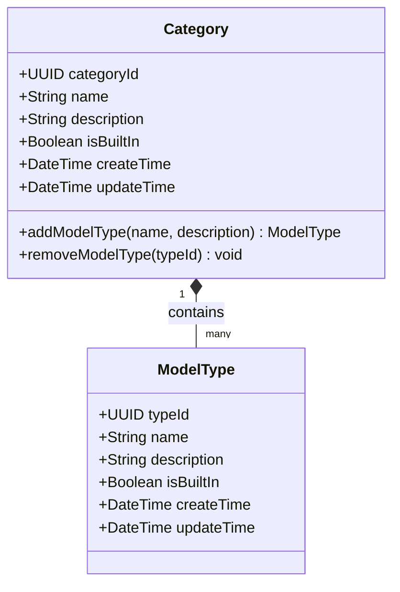
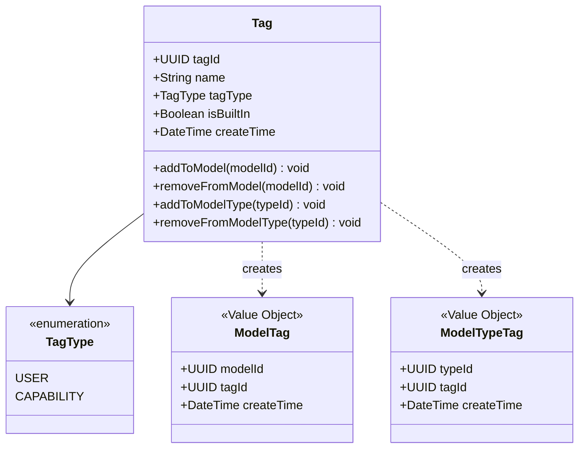
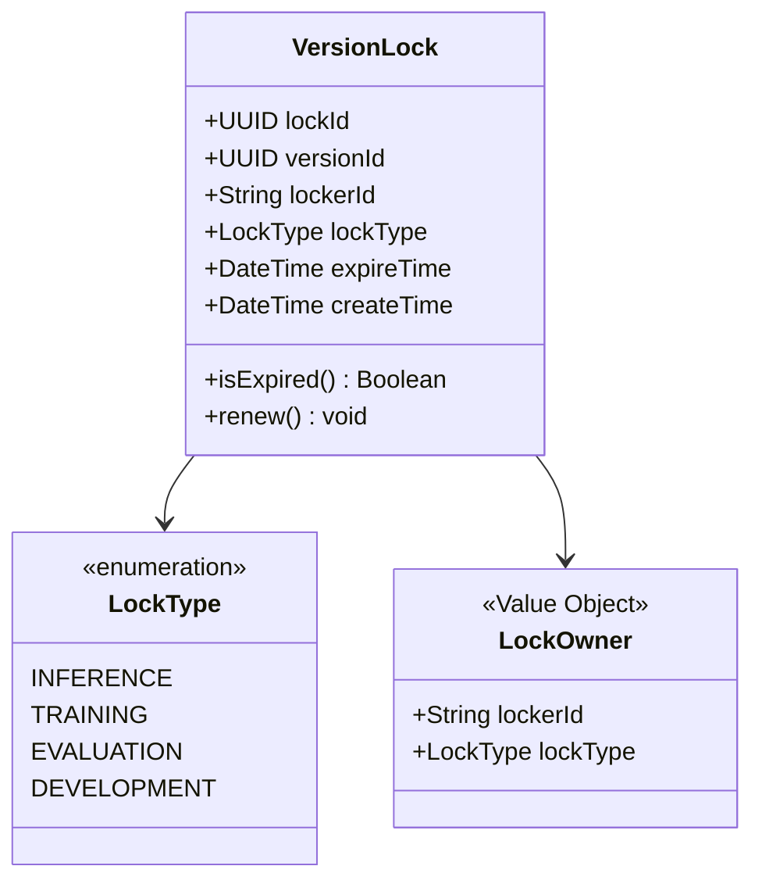
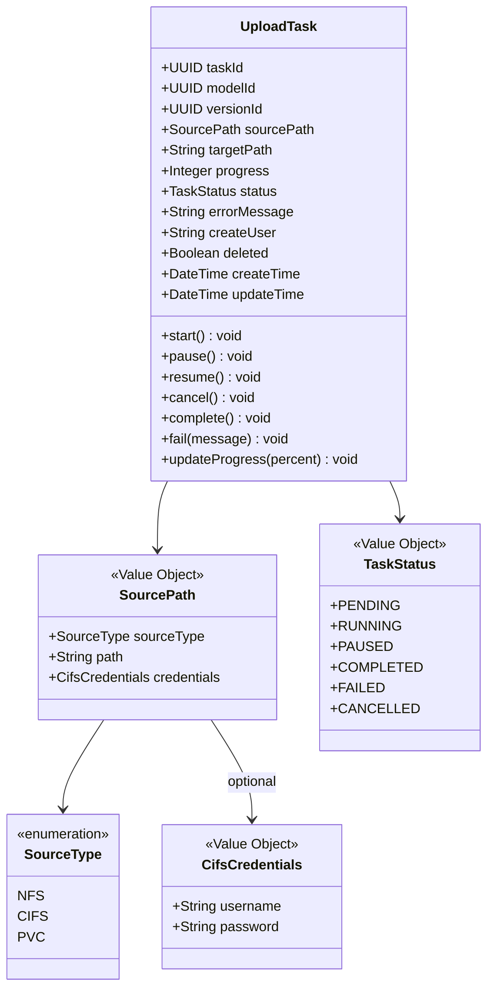
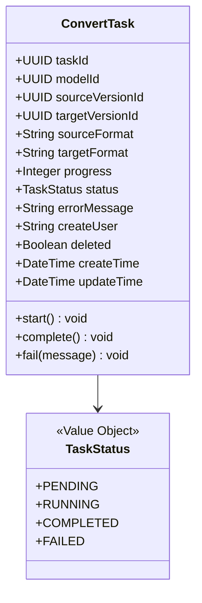
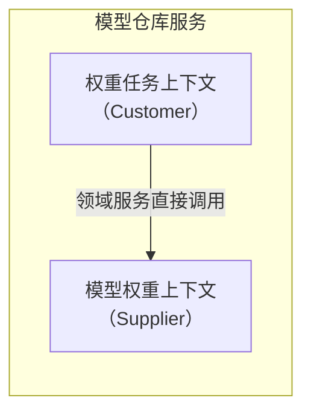
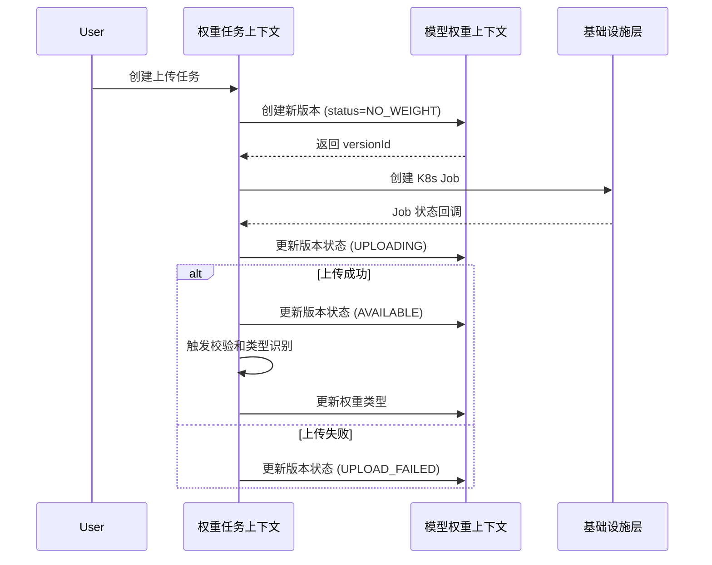
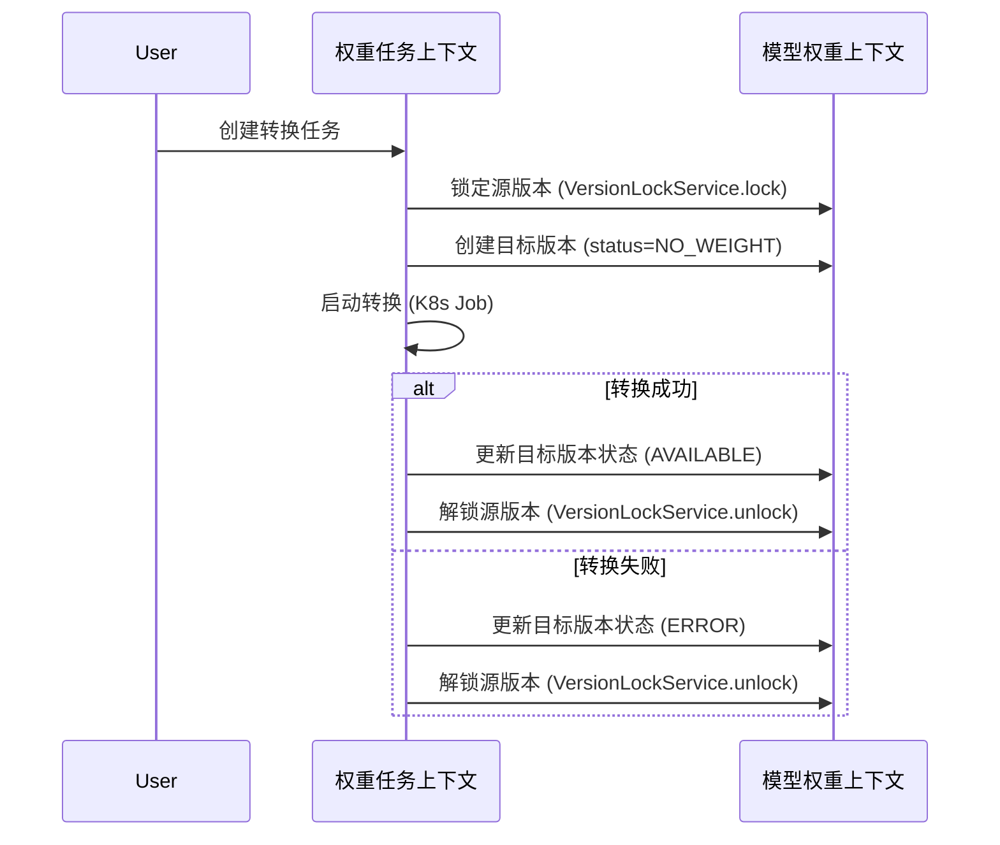

# ModelLite 模型仓库 - 限界上下文设计（Bounded Context Design）

> **文档类型**: DDD 限界上下文设计
> **文档版本**: v1.1
> **编写日期**: 2026-04-22
> **适用范围**: ModelLite 平台模型仓库模块 DDD 架构设计
> **目标读者**: 架构师、领域专家、后端开发工程师

---

## 1. 概述

### 1.1 设计目标

本文档定义模型仓库模块的限界上下文（Bounded Context），明确每个上下文内的统一语言边界、聚合设计、领域服务、仓储接口，以及上下文之间的映射关系和协作方式。

### 1.2 子域与限界上下文的映射

子域是业务视角的划分，限界上下文是代码组织视角的划分。模型仓库采用以下映射：

| 子域 | 限界上下文 | 映射关系 |
|------|-----------|----------|
| 模型权重子域 ★ Core | 模型权重上下文 (ModelWeight) | 1:1 |
| 版本锁子域 ◐ Supporting | 模型权重上下文 (ModelWeight) | 合并入模型权重上下文 |
| 权重任务子域 ★ Core | 权重任务上下文 (WeightTask) | 1:1 |
| 基础设施层 | 非上下文（技术层） | — |

> **设计决策**: 版本锁子域虽然是独立子域，但在限界上下文层面归入模型权重上下文。理由：VersionLock 与 ModelVersion 关系紧密（锁保护的是版本），且在同一代码包中更便于维护 isLocked 反规范化字段的一致性。

### 1.3 上下文总览

---

## 2. 模型权重上下文（ModelWeight Context）

### 2.1 统一语言范围

此上下文中，语言围绕**模型实体、版本、分类体系、标签、版本锁**展开：

| 术语 | 含义 |
|------|------|
| Model | 顶层实体，模型的元数据集合 |
| ModelVersion | 模型的子实体，某一版本的权重信息 |
| Category | 一级分类，如 TextGeneration |
| ModelType | 二级分类，如 glm-5 |
| Tag | 标签（用户标签 + 能力标签），独立聚合 |
| VersionLock | 版本锁，保护版本不被删除 |
| LockOwner | 锁持有者（任务 ID + 任务类型） |
| VersionStatus | 版本状态（NoWeight/Uploading/Available/UploadFailed/ValidationFailed/Error） |
| RecycleBin | 回收站，软删除后的暂存区 |
| isLocked | 反规范化字段，由 version_lock 表驱动更新 |

### 2.2 聚合设计

#### 2.2.1 Model 聚合（核心聚合）

> **不变量**: ModelVersion.isLocked 是 version_lock 表的查询缓存（反规范化字段），永远由 version_lock 表驱动更新，绝不独立修改。所有锁操作封装在 VersionLockService 中，在同一事务中保证一致性。

#### 2.2.2 Category 聚合

**说明**：
- Category 和 ModelType 采用**真删除**（确保下无模型时才允许删除），无需 deleted 字段
- ModelType 的能力（如 supportFinetune）通过 Tag 聚合关联表达，不再作为 ModelType 的字段

#### 2.2.3 Tag 聚合

**Tag 聚合的双重关联场景**：

| 关联对象 | 值对象 | TagType | 说明 |
|----------|--------|---------|------|
| Model | ModelTag | USER | 用户自定义标签，用于模型组织（REQ-TAG-001） |
| ModelType | ModelTypeTag | CAPABILITY | 能力标签，描述模型类型的能力（替代 supportFinetune 字段） |

**内置 Tag 预设**：

| 内置 Tag 名称 | TagType | 说明 |
|---------------|---------|------|
| supportFinetune | CAPABILITY | 表示该模型类型支持微调训练 |
| （未来可扩展） | CAPABILITY | 如 supportQuantization、supportInference 等 |

**业务不变量**：
- isBuiltIn=true 的标签不允许删除
- 标签名称唯一

#### 2.2.4 VersionLock 聚合

**说明**：
- VersionLock 有独立的生命周期（锁定→续约→过期/解锁），但与 ModelVersion 关系紧密
- 同一版本支持多任务并发锁定（引用计数），仅当所有锁释放后才允许删除
- 锁有 TTL（默认 24 小时），超时自动失效

### 2.3 领域服务

| 领域服务 | 职责 | 跨聚合协调 |
|----------|------|-----------|
| VersionLockService | 锁定/解锁/续约的核心逻辑 | 协调 VersionLock 聚合与 Model 聚合的 isLocked 字段同步 |
| LockMonitoringService | 僵尸锁巡检、过期预警、续约模式异常检测 | 仅 Leader 节点执行 |

### 2.4 仓储接口

| 仓储 | 职责 |
|------|------|
| ModelRepository | Model 及 ModelVersion 的持久化（含版本状态更新、软删除管理） |
| CategoryRepository | Category 及 ModelType 的持久化 |
| TagRepository | Tag、ModelTag、ModelTypeTag 的持久化 |
| VersionLockRepository | VersionLock 的持久化（含过期锁查询） |

### 2.5 领域事件

> 本上下文的领域事件详见 [ModelLite-Repository-DDD-Domain-Events.md](./ModelLite-Repository-DDD-Domain-Events.md) 第 2-8 章。

---

## 3. 权重任务上下文（WeightTask Context）

### 3.1 统一语言范围

此上下文中，语言围绕**任务、通道、校验**展开：

| 术语 | 含义 |
|------|------|
| UploadTask | 上传任务，跟踪从外部存储拷贝权重的异步过程 |
| ConvertTask | 转换任务，跟踪权重格式转换的异步过程 |
| SourcePath | 上传源路径（NFS/CIFS/PVC） |
| TaskStatus | 任务状态（Pending/Running/Paused/Completed/Failed/Cancelled） |
| Register | 纳管，注册外部路径不复制文件 |
| Archive | 归档，训练产出纳入版本管理 |
| WeightValidation | 权重完整性校验 |
| WeightTypeRecognition | 权重类型识别 |

### 3.2 聚合设计

#### 3.2.1 UploadTask 聚合

#### 3.2.2 ConvertTask 聚合

### 3.3 领域服务

| 领域服务 | 职责 |
|----------|------|
| WeightValidationService | 权重完整性校验：文件数量校验，未来可扩展 SHA256、脚本校验等 |
| WeightTypeRecognitionService | 权重类型识别：解析 config.json 识别数据精度类型（FP16、w8a8 等） |

### 3.4 仓储接口

| 仓储 | 职责 |
|------|------|
| UploadTaskRepository | UploadTask 的持久化 |
| ConvertTaskRepository | ConvertTask 的持久化 |

### 3.5 领域事件

> 本上下文的领域事件详见 [ModelLite-Repository-DDD-Domain-Events.md](./ModelLite-Repository-DDD-Domain-Events.md) 第 3-4 章。

---

## 4. 上下文映射（Context Map）

### 4.1 上下文关系

**映射模式**: **Customer-Supplier（客户-供应商）**

- **供应商 (Supplier)**: 模型权重上下文 — 提供版本创建、状态更新、锁管理等能力
- **客户 (Customer)**: 权重任务上下文 — 在权重导入流程中消费这些能力
- **协作方式**: 同一服务内，通过领域服务直接调用

### 4.2 协作接口

权重任务上下文调用模型权重上下文的以下能力：

| 协作场景 | 权重任务上下文调用 | 模型权重上下文提供 |
|----------|-------------------|-------------------|
| 纳管/上传/归档时创建新版本 | `ModelRepository.createVersion()` | 版本创建 |
| 上传/校验完成后更新版本状态 | `ModelRepository.updateVersionStatus()` | 状态更新 |
| 权重转换时锁定源版本 | `VersionLockService.lock()` | 版本锁定 |
| 转换完成/失败后解锁源版本 | `VersionLockService.unlock()` | 版本解锁 |

### 4.3 协作流程

#### 4.3.1 权重上传流程

#### 4.3.2 权重格式转换流程

---

## 5. 决策记录

| 决策编号 | 决策内容 | 决策理由 |
|----------|----------|----------|
| BC-01 | 采用 2 个限界上下文 | 模型权重和权重任务有不同的语言体系（实体 vs 任务），适合独立上下文；2 个上下文足够清晰又不至于过度拆分 |
| BC-02 | VersionLock 归入模型权重上下文 | VersionLock 与 ModelVersion 关系紧密，且 isLocked 反规范化字段需要跨聚合一致性维护，在同一上下文中更易管理 |
| BC-03 | 上下文间通过领域服务直接调用 | 模型仓库是单一服务，不需要事件机制；领域服务直接调用足够简单有效 |
| BC-04 | 采用包级别分离上下文 | Spring Boot 项目惯例；同一服务内包名区分上下文，既保持边界清晰又方便互相调用 |
| BC-05 | 接口层跨上下文共享 | 接口层很薄（只做参数校验和格式封装），按上下文分离增加文件数但不增加清晰度；通过注释标注每个 API 指向的应用服务 |
| BC-06 | isLocked 为反规范化字段 | 高频查询场景（删除前检查锁）的性能优化；一致性由 VersionLockService 在同一事务中保证 |

---

## 6. 变更记录

| 版本 | 日期 | 变更内容 | 作者 |
|------|------|----------|------|
| v1.0 | 2026-04-22 | 初始版本，定义 2 个限界上下文（模型权重、权重任务），含聚合设计、上下文映射、协作流程、代码包结构 | Prometheus |
| v1.1 | 2026-04-22 | 修复第 4.1 章节 Mermaid 图语法错误 | Prometheus |
| v1.2 | 2026-04-24 | 文档精简：1. 删除聚合字段说明表格（classDiagram 已承载） 2. 领域事件清单改为引用 Domain Events 文档 3. 代码包结构章节移至 Tech Design 文档 | Prometheus |

---

## 7. 参考文档

- [ModelLite-模型仓库-需求规格说明书-v1.2.md](/.sisyphus/drafts/ModelLite-模型仓库-需求规格说明书-v1.2.md)
- [ModelLite-Repository-DDD-Ubiquitous-Language.md](./ModelLite-Repository-DDD-Ubiquitous-Language.md)
- [ModelLite-Repository-DDD-Domain-Events.md](./ModelLite-Repository-DDD-Domain-Events.md)
- [ModelLite-Repository-DDD-Subdomain-Modeling.md](./ModelLite-Repository-DDD-Subdomain-Modeling.md)
- [ModelLite-模型仓库-架构设计-v1.1.md](/docs/architecture/ModelLite-模型仓库-架构设计-v1.1.md)

---

**文档结束**
