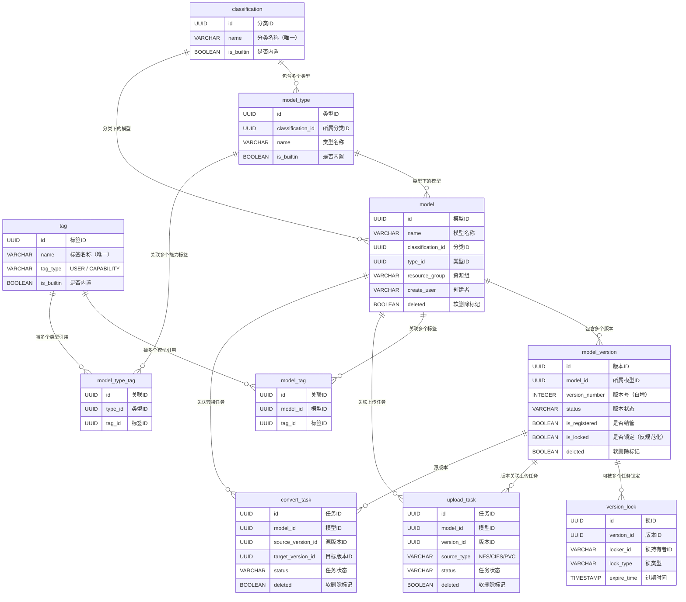
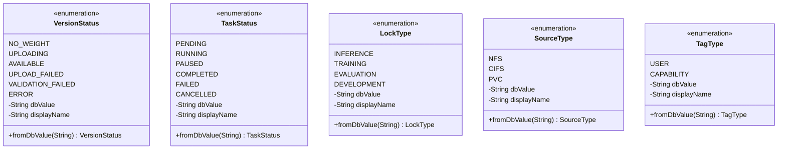
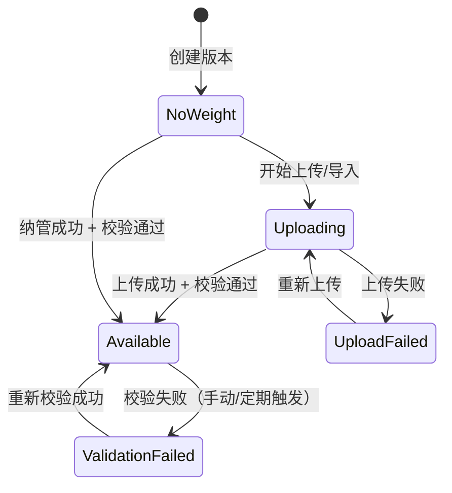

# Feature 1: 基础设施与通用能力 — 特性设计文档

> **文档类型**: 特性设计文档
> **文档版本**: v1.0
> **编写日期**: 2026-04-24
> **适用范围**: ModelLite 平台模型仓库模块 Feature 1
> **目标读者**: 后端开发工程师

---

## 1. 特性概述

### 1.1 目标

搭建模型仓库模块的技术底座，包括数据库 Schema、项目骨架、枚举定义、异常体系、通用配置等基础设施能力，使后续特性（分类体系、模型管理、权重导入等）可以直接在此之上开发业务代码。

### 1.2 范围

**IN（包含）**:
- 数据库 Schema（10 张核心表的 DDL）
- Maven 项目骨架（DDD 包结构）
- Mock 公共模块（BaseResponse、ModelLiteException）
- 枚举定义（VersionStatus、TaskStatus、LockType、SourceType、TagType）
- 错误码定义（0102001-0105002）
- MyBatis 配置 + 枚举 TypeHandler
- Druid 连接池配置（dev/prod）
- Logback 日志轮转配置
- 文件后缀白名单 ConfigMap + 加载类
- SSL/TLS 基础设施配置
- K8s Deployment + Service YAML
- 健康检查接口

**OUT（不包含）**:
- 领域事件代码（仅文档记录）
- Repository 接口定义（Feature 3）
- Application Service（Feature 3）
- API Controller（Feature 3，仅健康检查除外）
- 全局异常处理器实现（Feature 3，此处仅骨架）
- Spring Security 配置（Feature 3）
- 内置分类/类型/标签数据填充（Feature 2）
- K8s Job 模板（Feature 4）
- Leader Election 配置（Feature 5）

### 1.3 依赖关系

| 依赖项 | 类型 | 说明 |
|--------|------|------|
| PostgreSQL 实例 | 外部系统 | 数据库服务需预先部署 |
| com.huawei.modellite.common 公共模块 | 外部依赖 | 提供 ModelLiteException、BaseResponse 等（本特性内 Mock） |
| K8s 集群 | 外部系统 | 部署运行环境 |
| DDD 架构设计文档 | 文档 | 本特性所有设计决策的来源（5 份 DDD 设计文档） |

---

## 2. 数据库设计

### 2.1 新增表 DDL

> 以下为全部 10 张核心表的 DDL。Feature 1 创建空表，不填充数据。

#### classification（分类表）

```sql
CREATE TABLE classification (
    id                  UUID PRIMARY KEY DEFAULT gen_random_uuid(),
    name                VARCHAR(100) NOT NULL UNIQUE,
    description         VARCHAR(500) DEFAULT '',
    is_builtin          BOOLEAN NOT NULL DEFAULT FALSE,
    create_time         TIMESTAMP WITH TIME ZONE NOT NULL DEFAULT NOW(),
    update_time         TIMESTAMP WITH TIME ZONE NOT NULL DEFAULT NOW()
);

COMMENT ON TABLE classification IS '模型分类表（一级分类），如 TextGeneration、ImageTextToText';
COMMENT ON COLUMN classification.id IS '分类ID（UUID，自动生成）';
COMMENT ON COLUMN classification.name IS '分类名称，全局唯一';
COMMENT ON COLUMN classification.is_builtin IS '是否内置分类（内置分类不可删除）';
```

#### model_type（模型类型表）

```sql
CREATE TABLE model_type (
    id                  UUID PRIMARY KEY DEFAULT gen_random_uuid(),
    classification_id   UUID NOT NULL REFERENCES classification(id),
    name                VARCHAR(100) NOT NULL,
    description         VARCHAR(500) DEFAULT '',
    is_builtin          BOOLEAN NOT NULL DEFAULT FALSE,
    create_time         TIMESTAMP WITH TIME ZONE NOT NULL DEFAULT NOW(),
    update_time         TIMESTAMP WITH TIME ZONE NOT NULL DEFAULT NOW(),

    CONSTRAINT uk_model_type_name UNIQUE (classification_id, name)
);

COMMENT ON TABLE model_type IS '模型类型表（二级分类），如 glm-5、Qwen2.5-VL-7B';
COMMENT ON COLUMN model_type.classification_id IS '所属分类ID（外键引用 classification.id）';
COMMENT ON COLUMN model_type.is_builtin IS '是否内置类型（内置类型不可删除）';
```

> **设计决策**: classification 和 model_type 采用**真删除**（无 deleted 字段），删除前确保下无模型引用。

#### tag（标签表）

```sql
CREATE TABLE tag (
    id                  UUID PRIMARY KEY DEFAULT gen_random_uuid(),
    name                VARCHAR(50) NOT NULL UNIQUE,
    tag_type            VARCHAR(20) NOT NULL,
    is_builtin          BOOLEAN NOT NULL DEFAULT FALSE,
    create_time         TIMESTAMP WITH TIME ZONE NOT NULL DEFAULT NOW(),
    update_time         TIMESTAMP WITH TIME ZONE NOT NULL DEFAULT NOW()
);

COMMENT ON TABLE tag IS '标签表，同时服务两种关联场景：USER=用户自定义标签，CAPABILITY=能力标签';
COMMENT ON COLUMN tag.tag_type IS '标签类型：USER=用户自定义标签，CAPABILITY=能力标签';
COMMENT ON COLUMN tag.is_builtin IS '是否内置标签（内置标签不允许删除）';
```

#### model（模型表）

```sql
CREATE TABLE model (
    id                  UUID PRIMARY KEY DEFAULT gen_random_uuid(),
    name                VARCHAR(255) NOT NULL,
    description         VARCHAR(2000) DEFAULT '',
    classification_id   UUID NOT NULL REFERENCES classification(id),
    type_id             UUID NOT NULL REFERENCES model_type(id),
    resource_group      VARCHAR(100) NOT NULL,
    create_user         VARCHAR(100) NOT NULL,
    author              VARCHAR(100) DEFAULT NULL,
    deleted             BOOLEAN NOT NULL DEFAULT FALSE,
    create_time         TIMESTAMP WITH TIME ZONE NOT NULL DEFAULT NOW(),
    update_time         TIMESTAMP WITH TIME ZONE NOT NULL DEFAULT NOW(),

    CONSTRAINT uk_model_name UNIQUE (name, classification_id, type_id)
        WHERE (deleted = FALSE)
);

COMMENT ON TABLE model IS '模型表，模型仓库的顶层实体';
COMMENT ON COLUMN model.name IS '模型名称，同一分类+类型组合下唯一，创建后不可修改';
COMMENT ON COLUMN model.resource_group IS '资源组标识，创建后不可修改（设计保留扩展性）';
COMMENT ON COLUMN model.deleted IS '软删除标记，TRUE=已移入回收站';
```

> **部分索引**: `WHERE (deleted = FALSE)` 确保软删除后名称可被复用。

#### model_version（模型版本表）

```sql
CREATE TABLE model_version (
    id                  UUID PRIMARY KEY DEFAULT gen_random_uuid(),
    model_id            UUID NOT NULL REFERENCES model(id),
    version_number      INTEGER NOT NULL,
    pvc_name            VARCHAR(255) DEFAULT NULL,
    internal_path       VARCHAR(1024) DEFAULT NULL,
    weight_type         VARCHAR(50) DEFAULT NULL,
    is_registered       BOOLEAN NOT NULL DEFAULT FALSE,
    status              VARCHAR(30) NOT NULL DEFAULT 'NoWeight',
    is_locked           BOOLEAN NOT NULL DEFAULT FALSE,
    train_frame         VARCHAR(100) DEFAULT NULL,
    train_type          VARCHAR(100) DEFAULT NULL,
    train_strategy      VARCHAR(100) DEFAULT NULL,
    train_time          BIGINT DEFAULT NULL,
    final_loss          VARCHAR(100) DEFAULT NULL,
    source_version      VARCHAR(50) DEFAULT NULL,
    deleted             BOOLEAN NOT NULL DEFAULT FALSE,
    create_time         TIMESTAMP WITH TIME ZONE NOT NULL DEFAULT NOW(),
    update_time         TIMESTAMP WITH TIME ZONE NOT NULL DEFAULT NOW(),

    CONSTRAINT uk_model_version UNIQUE (model_id, version_number)
);

COMMENT ON TABLE model_version IS '模型版本表，模型的具体可部署实例';
COMMENT ON COLUMN model_version.version_number IS '版本号，自动递增整数（V1, V2, V3...），不允许跳号';
COMMENT ON COLUMN model_version.pvc_name IS '权重存储 PVC 名称';
COMMENT ON COLUMN model_version.internal_path IS 'PVC 内部路径';
COMMENT ON COLUMN model_version.weight_type IS '权重数据精度类型（FP16、w8a8等），自动识别';
COMMENT ON COLUMN model_version.is_registered IS '是否为纳管版本（纳管版本只读挂载）';
COMMENT ON COLUMN model_version.status IS '版本状态：NoWeight/Uploading/Available/UploadFailed/ValidationFailed/Error';
COMMENT ON COLUMN model_version.is_locked IS '是否被锁定（反规范化字段，由 version_lock 表驱动更新，绝不独立修改）';
COMMENT ON COLUMN model_version.train_frame IS '训练框架（归档版本才有）';
COMMENT ON COLUMN model_version.train_time IS '训练时长（毫秒，归档版本才有）';
```

#### model_tag（模型-标签关联表）

```sql
CREATE TABLE model_tag (
    id                  UUID PRIMARY KEY DEFAULT gen_random_uuid(),
    model_id            UUID NOT NULL REFERENCES model(id),
    tag_id              UUID NOT NULL REFERENCES tag(id),
    create_time         TIMESTAMP WITH TIME ZONE NOT NULL DEFAULT NOW(),

    CONSTRAINT uk_model_tag UNIQUE (model_id, tag_id)
);

COMMENT ON TABLE model_tag IS '模型-标签关联表（用户自定义标签关联）';
```

#### model_type_tag（模型类型-标签关联表）

```sql
CREATE TABLE model_type_tag (
    id                  UUID PRIMARY KEY DEFAULT gen_random_uuid(),
    type_id             UUID NOT NULL REFERENCES model_type(id),
    tag_id              UUID NOT NULL REFERENCES tag(id),
    create_time         TIMESTAMP WITH TIME ZONE NOT NULL DEFAULT NOW(),

    CONSTRAINT uk_model_type_tag UNIQUE (type_id, tag_id)
);

COMMENT ON TABLE model_type_tag IS '模型类型-标签关联表（能力标签关联，替代 supportFinetune 字段）';
```

#### version_lock（版本锁表）

```sql
CREATE TABLE version_lock (
    id                  UUID PRIMARY KEY DEFAULT gen_random_uuid(),
    version_id          UUID NOT NULL REFERENCES model_version(id),
    locker_id           VARCHAR(200) NOT NULL,
    lock_type           VARCHAR(30) NOT NULL,
    expire_time         TIMESTAMP WITH TIME ZONE NOT NULL,
    create_time         TIMESTAMP WITH TIME ZONE NOT NULL DEFAULT NOW()
);

COMMENT ON TABLE version_lock IS '版本锁表，保护正在被平台任务使用的权重版本不被误删';
COMMENT ON COLUMN version_lock.locker_id IS '锁持有者标识（任务ID）';
COMMENT ON COLUMN version_lock.lock_type IS '锁类型：INFERENCE/TRAINING/EVALUATION/DEVELOPMENT';
COMMENT ON COLUMN version_lock.expire_time IS '锁过期时间（默认创建时间 + 24小时）';
```

#### upload_task（上传任务表）

```sql
CREATE TABLE upload_task (
    id                  UUID PRIMARY KEY DEFAULT gen_random_uuid(),
    model_id            UUID NOT NULL REFERENCES model(id),
    version_id          UUID NOT NULL REFERENCES model_version(id),
    source_type         VARCHAR(20) NOT NULL,
    source_path         VARCHAR(1024) NOT NULL,
    cifs_username       VARCHAR(200) DEFAULT NULL,
    cifs_password       VARCHAR(200) DEFAULT NULL,
    target_path         VARCHAR(1024) NOT NULL,
    progress            INTEGER DEFAULT 0,
    status              VARCHAR(20) NOT NULL DEFAULT 'Pending',
    error_message       VARCHAR(2000) DEFAULT NULL,
    create_user         VARCHAR(100) NOT NULL,
    deleted             BOOLEAN NOT NULL DEFAULT FALSE,
    create_time         TIMESTAMP WITH TIME ZONE NOT NULL DEFAULT NOW(),
    update_time         TIMESTAMP WITH TIME ZONE NOT NULL DEFAULT NOW()
);

COMMENT ON TABLE upload_task IS '上传任务表，跟踪权重文件从外部存储拷贝到平台 PVC 的异步过程';
COMMENT ON COLUMN upload_task.source_type IS '源路径类型：NFS/CIFS/PVC';
COMMENT ON COLUMN upload_task.cifs_username IS 'CIFS 认证用户名（仅 source_type=CIFS 时必填）';
COMMENT ON COLUMN upload_task.cifs_password IS 'CIFS 认证密码（仅 source_type=CIFS 时必填）';
COMMENT ON COLUMN upload_task.status IS '任务状态：Pending/Running/Paused/Completed/Failed/Cancelled';
```

#### convert_task（转换任务表）

```sql
CREATE TABLE convert_task (
    id                  UUID PRIMARY KEY DEFAULT gen_random_uuid(),
    model_id            UUID NOT NULL REFERENCES model(id),
    source_version_id   UUID NOT NULL REFERENCES model_version(id),
    target_version_id   UUID DEFAULT NULL REFERENCES model_version(id),
    source_format       VARCHAR(50) NOT NULL,
    target_format       VARCHAR(50) NOT NULL,
    progress            INTEGER DEFAULT 0,
    status              VARCHAR(20) NOT NULL DEFAULT 'Pending',
    error_message       VARCHAR(2000) DEFAULT NULL,
    create_user         VARCHAR(100) NOT NULL,
    deleted             BOOLEAN NOT NULL DEFAULT FALSE,
    create_time         TIMESTAMP WITH TIME ZONE NOT NULL DEFAULT NOW(),
    update_time         TIMESTAMP WITH TIME ZONE NOT NULL DEFAULT NOW()
);

COMMENT ON TABLE convert_task IS '转换任务表，跟踪权重格式转换的异步过程（如 Megatron → Safetensors）';
COMMENT ON COLUMN convert_task.target_version_id IS '目标版本ID，任务创建时先为 NULL，版本创建后回填';
```

### 2.2 表关系图（ER 图）



### 2.3 索引设计

| 表名 | 索引名 | 索引类型 | 索引字段 | 说明 |
|------|--------|----------|----------|------|
| model | idx_model_classification | B-tree | classification_id WHERE deleted = FALSE | 按分类筛选 |
| model | idx_model_type | B-tree | type_id WHERE deleted = FALSE | 按类型筛选 |
| model | idx_model_resource_group | B-tree | resource_group WHERE deleted = FALSE | 资源组可见性过滤 |
| model | idx_model_create_time | B-tree | create_time WHERE deleted = FALSE | 按时间排序 |
| model_version | idx_version_model | B-tree | model_id | 查询模型下的版本列表 |
| model_version | idx_version_status | B-tree | status WHERE deleted = FALSE | 按状态筛选 |
| version_lock | idx_lock_version | B-tree | version_id | 查询版本的所有锁 |
| version_lock | idx_lock_expire | B-tree | expire_time | Leader 巡检过期锁 |
| version_lock | idx_lock_locker | B-tree | locker_id, lock_type | 按任务查锁 |
| upload_task | idx_upload_model | B-tree | model_id WHERE deleted = FALSE | 查询模型的上传任务 |
| upload_task | idx_upload_status | B-tree | status WHERE deleted = FALSE | 按状态筛选 |
| convert_task | idx_convert_model | B-tree | model_id WHERE deleted = FALSE | 查询模型的转换任务 |
| convert_task | idx_convert_status | B-tree | status WHERE deleted = FALSE | 按状态筛选 |
| tag | idx_tag_type | B-tree | tag_type | 按标签类型筛选 |
| model_tag | idx_model_tag_tag | B-tree | tag_id | 删除标签前检查引用 |
| model_type_tag | idx_model_type_tag_tag | B-tree | tag_id | 删除标签前检查引用 |

### 2.4 数据字典

#### model 表

| 字段名 | 类型 | 是否必填 | 默认值 | 取值范围/说明 |
|--------|------|----------|--------|---------------|
| id | UUID | Y | gen_random_uuid() | 主键 |
| name | VARCHAR(255) | Y | — | 1-255 字符，仅允许字母、数字、中文、下划线、中划线 |
| description | VARCHAR(2000) | N | '' | 0-2000 字符 |
| classification_id | UUID | Y | — | 外键引用 classification.id |
| type_id | UUID | Y | — | 外键引用 model_type.id |
| resource_group | VARCHAR(100) | Y | — | 资源组标识，创建后不可修改 |
| create_user | VARCHAR(100) | Y | — | 创建者 |
| author | VARCHAR(100) | N | NULL | 模型作者 |
| deleted | BOOLEAN | Y | FALSE | 软删除标记 |
| create_time | TIMESTAMP WITH TIME ZONE | Y | NOW() | 创建时间 |
| update_time | TIMESTAMP WITH TIME ZONE | Y | NOW() | 更新时间 |

#### model_version 表

| 字段名 | 类型 | 是否必填 | 默认值 | 取值范围/说明 |
|--------|------|----------|--------|---------------|
| id | UUID | Y | gen_random_uuid() | 主键 |
| model_id | UUID | Y | — | 外键引用 model.id |
| version_number | INTEGER | Y | — | 自动递增（V1, V2...），不允许跳号 |
| pvc_name | VARCHAR(255) | N | NULL | 权重存储 PVC 名称 |
| internal_path | VARCHAR(1024) | N | NULL | PVC 内部路径 |
| weight_type | VARCHAR(50) | N | NULL | FP16、w8a8 等，自动识别 |
| is_registered | BOOLEAN | Y | FALSE | TRUE=纳管版本（只读挂载） |
| status | VARCHAR(30) | Y | 'NoWeight' | NoWeight / Uploading / Available / UploadFailed / ValidationFailed / Error |
| is_locked | BOOLEAN | Y | FALSE | 反规范化字段，由 version_lock 表驱动 |
| train_frame | VARCHAR(100) | N | NULL | 训练框架（归档版本） |
| train_type | VARCHAR(100) | N | NULL | 训练类型（归档版本） |
| train_strategy | VARCHAR(100) | N | NULL | 训练策略（归档版本） |
| train_time | BIGINT | N | NULL | 训练时长（毫秒，归档版本） |
| final_loss | VARCHAR(100) | N | NULL | 最终 Loss（归档版本） |
| source_version | VARCHAR(50) | N | NULL | 权重来源版本（归档版本） |
| deleted | BOOLEAN | Y | FALSE | 软删除标记 |
| create_time | TIMESTAMP WITH TIME ZONE | Y | NOW() | 创建时间 |
| update_time | TIMESTAMP WITH TIME ZONE | Y | NOW() | 更新时间 |

#### version_lock 表

| 字段名 | 类型 | 是否必填 | 默认值 | 取值范围/说明 |
|--------|------|----------|--------|---------------|
| id | UUID | Y | gen_random_uuid() | 主键 |
| version_id | UUID | Y | — | 外键引用 model_version.id |
| locker_id | VARCHAR(200) | Y | — | 锁持有者标识（任务 ID） |
| lock_type | VARCHAR(30) | Y | — | INFERENCE / TRAINING / EVALUATION / DEVELOPMENT |
| expire_time | TIMESTAMP WITH TIME ZONE | Y | — | 锁过期时间（创建时间 + 24h） |
| create_time | TIMESTAMP WITH TIME ZONE | Y | NOW() | 锁定时间 |

---

## 3. 领域模型设计

### 3.1 类图 — 枚举



### 3.2 核心类定义

#### VersionStatus（枚举）

| 枚举值 | dbValue | displayName | 说明 |
|--------|---------|-------------|------|
| NO_WEIGHT | NoWeight | 无权重 | 版本已创建但尚未有权重文件 |
| UPLOADING | Uploading | 上传中 | 权重文件正在上传/复制中 |
| AVAILABLE | Available | 可用 | 权重文件已就绪，校验通过 |
| UPLOAD_FAILED | UploadFailed | 上传失败 | 权重文件上传/复制失败 |
| VALIDATION_FAILED | ValidationFailed | 校验失败 | 完整性校验或类型识别失败 |
| ERROR | Error | 异常 | 其他非预期的异常状态 |

**枚举通用结构伪代码**（所有枚举遵循相同模式）:

```java
public enum VersionStatus {
    NO_WEIGHT("NoWeight", "无权重"),
    UPLOADING("Uploading", "上传中"),
    AVAILABLE("Available", "可用"),
    UPLOAD_FAILED("UploadFailed", "上传失败"),
    VALIDATION_FAILED("ValidationFailed", "校验失败"),
    ERROR("Error", "异常");

    private final String dbValue;
    private final String displayName;

    // 标准构造方法、getter

    // 从数据库值反序列化，找不到时抛 IllegalArgumentException
    public static VersionStatus fromDbValue(String dbValue) {
        for (VersionStatus status : values()) {
            if (status.dbValue.equals(dbValue)) return status;
        }
        throw new IllegalArgumentException("Unknown VersionStatus: " + dbValue);
    }
}
```

#### TaskStatus（枚举）

| 枚举值 | dbValue | displayName | 说明 |
|--------|---------|-------------|------|
| PENDING | Pending | 待执行 | 任务已创建，尚未开始 |
| RUNNING | Running | 执行中 | 任务正在执行 |
| PAUSED | Paused | 已暂停 | 用户暂停了任务 |
| COMPLETED | Completed | 已完成 | 任务成功完成 |
| FAILED | Failed | 失败 | 任务执行失败 |
| CANCELLED | Cancelled | 已取消 | 用户取消了任务 |

#### LockType（枚举）

| 枚举值 | dbValue | displayName | 说明 |
|--------|---------|-------------|------|
| INFERENCE | Inference | 推理服务 | 推理模块部署的在线服务 |
| TRAINING | Training | 训练任务 | 训练模块发起的微调任务 |
| EVALUATION | Evaluation | 评测任务 | 评测模块发起的评估任务 |
| DEVELOPMENT | Development | 模型开发 | Jupyter 模型开发环境 |

#### SourceType（枚举）

| 枚举值 | dbValue | displayName | 说明 |
|--------|---------|-------------|------|
| NFS | NFS | NFS 存储 | 网络文件系统 |
| CIFS | CIFS | CIFS 存储 | Windows 共享（需认证） |
| PVC | PVC | PVC 存储 | Kubernetes PersistentVolumeClaim |

#### TagType（枚举）

| 枚举值 | dbValue | displayName | 说明 |
|--------|---------|-------------|------|
| USER | USER | 用户自定义标签 | 用户手动添加的标签 |
| CAPABILITY | CAPABILITY | 能力标签 | 描述模型类型的能力 |

### 3.3 错误码定义

```java
public final class ErrorCode {
    private ErrorCode() {}

    // ===== 模型相关 =====
    public static final String MODEL_NOT_FOUND = "0102001";            // 模型不存在
    public static final String MODEL_NAME_EXISTS = "0102002";          // 同分类+类型下模型名称已存在
    public static final String MODEL_NAME_IMMUTABLE = "0102003";       // 模型名称不可修改
    public static final String CATEGORY_HAS_MODELS = "0102004";        // 分类下存在模型，禁止删除
    public static final String MODEL_CAPACITY_EXCEEDED = "0102005";    // 单资源组模型数量超限

    // ===== 版本相关 =====
    public static final String VERSION_NOT_FOUND = "0102006";          // 版本不存在
    public static final String VERSION_NUMBER_GAP = "0102007";         // 版本号不连续
    public static final String VERSION_LOCKED = "0102008";             // 版本已被锁定
    public static final String VERSION_CAPACITY_EXCEEDED = "0102009";  // 单模型版本数量超限

    // ===== 上传任务相关 =====
    public static final String UPLOAD_TASK_NOT_FOUND = "0102010";      // 上传任务不存在
    public static final String FILE_SUFFIX_NOT_ALLOWED = "0102011";    // 文件后缀不在白名单
    public static final String UPLOAD_TASK_CONCURRENT_LIMIT = "0102012"; // 并发上传任务数超限

    // ===== 转换任务相关 =====
    public static final String CONVERT_TASK_NOT_FOUND = "0102013";     // 转换任务不存在
    public static final String UNSUPPORTED_CONVERT_FORMAT = "0102014"; // 不支持的转换格式
}
```

> **错误码规则**: `0102` + 3位顺序号。`01`=项目编号，`02`=模型仓库模块，后 3 位全局递增，不按业务域分段。

**错误码与 HTTP 状态码映射**:

| 错误码 | HTTP 状态码 | 说明 |
|--------|-------------|------|
| 0102001 | 404 | 模型不存在 |
| 0102002 | 409 | 名称冲突 |
| 0102003 | 400 | 名称不可修改 |
| 0102004 | 400 | 分类下有模型 |
| 0102005 | 400 | 模型数量超限 |
| 0102006 | 404 | 版本不存在 |
| 0102007 | 400 | 版本号不连续 |
| 0102008 | 409 | 版本被锁定 |
| 0102009 | 400 | 版本数量超限 |
| 0102010 | 404 | 上传任务不存在 |
| 0102011 | 400 | 文件后缀不允许 |
| 0102012 | 400 | 并发上传超限 |
| 0102013 | 404 | 转换任务不存在 |
| 0102014 | 400 | 不支持的格式 |

### 3.4 TypeHandler（MyBatis 枚举转换）

每个枚举对应一个 TypeHandler，负责 VARCHAR ↔ 枚举的双向转换。所有 TypeHandler 放在 `infrastructure/persistence/typehandler/` 包下。

**TypeHandler 伪代码**（以 VersionStatus 为例，其他枚举结构相同）:

```java
@MappedTypes(VersionStatus.class)
public class VersionStatusTypeHandler extends BaseTypeHandler<VersionStatus> {
    @Override
    public void setNonNullParameter(PreparedStatement ps, int i, VersionStatus param, JdbcType type)
            throws SQLException {
        ps.setString(i, param.getDbValue());
    }

    @Override
    public VersionStatus getNullableResult(ResultSet rs, String columnName) throws SQLException {
        return VersionStatus.fromDbValue(rs.getString(columnName));
    }
    // ... 其他 getNullableResult 重载同理
}
```

**TypeHandler 清单**:

| TypeHandler 类 | 对应枚举 | 数据库列类型 |
|----------------|----------|-------------|
| VersionStatusTypeHandler | VersionStatus | VARCHAR(30) |
| TaskStatusTypeHandler | TaskStatus | VARCHAR(20) |
| LockTypeTypeHandler | LockType | VARCHAR(30) |
| SourceTypeTypeHandler | SourceType | VARCHAR(20) |
| TagTypeTypeHandler | TagType | VARCHAR(20) |

### 3.5 业务不变量

本特性为基础设施层，不涉及业务逻辑。以下不变量由数据库约束强制保证，供后续特性参考：

| 不变量名 | 说明 | 强制方式 |
|----------|------|----------|
| 模型名称唯一性 | 同一分类+类型组合下，未删除的模型名称唯一 | 部分唯一索引 `uk_model_name WHERE deleted = FALSE` |
| 版本号唯一性 | 同一模型下版本号唯一 | 唯一索引 `uk_model_version` |
| 分类下无模型时才可删除 | classification/model_type 下有模型引用时禁止删除 | 代码校验（Feature 3） |
| isLocked 一致性 | model_version.is_locked 由 version_lock 表驱动 | 代码校验 + 同一事务更新（Feature 5） |

---

## 4. 接口设计

本特性仅提供**健康检查接口**，不涉及业务 API。

### 4.1 人机接口

#### 健康检查

| 属性 | 值 |
|------|-----|
| URL | `GET /actuator/health` |
| Method | GET |
| 描述 | Spring Boot Actuator 健康检查，K8s liveness/readiness probe 使用 |

**Response Body**（成功）:
```json
{
    "status": "UP"
}
```

> 其他业务 API 在 Feature 3-8 中定义。

### 4.2 机机接口

本特性不涉及机机接口。

---

## 5. 核心业务流程

本特性为基础设施层，不涉及业务流程。

以下为 **版本状态机**（供 Feature 3-4 参考）:



**状态转换规则**:

| 当前状态 | 触发条件 | 目标状态 | 说明 |
|----------|----------|----------|------|
| NoWeight | 纳管成功 | Available | 纳管不复制文件，直接可用 |
| NoWeight | 开始上传 | Uploading | 异步拷贝任务启动 |
| Uploading | 上传完成 + 校验通过 | Available | 权重就绪 |
| Uploading | 上传失败 | UploadFailed | 记录失败原因 |
| Available | 校验失败 | ValidationFailed | 文件不完整或类型异常 |
| ValidationFailed | 重新校验成功 | Available | 手动触发重新校验 |
| UploadFailed | 重新上传 | Uploading | 可重试 |

---

## 6. 测试用例

### 6.1 单元测试（领域模型）

本特性无领域模型业务逻辑，单元测试覆盖枚举类：

#### 枚举 fromDbValue 正向解析

**Given**:
- VersionStatus 枚举已定义，包含 6 个值

**When**:
- 调用 `VersionStatus.fromDbValue("Available")`

**Then**:
- 返回 `VersionStatus.AVAILABLE`

#### 枚举 fromDbValue 无效值

**Given**:
- VersionStatus 枚举已定义

**When**:
- 调用 `VersionStatus.fromDbValue("INVALID")`

**Then**:
- 抛出 `IllegalArgumentException`
- 异常消息包含 "Unknown VersionStatus: INVALID"

#### 枚举所有值 dbValue 唯一

**Given**:
- 所有 5 个枚举类已定义

**When**:
- 遍历每个枚举的所有值，收集 dbValue

**Then**:
- 每个枚举内的 dbValue 互不重复

---

### 6.2 集成测试（仓储/基础设施）

#### 数据库连接验证

**Given**:
- PostgreSQL 实例可访问
- application-test.yml 配置了正确的数据库连接

**When**:
- 启动 Spring Boot 应用（test profile）

**Then**:
- DataSource Bean 初始化成功
- 执行 `SELECT 1` 返回正确结果

#### Schema DDL 全部执行

**Given**:
- PostgreSQL 实例可访问
- schema.sql 已创建

**When**:
- 执行 schema.sql

**Then**:
- `\dt` 输出包含 10 张表：classification, model_type, tag, model, model_version, model_tag, model_type_tag, version_lock, upload_task, convert_task

#### 唯一约束生效（部分索引）

**Given**:
- classification 表中已有 name='TextGeneration' 的记录

**When**:
- 执行 `INSERT INTO classification (name) VALUES ('TextGeneration')`

**Then**:
- 抛出唯一约束违反错误（UNIQUE VIOLATION）

#### TypeHandler 枚举转换

**Given**:
- model_version 表已创建
- VersionStatusTypeHandler 已注册

**When**:
- 插入一条 status='Available' 的版本记录
- 再查询该记录的 status 字段

**Then**:
- 查询结果类型为 `VersionStatus.AVAILABLE`

---

### 6.3 API 测试（接口层）

#### 健康检查端点

**Given**:
- 应用已启动（dev profile）

**When**:
- 调用 `GET /actuator/health`

**Then**:
- HTTP 状态码 = 200
- Response.body.status = "UP"

#### 敏感端点不暴露

**Given**:
- 应用已启动（dev profile）

**When**:
- 调用 `GET /actuator/env`

**Then**:
- HTTP 状态码 = 404

#### Druid 监控端点（仅开发环境）

**Given**:
- 应用已启动（dev profile）

**When**:
- 调用 `GET /druid/index.html`

**Then**:
- HTTP 状态码 = 200

#### Druid 监控端点（生产环境禁用）

**Given**:
- 应用已启动（prod profile）

**When**:
- 调用 `GET /druid/index.html`

**Then**:
- HTTP 状态码 = 404

---

**文档结束**