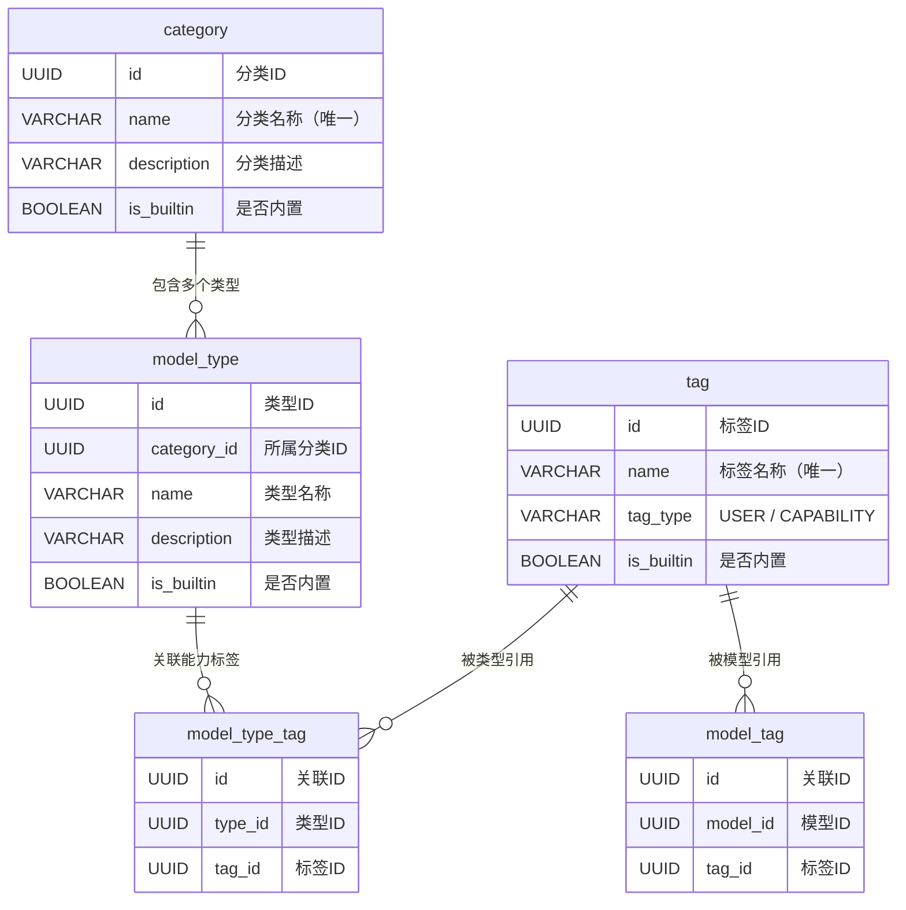
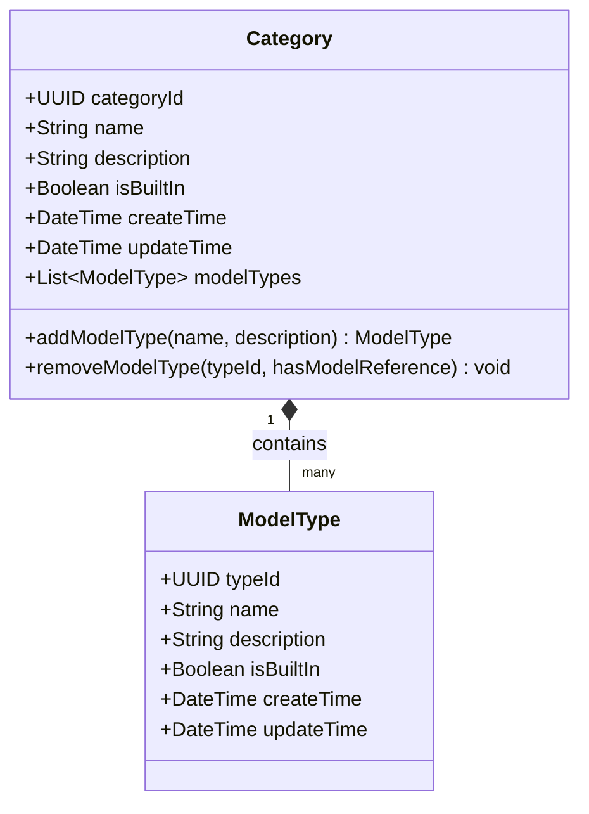
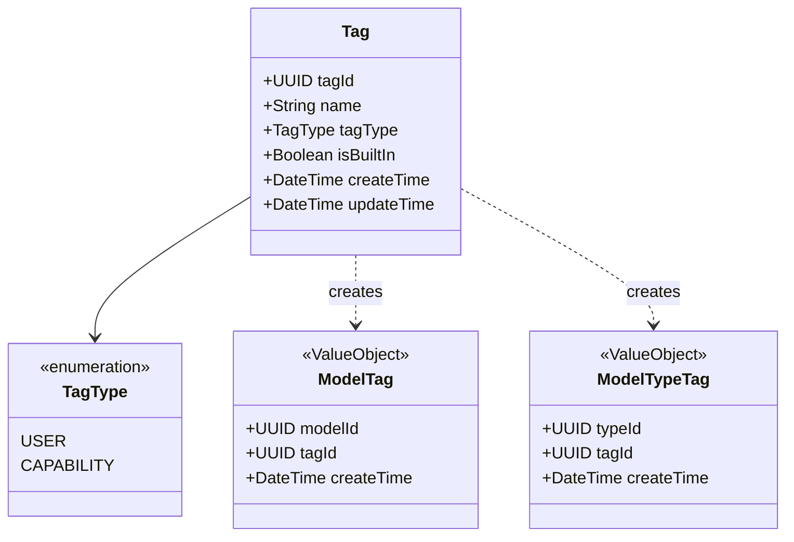
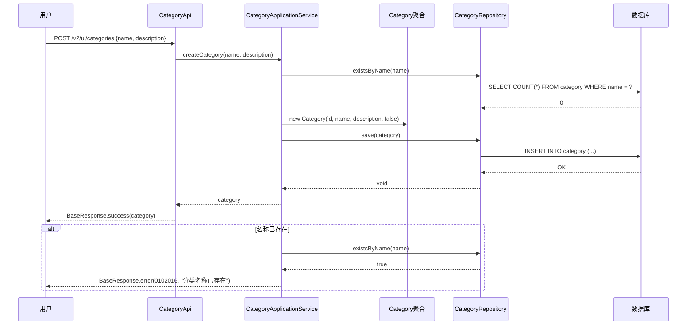
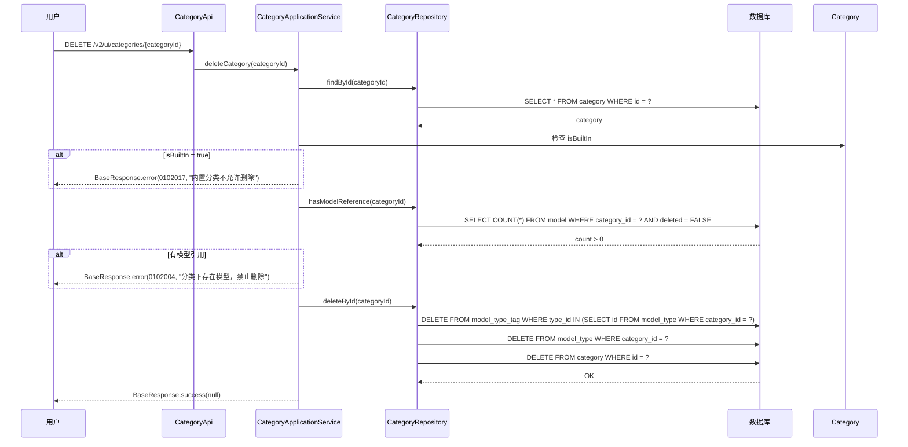
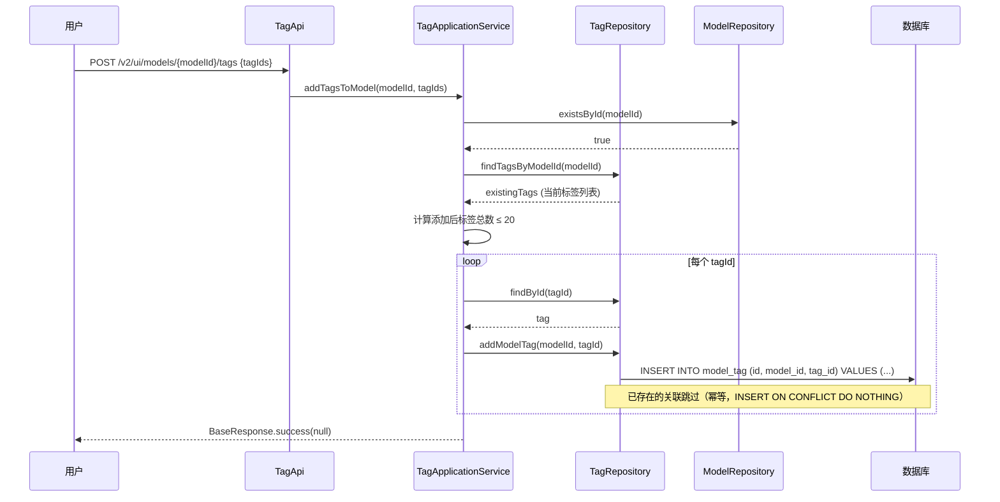

# Feature 2: 分类体系与标签管理 — 特性设计文档

> **文档类型**: 特性设计文档
> **文档版本**: v1.0
> **编写日期**: 2026-04-25
> **适用范围**: ModelLite 平台模型仓库模块 Feature 2
> **目标读者**: 后端开发工程师

---

## 1. 特性概述

### 1.1 目标

实现模型仓库的分类体系（两级分类：分类 + 模型类型）与标签管理能力，为模型提供结构化的组织方式。包括分类/类型的 CRUD、标签的 CRUD、模型与标签的关联管理、以及内置预设数据的填充机制。

### 1.2 范围

**IN（包含）**:
- Category 聚合根的领域模型实现（含 ModelType 实体）
- Tag 聚合根的领域模型实现（含 ModelTag、ModelTypeTag 值对象）
- CategoryRepository 仓储接口与 MyBatis 实现
- TagRepository 仓储接口与 MyBatis 实现
- CategoryApplicationService 应用服务
- TagApplicationService 应用服务
- 分类/类型管理的人机接口（CRUD）
- 标签管理的人机接口（CRUD + 模型关联）
- 内置预设数据填充机制（SQL 脚本 + 应用启动校验）
- 全局异常处理器（分类/标签相关错误处理）

**OUT（不包含）**:
- 模型 CRUD 接口（Feature 3）
- 模型列表查询中的分类/类型/标签筛选逻辑（Feature 3）
- 版本锁管理（Feature 5）
- M2M 接口（Feature 8）
- 具体内置预设数据清单（另起文档补充）
- 操作日志上报（Feature 8）

### 1.3 依赖关系

| 依赖项 | 类型 | 说明 |
|--------|------|------|
| Feature 1: 基础设施与通用能力 | 特性 | 数据库 Schema（category, model_type, tag, model_tag, model_type_tag 表）、枚举定义（TagType）、错误码定义、MyBatis 配置 |
| com.huawei.modellite.common 公共模块 | 外部依赖 | 提供 ModelLiteException、BaseResponse 等 |

---

## 2. 数据库设计

### 2.1 新增/变更表 DDL

> 本特性涉及的 5 张表已在 Feature 1 中创建空表，DDL 不变更。此处仅补充数据字典和业务约束说明。

#### category（分类表）

**DDL**: 见 Feature 1 §2.1。

**本特性新增业务规则**:
- `is_builtin = TRUE` 的分类不允许删除
- 删除分类前须确保 `model` 表中无 `category_id` 引用（检查 `WHERE category_id = ? AND deleted = FALSE`）

#### model_type（模型类型表）

**DDL**: 见 Feature 1 §2.1。

**本特性新增业务规则**:
- `is_builtin = TRUE` 的类型不允许删除
- 删除类型前须确保 `model` 表中无 `type_id` 引用（检查 `WHERE type_id = ? AND deleted = FALSE`）

#### tag（标签表）

**DDL**: 见 Feature 1 §2.1。

**本特性新增业务规则**:
- `is_builtin = TRUE` 的标签不允许删除
- 删除标签前须确保 `model_tag` 和 `model_type_tag` 表中无 `tag_id` 引用

#### model_tag（模型-标签关联表）

**DDL**: 见 Feature 1 §2.1。本特性无 DDL 变更。

#### model_type_tag（模型类型-标签关联表）

**DDL**: 见 Feature 1 §2.1。本特性无 DDL 变更。

### 2.2 表关系图（ER 图）



### 2.3 索引设计

> 索引已在 Feature 1 §2.3 中定义，本特性无新增索引。

### 2.4 数据字典

#### category 表

| 字段名 | 类型 | 是否必填 | 默认值 | 取值范围/说明 |
|--------|------|----------|--------|---------------|
| id | UUID | Y | 应用侧生成 | 分类 ID，UUID v4 |
| name | VARCHAR(100) | Y | — | 分类名称，全局唯一，长度 1-100 |
| description | VARCHAR(500) | N | '' | 分类描述，长度 0-500 |
| is_builtin | BOOLEAN | Y | FALSE | 是否内置分类（内置分类不可删除） |
| create_time | TIMESTAMP WITH TIME ZONE | Y | NOW() | 创建时间 |
| update_time | TIMESTAMP WITH TIME ZONE | Y | NOW() | 更新时间 |

#### model_type 表

| 字段名 | 类型 | 是否必填 | 默认值 | 取值范围/说明 |
|--------|------|----------|--------|---------------|
| id | UUID | Y | 应用侧生成 | 类型 ID，UUID v4 |
| category_id | UUID | Y | — | 所属分类 ID（外键引用 category.id） |
| name | VARCHAR(100) | Y | — | 类型名称，同一分类下唯一，长度 1-100 |
| description | VARCHAR(500) | N | '' | 类型描述，长度 0-500 |
| is_builtin | BOOLEAN | Y | FALSE | 是否内置类型（内置类型不可删除） |
| create_time | TIMESTAMP WITH TIME ZONE | Y | NOW() | 创建时间 |
| update_time | TIMESTAMP WITH TIME ZONE | Y | NOW() | 更新时间 |

#### tag 表

| 字段名 | 类型 | 是否必填 | 默认值 | 取值范围/说明 |
|--------|------|----------|--------|---------------|
| id | UUID | Y | 应用侧生成 | 标签 ID，UUID v4 |
| name | VARCHAR(50) | Y | — | 标签名称，全局唯一，长度 1-50 |
| tag_type | VARCHAR(20) | Y | — | 标签类型：USER=用户自定义标签，CAPABILITY=能力标签 |
| is_builtin | BOOLEAN | Y | FALSE | 是否内置标签（内置标签不可删除） |
| create_time | TIMESTAMP WITH TIME ZONE | Y | NOW() | 创建时间 |
| update_time | TIMESTAMP WITH TIME ZONE | Y | NOW() | 更新时间 |

#### model_tag 表

| 字段名 | 类型 | 是否必填 | 默认值 | 取值范围/说明 |
|--------|------|----------|--------|---------------|
| id | UUID | Y | 应用侧生成 | 关联 ID，UUID v4 |
| model_id | UUID | Y | — | 模型 ID（外键引用 model.id） |
| tag_id | UUID | Y | — | 标签 ID（外键引用 tag.id） |
| create_time | TIMESTAMP WITH TIME ZONE | Y | NOW() | 创建时间 |

#### model_type_tag 表

| 字段名 | 类型 | 是否必填 | 默认值 | 取值范围/说明 |
|--------|------|----------|--------|---------------|
| id | UUID | Y | 应用侧生成 | 关联 ID，UUID v4 |
| type_id | UUID | Y | — | 类型 ID（外键引用 model_type.id） |
| tag_id | UUID | Y | — | 标签 ID（外键引用 tag.id） |
| create_time | TIMESTAMP WITH TIME ZONE | Y | NOW() | 创建时间 |

### 2.5 内置预设数据填充机制

**填充方式**: SQL 脚本 `src/main/resources/sql/data/V1__builtin_data.sql`

**执行时机**: 数据库初始化阶段，由运维/CI 手动执行

**预设数据框架**:
- 内置分类：`is_builtin = TRUE`，覆盖平台默认模型分类域
- 内置类型：`is_builtin = TRUE`，各分类下的默认模型架构
- 内置标签：`is_builtin = TRUE`，至少包含 `supportFinetune`（CAPABILITY 类型）
- 内置能力标签关联：`model_type_tag` 表中关联内置类型与内置能力标签

**具体预设数据清单**: 另起文档补充，本特性仅实现填充机制和 `is_builtin` 保护逻辑。

**应用侧校验（可选增强）**: 应用启动时检查内置数据是否存在，如缺失则打印告警日志（不自动补数据，保持幂等）。

---

## 3. 领域模型设计

### 3.1 类图

#### Category 聚合



#### Tag 聚合



### 3.2 核心类定义

#### Category（聚合根）

| 字段名 | 类型 | 说明 | 约束 |
|--------|------|------|------|
| categoryId | UUID | 分类唯一标识 | 创建后不可修改 |
| name | String | 分类名称 | 长度 1-100，全局唯一，创建后不可修改 |
| description | String | 分类描述 | 长度 0-500 |
| isBuiltIn | Boolean | 是否内置分类 | 内置分类不可删除 |
| createTime | DateTime | 创建时间 | 自动填充 |
| updateTime | DateTime | 更新时间 | 自动填充 |
| modelTypes | List\<ModelType\> | 分类下的类型列表 | 聚合内实体，延迟加载 |

| 方法名 | 参数 | 返回类型 | 说明 | 业务规则 |
|--------|------|----------|------|----------|
| addModelType | name: String, description: String | ModelType | 在分类下添加模型类型 | 前置：name 在本分类下唯一；后置：新增 ModelType 实体，isBuiltIn=FALSE |
| removeModelType | typeId: UUID, hasModelReference: boolean | void | 删除分类下的模型类型 | 前置：typeId 存在于本分类下；前置：isBuiltIn=FALSE；前置：hasModelReference=FALSE（无模型引用） |

#### ModelType（实体）

| 字段名 | 类型 | 说明 | 约束 |
|--------|------|------|------|
| typeId | UUID | 类型唯一标识 | 创建后不可修改 |
| name | String | 类型名称 | 长度 1-100，同一分类下唯一，创建后不可修改 |
| description | String | 类型描述 | 长度 0-500 |
| isBuiltIn | Boolean | 是否内置类型 | 内置类型不可删除 |

#### Tag（聚合根）

| 字段名 | 类型 | 说明 | 约束 |
|--------|------|------|------|
| tagId | UUID | 标签唯一标识 | 创建后不可修改 |
| name | String | 标签名称 | 长度 1-50，全局唯一 |
| tagType | TagType | 标签类型 | USER 或 CAPABILITY |
| isBuiltIn | Boolean | 是否内置标签 | 内置标签不可删除 |
| createTime | DateTime | 创建时间 | 自动填充 |
| updateTime | DateTime | 更新时间 | 自动填充 |

> Tag 聚合根本身不持有 ModelTag / ModelTypeTag 列表。关联关系通过 CategoryApplicationService / TagApplicationService 编排，由 CategoryRepository / TagRepository 管理关联表的持久化。

#### 关键方法伪代码

**Category.addModelType**:
```java
public ModelType addModelType(String name, String description) {
    // 前置条件：名称在本分类下唯一
    boolean nameExists = modelTypes.stream()
            .anyMatch(mt -> mt.getName().equals(name));
    if (nameExists) {
        throw new ModelLiteException(ErrorCode.MODEL_TYPE_NAME_EXISTS, 
                "分类下已存在同名模型类型: " + name);
    }
    
    // 创建实体
    ModelType modelType = new ModelType(
            UUID.randomUUID(), name, description, false);
    modelTypes.add(modelType);
    return modelType;
}
```

**Category.removeModelType**:
```java
public void removeModelType(UUID typeId, boolean hasModelReference) {
    ModelType modelType = modelTypes.stream()
            .filter(mt -> mt.getTypeId().equals(typeId))
            .findFirst()
            .orElseThrow(() -> new ModelLiteException(
                    ErrorCode.MODEL_TYPE_NOT_FOUND, "模型类型不存在"));
    
    if (modelType.getIsBuiltIn()) {
        throw new ModelLiteException(ErrorCode.MODEL_TYPE_BUILTIN, 
                "内置模型类型不允许删除");
    }
    
    if (hasModelReference) {
        throw new ModelLiteException(ErrorCode.CATEGORY_HAS_MODELS, 
                "模型类型下存在模型，禁止删除");
    }
    
    modelTypes.remove(modelType);
}
```

**Tag 创建（静态工厂方法）**:
```java
public static Tag createUserTag(String name) {
    return new Tag(UUID.randomUUID(), name, TagType.USER, false);
}

public static Tag createCapabilityTag(String name) {
    return new Tag(UUID.randomUUID(), name, TagType.CAPABILITY, false);
}
```

### 3.3 值对象定义

| 值对象名 | 字段名 | 类型 | 说明 | 校验规则 |
|----------|--------|------|------|----------|
| TagType | — | 枚举 | 标签类型 | USER / CAPABILITY，由 TypeHandler 转换 |
| ModelTag | modelId | UUID | 模型 ID | 非空，引用有效模型 |
| | tagId | UUID | 标签 ID | 非空，引用有效标签 |
| | createTime | DateTime | 创建时间 | 自动填充 |
| ModelTypeTag | typeId | UUID | 类型 ID | 非空，引用有效模型类型 |
| | tagId | UUID | 标签 ID | 非空，引用有效标签 |
| | createTime | DateTime | 创建时间 | 自动填充 |

### 3.4 领域服务

本特性无需独立领域服务。Category 和 Tag 聚合的业务逻辑均在聚合根内完成。

### 3.5 仓储接口

#### CategoryRepository

| 方法名 | 参数 | 返回类型 | 说明 |
|--------|------|----------|------|
| save | Category | void | 保存分类（含级联保存 ModelType） |
| findById | UUID categoryId | Optional\<Category\> | 按 ID 查找分类（不含 ModelType 列表） |
| findByIdWithTypes | UUID categoryId | Optional\<Category\> | 按 ID 查找分类（含 ModelType 列表） |
| findAll | — | List\<Category\> | 查询全部分类（不含 ModelType 列表） |
| findAllWithTypes | — | List\<Category\> | 查询全部分类（含 ModelType 列表） |
| existsByName | String name | boolean | 检查分类名称是否存在 |
| hasModelReference | UUID categoryId | boolean | 检查分类下是否有模型 |
| hasModelReferenceByTypeId | UUID typeId | boolean | 检查类型下是否有模型 |
| deleteById | UUID categoryId | void | 删除分类（含级联删除 ModelType） |
| deleteModelTypeById | UUID typeId | void | 删除指定模型类型 |

#### TagRepository

| 方法名 | 参数 | 返回类型 | 说明 |
|--------|------|----------|------|
| save | Tag | void | 保存标签 |
| findById | UUID tagId | Optional\<Tag\> | 按 ID 查找标签 |
| findAll | — | List\<Tag\> | 查询全部标签 |
| findByTagType | TagType tagType | List\<Tag\> | 按标签类型筛选 |
| existsByName | String name | boolean | 检查标签名称是否存在 |
| hasReference | UUID tagId | boolean | 检查标签是否被模型或类型引用 |
| deleteById | UUID tagId | void | 删除标签 |
| addModelTag | UUID modelId, UUID tagId | void | 为模型添加标签 |
| removeModelTag | UUID modelId, UUID tagId | void | 从模型移除标签 |
| findTagsByModelId | UUID modelId | List\<Tag\> | 查询模型关联的标签列表 |
| findModelIdsByTagId | UUID tagId | List\<UUID\> | 查询关联了指定标签的模型 ID 列表 |
| addModelTypeTag | UUID typeId, UUID tagId | void | 为模型类型添加能力标签 |
| removeModelTypeTag | UUID typeId, UUID tagId | void | 从模型类型移除能力标签 |
| findTagsByModelTypeId | UUID typeId | List\<Tag\> | 查询模型类型关联的能力标签列表 |

### 3.6 业务不变量

| 不变量名 | 说明 | 强制方式 |
|----------|------|----------|
| 分类名称唯一 | 分类名称全局唯一 | 数据库唯一约束 `uk_category_name` + 代码校验 |
| 类型名称唯一 | 同一分类下类型名称唯一 | 数据库唯一约束 `uk_model_type_name` + 代码校验 |
| 标签名称唯一 | 标签名称全局唯一 | 数据库唯一约束 `uk_tag_name` + 代码校验 |
| 内置分类不可删除 | is_builtin=TRUE 的分类不允许删除 | 代码校验 |
| 内置类型不可删除 | is_builtin=TRUE 的类型不允许删除 | 代码校验 |
| 内置标签不可删除 | is_builtin=TRUE 的标签不允许删除 | 代码校验 |
| 分类下无模型时才可删除 | 删除分类前须确保下无模型引用 | 代码校验（查询 model 表） |
| 类型下无模型时才可删除 | 删除类型前须确保下无模型引用 | 代码校验（查询 model 表） |
| 标签无引用时才可删除 | 删除标签前须确保无模型或类型引用 | 代码校验（查询 model_tag + model_type_tag） |
| 模型标签上限 | 同一模型最多 20 个标签 | 代码校验 |

---

## 4. 接口设计

### 4.1 人机接口（User API）

#### 4.1.1 查询分类列表

| 属性 | 值 |
|------|-----|
| URL | `GET /v2/ui/categories` |
| Method | GET |
| 描述 | 查询所有分类列表（含各分类下的模型类型列表） |

**Request Parameters**: 无

**Response Body**（成功）:
```json
{
    "code": 0,
    "message": "success",
    "data": [
        {
            "id": "uuid-xxx",
            "name": "TextGeneration",
            "description": "文本生成模型",
            "isBuiltin": true,
            "modelTypes": [
                {
                    "id": "uuid-yyy",
                    "name": "glm-5",
                    "description": "GLM-5 模型",
                    "isBuiltin": true
                }
            ],
            "createTime": "2026-04-25T10:00:00Z",
            "updateTime": "2026-04-25T10:00:00Z"
        }
    ],
    "timestamp": "2026-04-25T10:30:00Z",
    "requestId": "req-uuid-xxx"
}
```

**错误码**:

| 错误码 | HTTP 状态码 | 说明 |
|--------|-------------|------|
| 无 | — | 此接口不返回业务错误码 |

---

#### 4.1.2 查询分类详情

| 属性 | 值 |
|------|-----|
| URL | `GET /v2/ui/categories/{categoryId}` |
| Method | GET |
| 描述 | 查询指定分类详情及其下的模型类型列表 |

**Path Parameters**:

| 参数名 | 类型 | 必填 | 说明 |
|--------|------|------|------|
| categoryId | UUID | Y | 分类 ID |

**Response Body**（成功）:
```json
{
    "code": 0,
    "message": "success",
    "data": {
        "id": "uuid-xxx",
        "name": "TextGeneration",
        "description": "文本生成模型",
        "isBuiltin": true,
        "modelTypes": [
            {
                "id": "uuid-yyy",
                "name": "glm-5",
                "description": "GLM-5 模型",
                "isBuiltin": true
            }
        ],
        "createTime": "2026-04-25T10:00:00Z",
        "updateTime": "2026-04-25T10:00:00Z"
    },
    "timestamp": "2026-04-25T10:30:00Z",
    "requestId": "req-uuid-xxx"
}
```

**错误码**:

| 错误码 | HTTP 状态码 | 说明 |
|--------|-------------|------|
| 0102015 | 404 | 分类不存在 |

---

#### 4.1.3 添加分类

| 属性 | 值 |
|------|-----|
| URL | `POST /v2/ui/categories` |
| Method | POST |
| 描述 | 创建新的模型分类（用户自定义分类，isBuiltin=false） |

**Request Body**:
```json
{
    "name": "MyCategory",          // 分类名称，必填，1-100字符
    "description": "自定义分类"     // 描述，可选，0-500字符
}
```

**Response Body**（成功）:
```json
{
    "code": 0,
    "message": "success",
    "data": {
        "id": "uuid-new",
        "name": "MyCategory",
        "description": "自定义分类",
        "isBuiltin": false,
        "modelTypes": [],
        "createTime": "2026-04-25T10:30:00Z",
        "updateTime": "2026-04-25T10:30:00Z"
    },
    "timestamp": "2026-04-25T10:30:00Z",
    "requestId": "req-uuid-xxx"
}
```

**错误码**:

| 错误码 | HTTP 状态码 | 说明 |
|--------|-------------|------|
| 0102016 | 409 | 分类名称已存在 |

**业务规则**:
- **前置条件**: 分类名称全局唯一
- **校验规则**: name 长度 1-100，description 长度 0-500
- **后置条件**: 新建分类 isBuiltin=false，无下级类型

---

#### 4.1.4 删除分类

| 属性 | 值 |
|------|-----|
| URL | `DELETE /v2/ui/categories/{categoryId}` |
| Method | DELETE |
| 描述 | 删除模型分类（真删除） |

**Path Parameters**:

| 参数名 | 类型 | 必填 | 说明 |
|--------|------|------|------|
| categoryId | UUID | Y | 分类 ID |

**Response Body**（成功）:
```json
{
    "code": 0,
    "message": "success",
    "data": null,
    "timestamp": "2026-04-25T10:30:00Z",
    "requestId": "req-uuid-xxx"
}
```

**错误码**:

| 错误码 | HTTP 状态码 | 说明 |
|--------|-------------|------|
| 0102015 | 404 | 分类不存在 |
| 0102017 | 400 | 内置分类不允许删除 |
| 0102004 | 400 | 分类下存在模型，禁止删除 |

**业务规则**:
- **前置条件**: 分类存在、isBuiltin=false、分类下无模型引用
- **后置条件**: 分类及其下所有模型类型被物理删除
- **级联删除**: 删除分类时，级联删除该分类下的所有 model_type 记录（仅当无模型引用时才允许走到此步）

---

#### 4.1.5 添加模型类型

| 属性 | 值 |
|------|-----|
| URL | `POST /v2/ui/categories/{categoryId}/types` |
| Method | POST |
| 描述 | 在指定分类下创建新的模型类型 |

**Path Parameters**:

| 参数名 | 类型 | 必填 | 说明 |
|--------|------|------|------|
| categoryId | UUID | Y | 分类 ID |

**Request Body**:
```json
{
    "name": "MyModelType",         // 类型名称，必填，1-100字符
    "description": "自定义类型"     // 描述，可选，0-500字符
}
```

**Response Body**（成功）:
```json
{
    "code": 0,
    "message": "success",
    "data": {
        "id": "uuid-new",
        "name": "MyModelType",
        "description": "自定义类型",
        "isBuiltin": false,
        "createTime": "2026-04-25T10:30:00Z",
        "updateTime": "2026-04-25T10:30:00Z"
    },
    "timestamp": "2026-04-25T10:30:00Z",
    "requestId": "req-uuid-xxx"
}
```

**错误码**:

| 错误码 | HTTP 状态码 | 说明 |
|--------|-------------|------|
| 0102015 | 404 | 分类不存在 |
| 0102018 | 409 | 同分类下类型名称已存在 |

**业务规则**:
- **前置条件**: 分类存在
- **校验规则**: name 长度 1-100，同一分类下唯一
- **后置条件**: 新建类型 isBuiltin=false

---

#### 4.1.6 删除模型类型

| 属性 | 值 |
|------|-----|
| URL | `DELETE /v2/ui/categories/{categoryId}/types/{typeId}` |
| Method | DELETE |
| 描述 | 删除指定模型类型（真删除） |

**Path Parameters**:

| 参数名 | 类型 | 必填 | 说明 |
|--------|------|------|------|
| categoryId | UUID | Y | 分类 ID |
| typeId | UUID | Y | 类型 ID |

**Response Body**（成功）:
```json
{
    "code": 0,
    "message": "success",
    "data": null,
    "timestamp": "2026-04-25T10:30:00Z",
    "requestId": "req-uuid-xxx"
}
```

**错误码**:

| 错误码 | HTTP 状态码 | 说明 |
|--------|-------------|------|
| 0102015 | 404 | 分类不存在 |
| 0102019 | 404 | 模型类型不存在 |
| 0102020 | 400 | 内置模型类型不允许删除 |
| 0102004 | 400 | 类型下存在模型，禁止删除 |

**业务规则**:
- **前置条件**: 分类存在、类型存在且属于该分类、isBuiltin=false、类型下无模型引用
- **级联处理**: 删除类型时，同步清理 `model_type_tag` 中该类型的关联记录

---

#### 4.1.7 查询标签列表

| 属性 | 值 |
|------|-----|
| URL | `GET /v2/ui/tags` |
| Method | GET |
| 描述 | 查询全部标签列表 |

**Request Parameters**:

| 参数名 | 类型 | 必填 | 默认值 | 说明 |
|--------|------|------|--------|------|
| tagType | String | N | — | 标签类型筛选：USER / CAPABILITY |

**Response Body**（成功）:
```json
{
    "code": 0,
    "message": "success",
    "data": [
        {
            "id": "uuid-xxx",
            "name": "supportFinetune",
            "tagType": "CAPABILITY",
            "isBuiltin": true,
            "createTime": "2026-04-25T10:00:00Z",
            "updateTime": "2026-04-25T10:00:00Z"
        },
        {
            "id": "uuid-yyy",
            "name": "experimental",
            "tagType": "USER",
            "isBuiltin": false,
            "createTime": "2026-04-25T10:00:00Z",
            "updateTime": "2026-04-25T10:00:00Z"
        }
    ],
    "timestamp": "2026-04-25T10:30:00Z",
    "requestId": "req-uuid-xxx"
}
```

**错误码**: 无

---

#### 4.1.8 添加标签

| 属性 | 值 |
|------|-----|
| URL | `POST /v2/ui/tags` |
| Method | POST |
| 描述 | 创建新的用户自定义标签（tagType=USER） |

**Request Body**:
```json
{
    "name": "experimental"          // 标签名称，必填，1-50字符
}
```

**Response Body**（成功）:
```json
{
    "code": 0,
    "message": "success",
    "data": {
        "id": "uuid-new",
        "name": "experimental",
        "tagType": "USER",
        "isBuiltin": false,
        "createTime": "2026-04-25T10:30:00Z",
        "updateTime": "2026-04-25T10:30:00Z"
    },
    "timestamp": "2026-04-25T10:30:00Z",
    "requestId": "req-uuid-xxx"
}
```

**错误码**:

| 错误码 | HTTP 状态码 | 说明 |
|--------|-------------|------|
| 0102021 | 409 | 标签名称已存在 |

**业务规则**:
- **前置条件**: 标签名称全局唯一
- **校验规则**: name 长度 1-50
- **后置条件**: 新建标签 tagType=USER，isBuiltin=false

---

#### 4.1.9 删除标签

| 属性 | 值 |
|------|-----|
| URL | `DELETE /v2/ui/tags/{tagId}` |
| Method | DELETE |
| 描述 | 删除标签（仅用户自定义标签可删除） |

**Path Parameters**:

| 参数名 | 类型 | 必填 | 说明 |
|--------|------|------|------|
| tagId | UUID | Y | 标签 ID |

**Response Body**（成功）:
```json
{
    "code": 0,
    "message": "success",
    "data": null,
    "timestamp": "2026-04-25T10:30:00Z",
    "requestId": "req-uuid-xxx"
}
```

**错误码**:

| 错误码 | HTTP 状态码 | 说明 |
|--------|-------------|------|
| 0102022 | 404 | 标签不存在 |
| 0102023 | 400 | 内置标签不允许删除 |
| 0102024 | 400 | 标签仍被引用，禁止删除 |

**业务规则**:
- **前置条件**: 标签存在、isBuiltin=false、无模型或类型引用
- **级联处理**: 无（删除前需确保无引用）

---

#### 4.1.10 为模型添加标签

| 属性 | 值 |
|------|-----|
| URL | `POST /v2/ui/models/{modelId}/tags` |
| Method | POST |
| 描述 | 为指定模型添加标签 |

**Path Parameters**:

| 参数名 | 类型 | 必填 | 说明 |
|--------|------|------|------|
| modelId | UUID | Y | 模型 ID |

**Request Body**:
```json
{
    "tagIds": ["uuid-tag1", "uuid-tag2"]   // 标签 ID 列表，必填
}
```

**Response Body**（成功）:
```json
{
    "code": 0,
    "message": "success",
    "data": null,
    "timestamp": "2026-04-25T10:30:00Z",
    "requestId": "req-uuid-xxx"
}
```

**错误码**:

| 错误码 | HTTP 状态码 | 说明 |
|--------|-------------|------|
| 0102001 | 404 | 模型不存在 |
| 0102022 | 404 | 标签不存在 |
| 0102025 | 400 | 模型标签数量超过上限（20个） |

**业务规则**:
- **前置条件**: 模型存在、标签存在
- **校验规则**: 添加后模型总标签数 ≤ 20；已存在的标签关联跳过（幂等）
- **后置条件**: model_tag 表新增关联记录

---

#### 4.1.11 从模型移除标签

| 属性 | 值 |
|------|-----|
| URL | `DELETE /v2/ui/models/{modelId}/tags/{tagId}` |
| Method | DELETE |
| 描述 | 从指定模型移除标签 |

**Path Parameters**:

| 参数名 | 类型 | 必填 | 说明 |
|--------|------|------|------|
| modelId | UUID | Y | 模型 ID |
| tagId | UUID | Y | 标签 ID |

**Response Body**（成功）:
```json
{
    "code": 0,
    "message": "success",
    "data": null,
    "timestamp": "2026-04-25T10:30:00Z",
    "requestId": "req-uuid-xxx"
}
```

**错误码**:

| 错误码 | HTTP 状态码 | 说明 |
|--------|-------------|------|
| 0102001 | 404 | 模型不存在 |
| 0102022 | 404 | 标签不存在 |
| 0102026 | 404 | 模型与标签无关联 |

**业务规则**:
- **前置条件**: 模型存在、关联存在
- **后置条件**: model_tag 表删除对应关联记录

---

### 4.2 机机接口（M2M API）

本特性不涉及 M2M 接口。

---

## 5. 核心业务流程

### 5.1 分类/类型创建流程



**流程说明**:
1. 用户提交分类名称和描述
2. 应用服务校验名称唯一性
3. 创建 Category 聚合根（isBuiltin=false）
4. 通过 Repository 持久化到数据库

### 5.2 分类/类型删除流程



**流程说明**:
1. 查找分类，验证存在性
2. 检查 isBuiltIn（内置不可删除）
3. 检查是否有模型引用
4. 级联清理 model_type_tag 关联
5. 级联删除 model_type 记录
6. 删除 category 记录

### 5.3 标签添加到模型流程



**流程说明**:
1. 校验模型存在
2. 获取模型当前标签列表，计算添加后总数 ≤ 20
3. 逐个添加标签关联（幂等：已存在则跳过）

---

## 6. 测试用例

### 6.1 单元测试（领域模型）

#### Category.addModelType 成功添加

**Given**:
- 已创建一个 Category 聚合根，categoryId = "cat-uuid"

**When**:
- 调用 `category.addModelType("NewType", "新类型描述")`

**Then**:
- 返回 ModelType 实体，name = "NewType"，isBuiltin = false
- category.getModelTypes() 包含新增的 ModelType

#### Category.addModelType 名称重复

**Given**:
- 已创建一个 Category 聚合根，且 modelTypes 中已有 name="glm-5" 的类型

**When**:
- 调用 `category.addModelType("glm-5", "重复名称")`

**Then**:
- 抛出 ModelLiteException，错误码 = 0102018
- 异常消息包含 "分类下已存在同名模型类型"

#### Category.removeModelType 内置类型拒绝删除

**Given**:
- 已创建一个 Category 聚合根，且 modelTypes 中有 name="glm-5"，isBuiltin=true 的类型

**When**:
- 调用 `category.removeModelType(typeId, false)`

**Then**:
- 抛出 ModelLiteException，错误码 = 0102020
- 异常消息包含 "内置模型类型不允许删除"

#### Category.removeModelType 有模型引用拒绝删除

**Given**:
- 已创建一个 Category 聚合根，且 modelTypes 中有 isBuiltin=false 的类型

**When**:
- 调用 `category.removeModelType(typeId, true)`（hasModelReference=true）

**Then**:
- 抛出 ModelLiteException，错误码 = 0102004
- 异常消息包含 "模型类型下存在模型，禁止删除"

#### Tag 创建用户标签

**Given**:
- 无前置条件

**When**:
- 调用 `Tag.createUserTag("experimental")`

**Then**:
- 返回 Tag 实体，name = "experimental"，tagType = USER，isBuiltin = false

#### Tag 创建能力标签

**Given**:
- 无前置条件

**When**:
- 调用 `Tag.createCapabilityTag("supportFinetune")`

**Then**:
- 返回 Tag 实体，name = "supportFinetune"，tagType = CAPABILITY，isBuiltin = false

---

### 6.2 集成测试（仓储）

#### CategoryRepository 保存与查询

**Given**:
- H2 内存数据库已初始化

**When**:
- 调用 `categoryRepository.save(category)` 保存一个含 2 个 ModelType 的分类
- 再调用 `categoryRepository.findByIdWithTypes(categoryId)`

**Then**:
- 查询结果存在
- 查询结果的 modelTypes 包含 2 个 ModelType
- 各字段值与保存时一致

#### CategoryRepository 删除分类级联删除类型

**Given**:
- H2 数据库中已有分类和其下 2 个 model_type 记录

**When**:
- 调用 `categoryRepository.deleteById(categoryId)`

**Then**:
- category 表中该记录被删除
- model_type 表中该分类下的记录也被删除

#### TagRepository 添加模型标签

**Given**:
- H2 数据库中已有 model 和 tag 记录

**When**:
- 调用 `tagRepository.addModelTag(modelId, tagId)`
- 再调用 `tagRepository.findTagsByModelId(modelId)`

**Then**:
- 返回的标签列表包含刚添加的标签

#### TagRepository 添加重复模型标签幂等

**Given**:
- H2 数据库中已有 model_tag 关联记录 (modelId, tagId)

**When**:
- 再次调用 `tagRepository.addModelTag(modelId, tagId)`

**Then**:
- 不抛出异常（幂等处理）
- model_tag 表中仍只有 1 条关联记录

---

### 6.3 API 测试（接口层）

#### 创建分类成功

**Given**:
- 数据库中无名为 "TestCategory" 的分类

**When**:
- 调用 `POST /v2/ui/categories` body: `{"name": "TestCategory", "description": "测试分类"}`

**Then**:
- HTTP 状态码 = 200
- Response.code = 0
- Response.data.name = "TestCategory"
- Response.data.isBuiltin = false

#### 创建分类名称重复

**Given**:
- 数据库中已有名为 "TestCategory" 的分类

**When**:
- 调用 `POST /v2/ui/categories` body: `{"name": "TestCategory"}`

**Then**:
- HTTP 状态码 = 200
- Response.code = 0102016
- Response.message 包含 "分类名称已存在"

#### 删除内置分类失败

**Given**:
- 数据库中已有 id="cat-builtin"，is_builtin=true 的分类

**When**:
- 调用 `DELETE /v2/ui/categories/cat-builtin`

**Then**:
- HTTP 状态码 = 200
- Response.code = 0102017
- Response.message 包含 "内置分类不允许删除"

#### 为模型添加标签成功

**Given**:
- 数据库中已有 model (id="model-1") 和 tag (id="tag-1")
- model-1 当前无标签

**When**:
- 调用 `POST /v2/ui/models/model-1/tags` body: `{"tagIds": ["tag-1"]}`

**Then**:
- HTTP 状态码 = 200
- Response.code = 0
- model_tag 表中新增 1 条关联记录

#### 为模型添加标签超过上限

**Given**:
- 数据库中已有 model (id="model-1")
- model-1 已有 20 个标签关联

**When**:
- 调用 `POST /v2/ui/models/model-1/tags` body: `{"tagIds": ["tag-new"]}`

**Then**:
- HTTP 状态码 = 200
- Response.code = 0102025
- Response.message 包含 "模型标签数量超过上限"

---

## 附录：新增错误码定义

> 以下错误码在 Feature 1 定义的 ErrorCode 基础上扩展。错误码格式遵循 `0102YYY`，全局递增。

```java
// ===== 分类相关 =====
public static final String CATEGORY_NOT_FOUND = "0102015";             // 分类不存在
public static final String CATEGORY_NAME_EXISTS = "0102016";           // 分类名称已存在
public static final String CATEGORY_BUILTIN = "0102017";               // 内置分类不允许删除

// ===== 模型类型相关 =====
public static final String MODEL_TYPE_NAME_EXISTS = "0102018";         // 同分类下类型名称已存在
public static final String MODEL_TYPE_NOT_FOUND = "0102019";           // 模型类型不存在
public static final String MODEL_TYPE_BUILTIN = "0102020";             // 内置模型类型不允许删除

// ===== 标签相关 =====
public static final String TAG_NAME_EXISTS = "0102021";                // 标签名称已存在
public static final String TAG_NOT_FOUND = "0102022";                  // 标签不存在
public static final String TAG_BUILTIN = "0102023";                    // 内置标签不允许删除
public static final String TAG_HAS_REFERENCE = "0102024";              // 标签仍被引用，禁止删除
public static final String MODEL_TAG_LIMIT_EXCEEDED = "0102025";       // 模型标签数量超过上限
public static final String MODEL_TAG_NOT_FOUND = "0102026";            // 模型与标签无关联
```

**新增错误码与 HTTP 状态码映射**:

| 错误码 | HTTP 状态码 | 说明 |
|--------|-------------|------|
| 0102015 | 404 | 分类不存在 |
| 0102016 | 409 | 分类名称冲突 |
| 0102017 | 400 | 内置分类保护 |
| 0102018 | 409 | 类型名称冲突 |
| 0102019 | 404 | 模型类型不存在 |
| 0102020 | 400 | 内置类型保护 |
| 0102021 | 409 | 标签名称冲突 |
| 0102022 | 404 | 标签不存在 |
| 0102023 | 400 | 内置标签保护 |
| 0102024 | 400 | 标签被引用 |
| 0102025 | 400 | 标签数量超限 |
| 0102026 | 404 | 标签关联不存在 |

---

**文档结束**