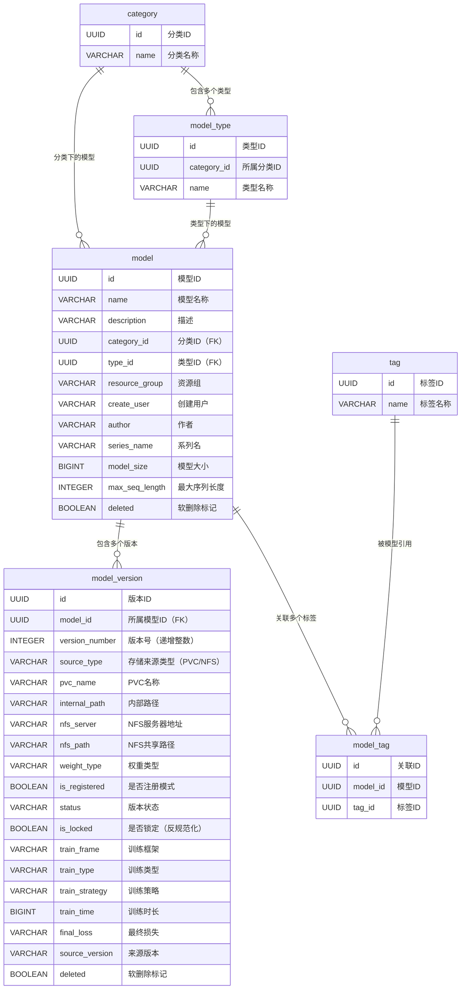
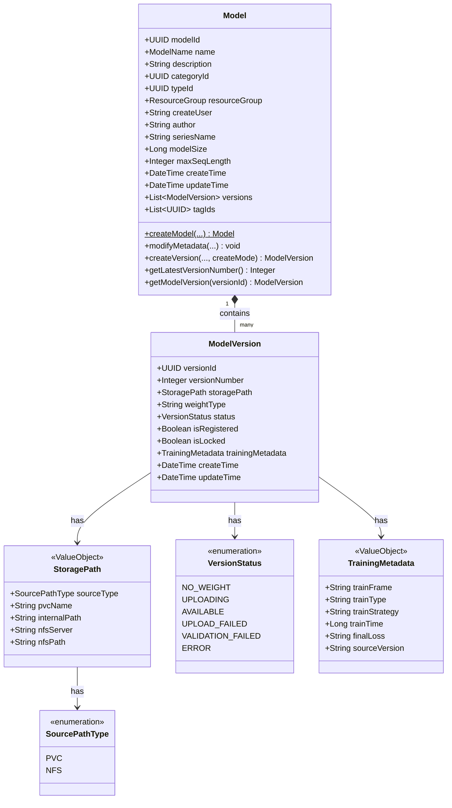
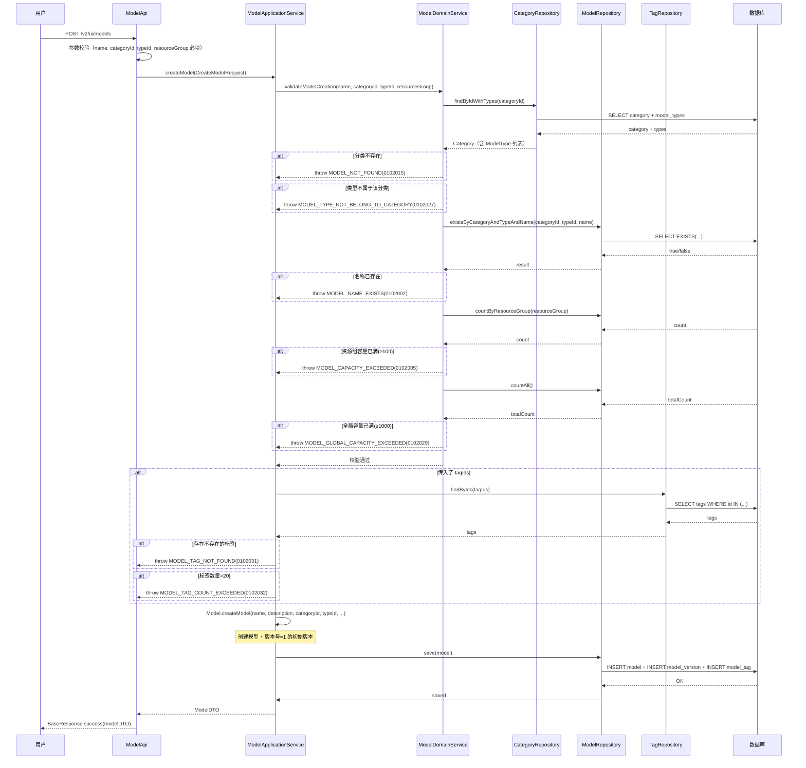
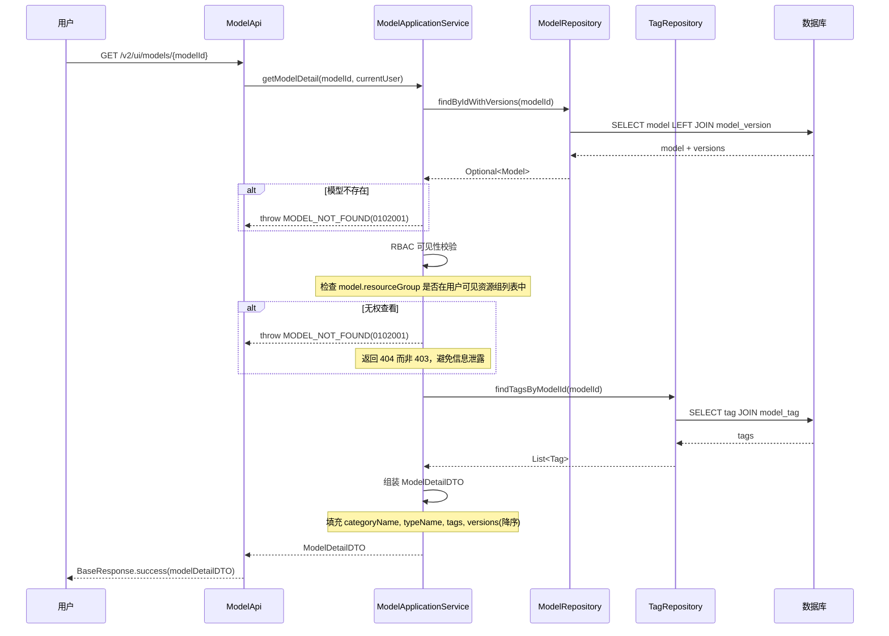
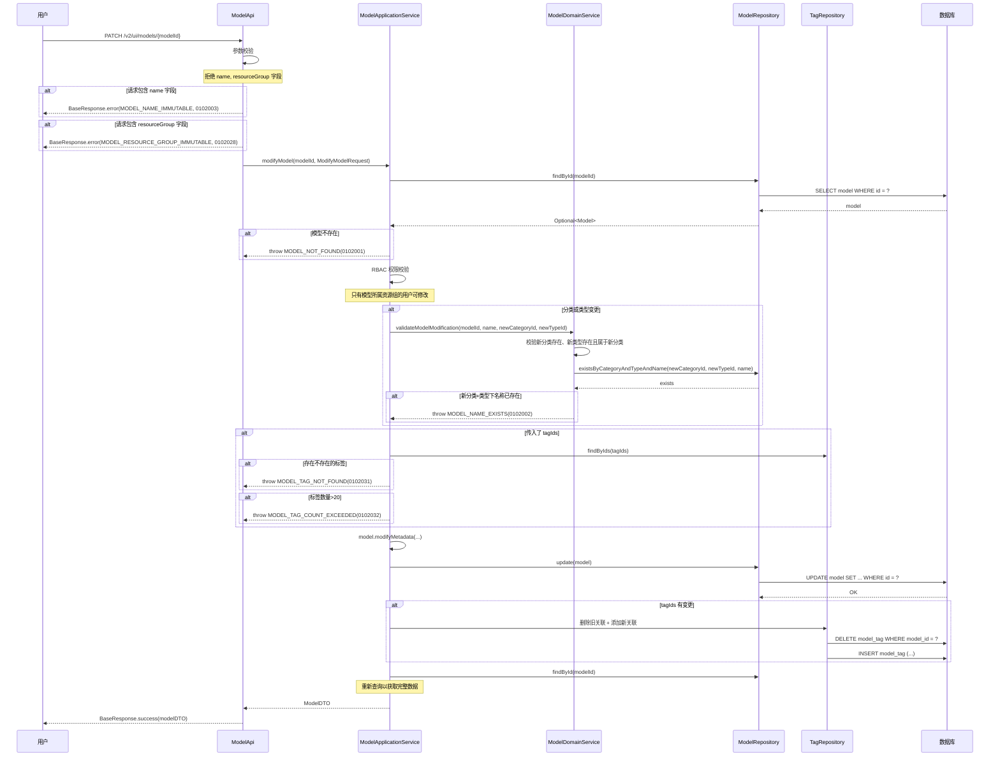
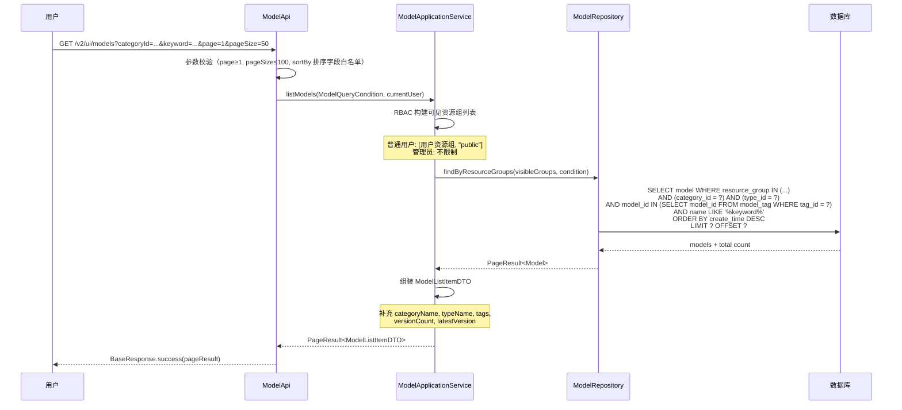
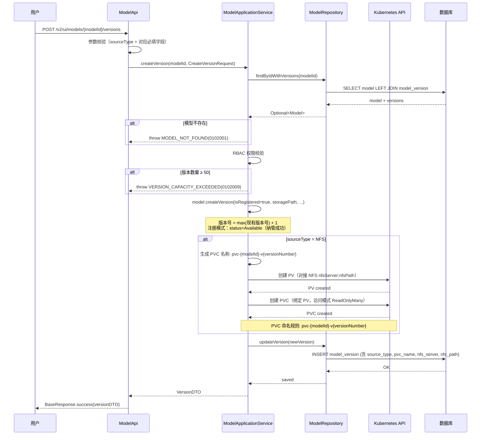
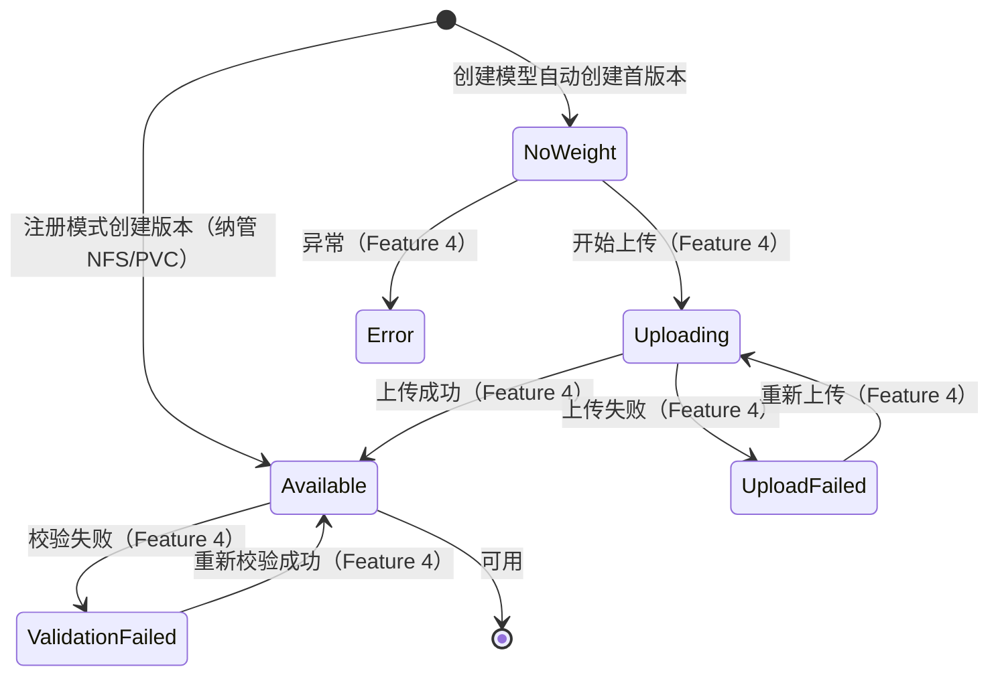

# Feature 3: 模型与版本生命周期管理 — 特性设计文档

> **文档类型**: 特性设计文档
> **文档版本**: v1.0
> **编写日期**: 2026-04-26
> **适用范围**: ModelLite 平台模型仓库模块 Feature 3
> **目标读者**: 后端开发工程师

---

## 1. 特性概述

### 1.1 目标

实现模型仓库的核心业务——模型（Model）与模型版本（ModelVersion）的完整生命周期管理。包括模型的创建/查看/修改，版本的创建/查看，模型列表查询（含分类/类型/标签筛选），以及资源组级别的可见性控制（RBAC）。模型是平台最核心的聚合根，版本作为模型内的实体承载权重文件生命周期。

### 1.2 范围

**IN（包含）**:
- Model 聚合根的领域模型实现（含 ModelVersion 实体）
- 值对象实现：StoragePath（含 SourcePathType 枚举）, TrainingMetadata；单字段校验内联到聚合根
- 枚举实现：VersionStatus（复用 Feature 1 已定义的枚举）
- ModelRepository 仓储接口与 MyBatis 实现
- ModelApplicationService 应用服务
- 模型 CRUD 的人机接口（创建/查看/修改）
- 版本创建/查看的人机接口
- 模型列表查询（分页、分类/类型/标签/名称筛选、排序）
- 资源组可见性控制（RBAC 过滤）
- 模型容量限制校验（单资源组 100 模型、单模型 50 版本、全局 1000 模型）
- Feature 1 中预定义的模型/版本相关错误码的集成使用
- 本特性新增错误码定义

**OUT（不包含）**:
- 版本状态流转相关操作（上传、转换、校验 → Feature 4）
- 版本锁管理（Feature 5）
- 模型/版本软删除与回收站（Feature 6）
- M2M 机机接口（Feature 8）
- 操作日志上报（Feature 8）
- 内置预设数据填充（Feature 2）
- 分类/类型/标签的 CRUD 接口（Feature 2）

### 1.3 依赖关系

| 依赖项 | 类型 | 说明 |
|--------|------|------|
| Feature 1: 基础设施与通用能力 | 特性 | 数据库 Schema（model, model_version, model_tag 表）、枚举定义（VersionStatus, SourceType）、TypeHandler、错误码定义（0102001-0102009）、MyBatis 配置 |
| Feature 2: 分类体系与标签管理 | 特性 | Category/Tag 聚合、CategoryRepository/TagRepository（分类/类型/标签存在性校验）、model_tag 关联管理 |
| com.huawei.modellite.common 公共模块 | 外部依赖 | 提供 ModelLiteException、BaseResponse 等 |

### 1.4 需求追溯

| 需求编号 | 需求名称 | 本特性覆盖范围 |
|----------|----------|----------------|
| REQ-MODEL-001 | 模型创建 | 完整实现 |
| REQ-MODEL-002 | 模型查看 | 完整实现 |
| REQ-MODEL-003 | 模型修改 | 完整实现（description, category, type, tags 可修改） |
| REQ-VERSION-001 | 版本创建 | 完整实现（仅注册模式，上传模式由 Feature 4 实现） |
| REQ-VERSION-002 | 版本查看 | 完整实现 |
| REQ-QUERY-001 | 模型列表查询 | 完整实现 |
| REQ-RBAC-001 | 资源组可见性 | 完整实现 |
| REQ-RBAC-002 | 资源组归属 | 完整实现（创建时设置，当前不可修改） |
| REQ-RBAC-003 | 公共资源组权限 | 完整实现（公共资源组模型对所有用户可见） |

---

## 2. 数据库设计

### 2.1 新增/变更表 DDL

> 本特性涉及的 2 张核心表（model, model_version）已在 Feature 1 中创建，DDL 不变更。此处补充完整的数据字典、业务约束和索引设计说明。

#### model（模型表）

**DDL**: 见 Feature 1 §2.1。

**本特性新增业务规则**:
- 模型名称在「同一分类 + 同一类型」下唯一（`uk_model_name` 约束，WHERE deleted = FALSE）
- 模型名称创建后不可修改（代码校验）
- 资源组（resource_group）创建后不可修改（代码校验，但预留未来扩展能力）
- 单个资源组下模型数量上限 100（代码校验）
- 全局模型数量上限 1000（代码校验）
- 软删除标记 `deleted` 由 Feature 6 管理，本特性不涉及

#### model_version（模型版本表）

**DDL**: 见 Feature 1 §2.1。

**本特性新增业务规则**:
- 版本号（version_number）为自动递增整数，无间隔（代码校验 + 数据库唯一约束 `uk_model_version`）
- 单个模型下版本数量上限 50（代码校验）
- 版本状态（status）初始值为 `NoWeight`，注册模式创建时直接置为 `Available`（纳管成功）
- `is_locked` 为反规范化字段，实际锁状态由 version_lock 表驱动（Feature 5）
- `is_registered` 标记版本是否为注册模式（TRUE）或上传模式（FALSE）

#### model_tag（模型-标签关联表）

**DDL**: 见 Feature 1 §2.1。本特性通过 TagRepository（Feature 2）管理模型-标签关联。

### 2.2 表关系图（ER 图）



### 2.3 索引设计

> 以下索引中部分已在 Feature 1 §2.3 中定义，此处列出本特性依赖的全部索引。

| 表名 | 索引名 | 索引类型 | 索引字段 | 说明 | 状态 |
|------|--------|----------|----------|------|------|
| model | uk_model_name | UNIQUE | name, category_id, type_id WHERE deleted=FALSE | 模型名称唯一约束 | Feature 1 已创建 |
| model | idx_model_category | B-tree | category_id WHERE deleted=FALSE | 按分类查询模型 | Feature 1 已创建 |
| model | idx_model_type | B-tree | type_id WHERE deleted=FALSE | 按类型查询模型 | Feature 1 已创建 |
| model | idx_model_resource_group | B-tree | resource_group WHERE deleted=FALSE | 资源组可见性过滤 | **本特性新增** |
| model | idx_model_create_time | B-tree | create_time DESC WHERE deleted=FALSE | 按创建时间排序 | **本特性新增** |
| model | idx_model_update_time | B-tree | update_time DESC WHERE deleted=FALSE | 按更新时间排序 | **本特性新增** |
| model | idx_model_name_trgm | GIN | name | 名称模糊搜索（LIKE '%keyword%'） | **本特性新增** |
| model_version | uk_model_version | UNIQUE | model_id, version_number | 版本号唯一约束 | Feature 1 已创建 |
| model_version | idx_version_model_id | B-tree | model_id WHERE deleted=FALSE | 按模型查版本列表 | Feature 1 已创建 |
| model_tag | idx_model_tag_model | B-tree | model_id | 按模型查标签 | Feature 1 已创建 |
| model_tag | idx_model_tag_tag | B-tree | tag_id | 按标签查模型 | Feature 1 已创建 |

**新增索引 DDL**:

```sql
-- 资源组索引（RBAC 过滤核心索引）
CREATE INDEX idx_model_resource_group ON model(resource_group) WHERE deleted = FALSE;

-- 排序索引
CREATE INDEX idx_model_create_time ON model(create_time DESC) WHERE deleted = FALSE;
CREATE INDEX idx_model_update_time ON model(update_time DESC) WHERE deleted = FALSE;

-- 名称模糊搜索索引（需要 pg_trgm 扩展）
CREATE EXTENSION IF NOT EXISTS pg_trgm;
CREATE INDEX idx_model_name_trgm ON model USING gin(name gin_trgm_ops);
```

### 2.4 数据字典

#### model 表

| 字段名 | 类型 | 是否必填 | 默认值 | 取值范围/说明 |
|--------|------|----------|--------|---------------|
| id | UUID | Y | 应用侧生成 | 模型 ID，UUID v4 |
| name | VARCHAR(255) | Y | — | 模型名称，同一分类+类型下唯一，长度 1-255，创建后不可修改 |
| description | VARCHAR(2000) | N | '' | 模型描述，长度 0-2000 |
| category_id | UUID | Y | — | 分类 ID（外键引用 category.id） |
| type_id | UUID | Y | — | 类型 ID（外键引用 model_type.id） |
| resource_group | VARCHAR(100) | Y | — | 资源组标识，创建后不可修改 |
| create_user | VARCHAR(100) | Y | — | 创建用户标识 |
| author | VARCHAR(100) | N | NULL | 模型作者 |
| series_name | VARCHAR(255) | N | NULL | 模型系列名称 |
| model_size | BIGINT | N | NULL | 模型大小（字节） |
| max_seq_length | INTEGER | N | NULL | 最大序列长度 |
| deleted | BOOLEAN | Y | FALSE | 软删除标记（Feature 6 管理） |
| create_time | TIMESTAMP WITH TIME ZONE | Y | NOW() | 创建时间 |
| update_time | TIMESTAMP WITH TIME ZONE | Y | NOW() | 更新时间 |

#### model_version 表

| 字段名 | 类型 | 是否必填 | 默认值 | 取值范围/说明 |
|--------|------|----------|--------|---------------|
| id | UUID | Y | 应用侧生成 | 版本 ID，UUID v4 |
| model_id | UUID | Y | — | 所属模型 ID（外键引用 model.id） |
| version_number | INTEGER | Y | — | 版本号，自动递增整数，无间隔，同一模型下唯一 |
| source_type | VARCHAR(20) | N | NULL | 存储来源类型：`PVC`（使用已有 PVC）/ `NFS`（系统自动创建 PVC 对接 NFS） |
| pvc_name | VARCHAR(255) | N | NULL | PVC 名称；PVC 模式为用户提供的已有 PVC；NFS 模式为系统自动创建（命名规则 `pvc-{modelId}-v{versionNumber}`） |
| internal_path | VARCHAR(1024) | N | NULL | PVC 内部路径 |
| nfs_server | VARCHAR(255) | N | NULL | NFS 服务器地址（如 `10.0.1.100`），仅 NFS 模式填写 |
| nfs_path | VARCHAR(1024) | N | NULL | NFS 共享路径（如 `/data/models/glm-5`），仅 NFS 模式填写 |
| weight_type | VARCHAR(50) | N | NULL | 权重类型 |
| is_registered | BOOLEAN | Y | FALSE | 是否注册模式（TRUE=注册，FALSE=上传） |
| status | VARCHAR(30) | Y | 'NoWeight' | 版本状态枚举：NoWeight/Uploading/Available/UploadFailed/ValidationFailed/Error；注册模式创建时直接置为 Available（纳管成功） |
| is_locked | BOOLEAN | Y | FALSE | 是否锁定（反规范化字段，实际由 version_lock 表驱动） |
| train_frame | VARCHAR(100) | N | NULL | 训练框架（如 PyTorch、TensorFlow） |
| train_type | VARCHAR(100) | N | NULL | 训练类型 |
| train_strategy | VARCHAR(100) | N | NULL | 训练策略 |
| train_time | BIGINT | N | NULL | 训练时长（秒） |
| final_loss | VARCHAR(100) | N | NULL | 最终损失值 |
| source_version | VARCHAR(50) | N | NULL | 来源版本标识 |
| deleted | BOOLEAN | Y | FALSE | 软删除标记（Feature 6 管理） |
| create_time | TIMESTAMP WITH TIME ZONE | Y | NOW() | 创建时间 |
| update_time | TIMESTAMP WITH TIME ZONE | Y | NOW() | 更新时间 |

---

## 3. 领域模型设计

### 3.1 类图

#### Model 聚合



### 3.2 核心类定义

#### Model（聚合根）

**包路径**: `com.huawei.modellite.repository.modelweight.domain.aggregate.model`

| 字段名 | 类型 | 说明 | 约束 |
|--------|------|------|------|
| modelId | UUID | 模型唯一标识 | 创建后不可修改 |
| name | String | 模型名称 | 长度 1-255，仅允许字母、数字、中文、下划线、连字符（`^[a-zA-Z0-9\u4e00-\u9fa5_-]+$`），同一分类+类型下唯一，创建后不可修改 |
| description | String | 模型描述 | 长度 0-2000，可修改 |
| categoryId | UUID | 分类 ID | 引用有效的 category.id，可修改 |
| typeId | UUID | 类型 ID | 引用有效的 model_type.id，可修改 |
| resourceGroup | String | 资源组 | 非空，最长 100 字符，特殊值 "public" 表示公共资源组，创建后不可修改 |
| createUser | String | 创建用户 | 创建后不可修改 |
| author | String | 作者 | 可选，可修改 |
| seriesName | String | 系列名 | 可选，可修改 |
| modelSize | Long | 模型大小（字节） | 可选，可修改 |
| maxSeqLength | Integer | 最大序列长度 | 可选，可修改 |
| createTime | DateTime | 创建时间 | 自动填充 |
| updateTime | DateTime | 更新时间 | 自动填充 |
| versions | List\<ModelVersion\> | 版本列表 | 聚合内实体，延迟加载 |
| tagIds | List\<UUID\> | 标签 ID 列表 | 由 TagRepository 管理，Model 聚合内仅维护 ID |

**方法定义**:

| 方法名 | 参数 | 返回类型 | 说明 | 业务规则 |
|--------|------|----------|------|----------|
| createModel（静态工厂） | name, description, categoryId, typeId, resourceGroup, createUser, author?, seriesName?, modelSize?, maxSeqLength? | Model | 创建新模型（含首个版本） | 前置：分类存在、类型存在、类型属于该分类、名称唯一、资源组容量未满、全局容量未满；后置：创建模型 + 版本号=1 的初始版本（status=NoWeight, isRegistered=false） |
| modifyMetadata | description?, categoryId?, typeId?, author?, seriesName?, modelSize?, maxSeqLength? | void | 修改模型元数据 | 前置：模型存在；规则：name 和 resourceGroup 不可修改；若修改 categoryId/typeId，需校验新分类+类型下名称唯一、新类型属于新分类 |
| createVersion | isRegistered, storagePath, weightType?, trainingMetadata? | ModelVersion | 创建新版本 | 前置：版本容量未满（<50）；规则：版本号 = max(现有版本号) + 1；后置：注册模式 status=Available（纳管成功），非注册模式 status=NoWeight；NFS 模式由应用服务层创建 PV+PVC 后填充 pvcName |
| getLatestVersionNumber | — | Integer | 获取当前最大版本号 | 空列表返回 0 |
| getModelVersion | versionId | ModelVersion | 按 ID 查找版本 | 不存在则抛 VERSION_NOT_FOUND |

#### ModelVersion（实体）

| 字段名 | 类型 | 说明 | 约束 |
|--------|------|------|------|
| versionId | UUID | 版本唯一标识 | 创建后不可修改 |
| versionNumber | Integer | 版本号 | 自动递增整数，≥1，无间隔，创建后不可修改 |
| storagePath | StoragePath | 存储路径 | 值对象，可为空 |
| weightType | String | 权重类型 | 可为空，最长 50 字符 |
| status | VersionStatus | 版本状态 | 注册模式创建时为 Available（纳管成功），非注册模式为 NoWeight |
| isRegistered | Boolean | 是否注册模式 | 创建时设置，不可修改 |
| isLocked | Boolean | 是否锁定 | 反规范化字段，Feature 5 管理 |
| trainingMetadata | TrainingMetadata | 训练元数据 | 值对象，可为空 |
| createTime | DateTime | 创建时间 | 自动填充 |
| updateTime | DateTime | 更新时间 | 自动填充 |

#### 关键方法伪代码

**Model.createModel（静态工厂方法）**:
```java
// 前置条件由应用服务层校验：
//   分类存在、类型存在、类型属于该分类、名称在分类+类型下唯一、
//   资源组容量未满（<100）、全局容量未满（<1000）

public static Model createModel(name, description, categoryId, typeId, 
        resourceGroup, createUser, author?, seriesName?, modelSize?, maxSeqLength?) {
    // 赋值：modelId=UUID随机, name=trim后校验字符集, resourceGroup,
    //       categoryId, typeId, createUser, 可选字段直接赋值
    // 校验：name 非空且长度 1-255，仅含 [a-zA-Z0-9中文_-]；resourceGroup 非空且 ≤100
    // 创建首个版本：版本号=1，status=NoWeight，isRegistered=false，storagePath=empty
    // 返回新 Model 实例
}
```

**Model.createVersion**:
```java
// 前置条件：版本容量校验由应用服务层完成（<50）

public ModelVersion createVersion(isRegistered, storagePath, weightType?, trainingMetadata?) {
    // 赋值：versionId=UUID随机, versionNumber=getNextVersionNumber(),
    //       isRegistered, storagePath, weightType, isLocked=false,
    //       trainingMetadata（若 null 则取 empty）
    // 状态：若 isRegistered=true → status=Available（纳管成功，直接可用）
    //       若 isRegistered=false → status=NoWeight（等待上传）
    // 校验：versionNumber ≥ 1 且连续递增
    // 后置：添加到 versions 列表，更新 updateTime
    // 返回新 ModelVersion 实例
}
```

**Model.modifyMetadata**:
```java
public void modifyMetadata(description?, categoryId?, typeId?, 
        author?, seriesName?, modelSize?, maxSeqLength?) {
    // 不可修改字段（由 API 层不暴露保证）：name, resourceGroup
    // 赋值：将所有非 null 参数赋值给对应字段
    // 校验约束（跨聚合校验由 ModelDomainService 完成）：
    //   若 categoryId/typeId 变更 → 新类型属于新分类、新分类+类型下名称唯一
    // 后置：更新 updateTime
}
```

**ModelVersion.createFirstVersion（静态工厂方法）**:
```java
static ModelVersion createFirstVersion(UUID modelId) {
    // 赋值：versionId=UUID随机, versionNumber=1, modelId, 
    //       status=NoWeight, isRegistered=false, isLocked=false
    // 空值：storagePath=empty, weightType=null, trainingMetadata=empty
}
```

### 3.3 值对象定义

本设计仅保留**多字段组合型**值对象，单字段校验直接在聚合根方法中完成。

| 值对象名 | 字段名 | 类型 | 说明 | 校验规则 |
|----------|--------|------|------|----------|
| StoragePath | sourceType | SourcePathType | 存储路径来源类型 | 枚举：PVC / NFS |
| | pvcName | String | PVC 名称 | PVC 模式必填；NFS 模式为系统自动生成（`pvc-{modelId}-v{versionNumber}`） |
| | internalPath | String | PVC 内部路径 | 可为空，最长 1024 字符 |
| | nfsServer | String | NFS 服务器地址 | NFS 模式必填（如 `10.0.1.100` 或 `nfs-server.example.com`），PVC 模式为 null |
| | nfsPath | String | NFS 共享路径 | NFS 模式必填（如 `/data/models/glm-5`），PVC 模式为 null |
| TrainingMetadata | trainFrame | String | 训练框架 | 可为空，最长 100 字符 |
| | trainType | String | 训练类型 | 可为空，最长 100 字符 |
| | trainStrategy | String | 训练策略 | 可为空，最长 100 字符 |
| | trainTime | Long | 训练时长（秒） | 可为空，≥0 |
| | finalLoss | String | 最终损失值 | 可为空，最长 100 字符 |
| | sourceVersion | String | 来源版本 | 可为空，最长 50 字符 |

**枚举定义**:

| 枚举名 | 值 | 说明 |
|--------|------|------|
| SourcePathType | PVC | 使用已有 PVC，用户直接提供 pvcName + internalPath |
| | NFS | 使用 NFS 路径，系统自动创建 PV+PVC 对接 NFS（只读访问模式） |

**值对象实现说明**:

- `StoragePath`:
  - PVC 模式构造：`StoragePath.ofPvc(pvcName, internalPath)` → sourceType=PVC, nfsServer=null, nfsPath=null
  - NFS 模式构造：`StoragePath.ofNfs(nfsServer, nfsPath)` → sourceType=NFS, pvcName=null（后续由应用服务填充自动生成的 PVC 名称）
  - `empty()` 静态方法返回所有字段为 null 的实例
  - PVC 模式校验：pvcName 非空
  - NFS 模式校验：nfsServer 非空、nfsPath 非空
- `TrainingMetadata`: `empty()` 静态方法返回所有字段为 null 的实例

**聚合根内联校验**（替代原单字段 VO）:

- `name`（String）：构造/创建时校验非空、trim、长度 1-255、字符集 `^[a-zA-Z0-9\u4e00-\u9fa5_-]+$`
- `resourceGroup`（String）：构造时校验非空、长度 ≤100；辅助方法 `isPublicResourceGroup()` 返回 `"public".equals(resourceGroup)`
- `versionNumber`（Integer）：构造时校验 ≥1；辅助方法 `getNextVersionNumber()` 返回当前最大值 + 1
- `weightType`（String）：可为空，长度 ≤50

### 3.4 领域服务

本特性需要 ModelDomainService 领域服务，用于跨聚合校验：

| 领域服务名 | 职责 | 跨聚合协调场景 |
|------------|------|----------------|
| ModelDomainService | 模型创建/修改的跨聚合校验 | 校验分类存在性（CategoryRepository）、类型存在性及归属（CategoryRepository）、资源组容量（ModelRepository）、全局容量（ModelRepository）、名称唯一性（ModelRepository）、标签存在性（TagRepository） |

**关键方法**:

| 方法名 | 参数 | 返回类型 | 说明 |
|--------|------|----------|------|
| validateModelCreation | name, categoryId, typeId, resourceGroup | void | 校验分类存在、类型存在且属于该分类、名称唯一、资源组容量未满、全局容量未满 |
| validateModelModification | modelId, name, categoryId, typeId | void | 校验模型存在；若 categoryId/typeId 变更，校验新分类+类型下名称唯一、新类型属于新分类 |

**伪代码 — validateModelCreation**:
```java
public void validateModelCreation(name, categoryId, typeId, resourceGroup) {
    // 1. 分类存在性 → categoryRepository.findById → 不存在抛 CATEGORY_NOT_FOUND
    // 2. 类型存在性及归属 → category.getModelTypes().find(typeId) → 不存在抛 MODEL_TYPE_NOT_BELONG_TO_CATEGORY
    // 3. 名称唯一性 → modelRepository.existsByCategoryAndTypeAndName → 存在抛 MODEL_NAME_EXISTS
    // 4. 资源组容量 → modelRepository.countByResourceGroup ≥ 100 抛 MODEL_CAPACITY_EXCEEDED
    // 5. 全局容量 → modelRepository.countAll ≥ 1000 抛 MODEL_GLOBAL_CAPACITY_EXCEEDED
}
```

**伪代码 — validateModelModification**:
```java
public void validateModelModification(modelId, categoryId, typeId) {
    // 1. 模型存在性 → modelRepository.findById → 不存在抛 MODEL_NOT_FOUND
    // 2. 若 categoryId 或 typeId 变更：
    //    a. 新分类存在性 → CATEGORY_NOT_FOUND
    //    b. 新类型存在性及归属 → MODEL_TYPE_NOT_BELONG_TO_CATEGORY
    //    c. 新分类+类型下名称唯一性 → MODEL_NAME_EXISTS
}
```

### 3.5 仓储接口

#### ModelRepository

**包路径**: `com.huawei.modellite.repository.modelweight.domain.repository`

| 方法名 | 参数 | 返回类型 | 说明 |
|--------|------|----------|------|
| save | Model | void | 保存模型（含级联保存 ModelVersion 和 model_tag） |
| findById | UUID modelId | Optional\<Model\> | 按 ID 查找模型（不含版本列表和标签） |
| findByIdWithVersions | UUID modelId | Optional\<Model\> | 按 ID 查找模型（含版本列表，按版本号降序） |
| findVersionById | UUID modelId, UUID versionId | Optional\<ModelVersion\> | 按 ID 查找指定版本 |
| findAll | — | List\<Model\> | 查询全部模型（不含版本） |
| findByCondition | ModelQueryCondition | PageResult\<Model\> | 条件查询（分页、筛选、排序） |
| findByResourceGroups | List\<String\> resourceGroups, ModelQueryCondition condition | PageResult\<Model\> | 按资源组列表过滤查询（RBAC 核心） |
| existsByCategoryAndTypeAndName | UUID categoryId, UUID typeId, String name | boolean | 检查模型名称在同分类+同类型下是否存在 |
| countByResourceGroup | String resourceGroup | long | 统计资源组下模型数量 |
| countAll | — | long | 统计全局模型数量 |
| update | Model | void | 更新模型元数据（不含版本） |
| updateVersion | ModelVersion | void | 更新版本信息 |
| findTagIdsByModelId | UUID modelId | List\<UUID\> | 查询模型关联的标签 ID 列表 |

#### ModelQueryCondition（查询条件值对象）

| 字段名 | 类型 | 说明 | 默认值 |
|--------|------|------|--------|
| categoryId | UUID | 分类 ID 筛选 | null（不筛选） |
| typeId | UUID | 类型 ID 筛选 | null（不筛选） |
| tagId | UUID | 标签 ID 筛选 | null（不筛选） |
| keyword | String | 名称模糊搜索 | null（不筛选） |
| resourceGroups | List\<String\> | 资源组列表（RBAC） | null（不筛选） |
| page | Integer | 页码（从 1 开始） | 1 |
| pageSize | Integer | 每页条数 | 50 |
| sortBy | String | 排序字段 | "createTime" |
| sortOrder | String | 排序方向 | "desc" |

#### PageResult\<T\>（分页结果值对象）

| 字段名 | 类型 | 说明 |
|--------|------|------|
| items | List\<T\> | 当前页数据列表 |
| total | long | 总记录数 |
| page | int | 当前页码 |
| pageSize | int | 每页条数 |
| totalPages | int | 总页数 |

### 3.6 业务不变量

| 不变量名 | 说明 | 强制方式 |
|----------|------|----------|
| 模型名称唯一 | 模型名称在同一分类+同一类型下唯一（软删除排除） | 数据库唯一约束 `uk_model_name` + 代码校验 |
| 模型名称不可变 | 模型名称创建后不可修改 | API 层不暴露 name 修改字段 |
| 资源组不可变 | 资源组创建后不可修改 | API 层不暴露 resourceGroup 修改字段 |
| 资源组容量限制 | 单个资源组下模型数量 ≤ 100 | 代码校验（countByResourceGroup） |
| 全局容量限制 | 全局模型数量 ≤ 1000 | 代码校验（countAll） |
| 版本容量限制 | 单个模型下版本数量 ≤ 50 | 代码校验（versions.size()） |
| 版本号递增无间隔 | 版本号为连续递增整数，从 1 开始 | 代码校验 + 数据库唯一约束 `uk_model_version` |
| 创建模型必含首版本 | 创建模型时必须同时创建版本号=1的初始版本 | 聚合根工厂方法保证 |
| 分类-类型归属一致 | 模型的类型必须属于其分类 | 领域服务校验 |
| 资源组可见性 | 普通用户只能看到自己资源组+公共资源组的模型；管理员可看到全部 | 应用服务层过滤（findByResourceGroups） |
| 标签数量限制 | 同一模型最多 20 个标签 | 代码校验 |

### 3.7 错误码定义

> Feature 1 已定义的模型/版本相关错误码（本特性复用）:

| 错误码 | 枚举名 | HTTP 状态码 | 说明 | 来源 |
|--------|--------|-------------|------|------|
| 0102001 | MODEL_NOT_FOUND | 404 | 模型不存在 | Feature 1 |
| 0102002 | MODEL_NAME_EXISTS | 409 | 模型名称已存在 | Feature 1 |
| 0102003 | MODEL_NAME_IMMUTABLE | 400 | 模型名称不可修改 | Feature 1 |
| 0102005 | MODEL_CAPACITY_EXCEEDED | 400 | 模型数量超出限制 | Feature 1 |
| 0102006 | VERSION_NOT_FOUND | 404 | 版本不存在 | Feature 1 |
| 0102007 | VERSION_NUMBER_GAP | 400 | 版本号不连续 | Feature 1 |
| 0102008 | VERSION_LOCKED | 400 | 版本已锁定 | Feature 1 |
| 0102009 | VERSION_CAPACITY_EXCEEDED | 400 | 版本数量超出限制 | Feature 1 |

> 本特性新增错误码:

| 错误码 | 枚举名 | HTTP 状态码 | 说明 |
|--------|--------|-------------|------|
| 0102027 | MODEL_TYPE_NOT_BELONG_TO_CATEGORY | 400 | 模型类型不属于该分类 |
| 0102028 | MODEL_RESOURCE_GROUP_IMMUTABLE | 400 | 资源组不可修改 |
| 0102029 | MODEL_GLOBAL_CAPACITY_EXCEEDED | 400 | 全局模型数量超出限制 |
| 0102030 | VERSION_INVALID_CREATE_MODE | 400 | 无效的版本创建模式 |
| 0102031 | MODEL_TAG_NOT_FOUND | 404 | 标签不存在 |
| 0102032 | MODEL_TAG_COUNT_EXCEEDED | 400 | 模型标签数量超出限制（≤20） |
| 0102033 | STORAGE_PATH_PVC_NAME_REQUIRED | 400 | PVC 模式下 pvcName 不能为空 |
| 0102034 | STORAGE_PATH_NFS_REQUIRED | 400 | NFS 模式下 nfsServer 和 nfsPath 不能为空 |

---

## 4. 接口设计

### 4.1 人机接口（User API）

#### 4.1.1 创建模型

| 属性 | 值 |
|------|-----|
| URL | `POST /v2/ui/models` |
| Method | POST |
| 描述 | 创建新模型（同时创建版本号=1的初始版本） |

**Request Body**:
```json
{
    "name": "glm-5-9b",                    // 模型名称，必填，1-255字符
    "description": "GLM-5 9B 模型",         // 描述，可选，0-2000字符
    "categoryId": "uuid-category-001",      // 分类ID，必填
    "typeId": "uuid-type-001",              // 类型ID，必填
    "resourceGroup": "team-alpha",          // 资源组，必填，1-100字符
    "author": "张三",                        // 作者，可选，1-100字符
    "seriesName": "GLM-5",                  // 系列名，可选，1-255字符
    "modelSize": 18000000000,               // 模型大小（字节），可选
    "maxSeqLength": 8192,                   // 最大序列长度，可选
    "tagIds": [                             // 标签ID列表，可选，最多20个
        "uuid-tag-001",
        "uuid-tag-002"
    ]
}
```

**Response Body**（成功）:
```json
{
    "code": 0,
    "message": "success",
    "data": {
        "id": "uuid-model-new",
        "name": "glm-5-9b",
        "description": "GLM-5 9B 模型",
        "categoryId": "uuid-category-001",
        "typeName": "glm-5",
        "categoryName": "TextGeneration",
        "typeId": "uuid-type-001",
        "resourceGroup": "team-alpha",
        "createUser": "user-001",
        "author": "张三",
        "seriesName": "GLM-5",
        "modelSize": 18000000000,
        "maxSeqLength": 8192,
        "tags": [
            { "id": "uuid-tag-001", "name": "NLP" },
            { "id": "uuid-tag-002", "name": "supportFinetune" }
        ],
        "versions": [
            {
                "id": "uuid-version-001",
                "versionNumber": 1,
                "status": "NoWeight",
                "isRegistered": false,
                "isLocked": false,
                "createTime": "2026-04-26T10:00:00Z",
                "updateTime": "2026-04-26T10:00:00Z"
            }
        ],
        "createTime": "2026-04-26T10:00:00Z",
        "updateTime": "2026-04-26T10:00:00Z"
    },
    "timestamp": "2026-04-26T10:00:00Z",
    "requestId": "req-uuid-xxx"
}
```

**错误码**:

| 错误码 | HTTP 状态码 | 说明 |
|--------|-------------|------|
| 0102015 | 404 | 分类不存在 |
| 0102018 | 404 | 模型类型不存在 |
| 0102027 | 400 | 模型类型不属于该分类 |
| 0102002 | 409 | 模型名称已存在 |
| 0102005 | 400 | 资源组下模型数量已达上限 |
| 0102029 | 400 | 全局模型数量已达上限 |
| 0102031 | 404 | 标签不存在 |
| 0102032 | 400 | 标签数量超出限制（>20） |

**业务规则**:
- **前置条件**: 分类存在、类型存在、类型属于该分类、名称在分类+类型下唯一、资源组容量未满、全局容量未满、标签存在
- **校验规则**: name 长度 1-255，description 长度 0-2000，tagIds 最多 20 个
- **后置条件**: 创建模型记录 + 版本号=1 的初始版本（status=NoWeight），建立标签关联
- **RBAC**: resourceGroup 由创建者指定（从请求上下文或参数获取）

---

#### 4.1.2 查询模型详情

| 属性 | 值 |
|------|-----|
| URL | `GET /v2/ui/models/{modelId}` |
| Method | GET |
| 描述 | 查询指定模型的完整详情（含版本列表，按版本号降序） |

**Path Parameters**:

| 参数名 | 类型 | 必填 | 说明 |
|--------|------|------|------|
| modelId | UUID | Y | 模型 ID |

**Response Body**（成功）:
```json
{
    "code": 0,
    "message": "success",
    "data": {
        "id": "uuid-model-001",
        "name": "glm-5-9b",
        "description": "GLM-5 9B 模型",
        "categoryId": "uuid-category-001",
        "categoryName": "TextGeneration",
        "typeId": "uuid-type-001",
        "typeName": "glm-5",
        "resourceGroup": "team-alpha",
        "createUser": "user-001",
        "author": "张三",
        "seriesName": "GLM-5",
        "modelSize": 18000000000,
        "maxSeqLength": 8192,
        "tags": [
            { "id": "uuid-tag-001", "name": "NLP" },
            { "id": "uuid-tag-002", "name": "supportFinetune" }
        ],
        "versions": [
            {
                "id": "uuid-version-002",
                "versionNumber": 2,
                "status": "Available",
                "isRegistered": true,
                "isLocked": false,
                "sourceType": "PVC",
                "pvcName": "model-pvc",
                "internalPath": "/models/glm-5-9b/v2",
                "weightType": "safetensors",
                "trainingMetadata": {
                    "trainFrame": "PyTorch",
                    "trainType": "SFT",
                    "trainStrategy": "LoRA",
                    "trainTime": 36000,
                    "finalLoss": "0.0023",
                    "sourceVersion": "v1.0-base"
                },
                "createTime": "2026-04-26T14:00:00Z",
                "updateTime": "2026-04-26T15:00:00Z"
            },
            {
                "id": "uuid-version-001",
                "versionNumber": 1,
                "status": "Available",
                "isRegistered": false,
                "isLocked": false,
                "weightType": null,
                "createTime": "2026-04-26T10:00:00Z",
                "updateTime": "2026-04-26T10:00:00Z"
            }
        ],
        "createTime": "2026-04-26T10:00:00Z",
        "updateTime": "2026-04-26T14:00:00Z"
    },
    "timestamp": "2026-04-26T16:00:00Z",
    "requestId": "req-uuid-xxx"
}
```

**错误码**:

| 错误码 | HTTP 状态码 | 说明 |
|--------|-------------|------|
| 0102001 | 404 | 模型不存在 |

**业务规则**:
- **前置条件**: 模型存在
- **RBAC**: 普通用户只能查看自己资源组或公共资源组的模型；管理员可查看全部
- **后置条件**: 版本列表按 version_number DESC 排序

---

#### 4.1.3 修改模型元数据

| 属性 | 值 |
|------|-----|
| URL | `PATCH /v2/ui/models/{modelId}` |
| Method | PATCH |
| 描述 | 修改模型元数据（description, category, type, tags, author, seriesName, modelSize, maxSeqLength） |

**Path Parameters**:

| 参数名 | 类型 | 必填 | 说明 |
|--------|------|------|------|
| modelId | UUID | Y | 模型 ID |

**Request Body**:
```json
{
    "description": "更新后的描述",            // 可选，0-2000字符
    "categoryId": "uuid-category-002",      // 可选，分类ID
    "typeId": "uuid-type-003",              // 可选，类型ID（需与categoryId同时变更）
    "author": "李四",                        // 可选
    "seriesName": "GLM-5-Series",           // 可选
    "modelSize": 20000000000,               // 可选
    "maxSeqLength": 16384,                  // 可选
    "tagIds": [                             // 可选，全量替换标签列表
        "uuid-tag-001",
        "uuid-tag-003"
    ]
}
```

**Response Body**（成功）:
```json
{
    "code": 0,
    "message": "success",
    "data": {
        "id": "uuid-model-001",
        "name": "glm-5-9b",
        "description": "更新后的描述",
        "categoryId": "uuid-category-002",
        "categoryName": "Multimodal",
        "typeId": "uuid-type-003",
        "typeName": "glm-5v",
        "resourceGroup": "team-alpha",
        "createUser": "user-001",
        "author": "李四",
        "seriesName": "GLM-5-Series",
        "modelSize": 20000000000,
        "maxSeqLength": 16384,
        "tags": [
            { "id": "uuid-tag-001", "name": "NLP" },
            { "id": "uuid-tag-003", "name": "Vision" }
        ],
        "createTime": "2026-04-26T10:00:00Z",
        "updateTime": "2026-04-26T16:30:00Z"
    },
    "timestamp": "2026-04-26T16:30:00Z",
    "requestId": "req-uuid-xxx"
}
```

**错误码**:

| 错误码 | HTTP 状态码 | 说明 |
|--------|-------------|------|
| 0102001 | 404 | 模型不存在 |
| 0102015 | 404 | 分类不存在（变更分类时） |
| 0102018 | 404 | 模型类型不存在（变更类型时） |
| 0102027 | 400 | 模型类型不属于该分类 |
| 0102002 | 409 | 新分类+类型下名称已存在 |
| 0102003 | 400 | 模型名称不可修改（不允许传 name 字段） |
| 0102028 | 400 | 资源组不可修改（不允许传 resourceGroup 字段） |
| 0102031 | 404 | 标签不存在 |
| 0102032 | 400 | 标签数量超出限制（>20） |

**业务规则**:
- **前置条件**: 模型存在
- **不可修改字段**: `name`, `resourceGroup`, `createUser` — 请求中若包含这些字段则返回错误
- **分类+类型联动**: 若变更 categoryId，typeId 也必须变更（或保持不变）；新类型必须属于新分类
- **标签全量替换**: tagIds 为全量替换语义，传入空数组则清除所有标签
- **RBAC**: 只有模型所属资源组的用户可修改

---

#### 4.1.4 查询模型列表

| 属性 | 值 |
|------|-----|
| URL | `GET /v2/ui/models` |
| Method | GET |
| 描述 | 分页查询模型列表，支持分类/类型/标签/名称筛选和排序 |

**Query Parameters**:

| 参数名 | 类型 | 必填 | 默认值 | 说明 |
|--------|------|------|--------|------|
| categoryId | UUID | N | — | 按分类筛选 |
| typeId | UUID | N | — | 按类型筛选 |
| tagId | UUID | N | — | 按标签筛选 |
| keyword | String | N | — | 名称模糊搜索（LIKE '%keyword%'） |
| page | Integer | N | 1 | 页码（从 1 开始） |
| pageSize | Integer | N | 50 | 每页条数（最大 100） |
| sortBy | String | N | "createTime" | 排序字段：createTime / updateTime |
| sortOrder | String | N | "desc" | 排序方向：asc / desc |

**Response Body**（成功）:
```json
{
    "code": 0,
    "message": "success",
    "data": {
        "items": [
            {
                "id": "uuid-model-001",
                "name": "glm-5-9b",
                "description": "GLM-5 9B 模型",
                "categoryId": "uuid-category-001",
                "categoryName": "TextGeneration",
                "typeId": "uuid-type-001",
                "typeName": "glm-5",
                "resourceGroup": "team-alpha",
                "createUser": "user-001",
                "author": "张三",
                "seriesName": "GLM-5",
                "modelSize": 18000000000,
                "maxSeqLength": 8192,
                "tags": [
                    { "id": "uuid-tag-001", "name": "NLP" }
                ],
                "versionCount": 3,
                "latestVersion": {
                    "id": "uuid-version-003",
                    "versionNumber": 3,
                    "status": "Available"
                },
                "createTime": "2026-04-26T10:00:00Z",
                "updateTime": "2026-04-26T18:00:00Z"
            }
        ],
        "total": 42,
        "page": 1,
        "pageSize": 50,
        "totalPages": 1
    },
    "timestamp": "2026-04-26T19:00:00Z",
    "requestId": "req-uuid-xxx"
}
```

**错误码**:

| 错误码 | HTTP 状态码 | 说明 |
|--------|-------------|------|
| 0102015 | 404 | 分类不存在（传了 categoryId 但不存在时） |
| 0102018 | 404 | 类型不存在（传了 typeId 但不存在时） |
| 0102031 | 404 | 标签不存在（传了 tagId 但不存在时） |

**业务规则**:
- **RBAC**: 普通用户只能看到自己资源组 + "public" 资源组的模型；管理员可看到全部
- **排序**: 默认按创建时间降序；支持 createTime / updateTime 字段排序
- **筛选组合**: categoryId, typeId, tagId, keyword 可自由组合
- **性能要求**: 50 条数据响应时间 ≤ 500ms
- **列表项**: 不含完整版本列表，仅含 versionCount 和 latestVersion 摘要

---

#### 4.1.5 创建版本（注册模式）

| 属性 | 值 |
|------|-----|
| URL | `POST /v2/ui/models/{modelId}/versions` |
| Method | POST |
| 描述 | 为指定模型创建新版本（注册模式，isRegistered=true） |

**Path Parameters**:

| 参数名 | 类型 | 必填 | 说明 |
|--------|------|------|------|
| modelId | UUID | Y | 模型 ID |

**Request Body — PVC 模式**:
```json
{
    "sourceType": "PVC",
    "pvcName": "existing-pvc-name",            // 已有 PVC 名称，必填
    "internalPath": "/models/glm-5-9b/v2",     // PVC 内路径，可选
    "weightType": "safetensors",               // 权重类型，可选，最长50字符
    "trainingMetadata": {                      // 训练元数据，可选
        "trainFrame": "PyTorch",
        "trainType": "SFT",
        "trainStrategy": "LoRA",
        "trainTime": 36000,
        "finalLoss": "0.0023",
        "sourceVersion": "v1.0-base"
    }
}
```

**Request Body — NFS 模式**:
```json
{
    "sourceType": "NFS",
    "nfsServer": "10.0.1.100",                 // NFS 服务器地址，必填
    "nfsPath": "/data/models/glm-5-9b/v2",    // NFS 共享路径，必填
    "weightType": "safetensors",               // 权重类型，可选，最长50字符
    "trainingMetadata": {                      // 训练元数据，可选
        "trainFrame": "PyTorch",
        "trainType": "SFT",
        "trainStrategy": "LoRA",
        "trainTime": 36000,
        "finalLoss": "0.0023",
        "sourceVersion": "v1.0-base"
    }
}
```

**Response Body**（成功）:
```json
{
    "code": 0,
    "message": "success",
    "data": {
        "id": "uuid-version-new",
        "modelId": "uuid-model-001",
        "versionNumber": 3,
        "status": "Available",
        "isRegistered": true,
        "isLocked": false,
        "sourceType": "NFS",
        "pvcName": "pvc-uuid-model-001-v3",
        "nfsServer": "10.0.1.100",
        "nfsPath": "/data/models/glm-5-9b/v3",
        "weightType": "safetensors",
        "trainingMetadata": {
            "trainFrame": "PyTorch",
            "trainType": "SFT",
            "trainStrategy": "LoRA",
            "trainTime": 36000,
            "finalLoss": "0.0023",
            "sourceVersion": "v1.0-base"
        },
        "createTime": "2026-04-26T18:00:00Z",
        "updateTime": "2026-04-26T18:00:00Z"
    },
    "timestamp": "2026-04-26T18:00:00Z",
    "requestId": "req-uuid-xxx"
}
```

**错误码**:

| 错误码 | HTTP 状态码 | 说明 |
|--------|-------------|------|
| 0102001 | 404 | 模型不存在 |
| 0102009 | 400 | 版本数量超出限制（≥50） |
| 0102033 | 400 | PVC 模式下 pvcName 不能为空 |
| 0102034 | 400 | NFS 模式下 nfsServer 和 nfsPath 不能为空 |

**业务规则**:
- **前置条件**: 模型存在、版本容量未满（<50）
- **后置条件**: 版本号 = 当前最大版本号 + 1，注册模式 status=Available（纳管成功），非注册模式 status=NoWeight
- **PVC 模式**（sourceType=PVC）: 直接使用用户提供的 pvcName + internalPath
- **NFS 模式**（sourceType=NFS）: 系统自动创建 PV + PVC 对接 NFS（PVC 命名 `pvc-{modelId}-v{versionNumber}`），PVC 访问模式设为 **ReadOnlyMany**
- **RBAC**: 只有模型所属资源组的用户可创建版本

---

#### 4.1.6 查询版本详情

| 属性 | 值 |
|------|-----|
| URL | `GET /v2/ui/models/{modelId}/versions/{versionId}` |
| Method | GET |
| 描述 | 查询指定版本的完整详情（含训练元数据） |

**Path Parameters**:

| 参数名 | 类型 | 必填 | 说明 |
|--------|------|------|------|
| modelId | UUID | Y | 模型 ID |
| versionId | UUID | Y | 版本 ID |

**Response Body**（成功）:
```json
{
    "code": 0,
    "message": "success",
    "data": {
        "id": "uuid-version-002",
        "modelId": "uuid-model-001",
        "versionNumber": 2,
        "status": "Available",
        "isRegistered": true,
        "isLocked": false,
        "sourceType": "PVC",
        "pvcName": "model-pvc",
        "internalPath": "/models/glm-5-9b/v2",
        "weightType": "safetensors",
        "trainingMetadata": {
            "trainFrame": "PyTorch",
            "trainType": "SFT",
            "trainStrategy": "LoRA",
            "trainTime": 36000,
            "finalLoss": "0.0023",
            "sourceVersion": "v1.0-base"
        },
        "createTime": "2026-04-26T14:00:00Z",
        "updateTime": "2026-04-26T15:00:00Z"
    },
    "timestamp": "2026-04-26T19:00:00Z",
    "requestId": "req-uuid-xxx"
}
```

**错误码**:

| 错误误码 | HTTP 状态码 | 说明 |
|----------|-------------|------|
| 0102001 | 404 | 模型不存在 |
| 0102006 | 404 | 版本不存在 |

**业务规则**:
- **前置条件**: 模型存在、版本存在且属于该模型
- **RBAC**: 普通用户只能查看自己资源组或公共资源组的模型版本

---

### 4.2 机机接口（M2M API）

> M2M 接口在本特性中暂不实现（属于 Feature 8 范围）。但 API 路径预留如下：
>
> - `POST /v2/models` — 创建模型（M2M）
> - `GET /v2/models/{modelId}` — 查询模型详情（M2M）
> - `PATCH /v2/models/{modelId}` — 修改模型（M2M）
> - `GET /v2/models` — 查询模型列表（M2M）
> - `POST /v2/models/{modelId}/versions` — 创建版本（M2M）
> - `GET /v2/models/{modelId}/versions/{versionId}` — 查询版本详情（M2M）
>
> M2M 接口的 Request/Response 结构与 User API 保持一致，仅 URL 前缀不同（无 `/ui`）。

---

## 5. 核心业务流程

### 5.1 创建模型



**流程说明**:
1. API 层做参数基础校验（必填字段、长度）
2. ApplicationService 编排跨聚合校验逻辑（通过 ModelDomainService）
3. ModelDomainService 串联分类、类型、名称唯一性、容量校验
4. 标签存在性和数量校验由 ApplicationService 通过 TagRepository 完成
5. 所有校验通过后，调用 Model 静态工厂方法创建聚合（含首版本）
6. 一次性持久化 model + model_version + model_tag

---

### 5.2 查询模型详情



**流程说明**:
1. 查询模型及其版本列表（一次 JOIN 查询）
2. RBAC 可见性校验：无权限时返回 404（不泄露模型存在信息）
3. 查询标签关联（通过 TagRepository）
4. 组装 DTO：补充 categoryName, typeName, 标签列表、版本列表降序

---

### 5.3 修改模型元数据



**流程说明**:
1. API 层拦截不可修改字段（name, resourceGroup）
2. ApplicationService 加载模型、RBAC 权限校验
3. 若分类/类型变更，通过 ModelDomainService 校验新分类+类型下名称唯一性
4. 调用聚合根 modifyMetadata 方法更新字段
5. 标签采用全量替换策略：先删后增
6. 返回更新后的完整模型信息

---

### 5.4 查询模型列表



**流程说明**:
1. API 层校验分页参数和排序字段白名单
2. ApplicationService 根据当前用户角色构建可见资源组列表
3. Repository 构建动态 SQL：
   - WHERE resource_group IN (可见组) — RBAC 核心
   - AND 条件筛选（categoryId, typeId, tagId, keyword）
   - ORDER BY 排序
   - LIMIT/OFFSET 分页
4. 组装列表 DTO：每项包含分类名、类型名、标签、版本数、最新版本摘要
5. tagId 筛选通过子查询 `model_id IN (SELECT model_id FROM model_tag WHERE tag_id = ?)` 实现

---

### 5.5 创建版本（注册模式）



**流程说明**:
1. 加载模型及其全部版本列表
2. RBAC 权限校验（仅资源组内用户可创建版本）
3. 版本容量校验（<50）
4. 调用聚合根 createVersion 方法（版本号自动递增，注册模式 status=Available）
5. **NFS 模式额外步骤**: 生成 PVC 名称 → 创建 PV 对接 NFS → 创建 PVC（ReadOnlyMany）绑定 PV
6. **PVC 模式**: 直接使用用户提供的已有 PVC 名称
7. 持久化新版本（含完整存储路径信息，注册模式 status=Available）

---

### 5.6 版本状态机

> 版本状态在 Feature 1 中已定义。本特性覆盖两条路径：
> - **创建模型时自动创建的首个版本**：初始状态 NoWeight（无权重文件）
> - **注册模式创建版本**：纳管外部 NFS/PVC 成功后直接变为 Available



**状态转换规则（本特性范围内）**:

| 当前状态 | 触发条件 | 目标状态 | 说明 |
|----------|----------|----------|------|
| — | 创建模型（自动创建首版本） | NoWeight | 首版本无权重文件 |
| — | 注册模式创建版本 + NFS/PVC 对接成功 | Available | 纳管不复制文件，对接成功即可用 |

> Feature 4 负责的转换：NoWeight→Uploading、Uploading→Available/UploadFailed、Available→ValidationFailed、ValidationFailed→Available、NoWeight→Error。

---

## 6. 测试用例

### 6.1 单元测试（领域模型）

#### 6.1.1 Model.createModel — 正常创建

**Given**:
- 有效的模型参数：name="test-model", categoryId=UUID随机, typeId=UUID随机, resourceGroup="team-a", createUser="user1"

**When**:
- 调用 `Model.createModel("test-model", "", categoryId, typeId, "team-a", "user1", null, null, null, null)`

**Then**:
- 返回的 Model 对象不为 null
- `model.modelId` 不为 null
- `model.name.value` 等于 "test-model"
- `model.categoryId` 等于传入的 categoryId
- `model.typeId` 等于传入的 typeId
- `model.resourceGroup.value` 等于 "team-a"
- `model.versions.size()` 等于 1
- `model.versions.get(0).versionNumber.value` 等于 1
- `model.versions.get(0).status` 等于 VersionStatus.NO_WEIGHT
- `model.versions.get(0).isRegistered` 等于 false
- `model.tagIds` 为空列表

---

#### 6.1.2 Model.createModel — 名称校验（空名称）

**Given**:
- name 参数为空字符串 ""

**When**:
- 调用 `Model.createModel("", ...)`

**Then**:
- 抛出异常，提示名称不能为空
- 断言：`assertThrows(ModelLiteException.class, () -> Model.createModel("", ...))`

---

#### 6.1.3 Model.createModel — 名称校验（过长名称）

**Given**:
- name 参数为 256 字符的字符串

**When**:
- 调用 `Model.createModel("a".repeat(256), ...)`

**Then**:
- 抛出异常，提示名称长度超限

---

#### 6.1.4 Model.createVersion — 正常创建第二个版本

**Given**:
- 已有一个 Model 对象，包含 1 个版本（versionNumber=1）

**When**:
- 调用 `model.createVersion(true, null, null, "safetensors", "PyTorch", "SFT", "LoRA", 36000L, "0.0023", "v1.0")`

**Then**:
- `model.versions.size()` 等于 2
- 新版本的 `versionNumber.value` 等于 2
- 新版本的 `isRegistered` 等于 true
- 新版本的 `status` 等于 VersionStatus.AVAILABLE（注册模式纳管成功，直接可用）
- 新版本的 `trainingMetadata.trainFrame` 等于 "PyTorch"
- `model.updateTime` 已更新

---

#### 6.1.5 Model.createVersion — 版本号连续递增

**Given**:
- 已有一个 Model 对象，包含 3 个版本（versionNumber = 1, 2, 3）

**When**:
- 调用 `model.createVersion(false, null, null, null, null, null, null, null, null, null)`

**Then**:
- 新版本的 `versionNumber.value` 等于 4
- 新版本的 `status` 等于 VersionStatus.NO_WEIGHT（非注册模式，等待上传）
- 版本号无间隔

---

#### 6.1.6 Model.modifyMetadata — 正常修改描述

**Given**:
- 已有一个 Model 对象，description="old description"

**When**:
- 调用 `model.modifyMetadata("new description", null, null, null, null, null, null)`

**Then**:
- `model.description` 等于 "new description"
- `model.updateTime` 已更新
- 其他字段不变

---

#### 6.1.7 Model.modifyMetadata — 修改分类和类型

**Given**:
- 已有一个 Model 对象，categoryId=oldCatId, typeId=oldTypeId

**When**:
- 调用 `model.modifyMetadata(null, newCatId, newTypeId, null, null, null, null)`

**Then**:
- `model.categoryId` 等于 newCatId
- `model.typeId` 等于 newTypeId
- name 和 resourceGroup 未变（不可修改字段不在方法参数中）

---

#### 6.1.8 Model.createModel — name 字段校验

**Given**:
- 各种边界输入：null, "", "   ", 1 字符, 255 字符, 256 字符, 含前后空格, 含非法字符, 中文/下划线/连字符

**When**:
- 分别调用 `Model.createModel(input, "desc", catId, typeId, "group", "user", null, null, null, null)`

**Then**:
- null: 抛出异常
- "": 抛出异常
- "   ": 抛出异常（trim 后为空）
- 1 字符: 正常创建，name 为该字符
- 255 字符: 正常创建
- 256 字符: 抛出异常
- " name ": 正常创建，name 等于 "name"（已 trim）
- "glm-5_9b": 正常创建（含字母、数字、连字符、下划线）
- "模型-v1": 正常创建（含中文）
- "glm@5": 抛出异常（含非法字符 @）
- "glm 5": 抛出异常（含空格）

---

#### 6.1.9 Model.createModel — resourceGroup 字段校验

**Given**:
- 各种输入：null, "", "team-a", "public"

**When**:
- 分别调用 `Model.createModel("test", "desc", catId, typeId, input, "user", null, null, null, null)`

**Then**:
- null: 抛出异常
- "": 抛出异常
- "team-a": 正常创建，isPublicResourceGroup() 返回 false
- "public": 正常创建，isPublicResourceGroup() 返回 true

---

#### 6.1.10 StoragePath — PVC 模式构造

**Given**:
- PVC 模式参数：pvcName="my-pvc", internalPath="/data"

**When**:
- 调用 `StoragePath.ofPvc("my-pvc", "/data")`

**Then**:
- sourceType = PVC, pvcName = "my-pvc", internalPath = "/data", nfsServer = null, nfsPath = null

---

#### 6.1.10a StoragePath — NFS 模式构造

**Given**:
- NFS 模式参数：nfsServer="10.0.1.100", nfsPath="/data/models"

**When**:
- 调用 `StoragePath.ofNfs("10.0.1.100", "/data/models")`

**Then**:
- sourceType = NFS, nfsServer = "10.0.1.100", nfsPath = "/data/models", pvcName = null, internalPath = null

---

#### 6.1.10b StoragePath — PVC 模式 pvcName 为空拒绝

**Given**:
- PVC 模式参数：pvcName=null

**When**:
- 调用 `StoragePath.ofPvc(null, "/data")`

**Then**:
- 抛出异常（PVC 模式下 pvcName 必填）

---

#### 6.1.10c StoragePath — NFS 模式字段为空拒绝

**Given**:
- NFS 模式参数：nfsServer=null, nfsPath="/data"

**When**:
- 调用 `StoragePath.ofNfs(null, "/data")`

**Then**:
- 抛出异常（NFS 模式下 nfsServer 和 nfsPath 必填）

---

### 6.2 集成测试（仓储/应用服务）

#### 6.2.1 ModelRepository.save — 保存模型及首版本

**Given**:
- 数据库中存在分类 "TextGeneration"（id=catId）和类型 "glm-5"（id=typeId）
- H2 内存数据库已初始化

**When**:
- 创建 Model 对象并调用 `modelRepository.save(model)`

**Then**:
- 数据库 `model` 表新增 1 条记录
- 数据库 `model_version` 表新增 1 条记录（version_number=1, status='NoWeight'）
- 查询验证：`modelRepository.findById(model.getModelId())` 返回的模型名称正确

---

#### 6.2.2 ModelRepository.save — 保存模型含标签关联

**Given**:
- 数据库中存在分类、类型
- 数据库中存在 2 个标签（id=tagId1, tagId2）

**When**:
- 创建 Model 对象（tagIds=[tagId1, tagId2]）并调用 `modelRepository.save(model)`

**Then**:
- 数据库 `model_tag` 表新增 2 条记录
- `modelRepository.findTagIdsByModelId(modelId)` 返回 [tagId1, tagId2]

---

#### 6.2.3 ModelRepository.findByIdWithVersions — 查询模型含版本列表

**Given**:
- 数据库中存在模型（id=modelId），该模型有 3 个版本（version_number=1,2,3）

**When**:
- 调用 `modelRepository.findByIdWithVersions(modelId)`

**Then**:
- 返回的 Model 对象 versions 列表长度为 3
- 版本按 version_number 降序排列：[3, 2, 1]

---

#### 6.2.4 ModelRepository.existsByCategoryAndTypeAndName — 名称唯一性检查

**Given**:
- 数据库中存在模型（name="test-model", categoryId=catId, typeId=typeId）

**When**:
- 调用 `modelRepository.existsByCategoryAndTypeAndName(catId, typeId, "test-model")`

**Then**:
- 返回 true

**When**:
- 调用 `modelRepository.existsByCategoryAndTypeAndName(catId, typeId, "other-model")`

**Then**:
- 返回 false

---

#### 6.2.5 ModelRepository.countByResourceGroup — 资源组计数

**Given**:
- 数据库中存在 3 个 resource_group="team-a" 的模型

**When**:
- 调用 `modelRepository.countByResourceGroup("team-a")`

**Then**:
- 返回 3

---

#### 6.2.6 ModelRepository.findByResourceGroups — RBAC 过滤查询

**Given**:
- 数据库中存在模型：3 个 resource_group="team-a"，2 个 resource_group="team-b"，1 个 resource_group="public"

**When**:
- 调用 `modelRepository.findByResourceGroups(["team-a", "public"], defaultCondition)`

**Then**:
- 返回 4 个模型（3 个 team-a + 1 个 public）
- 不包含 team-b 的模型

---

#### 6.2.7 ModelRepository.findByCondition — 关键词模糊搜索

**Given**:
- 数据库中存在模型：name="glm-5-9b", name="glm-5-3b", name="llama-7b"

**When**:
- 调用 `modelRepository.findByCondition(condition(keyword="glm"))`

**Then**:
- 返回 2 个模型（glm-5-9b, glm-5-3b）

---

#### 6.2.8 ModelRepository.findByCondition — 标签筛选

**Given**:
- 数据库中存在模型 A（关联标签 tagId1）和模型 B（关联标签 tagId2）

**When**:
- 调用 `modelRepository.findByCondition(condition(tagId=tagId1))`

**Then**:
- 返回 1 个模型（模型 A）

---

#### 6.2.9 ModelRepository.findByCondition — 分页

**Given**:
- 数据库中存在 55 个模型

**When**:
- 调用 `modelRepository.findByCondition(condition(page=1, pageSize=50))`

**Then**:
- 返回 PageResult：items.size()=50, total=55, totalPages=2

**When**:
- 调用 `modelRepository.findByCondition(condition(page=2, pageSize=50))`

**Then**:
- 返回 PageResult：items.size()=5, total=55, totalPages=2

---

#### 6.2.10 ModelApplicationService.createModel — 端到端创建

**Given**:
- 数据库中存在分类 "TextGeneration"（含类型 "glm-5"）
- 数据库中不存在同名模型

**When**:
- 调用 `modelApplicationService.createModel(createModelRequest)`

**Then**:
- 返回 ModelDTO，包含模型 ID、名称、版本列表（1 个版本）
- 数据库验证：model 表新增 1 条，model_version 表新增 1 条

---

#### 6.2.11 ModelApplicationService.createModel — 名称重复拒绝

**Given**:
- 数据库中已存在模型（name="test-model", categoryId=catId, typeId=typeId）

**When**:
- 调用 `modelApplicationService.createModel(sameNameRequest)`

**Then**:
- 抛出 ModelLiteException，ErrorCode 为 MODEL_NAME_EXISTS(0102002)

---

#### 6.2.12 ModelApplicationService.createModel — 资源组容量满拒绝

**Given**:
- 数据库中 resource_group="team-a" 已有 100 个模型

**When**:
- 调用 `modelApplicationService.createModel(resourceGroup="team-a")`

**Then**:
- 抛出 ModelLiteException，ErrorCode 为 MODEL_CAPACITY_EXCEEDED(0102005)

---

#### 6.2.13 ModelApplicationService.createModel — 全局容量满拒绝

**Given**:
- 数据库中已有 1000 个模型

**When**:
- 调用 `modelApplicationService.createModel(anyRequest)`

**Then**:
- 抛出 ModelLiteException，ErrorCode 为 MODEL_GLOBAL_CAPACITY_EXCEEDED(0102029)

---

#### 6.2.14 ModelApplicationService.createVersion — 版本容量满拒绝

**Given**:
- 数据库中某模型已有 50 个版本

**When**:
- 调用 `modelApplicationService.createVersion(modelId, createVersionRequest)`

**Then**:
- 抛出 ModelLiteException，ErrorCode 为 VERSION_CAPACITY_EXCEEDED(0102009)

---

### 6.3 API 测试（接口层）

#### 6.3.1 POST /v2/ui/models — 创建模型成功

**Given**:
- 请求参数:
```json
{
    "name": "glm-5-9b",
    "description": "GLM-5 9B 模型",
    "categoryId": "uuid-cat-001",
    "typeId": "uuid-type-001",
    "resourceGroup": "team-alpha",
    "author": "张三",
    "tagIds": ["uuid-tag-001"]
}
```
- 数据库初始状态：分类和类型存在、无同名模型

**When**:
- 调用 `POST /v2/ui/models`

**Then**:
- HTTP 状态码 = 200
- Response.code = 0
- Response.data.name = "glm-5-9b"
- Response.data.versions.size() = 1
- Response.data.versions[0].versionNumber = 1
- Response.data.versions[0].status = "NoWeight"
- Response.data.tags.size() = 1

---

#### 6.3.2 POST /v2/ui/models — 名称重复 409

**Given**:
- 数据库中已存在同名模型（同分类+同类型下）

**When**:
- 调用 `POST /v2/ui/models`（相同 name + categoryId + typeId）

**Then**:
- HTTP 状态码 = 409
- Response.code = 0102002

---

#### 6.3.3 POST /v2/ui/models — 分类不存在 404

**Given**:
- categoryId 指向不存在的分类

**When**:
- 调用 `POST /v2/ui/models`

**Then**:
- HTTP 状态码 = 404
- Response.code = 0102015

---

#### 6.3.4 POST /v2/ui/models — 类型不属于分类 400

**Given**:
- categoryId 指向分类 A，typeId 指向分类 B 下的类型

**When**:
- 调用 `POST /v2/ui/models`

**Then**:
- HTTP 状态码 = 400
- Response.code = 0102027

---

#### 6.3.5 GET /v2/ui/models/{modelId} — 查询模型详情成功

**Given**:
- 数据库中存在模型（id=modelId），包含 2 个版本（version_number=1,2）、1 个标签

**When**:
- 调用 `GET /v2/ui/models/{modelId}`（当前用户有权限）

**Then**:
- HTTP 状态码 = 200
- Response.code = 0
- Response.data.name 正确
- Response.data.versions.size() = 2
- Response.data.versions[0].versionNumber = 2（降序排列）
- Response.data.tags.size() = 1
- Response.data.categoryName 不为空
- Response.data.typeName 不为空

---

#### 6.3.6 GET /v2/ui/models/{modelId} — 模型不存在 404

**Given**:
- modelId 不存在

**When**:
- 调用 `GET /v2/ui/models/{modelId}`

**Then**:
- HTTP 状态码 = 404
- Response.code = 0102001

---

#### 6.3.7 GET /v2/ui/models/{modelId} — 无权限（返回 404）

**Given**:
- 模型存在但属于 resource_group="team-b"
- 当前用户属于 "team-a"

**When**:
- 调用 `GET /v2/ui/models/{modelId}`

**Then**:
- HTTP 状态码 = 404（非 403，避免信息泄露）
- Response.code = 0102001

---

#### 6.3.8 PATCH /v2/ui/models/{modelId} — 修改描述成功

**Given**:
- 数据库中存在模型（id=modelId）
- 请求参数:
```json
{
    "description": "更新后的描述"
}
```

**When**:
- 调用 `PATCH /v2/ui/models/{modelId}`（当前用户有权限）

**Then**:
- HTTP 状态码 = 200
- Response.code = 0
- Response.data.description = "更新后的描述"
- Response.data.updateTime > createTime

---

#### 6.3.9 PATCH /v2/ui/models/{modelId} — 尝试修改名称被拒绝

**Given**:
- 请求参数包含 name 字段

**When**:
- 调用 `PATCH /v2/ui/models/{modelId}`（body 含 "name": "new-name"）

**Then**:
- HTTP 状态码 = 400
- Response.code = 0102003

---

#### 6.3.10 PATCH /v2/ui/models/{modelId} — 尝试修改资源组被拒绝

**Given**:
- 请求参数包含 resourceGroup 字段

**When**:
- 调用 `PATCH /v2/ui/models/{modelId}`（body 含 "resourceGroup": "new-group"）

**Then**:
- HTTP 状态码 = 400
- Response.code = 0102028

---

#### 6.3.11 PATCH /v2/ui/models/{modelId} — 修改分类和类型成功

**Given**:
- 模型当前 categoryId=catA, typeId=typeA
- 新分类 catB 下存在类型 typeB
- 新分类+类型下无同名模型
- 请求参数:
```json
{
    "categoryId": "uuid-catB",
    "typeId": "uuid-typeB"
}
```

**When**:
- 调用 `PATCH /v2/ui/models/{modelId}`

**Then**:
- HTTP 状态码 = 200
- Response.data.categoryName = catB.name
- Response.data.typeName = typeB.name

---

#### 6.3.12 PATCH /v2/ui/models/{modelId} — 标签全量替换

**Given**:
- 模型当前有 2 个标签 [tag1, tag2]
- 请求参数:
```json
{
    "tagIds": ["uuid-tag1", "uuid-tag3"]
}
```

**When**:
- 调用 `PATCH /v2/ui/models/{modelId}`

**Then**:
- HTTP 状态码 = 200
- Response.data.tags 包含 tag1 和 tag3，不包含 tag2

---

#### 6.3.13 GET /v2/ui/models — 模型列表查询成功（分页）

**Given**:
- 数据库中存在 55 个模型（当前用户可见）
- 请求参数: page=1, pageSize=50

**When**:
- 调用 `GET /v2/ui/models?page=1&pageSize=50`

**Then**:
- HTTP 状态码 = 200
- Response.data.items.size() = 50
- Response.data.total = 55
- Response.data.totalPages = 2
- Response.data.page = 1

---

#### 6.3.14 GET /v2/ui/models — 按分类筛选

**Given**:
- 数据库中分类 A 下有 10 个模型，分类 B 下有 5 个模型

**When**:
- 调用 `GET /v2/ui/models?categoryId=uuid-catA`

**Then**:
- Response.data.total = 10（仅分类 A 的模型）

---

#### 6.3.15 GET /v2/ui/models — 按标签筛选

**Given**:
- 数据库中关联标签 tag1 的模型有 3 个

**When**:
- 调用 `GET /v2/ui/models?tagId=uuid-tag1`

**Then**:
- Response.data.total = 3

---

#### 6.3.16 GET /v2/ui/models — 名称模糊搜索

**Given**:
- 数据库中存在名称含 "glm" 的模型 4 个，名称含 "llama" 的模型 2 个

**When**:
- 调用 `GET /v2/ui/models?keyword=glm`

**Then**:
- Response.data.total = 4
- 所有返回的模型名称均包含 "glm"

---

#### 6.3.17 GET /v2/ui/models — RBAC 过滤

**Given**:
- 数据库中存在：team-a 资源组 3 个模型，team-b 资源组 2 个模型，public 资源组 1 个模型
- 当前用户属于 team-a（非管理员）

**When**:
- 调用 `GET /v2/ui/models`

**Then**:
- Response.data.total = 4（3 个 team-a + 1 个 public）
- 不包含 team-b 的模型

---

#### 6.3.18 POST /v2/ui/models/{modelId}/versions — 创建版本成功

**Given**:
- 数据库中存在模型（id=modelId），当前有 2 个版本
- 请求参数:
```json
{
    "sourceType": "PVC",
    "pvcName": "existing-pvc",
    "weightType": "safetensors",
    "trainFrame": "PyTorch",
    "trainType": "SFT"
}
```

**When**:
- 调用 `POST /v2/ui/models/{modelId}/versions`（当前用户有权限）

**Then**:
- HTTP 状态码 = 200
- Response.data.versionNumber = 3
- Response.data.status = "Available"（注册模式纳管成功）
- Response.data.isRegistered = true
- Response.data.trainingMetadata.trainFrame = "PyTorch"

---

#### 6.3.19 GET /v2/ui/models/{modelId}/versions/{versionId} — 查询版本详情

**Given**:
- 数据库中存在模型和版本，版本包含训练元数据

**When**:
- 调用 `GET /v2/ui/models/{modelId}/versions/{versionId}`

**Then**:
- HTTP 状态码 = 200
- Response.data.versionNumber 正确
- Response.data.trainingMetadata 不为空
- Response.data.trainingMetadata.trainFrame 正确

---

#### 6.3.20 GET /v2/ui/models/{modelId}/versions/{versionId} — 版本不存在 404

**Given**:
- modelId 存在，versionId 不存在

**When**:
- 调用 `GET /v2/ui/models/{modelId}/versions/{versionId}`

**Then**:
- HTTP 状态码 = 404
- Response.code = 0102006

---

**文档结束**
