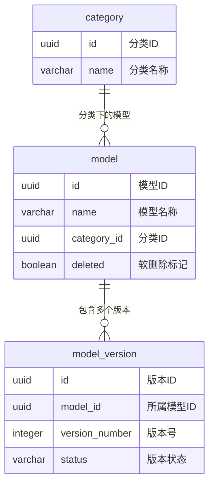
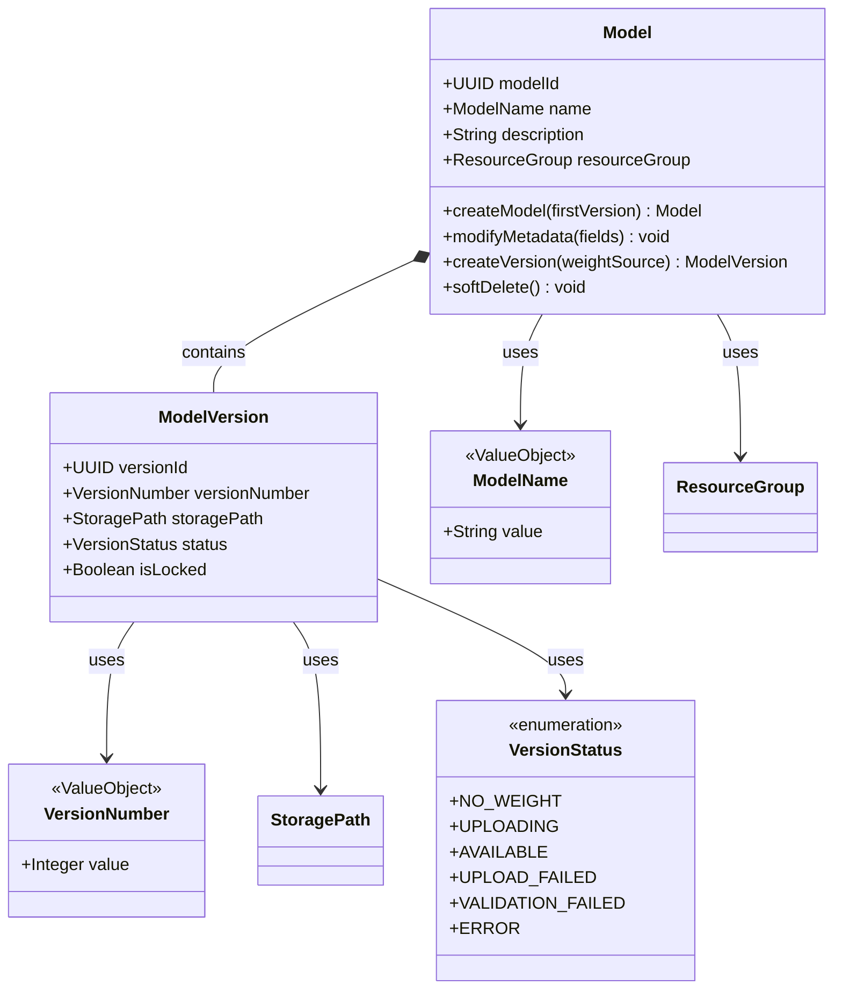
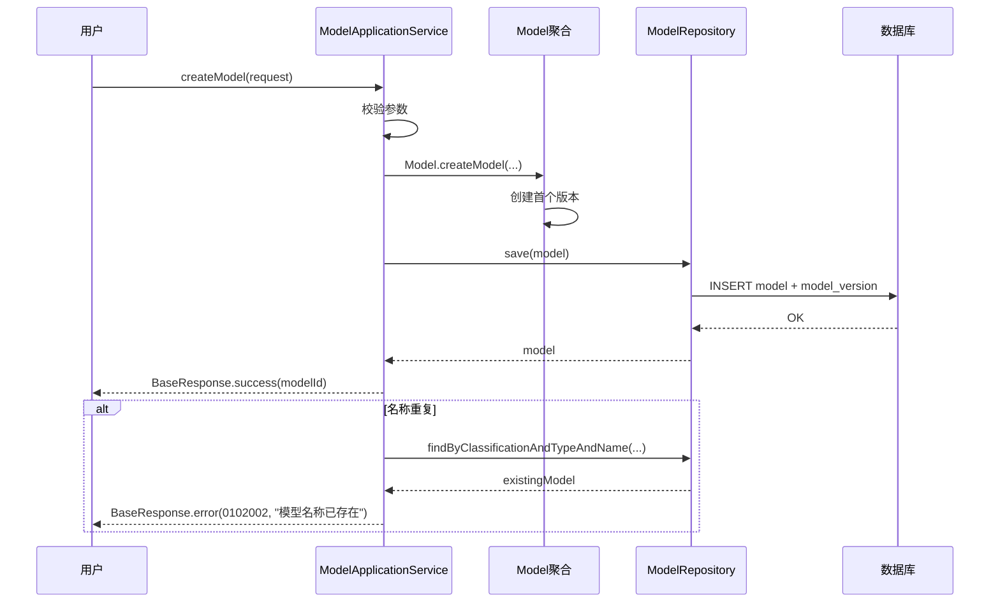
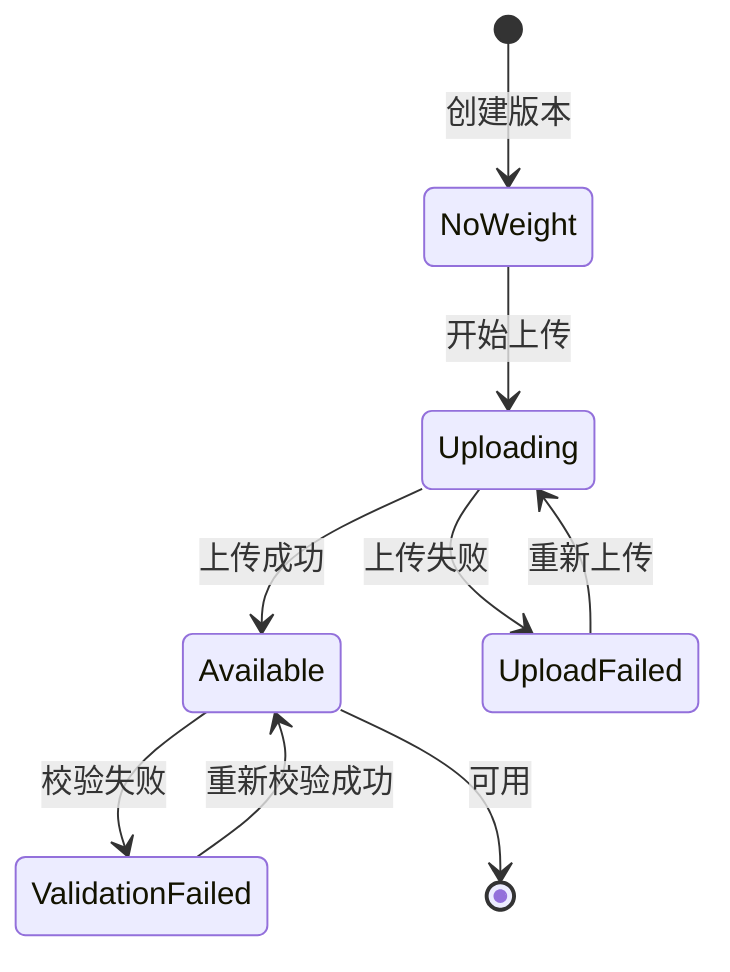

# 特性设计文档模板

> **文档类型**: 模板
> **编写日期**: 2026-04-24
> **适用范围**: ModelLite 平台模型仓库模块各特性详细设计
> **目标读者**: 后端开发工程师

---

## 模板规范

- **UML 图格式**: Mermaid（在 Markdown 中直接渲染）
- **代码示例**: 关键伪代码，小而精
- **测试用例粒度**: 场景级（Given-When-Then 格式）
- **详细程度**: 精确到字段级（开发者拿到即可编码）
- **Mermaid 占位符**: Mermaid 图使用示例结构，开发者需根据实际情况调整类名/字段

---

# Feature N: 【特性名称】 — 特性设计文档

> **文档类型**: 特性设计文档
> **文档版本**: v1.0
> **编写日期**: YYYY-MM-DD
> **适用范围**: ModelLite 平台模型仓库模块 Feature N
> **目标读者**: 后端开发工程师

---

## 1. 特性概述

### 1.1 目标

【一句话说明本特性要达成的业务目标】

### 1.2 范围

**IN（包含）**:
- 【列出本特性要实现的功能点】

**OUT（不包含）**:
- 【明确不属于本特性的内容，防止范围蔓延】

### 1.3 依赖关系

| 依赖项 | 类型 | 说明 |
|--------|------|------|
| 【前置特性或外部系统】 | 特性/系统 | 【依赖原因】 |

---

## 2. 数据库设计

### 2.1 新增/变更表 DDL

> 说明：每张表的完整 DDL，包括表名、字段名、字段类型、约束（NOT NULL、DEFAULT、CHECK）、主键、外键、唯一约束、注释。

```sql
-- 【表名】表
CREATE TABLE 【表名】 (
    【字段名】    【类型】    【约束】    -- 【字段说明】
    ...
    CONSTRAINT 【约束名】 【约束类型】 【约束定义】
);

COMMENT ON TABLE 【表名】 IS '【表说明】';
COMMENT ON COLUMN 【表名】.【字段名】 IS '【字段说明】';
```

### 2.2 表关系图（ER 图）

> 以下为示例结构，请根据本特性涉及的表调整。



### 2.3 索引设计

| 表名 | 索引名 | 索引类型 | 索引字段 | 说明 |
|------|--------|----------|----------|------|
| 【表名】 | idx_【字段】 | B-tree | 【字段】 | 【索引用途】 |

### 2.4 数据字典

| 表名 | 字段名 | 类型 | 是否必填 | 默认值 | 取值范围/说明 |
|------|--------|------|----------|--------|---------------|
| 【表名】 | 【字段名】 | 【类型】 | Y/N | 【默认值】 | 【说明】 |

---

## 3. 领域模型设计

### 3.1 类图

> 以下为示例结构，请根据本特性的聚合根、实体、值对象调整。



### 3.2 核心类定义

#### 【聚合根名】

| 字段名 | 类型 | 说明 | 约束 |
|--------|------|------|------|
| 【字段名】 | 【类型】 | 【说明】 | 【约束：如创建后不可修改、长度限制等】 |

| 方法名 | 参数 | 返回类型 | 说明 | 业务规则 |
|--------|------|----------|------|----------|
| 【方法名】 | 【参数列表】 | 【返回类型】 | 【说明】 | 【前置条件/后置条件/不变量保证】 |

#### 【关键方法伪代码】

```java
public 【返回类型】 【方法名】(【参数】) {
    // 前置条件检查
    if (【条件不满足】) {
        throw new ModelLiteException(ErrorCode.【错误码】, "【错误信息】");
    }
    
    // 核心业务逻辑
    // 【伪代码描述，小而精】
    
    // 后置条件保证
    // 【说明方法执行后的状态变化】
}
```

### 3.3 值对象定义

| 值对象名 | 字段名 | 类型 | 说明 | 校验规则 |
|----------|--------|------|------|----------|
| 【值对象名】 | 【字段名】 | 【类型】 | 【说明】 | 【校验规则：如长度、格式、取值范围】 |

### 3.4 领域服务

| 领域服务名 | 职责 | 跨聚合协调场景 |
|------------|------|----------------|
| 【服务名】 | 【职责描述】 | 【需要协调哪些聚合，什么场景下调用】 |

### 3.5 仓储接口

| 仓储接口名 | 职责 | 核心方法 |
|------------|------|----------|
| 【仓储名】 | 【职责】 | save(), findById(), findByXxx(), updateXxx() |

### 3.6 业务不变量

| 不变量名 | 说明 | 强制方式 |
|----------|------|----------|
| 【不变量名】 | 【业务规则描述】 | 【代码校验 / 数据库约束】 |

---

## 4. 接口设计

### 4.1 人机接口（User API）

#### 【接口名称】

| 属性 | 值 |
|------|-----|
| URL | `POST /v2/ui/【资源路径】` |
| Method | POST |
| 描述 | 【接口功能说明】 |

**Request Body**:
```json
{
    "【字段名】": 【类型】  // 【说明】，【必填/可选】
}
```

**Response Body**（成功）:
```json
{
    "code": 0,
    "message": "success",
    "data": {
        "【字段名】": 【类型】  // 【说明】
    },
    "timestamp": "2026-04-24T10:30:00Z",
    "requestId": "req-uuid-xxx"
}
```

**错误码**:

| 错误码 | HTTP 状态码 | 说明 |
|--------|-------------|------|
| 0102XXX | 400/404/409 | 【错误说明】 |

**业务规则**:
- **前置条件**: 【调用前必须满足的条件】
- **校验规则**: 【字段校验规则】
- **后置条件**: 【调用成功后的状态变化】

---

### 4.2 机机接口（M2M API）

> 同上格式，URL 为 `/v2/【资源路径】`（不加 /ui）

---

## 5. 核心业务流程

### 5.1 【场景名称】

> 以下为示例结构，请根据本特性的实际参与者调整。



**流程说明**:
1. 【步骤1说明】
2. 【步骤2说明】

---

### 5.2 【状态机名称】（如有状态流转）

> 以下为示例结构，请根据本特性的实际状态调整。



**状态转换规则**:

| 当前状态 | 触发条件 | 目标状态 | 说明 |
|----------|----------|----------|------|
| 【状态A】 | 【触发】 | 【状态B】 | 【说明】 |

---

## 6. 测试用例

### 6.1 单元测试（领域模型）

#### 【测试场景名】

**Given**:
- 【前置条件：如已创建一个模型】

**When**:
- 【触发动作：如调用 model.createVersion(weightSource)】

**Then**:
- 【期望结果：如返回新的 ModelVersion，版本号 = 当前最大版本号 + 1】
- 【断言条件：如 assertThat(version.getVersionNumber()).isEqualTo(expectedNumber)】

---

### 6.2 集成测试（仓储/应用服务）

#### 【测试场景名】

**Given**:
- 【前置条件：如数据库中存在分类数据】

**When**:
- 【触发动作：如调用 repository.save(model)】

**Then**:
- 【期望结果：如数据库 model 表新增一条记录】

---

### 6.3 API 测试（接口层）

#### 【接口测试场景名】

**Given**:
- 【请求参数】
- 【前置状态：如数据库初始状态】

**When**:
- 调用 `POST /v2/ui/【资源路径】`

**Then**:
- HTTP 状态码 = 【期望值】
- Response.code = 【期望值】
- Response.data.【字段】 = 【期望值】

---

**文档结束**