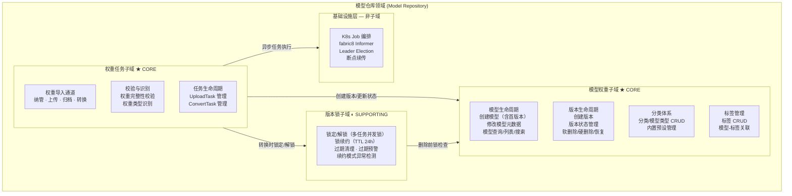
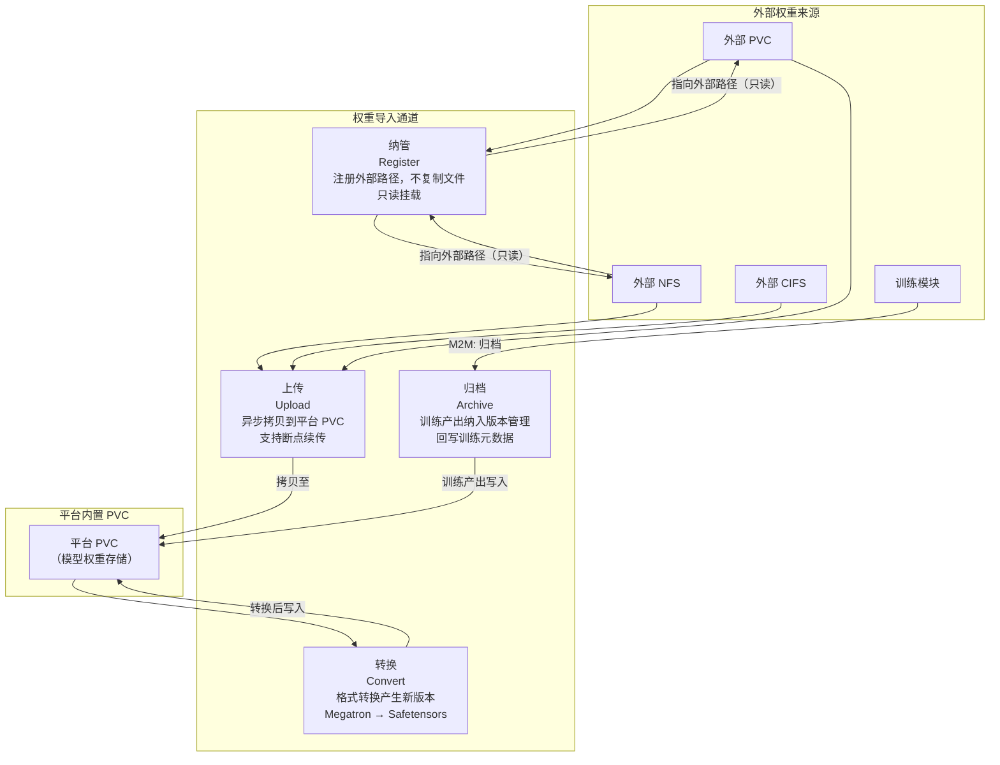
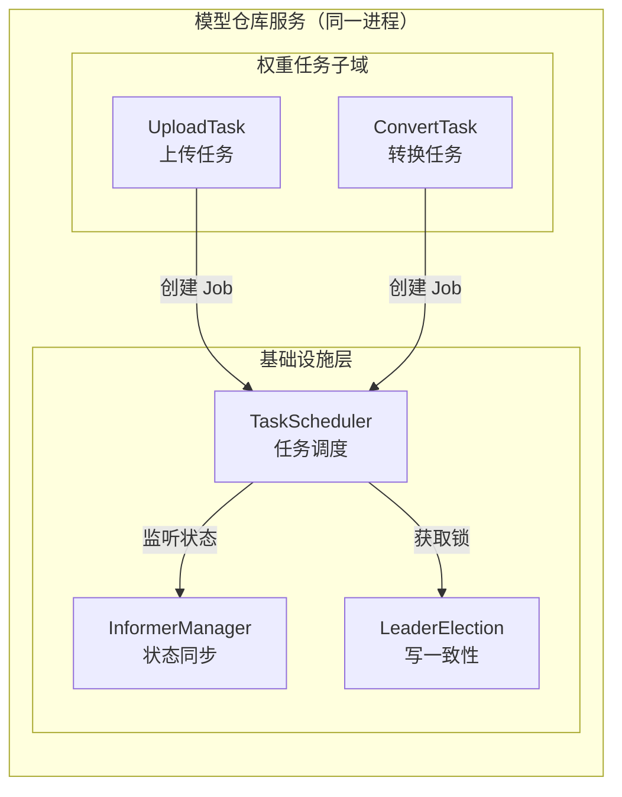
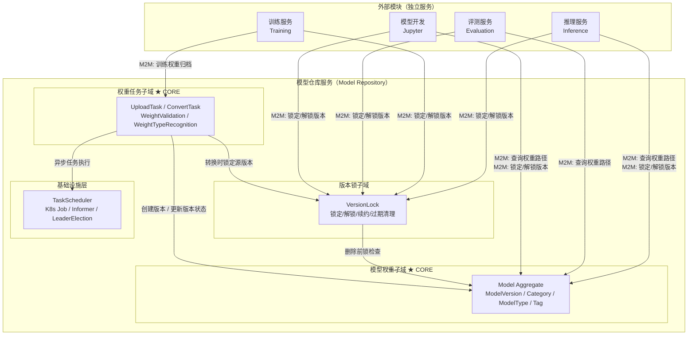

# ModelLite 模型仓库 - 领域/子域建模（Subdomain Modeling）

> **文档类型**: DDD 领域/子域建模
> **文档版本**: v1.2
> **编写日期**: 2026-04-22
> **适用范围**: ModelLite 平台模型仓库模块 DDD 架构设计
> **目标读者**: 架构师、领域专家、后端开发工程师

---

## 1. 建模概述

### 1.1 建模方法

本文档基于以下输入进行领域/子域建模：

- **统一语言**（[ModelLite-Repository-DDD-Ubiquitous-Language.md](ModelLite-Repository-DDD-Ubiquitous-Language.md)）：确保子域划分与业务术语一致
- **事件风暴结果**（[ModelLite-Repository-DDD-Domain-Events.md](ModelLite-Repository-DDD-Domain-Events.md)）：52 个领域事件作为业务能力的聚类依据
- **需求规格说明书 v1.2**：功能需求作为子域边界的验证参照

### 1.2 建模原则

| 原则 | 说明 |
|------|------|
| **业务内聚性** | 子域按业务能力聚类，而非技术分层 |
| **高内聚低耦合** | 子域内部高度内聚，子域之间松耦合 |
| **核心优先** | 识别 Core Domain 投入最优资源，Supporting/Generic 合理简化 |
| **独立生命周期** | 具有独立生命周期的业务能力优先考虑独立子域 |
| **演进友好** | 子域边界考虑未来扩展方向 |

---

## 2. 领域总览

模型仓库模块的领域为**模型仓库（Model Repository）**，作为 ModelLite 平台的模型资源中心，为下游的推理部署、微调训练、评测任务等模块提供模型数据支撑。

领域内划分为 **3 个子域** + **1 个基础设施能力层**：

---

## 3. 子域详细说明

### 3.1 模型权重子域（Model Weight）— ★ CORE DOMAIN

#### 领域愿景

作为平台的模型注册中心，管理模型及版本的全生命周期，为下游模块提供统一、可信的模型资源视图。模型及版本是平台所有下游模块（推理、训练、评测）消费的基础资源；分类体系组织了模型的知识结构，标签提供灵活的多维组织方式。

#### 子域类型说明

**Core Domain（核心域）**：这是模型仓库存在的根本理由。没有模型和版本的管理能力，模型仓库就失去了存在的意义。模型实体和版本实体是所有业务流程的起点和终点。

#### 包含的业务能力

| 能力模块 | 描述 | 涉及需求 |
|----------|------|----------|
| 模型生命周期 | 创建模型（含首版本）、修改模型元数据、查询/列表/搜索 | REQ-MODEL-001, REQ-MODEL-002, REQ-MODEL-003, REQ-QUERY-001 |
| 版本生命周期 | 创建版本、版本状态管理、查看版本详情 | REQ-VERSION-001, REQ-VERSION-002, REQ-GENERAL-002 |
| 删除与恢复 | 软删除（模型级/版本级）、硬删除、恢复、回收站管理 | REQ-DELETE-001, REQ-DELETE-002, REQ-DELETE-003, REQ-RECYCLE-001 |
| 分类体系 | 分类 CRUD、模型类型 CRUD、内置预设管理、分类/类型修改 | REQ-CATEGORY-001, REQ-CATEGORY-002 |
| 标签管理 | 标签 CRUD、模型-标签关联、按标签筛选 | REQ-TAG-001 |

#### 聚合设计

模型权重子域包含 4 个聚合：

**聚合 1: Model（核心聚合）**

| 聚合成员 | 类型 | 说明 |
|----------|------|------|
| Model | 聚合根 / Entity | 模型的元数据集合，包含名称、描述、分类、类型、资源组等 |
| ModelVersion | Entity | 模型的具体版本，包含版本号、存储路径、状态、训练元数据等 |

**聚合 2: Category（分类体系聚合）**

| 聚合成员 | 类型 | 说明 |
|----------|------|------|
| Category | 聚合根 / Entity | 模型的一级分类，如 TextGeneration、ImageTextToText |
| ModelType | Entity | 模型的二级分类，从属于某一分类，如 glm-5、Qwen2.5-VL-7B |

> **说明**: Category 和 ModelType 采用真删除（确保下无模型时才允许删除），无需 deleted 字段。

**聚合 3: Tag（标签聚合）**

| 聚合成员 | 类型 | 说明 |
|----------|------|------|
| Tag | 聚合根 / Entity | 标签实体，包含 tagType（USER/CAPABILITY）、isBuiltIn（是否内置）等 |
| ModelTag | Value Object | Model 与 Tag 的多对多关联 |
| ModelTypeTag | Value Object | ModelType 与 Tag 的多对多关联 |

> **说明**: Tag 同时服务两种关联场景：与 Model 关联（用户自定义标签，用于模型组织）、与 ModelType 关联（能力标签，如 supportFinetune）。内置 Tag 不允许删除。模型类型的能力（如 supportFinetune）不再作为 ModelType 的字段，而是通过 Tag 关联表达，支持更灵活的能力扩展。

**聚合 4: VersionLock（版本锁聚合）**

| 聚合成员 | 类型 | 说明 |
|----------|------|------|
| VersionLock | 聚合根 / Entity | 版本锁实体，包含锁 ID、锁定者、过期时间等 |
| LockOwner | Value Object | 锁持有者标识（任务 ID + 任务类型） |

> **说明**: VersionLock 有独立的生命周期（锁定→续约→过期/解锁），但与 ModelVersion 关系紧密，归入模型权重子域。ModelVersion 上的 isLocked 字段是 version_lock 表的查询缓存（反规范化），永远由 version_lock 表驱动更新，绝不独立修改。

#### 值对象

| 值对象 | 说明 |
|--------|------|
| ModelName | 模型名称，长度 1-255，创建后不可修改 |
| VersionNumber | 版本号，自动递增整数 |
| StoragePath | 存储路径，包含 PVC 名称和内部路径 |
| VersionStatus | 版本状态枚举（NoWeight/Uploading/Available/UploadFailed/ValidationFailed/Error） |
| ResourceGroup | 资源组标识 |
| TrainingMetadata | 训练元数据（训练框架、类型、策略、时长、最终 Loss、来源版本） |
| TagType | 标签类型枚举（USER/CAPABILITY） |

#### 核心领域事件

> 本子域的领域事件详见 [ModelLite-Repository-DDD-Domain-Events.md](ModelLite-Repository-DDD-Domain-Events.md) 第 2、5-8 章。

#### 业务不变量

| 不变量 | 说明 |
|--------|------|
| 模型名称唯一性 | 同一分类+类型组合下，模型名称必须唯一 |
| 版本号连续递增 | 版本号采用自动递增整数（V1, V2, V3...），不允许跳号 |
| 创建必须含首版本 | 创建模型时必须同时创建该模型的第一个版本 |
| 模型名称不可修改 | 模型名称创建后不可修改 |
| 资源组不可修改（当前） | 模型资源组创建后不可修改（设计保留扩展性） |
| 分类/类型删除约束 | 分类或类型下存在模型时，禁止删除 |
| 版本删除前检查锁 | 删除版本前必须检查该版本是否被锁定 |
| 内置标签不可删除 | isBuiltIn=true 的标签不允许删除 |
| isLocked 一致性 | ModelVersion.isLocked 由 version_lock 表驱动更新，绝不独立修改 |

---

### 3.2 权重任务子域（Weight Task）— ★ CORE DOMAIN

#### 领域愿景

管理权重文件从外部进入平台仓库的所有通道及其生命周期，确保权重数据的完整性和可用性。四种权重导入通道（纳管、上传、归档、转换）是 ML 模型仓库的核心差异化能力，校验和识别机制保障权重质量。

#### 子域类型说明

**Core Domain（核心域）**：权重管理是模型仓库区别于"简单文件管理器"的核心能力。纳管、上传、校验、归档、转换——这些是 ML 模型仓库特有的领域逻辑。后续可能会扩展更多任务类型。

#### 包含的业务能力

| 能力模块 | 描述 | 涉及需求 |
|----------|------|----------|
| 权重纳管 | 将外部已有存储路径注册到仓库，不复制文件，只读挂载 | REQ-REGISTER-001, REQ-REGISTER-002 |
| 权重上传 | 从外部存储异步拷贝权重文件到平台 PVC | REQ-UPLOAD-001, REQ-UPLOAD-002 |
| 训练归档 | 训练任务产出权重纳入版本管理 | REQ-M2M-002 |
| 权重格式转换 | Megatron → Safetensors 等格式转换，产出新版本 | REQ-CONVERT-001, REQ-CONVERT-002 |
| 权重完整性校验 | 文件数量完整性校验（未来可扩展 SHA256 等） | REQ-INFO-002 |
| 权重类型识别 | 解析 config.json 识别权重数据精度类型 | REQ-INFO-001 |
| 任务生命周期 | UploadTask 和 ConvertTask 的创建/管理/监控 | REQ-UPLOAD-002, REQ-CONVERT-002 |

#### 权重导入通道

四种权重进入仓库的通道，其中转换通道可作用于上传或归档得到的权重（这些权重保存在平台内置 PVC 中）：

#### 聚合设计

**聚合根 1**: `UploadTask`

| 聚合成员 | 类型 | 说明 |
|----------|------|------|
| UploadTask | 聚合根 / Entity | 上传任务实体，跟踪上传进度和状态 |
| SourcePath | Value Object | 上传源路径（NFS/CIFS/PVC） |
| TaskStatus | Value Object | 任务状态枚举 |

**聚合根 2**: `ConvertTask`

| 聚合成员 | 类型 | 说明 |
|----------|------|------|
| ConvertTask | 聚合根 / Entity | 转换任务实体，跟踪转换进度和状态 |
| TaskStatus | Value Object | 任务状态枚举 |

#### 领域服务

| 领域服务 | 职责 |
|----------|------|
| WeightValidationService | 权重完整性校验：文件数量校验、未来可扩展 SHA256 等 |
| WeightTypeRecognitionService | 权重类型识别：解析 config.json 识别数据精度类型 |

#### 核心领域事件

> 本子域的领域事件详见 [ModelLite-Repository-DDD-Domain-Events.md](ModelLite-Repository-DDD-Domain-Events.md) 第 3-4 章。

#### 业务不变量

| 不变量 | 说明 |
|--------|------|
| 上传前白名单校验 | 上传前必须通过文件后缀白名单校验 |
| 纳管版本只读 | 纳管版本只能以只读方式挂载，禁止写入 |
| 转换时锁定源版本 | 权重格式转换过程中源版本必须锁定，禁止删除 |
| 校验失败标记异常 | 校验失败需标记版本状态为异常 |
| 纳管路径必须是目录 | 纳管路径必须指向一个目录（而非单个文件） |
| 删除任务清理文件 | 删除上传任务时，如文件已部分上传，需清理残留文件 |

#### 对外依赖

| 依赖 | 依赖对象 | 说明 |
|------|----------|------|
| 版本创建/状态更新 | 模型权重子域 | 权重导入完成后需创建/更新模型版本状态 |
| 源版本锁定/解锁 | 版本锁子域 | 权重转换时需锁定源版本，完成后解锁 |
| 任务执行 | 基础设施层 | 通过 K8s Job 编排异步执行上传/转换任务 |

---

### 3.3 版本锁子域（Version Lock）— ◐ SUPPORTING SUBDOMAIN

#### 领域愿景

保护正在被平台任务使用的权重版本不被误删，提供安全的锁生命周期管理。版本锁不是业务目标，但是保障业务安全性的关键机制。

#### 子域类型说明

**Supporting Subdomain（支撑域）**：版本锁本身不直接产生业务价值，但它是保障模型权重安全的关键机制。训推任务在运行期间必须确保权重不被删除，版本锁提供了这一保障。其具有独立的完整生命周期（锁定→续约→过期/解锁），且与多个子域交互，因此独立为子域。

#### 包含的业务能力

| 能力模块 | 描述 | 涉及需求 |
|----------|------|----------|
| 锁定/解锁 | 多任务并发锁定（引用计数），支持锁定和解锁操作 | REQ-M2M-003 |
| 锁续约 | 锁持有者在锁过期前延长有效期，支持长时间运行任务 | REQ-M2M-003 |
| 过期清理 | Leader 节点定时巡检清理过期锁，防止僵尸锁 | 架构设计决策 |
| 过期预警 | 锁即将过期时通知任务方，预留续约时间 | 架构设计决策 |
| 异常检测 | 检测异常的锁续约模式，发现潜在问题 | 架构设计决策 |

#### 聚合设计

**聚合根**: `VersionLock`

| 聚合成员 | 类型 | 说明 |
|----------|------|------|
| VersionLock | 聚合根 / Entity | 版本锁实体，包含锁 ID、锁定者、过期时间等 |
| LockOwner | Value Object | 锁持有者标识（任务 ID + 任务类型） |

#### 领域服务

| 领域服务 | 职责 |
|----------|------|
| VersionLockService | 锁定/解锁/续约的核心业务逻辑 |
| LockMonitoringService | 僵尸锁巡检、过期预警、续约模式异常检测 |

#### 核心领域事件

> 本子域的领域事件详见 [ModelLite-Repository-DDD-Domain-Events.md](ModelLite-Repository-DDD-Domain-Events.md) 第 2.3、8 章。

#### 业务不变量

| 不变量 | 说明 |
|--------|------|
| 多任务并发锁定 | 同一版本支持被多个任务同时锁定（引用计数） |
| 锁有 TTL | 锁有默认 TTL（24 小时），超时自动失效 |
| 全部释放方可删除 | 仅当版本的所有锁定都被解除后，才允许删除版本 |
| 续约验证身份 | 续约需验证锁持有者身份，非持有者不可续约 |
| 仅 Leader 巡检 | 过期锁清理任务仅由 Leader 节点执行，避免并发清理 |

#### 对外提供能力

| 能力 | 消费方 | 调用方式 |
|------|--------|----------|
| 锁定/解锁版本 | 推理/训练/评测/模型开发模块 | M2M 接口 |
| 删除前锁检查 | 模型权重子域（删除版本时） | 内部调用 |
| 转换时锁源版本 | 权重任务子域（权重转换时） | 内部调用 |

---

### 3.4 基础设施层（Infrastructure）— 非子域

#### 定位

基础设施层提供通用的技术能力，不属于任何子域，而是被各子域共享使用。当前主要提供**任务调度能力**，支撑权重任务子域中的异步任务执行。

#### 任务调度能力

| 能力 | 说明 |
|------|------|
| K8s Job 编排 | 创建、监控、删除 Kubernetes Job，执行异步任务（上传、转换） |
| fabric8 Informer | 监听 K8s Job 状态变化，同步更新任务状态到数据库 |
| Leader Election | 多副本部署时确保写操作一致性，仅 Leader 节点处理写请求和任务编排 |
| 断点续传 | 支持大文件上传中断后恢复 |

#### 与子域的关系

基础设施层不定义业务概念，作为同一服务内的技术支撑组件，被权重任务子域直接调用：

---

## 4. 子域间协作关系

### 4.1 协作关系图

**协作关系说明**：

| 协作方向 | 说明 |
|----------|------|
| 外部模块 → 版本锁子域 | 推理/训练/评测/开发模块通过 **M2M 接口** 调用锁定/解锁功能 |
| 外部模块 → 模型权重子域 | 推理/评测/开发模块通过 **M2M 接口** 查询权重路径；训练模块通过 **M2M 接口** 归档权重 |
| 版本锁 → 模型权重 | 模型权重子域删除版本前，查询版本锁子域确认版本未被锁定 |
| 权重任务 → 版本锁 | 权重格式转换时，权重任务子域请求锁定源版本，转换完成后解锁 |
| 权重任务 → 模型权重 | 权重导入完成后，权重任务子域请求创建新版本或更新版本状态 |
| 权重任务 → 基础设施 | 权重任务子域通过基础设施层的 K8s Job 编排执行异步任务 |

### 4.2 协作关系矩阵

| 协作关系 | 上游（提供方） | 下游（消费方） | 协作方式 | 说明 |
|----------|---------------|---------------|----------|------|
| 版本创建 | 模型权重子域 | 权重任务子域 | 下游请求创建 | 权重导入时需在模型下创建新版本 |
| 版本状态更新 | 模型权重子域 | 权重任务子域 | 下游请求更新 | 上传/校验完成后更新版本状态 |
| 锁定检查 | 版本锁子域 | 模型权重子域 | 下游查询 | 删除版本前检查是否被锁定 |
| 转换锁定 | 版本锁子域 | 权重任务子域 | 下游请求锁定 | 权重转换时锁定源版本 |
| 任务执行 | 基础设施层 | 权重任务子域 | 服务内直接调用 | 异步任务通过 K8s Job 执行 |
| 权重路径查询 | 模型权重子域 | 推理/训练/评测模块 | M2M 接口 | 查询版本存储路径用于挂载 |
| 版本锁定/解锁 | 版本锁子域 | 推理/训练/评测模块 | M2M 接口 | 训推任务占用/释放版本 |
| 训练归档 | 权重任务子域 | 训练模块 | M2M 接口 | 训练产出权重归档为新版本 |

---

## 6. 决策记录

### 6.1 关键决策

| 决策编号 | 决策内容 | 决策理由 | 讨论结论 |
|----------|----------|----------|----------|
| D-01 | 权重格式转换不独立拆分子域 | 当前仅支持 Megatron→Safetensors，没有额外的权重转换场景，归入权重任务子域作为导入通道之一 | ✅ 用户确认 |
| D-02 | 分类标签归入模型权重子域 | 不同模型类型和具体的模型权重及版本是紧密关联的，分类体系服务于模型组织 | ✅ 用户确认 |
| D-03 | 版本锁作为独立子域 | 版本锁与其他域交互（模型权重子域、权重任务子域、外部模块），且有独立完整的生命周期（锁定→续约→过期/解锁） | ✅ 用户确认 |
| D-04 | 任务调度作为基础设施层通用能力 | 上传任务和权重转换任务都可使用任务调度能力，它不属于业务概念而是技术实现 | ✅ 用户确认 |
| D-05 | 模型目录子域更名为模型权重子域 | "目录"不能体现该子域管理模型和版本的核心职责，"权重"更准确地描述了业务本质 | ✅ 用户确认 |
| D-06 | 权重管理子域更名为权重任务子域 | 该子域管理的是上传、归档、完整性校验等任务，后续可能扩展更多任务类型 | ✅ 用户确认 |

---

## 7. 变更记录

| 版本 | 日期 | 变更内容 | 作者 |
|------|------|----------|------|
| v1.0 | 2026-04-22 | 初始版本，基于事件风暴结果进行子域建模，识别 3 个子域 + 1 个基础设施层 | Prometheus |
| v1.1 | 2026-04-22 | 修正权重导入通道图和协作关系图；所有图改用 Mermaid 语法 | Prometheus |
| v1.2 | 2026-04-22 | Tag 提升为独立聚合；Category/ModelType 采用真删除；明确 isLocked 反规范化策略 | Prometheus |
| v1.3 | 2026-04-24 | 文档精简：1. 领域事件清单改为引用 Domain Events 文档 2. 删除需求追溯矩阵和事件追溯矩阵（信息可从子域业务能力描述直接对应） | Prometheus |

---

## 8. 参考文档

- [ModelLite-模型仓库-需求规格说明书-v1.2.md](/docs/ModelLite-模型仓库-需求规格说明书-v1.2.md)
- [ModelLite-Repository-DDD-Ubiquitous-Language.md](ModelLite-Repository-DDD-Ubiquitous-Language.md)
- [ModelLite-Repository-DDD-Domain-Events.md](ModelLite-Repository-DDD-Domain-Events.md)
- [ModelLite-Repository-DDD-Bounded-Context.md](ModelLite-Repository-DDD-Bounded-Context.md)

---

**文档结束**
