# ModelLite 模型仓库架构设计文档

## 版本信息

| 项目 | 内容 |
|------|------|
| 文档版本 | v1.1 |
| 编写日期 | 2026-04-20 |
| 适用范围 | ModelLite 平台模型仓库模块 |
| 目标读者 | 架构师、技术负责人、后端开发工程师、测试工程师 |

---

## 修订历史

| 版本 | 日期 | 变更内容 | 作者 |
|------|------|----------|------|
| v1.0 | 2026-04-19 | 初始版本 | Prometheus |
| v1.1 | 2026-04-20 | 1. model 表补充业务属性字段（author、series_name、model_size、max_seq_length）<br>2. model_version 表补充训练元数据字段（train_frame、train_type、train_strategy、train_time、final_loss、source_version）<br>3. model_type 表补充能力标记字段（support_finetune）<br>4. 版本锁补充僵尸锁巡检清理机制<br>5. 非功能需求追溯矩阵补充容量需求项 | Sisyphus |

---

## 1. 架构设计目标

### 1.1 设计背景

ModelLite 模型仓库是平台的核心组件，负责机器学习模型的存储与版本管理、权重文件的上传与纳管、模型分类体系的维护，并为下游模块提供模型数据查询与引用能力。

本文档基于《ModelLite 模型仓库需求规格说明书 v1.1》编制的架构设计文档，旨在明确模型仓库的技术架构、模块划分、数据模型、接口规范、安全策略等核心设计内容，为后续开发实现提供完整的技术指导。

### 1.2 架构设计原则

模型仓库架构设计遵循以下核心原则：

**高可用性原则**：系统采用多副本部署架构，通过 Leader Election 机制确保集群状态下的一致性，保证在部分节点故障时服务依然可用。

**可扩展性原则**：系统设计预留充分的扩展点，支持未来引入新的 AI 资产类型、新的校验方式、动态白名单调整等需求。

**分权分域原则**：系统深度集成平台统一的 RBAC 鉴权体系和资源组可见性控制机制，实现精细化的权限管理。

**安全优先原则**：所有接口强制 SSL/TLS 双向证书认证，上传文件经过白名单校验，操作日志完整记录以支持审计追溯。

**异步解耦原则**：重量级操作如文件上传、格式转换采用异步任务架构，通过 K8s Job + fabric8 Informer 实现可靠的任务执行。

### 1.3 技术选型概述

模型仓库技术栈如下表所示：

| 类别 | 技术选型 | 说明 |
|------|----------|------|
| 开发框架 | Spring Boot 3.4.5 | 核心框架，提供 Web 服务、依赖注入等基础能力 |
| 编程语言 | Java 21 | 使用最新 LTS 版本，发挥虚拟线程等新特性 |
| 数据库 | PostgreSQL | 关系型数据库，支持复杂查询、JSON 类型 |
| ORM 框架 | MyBatis | 轻量级 ORM，支持复杂 SQL 和动态 SQL |
| 连接池 | Druid | 阿里巴巴开源连接池，提供监控能力 |
| 部署环境 | Kubernetes | 容器编排平台，提供弹性伸缩、自愈能力 |
| 异步任务 | K8s Job + fabric8 Informer | 可靠的异步任务执行与状态同步 |
| ID 生成 | UUID v4 | 全局唯一标识符生成 |

### 1.4 核心架构决策

模型仓库架构决策如下表所示：

| 序号 | 决策领域 | 决策内容 |
|------|----------|----------|
| 1 | 版本锁机制 | 关系表 + TTL(24小时)，支持多任务并发锁定；Leader 节点每 10 分钟巡检清理过期锁 |
| 2 | 部署架构 | 多副本 + Leader Election 确保一致性 |
| 3 | API 版本 | URL 路径方式，版本前缀 /v2 |
| 4 | 认证方式 | User API 通过 Gateway Header 透传认证，M2M API 通过 SSL 双向证书认证 |
| 5 | 软删除实现 | 状态字段标记 + 部分索引排除软删除记录 |
| 6 | 错误码格式 | 数字格式 1XXYYY，其中 XX 为模块码，YYY 为具体错误码 |
| 7 | 包名规范 | com.huawei.modellite.repository |
| 8 | 操作日志 | Annotation 标记 + 同步 HTTP 上报至平台日志服务 |
| 9 | 白名单存储 | ConfigMap 挂载为 Properties 文件读取 |
| 10 | 训练归档 | 回调接口模式，同步响应时间控制在 2 秒内；归档时回写训练元数据 |
| 11 | 纳管硬删除 | 只删除数据库记录，保留源文件不删除 |
| 12 | 训练元数据存储 | 平铺于 model_version 表，不独立建表；训练归档时由 M2M 接口回写 |
| 13 | 模型属性字段 | author、seriesName、modelSize、maxSeqLength 平铺于 model 表，不使用 JSON 扩展字段 |

---

## 2. 系统上下文

### 2.1 系统组件拓扑

ModelLite 平台部署于 Kubernetes 集群，包含多个核心模块。模型仓库作为平台的核心组件，与多个模块存在交互关系。

下图展示模型仓库在平台中的位置及与各模块的交互关系：

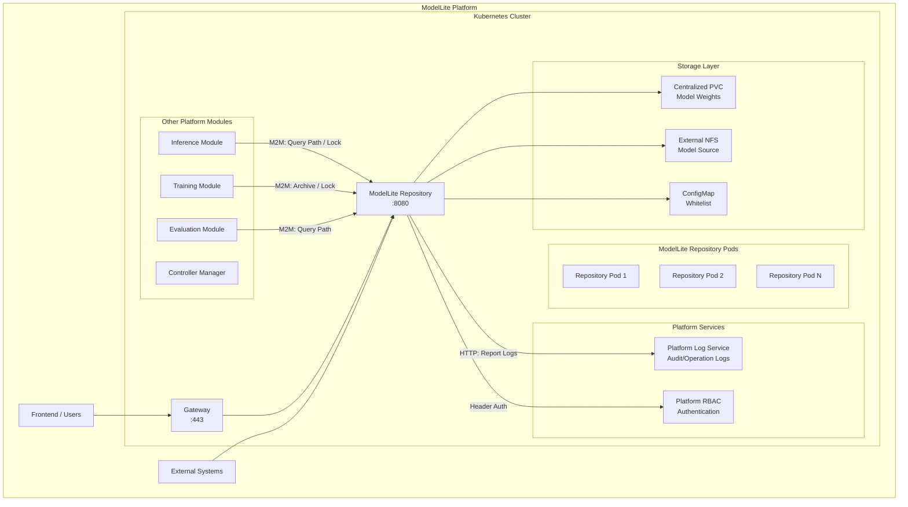

### 2.2 模块职责边界

**Gateway 模块**：作为流量入口，负责请求路由、负载均衡、SSL 终止。模型仓库的人机接口（User API）通过 Gateway 路由，认证信息通过 Header 透传。

**模型仓库模块**：核心业务模块，负责模型的增删改查、版本管理、权重文件管理、分类标签管理、异步任务调度等。

**推理模块（Inference）**：通过 M2M 接口查询模型权重路径，用于推理服务部署。

**训练模块（Training）**：通过 M2M 接口进行权重归档、版本锁定等操作，用于训练任务管理。

**评测模块（Evaluation）**：通过 M2M 接口查询模型权重路径，用于评测任务管理。

**Controller Manager**：管理平台 CRD 生命周期，与模型仓库无直接交互。

### 2.3 外部依赖关系

模型仓库对外部组件的依赖如下：

| 外部组件 | 依赖类型 | 交互方式 | 说明 |
|----------|----------|----------|------|
| PostgreSQL | 强依赖 | JDBC | 存储所有业务数据 |
| Platform RBAC | 强依赖 | Header 透传 | 复用平台鉴权体系 |
| Platform Log Service | 强依赖 | HTTP REST | 操作日志上报 |
| ConfigMap | 强依赖 | K8s Mount | 白名单配置读取 |
| Centralized PVC | 强依赖 | K8s Mount | 存储模型权重文件 |
| External NFS | 可选依赖 | 网络挂载 | 作为纳管源或上传源 |
| SSL Certificates | 强依赖 | 文件系统 | M2M 接口双向认证 |

---

## 3. 模块分层架构

### 3.1 分层架构概述

模型仓库采用经典的分层架构设计，自上而下分为接口层、服务层、仓储层、基础设施层四层。各层职责清晰，依赖关系单向传递，便于测试和维护。

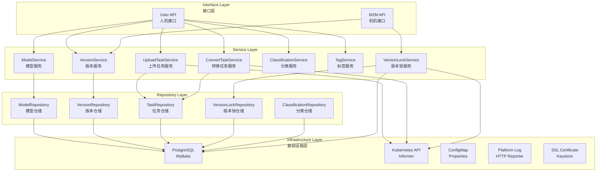

### 3.2 包结构设计

模型仓库包结构遵循领域驱动设计原则，按功能模块划分包：

```
com.huawei.modellite.repository
├── api                          # 接口层
│   ├── user                     # 人机接口
│   │   ├── ModelApi             # 模型接口
│   │   ├── VersionApi           # 版本接口
│   │   ├── UploadTaskApi        # 上传任务接口
│   │   ├── ConvertTaskApi       # 转换任务接口
│   │   ├── ClassificationApi     # 分类接口
│   │   ├── TagApi               # 标签接口
│   │   └── RecycleBinApi        # 回收站接口
│   └── m2m                      # 机机接口
│       ├── PathQueryApi         # 路径查询接口
│       ├── ArchiveApi           # 归档接口
│       └── LockApi              # 锁定接口
│
├── service                      # 服务层
│   ├── ModelService             # 模型服务
│   ├── VersionService           # 版本服务
│   ├── UploadTaskService        # 上传任务服务
│     ├── UploadTaskExecutor     # 上传任务执行器
│   ├── ConvertTaskService       # 转换任务服务
│     ├── ConvertTaskExecutor    # 转换任务执行器
│   ├── ClassificationService    # 分类服务
│   ├── TagService               # 标签服务
│   ├── VersionLockService       # 版本锁服务
│   └── common                   # 公共服务
│       ├── ValidationService    # 校验服务
│       └── LogService           # 日志服务
│
├── repository                   # 仓储层
│   ├── ModelRepository          # 模型仓储
│   ├── VersionRepository        # 版本仓储
│   ├── UploadTaskRepository     # 上传任务仓储
│   ├── ConvertTaskRepository    # 转换任务仓储
│   ├── ClassificationRepository # 分类仓储
│   ├── TypeRepository           # 类型仓储
│   ├── TagRepository            # 标签仓储
│   ├── ModelTagRepository       # 模型标签关联仓储
│   └── VersionLockRepository    # 版本锁仓储
│
├── domain                       # 领域模型
│   ├── entity                   # 实体
│   │   ├── Model                # 模型实体（含 author、seriesName、modelSize、maxSeqLength）
│   │   ├── ModelVersion         # 版本实体（含训练元数据 trainFrame、trainType、trainStrategy、trainTime、finalLoss、sourceVersion）
│   │   ├── UploadTask           # 上传任务实体
│   │   ├── ConvertTask          # 转换任务实体
│   │   ├── Classification       # 分类实体
│   │   ├── Type                 # 类型实体（含 supportFinetune 能力标记）
│   │   ├── Tag                  # 标签实体
│   │   ├── ModelTag             # 模型标签关联实体
│   │   └── VersionLock          # 版本锁实体
│   ├── enums                    # 枚举
│   │   ├── VersionStatus        # 版本状态
│   │   ├── TaskStatus           # 任务状态
│   │   ├── WeightType           # 权重类型
│   │   └── LockStatus           # 锁状态
│   └── event                    # 领域事件
│       ├── VersionCreatedEvent
│       ├── VersionLockedEvent
│       └── ModelDeletedEvent
│
├── infrastructure               # 基础设施层
│   ├── config                   # 配置
│   │   ├── AppConfig            # 应用配置
│   │   ├── DataSourceConfig     # 数据源配置
│   │   ├── K8sConfig           # K8s 配置
│   │   ├── SecurityConfig      # 安全配置
│   │   └── WebConfig           # Web 配置
│   ├── k8s                     # K8s 相关
│   │   ├── JobService          # Job 服务
│   │   ├── InformerManager     # Informer 管理器
│   │   └── LeaderElection      # Leader 选举
│   ├── log                      # 日志相关
│   │   ├── AuditLogAnnotation  # 审计日志注解
│   │   └── LogReporter         # 日志上报器
│   └── security                 # 安全相关
│       ├── SslConfig           # SSL 配置
│       └── M2mAuthFilter       # M2M 认证过滤器
│
├── common                       # 公共模块
│   ├── exception                # 异常
│   │   ├── BusinessException   # 业务异常
│   │   ├── ResourceLockedException  # 资源锁定异常
│   │   └── ErrorCode           # 错误码
│   ├── dto                     # 数据传输对象
│   │   ├── request             # 请求 DTO
│   │   └── response           # 响应 DTO
│   ├── converter               # 对象转换
│   └── util                    # 工具类
│
└── Mapper                      # MyBatis Mapper
    ├── ModelMapper
    ├── ModelVersionMapper
    ├── UploadTaskMapper
    ├── ConvertTaskMapper
    ├── ClassificationMapper
    ├── TypeMapper
    ├── TagMapper
    ├── ModelTagMapper
    └── VersionLockMapper
```

### 3.3 层间交互规范

**接口层与服务层交互**：接口层通过依赖注入获取服务层 Bean，调用服务方法完成业务逻辑。接口层不包含业务逻辑，只负责请求参数校验、响应格式封装。

**服务层与仓储层交互**：服务层通过依赖注入获取仓储层接口，仓储层封装数据库操作。服务层负责业务逻辑编排、事务边界控制。

**服务层之间交互**：同级服务通过依赖注入相互调用，如 VersionService 需要调用 VersionLockService 检查锁定状态。

**基础设施层被调用**：服务层和仓储层可调用基础设施层组件，如 K8s 客户端、配置中心、日志服务等。

---

## 4. 部署架构

### 4.1 Kubernetes 部署拓扑

模型仓库以 Kubernetes Deployment 形式部署，支持多副本运行。通过 Leader Election 机制确保集群状态下只有一个 Pod 处理写操作，保证数据一致性。

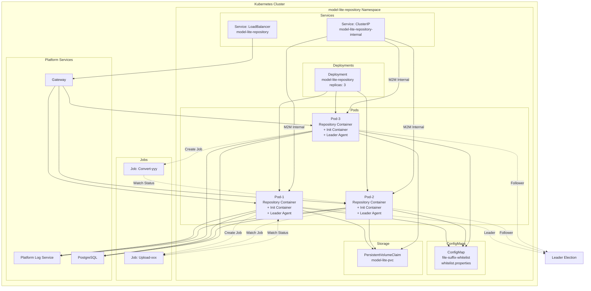

### 4.2 Leader Election 机制

模型仓库多副本部署时，通过 Leader Election 机制确保只有一个 Pod 处理写操作（创建、更新、删除），其他 Pod 处理读操作或作为热备。

**选举实现**：使用 Kubernetes 内置的 Leader Election 机制，基于 ConfigMap 或 Endpoint 资源实现分布式锁。

**工作原理**：
1. 所有 Pod 启动时尝试获取锁
2. 成功获取锁的 Pod 成为 Leader，开始处理写请求
3. Leader Pod 定期续约锁，防止锁过期
4. Leader Pod 故障时，其他 Pod 检测到锁释放，重新选举
5. 非 Leader Pod 不处理写请求，但可以处理读请求

**故障切换**：
- Leader Pod 故障后，通常在 15-30 秒内完成切换
- 切换期间写请求可能短暂失败，客户端需实现重试机制
- 读请求不受影响，由非 Leader Pod 处理

### 4.3 健康检查与自愈

模型仓库 Pod 包含以下健康检查机制：

| 检查类型 | 配置 | 失败处理 |
|----------|------|----------|
| Readiness Probe | HTTP GET /actuator/health/readiness | 从 Service 移除，停止接收流量 |
| Liveness Probe | HTTP GET /actuator/health/liveness | 重启 Pod |
| Startup Probe | HTTP GET /actuator/health | 初始探针，延迟启动 |

### 4.4 版本锁巡检与僵尸锁清理

版本锁采用 TTL（24 小时）自动过期机制防止锁无法释放，但为应对调用方异常退出、网络分区等极端场景，Leader 节点需额外执行定期巡检清理任务。

**巡检策略**：
- Leader 节点每 10 分钟执行一次过期锁清理
- 删除 `expire_time < NOW()` 的锁记录
- 清理后同步更新 `model_version.is_locked` 字段（仅当该版本无其他有效锁时置为 FALSE）

**告警机制**：
- 锁即将过期（距离过期不足 1 小时）时，记录 WARN 级别日志
- 锁被 TTL 自动清理时（非调用方主动解锁），记录 INFO 级别日志并上报操作日志服务

**设计约束**：
- 清理任务仅由 Leader 节点执行，避免多副本并发清理
- 清理操作需保证事务一致性：删除锁记录与更新版本锁定状态在同一事务中完成

### 4.5 资源限制

模型仓库 Pod 资源限制建议如下：

| 资源类型 | 限制值 | 说明 |
|----------|--------|------|
| CPU Request | 2 core | 基础 CPU 需求 |
| CPU Limit | 4 core | 最大 CPU 限制 |
| Memory Request | 4 Gi | 基础内存需求 |
| Memory Limit | 8 Gi | 最大内存限制 |
| Ephemeral Storage | 10 Gi | 临时存储用于上传缓冲 |

---

## 5. 数据模型设计

### 5.1 数据实体关系

模型仓库核心数据实体包括：模型、模型版本、版本锁、上传任务、转换任务、模型分类、模型类型、模型标签。以下是实体关系图：

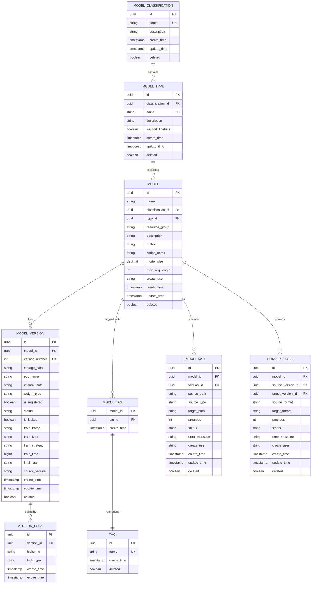

### 5.2 数据表详细设计

以下为 8 张核心数据表的详细设计。

#### 5.2.1 模型表 (model)

```sql
CREATE TABLE model (
    id UUID PRIMARY KEY DEFAULT gen_random_uuid(),
    name VARCHAR(255) NOT NULL,
    classification_id UUID NOT NULL,
    type_id UUID NOT NULL,
    resource_group VARCHAR(100) NOT NULL,
    description TEXT,
    author VARCHAR(255),
    series_name VARCHAR(255),
    model_size DECIMAL(10, 2),
    max_seq_length INTEGER,
    create_user VARCHAR(100) NOT NULL,
    create_time TIMESTAMP WITH TIME ZONE NOT NULL DEFAULT CURRENT_TIMESTAMP,
    update_time TIMESTAMP WITH TIME ZONE NOT NULL DEFAULT CURRENT_TIMESTAMP,
    deleted BOOLEAN NOT NULL DEFAULT FALSE,
    
    CONSTRAINT uk_classification_type_name UNIQUE (classification_id, type_id, name),
    CONSTRAINT uk_resource_group_name UNIQUE (resource_group, name)
);

CREATE INDEX idx_model_resource_group ON model(resource_group) WHERE deleted = FALSE;
CREATE INDEX idx_model_classification ON model(classification_id) WHERE deleted = FALSE;
CREATE INDEX idx_model_type ON model(type_id) WHERE deleted = FALSE;
CREATE INDEX idx_model_create_time ON model(create_time DESC) WHERE deleted = FALSE;
CREATE INDEX idx_model_deleted ON model(deleted) WHERE deleted = FALSE;
CREATE INDEX idx_model_author ON model(author) WHERE deleted = FALSE;
CREATE INDEX idx_model_series ON model(series_name) WHERE deleted = FALSE;
```

#### 5.2.2 模型版本表 (model_version)

```sql
CREATE TABLE model_version (
    id UUID PRIMARY KEY DEFAULT gen_random_uuid(),
    model_id UUID NOT NULL,
    version_number INTEGER NOT NULL,
    storage_path VARCHAR(1000),
    pvc_name VARCHAR(255),
    internal_path VARCHAR(500),
    weight_type VARCHAR(50),
    is_registered BOOLEAN NOT NULL DEFAULT FALSE,
    status VARCHAR(50) NOT NULL DEFAULT 'IMPORTING',
    is_locked BOOLEAN NOT NULL DEFAULT FALSE,
    train_frame VARCHAR(100),
    train_type VARCHAR(100),
    train_strategy VARCHAR(100),
    train_time BIGINT,
    final_loss VARCHAR(100),
    source_version VARCHAR(50),
    create_time TIMESTAMP WITH TIME ZONE NOT NULL DEFAULT CURRENT_TIMESTAMP,
    update_time TIMESTAMP WITH TIME ZONE NOT NULL DEFAULT CURRENT_TIMESTAMP,
    deleted BOOLEAN NOT NULL DEFAULT FALSE,
    
    CONSTRAINT fk_version_model FOREIGN KEY (model_id) REFERENCES model(id),
    CONSTRAINT uk_model_version_number UNIQUE (model_id, version_number)
);

CREATE INDEX idx_version_model_id ON model_version(model_id) WHERE deleted = FALSE;
CREATE INDEX idx_version_number ON model_version(model_id, version_number DESC) WHERE deleted = FALSE;
CREATE INDEX idx_version_status ON model_version(status) WHERE deleted = FALSE;
CREATE INDEX idx_version_locked ON model_version(is_locked) WHERE deleted = FALSE;
CREATE INDEX idx_version_deleted ON model_version(deleted) WHERE deleted = FALSE;
CREATE INDEX idx_version_pvc ON model_version(pvc_name) WHERE deleted = FALSE;
CREATE INDEX idx_version_source ON model_version(source_version) WHERE deleted = FALSE;
```

#### 5.2.3 版本锁表 (version_lock)

```sql
CREATE TABLE version_lock (
    id UUID PRIMARY KEY DEFAULT gen_random_uuid(),
    version_id UUID NOT NULL,
    locker_id VARCHAR(255) NOT NULL,
    lock_type VARCHAR(50) NOT NULL DEFAULT 'TASK',
    create_time TIMESTAMP WITH TIME ZONE NOT NULL DEFAULT CURRENT_TIMESTAMP,
    expire_time TIMESTAMP WITH TIME ZONE NOT NULL,
    
    CONSTRAINT fk_lock_version FOREIGN KEY (version_id) REFERENCES model_version(id)
);

CREATE INDEX idx_lock_version_id ON version_lock(version_id);
CREATE INDEX idx_lock_expire_time ON version_lock(expire_time);
CREATE INDEX idx_lock_locker_id ON version_lock(locker_id);
```

#### 5.2.4 上传任务表 (upload_task)

```sql
CREATE TABLE upload_task (
    id UUID PRIMARY KEY DEFAULT gen_random_uuid(),
    model_id UUID NOT NULL,
    version_id UUID NOT NULL,
    source_path VARCHAR(1000) NOT NULL,
    source_type VARCHAR(50) NOT NULL,
    target_path VARCHAR(1000) NOT NULL,
    progress INTEGER NOT NULL DEFAULT 0,
    status VARCHAR(50) NOT NULL DEFAULT 'PENDING',
    error_message TEXT,
    create_user VARCHAR(100) NOT NULL,
    create_time TIMESTAMP WITH TIME ZONE NOT NULL DEFAULT CURRENT_TIMESTAMP,
    update_time TIMESTAMP WITH TIME ZONE NOT NULL DEFAULT CURRENT_TIMESTAMP,
    deleted BOOLEAN NOT NULL DEFAULT FALSE,
    
    CONSTRAINT fk_upload_model FOREIGN KEY (model_id) REFERENCES model(id),
    CONSTRAINT fk_upload_version FOREIGN KEY (version_id) REFERENCES model_version(id)
);

CREATE INDEX idx_upload_model_id ON upload_task(model_id) WHERE deleted = FALSE;
CREATE INDEX idx_upload_version_id ON upload_task(version_id) WHERE deleted = FALSE;
CREATE INDEX idx_upload_status ON upload_task(status) WHERE deleted = FALSE;
CREATE INDEX idx_upload_create_user ON upload_task(create_user) WHERE deleted = FALSE;
CREATE INDEX idx_upload_create_time ON upload_task(create_time DESC) WHERE deleted = FALSE;
```

#### 5.2.5 转换任务表 (convert_task)

```sql
CREATE TABLE convert_task (
    id UUID PRIMARY KEY DEFAULT gen_random_uuid(),
    model_id UUID NOT NULL,
    source_version_id UUID NOT NULL,
    target_version_id UUID,
    source_format VARCHAR(50) NOT NULL,
    target_format VARCHAR(50) NOT NULL,
    progress INTEGER NOT NULL DEFAULT 0,
    status VARCHAR(50) NOT NULL DEFAULT 'PENDING',
    error_message TEXT,
    create_user VARCHAR(100) NOT NULL,
    create_time TIMESTAMP WITH TIME ZONE NOT NULL DEFAULT CURRENT_TIMESTAMP,
    update_time TIMESTAMP WITH TIME ZONE NOT NULL DEFAULT CURRENT_TIMESTAMP,
    deleted BOOLEAN NOT NULL DEFAULT FALSE,
    
    CONSTRAINT fk_convert_model FOREIGN KEY (model_id) REFERENCES model(id),
    CONSTRAINT fk_convert_source_version FOREIGN KEY (source_version_id) REFERENCES model_version(id),
    CONSTRAINT fk_convert_target_version FOREIGN KEY (target_version_id) REFERENCES model_version(id)
);

CREATE INDEX idx_convert_model_id ON convert_task(model_id) WHERE deleted = FALSE;
CREATE INDEX idx_convert_source_version ON convert_task(source_version_id) WHERE deleted = FALSE;
CREATE INDEX idx_convert_status ON convert_task(status) WHERE deleted = FALSE;
CREATE INDEX idx_convert_create_user ON convert_task(create_user) WHERE deleted = FALSE;
CREATE INDEX idx_convert_create_time ON convert_task(create_time DESC) WHERE deleted = FALSE;
```

#### 5.2.6 模型分类表 (model_classification)

```sql
CREATE TABLE model_classification (
    id UUID PRIMARY KEY DEFAULT gen_random_uuid(),
    name VARCHAR(100) NOT NULL UNIQUE,
    description TEXT,
    create_time TIMESTAMP WITH TIME ZONE NOT NULL DEFAULT CURRENT_TIMESTAMP,
    update_time TIMESTAMP WITH TIME ZONE NOT NULL DEFAULT CURRENT_TIMESTAMP,
    deleted BOOLEAN NOT NULL DEFAULT FALSE
);

CREATE INDEX idx_classification_deleted ON model_classification(deleted) WHERE deleted = FALSE;
```

#### 5.2.7 模型类型表 (model_type)

```sql
CREATE TABLE model_type (
    id UUID PRIMARY KEY DEFAULT gen_random_uuid(),
    classification_id UUID NOT NULL,
    name VARCHAR(100) NOT NULL,
    description TEXT,
    support_finetune BOOLEAN NOT NULL DEFAULT FALSE,
    create_time TIMESTAMP WITH TIME ZONE NOT NULL DEFAULT CURRENT_TIMESTAMP,
    update_time TIMESTAMP WITH TIME ZONE NOT NULL DEFAULT CURRENT_TIMESTAMP,
    deleted BOOLEAN NOT NULL DEFAULT FALSE,
    
    CONSTRAINT fk_type_classification FOREIGN KEY (classification_id) REFERENCES model_classification(id),
    CONSTRAINT uk_classification_type_name UNIQUE (classification_id, name)
);

CREATE INDEX idx_type_classification_id ON model_type(classification_id) WHERE deleted = FALSE;
CREATE INDEX idx_type_deleted ON model_type(deleted) WHERE deleted = FALSE;
CREATE INDEX idx_type_support_finetune ON model_type(support_finetune) WHERE deleted = FALSE;
```

#### 5.2.8 模型标签表 (model_tag)

```sql
CREATE TABLE model_tag (
    model_id UUID NOT NULL,
    tag_id UUID NOT NULL,
    create_time TIMESTAMP WITH TIME ZONE NOT NULL DEFAULT CURRENT_TIMESTAMP,
    
    PRIMARY KEY (model_id, tag_id),
    CONSTRAINT fk_model_tag_model FOREIGN KEY (model_id) REFERENCES model(id),
    CONSTRAINT fk_model_tag_tag FOREIGN KEY (tag_id) REFERENCES tag(id)
);

CREATE INDEX idx_model_tag_model_id ON model_tag(model_id);
CREATE INDEX idx_model_tag_tag_id ON model_tag(tag_id);
```

### 5.3 标签表 (tag)

虽然不在原始需求数据表清单中，但标签表是 model_tag 关联的必填表：

```sql
CREATE TABLE tag (
    id UUID PRIMARY KEY DEFAULT gen_random_uuid(),
    name VARCHAR(100) NOT NULL UNIQUE,
    create_time TIMESTAMP WITH TIME ZONE NOT NULL DEFAULT CURRENT_TIMESTAMP,
    deleted BOOLEAN NOT NULL DEFAULT FALSE
);

CREATE INDEX idx_tag_deleted ON tag(deleted) WHERE deleted = FALSE;
```

### 5.4 软删除实现策略

模型仓库采用状态字段 + 部分索引的方式实现软删除：

**软删除字段**：每张业务表包含 `deleted` 布尔字段，默认为 FALSE

**部分索引**：针对 `deleted` 字段创建部分索引，排除已删除记录

**查询行为**：所有查询默认添加 `WHERE deleted = FALSE` 条件，确保软删除记录对业务不可见

**恢复行为**：恢复操作将 `deleted` 设置为 FALSE，记录恢复正常可见状态

---

## 6. API 设计规范

### 6.1 API 版本与 URL 规范

模型仓库 API 采用 URL 路径方式区分版本，所有接口前缀为 `/v2`。

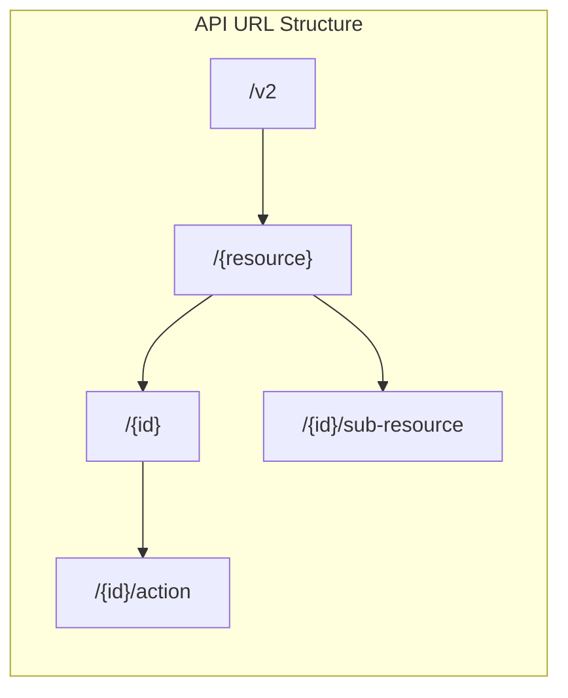

### 6.2 人机接口 (User API)

人机接口通过 Gateway 路由，认证信息通过 Header 透传。

#### 6.2.1 模型接口

| 方法 | URL 模式 | 描述 | 对应需求 |
|------|----------|------|----------|
| POST | /v2/models | 创建模型 | REQ-MODEL-001 |
| GET | /v2/models | 查询模型列表 | REQ-QUERY-001 |
| GET | /v2/models/{modelId} | 查看模型详情 | REQ-MODEL-002 |
| PATCH | /v2/models/{modelId} | 修改模型 | REQ-MODEL-003 |
| DELETE | /v2/models/{modelId} | 软删除模型 | REQ-DELETE-001 |
| DELETE | /v2/models/{modelId}/hard | 硬删除模型 | REQ-DELETE-002 |
| POST | /v2/models/{modelId}/restore | 恢复模型 | REQ-DELETE-003 |

#### 6.2.2 版本接口

| 方法 | URL 模式 | 描述 | 对应需求 |
|------|----------|------|----------|
| POST | /v2/models/{modelId}/versions | 创建版本 | REQ-VERSION-001 |
| GET | /v2/models/{modelId}/versions/{versionId} | 查看版本详情 | REQ-VERSION-002 |
| DELETE | /v2/models/{modelId}/versions/{versionId} | 软删除版本 | REQ-DELETE-001 |
| DELETE | /v2/models/{modelId}/versions/{versionId}/hard | 硬删除版本 | REQ-DELETE-002 |
| POST | /v2/models/{modelId}/versions/{versionId}/restore | 恢复版本 | REQ-DELETE-003 |
| POST | /v2/models/{modelId}/versions/{versionId}/validate | 触发校验 | REQ-INFO-002 |
| POST | /v2/models/{modelId}/versions/{versionId}/recognize | 触发类型识别 | REQ-INFO-001 |

#### 6.2.3 回收站接口

| 方法 | URL 模式 | 描述 | 对应需求 |
|------|----------|------|----------|
| GET | /v2/recycle-bin | 查看回收站 | REQ-RECYCLE-001 |
| POST | /v2/recycle-bin/models/{modelId}/restore | 恢复模型 | REQ-RECYCLE-001 |
| DELETE | /v2/recycle-bin/models/{modelId}/hard | 硬删除模型 | REQ-RECYCLE-001 |
| POST | /v2/recycle-bin/versions/{versionId}/restore | 恢复版本 | REQ-RECYCLE-001 |
| DELETE | /v2/recycle-bin/versions/{versionId}/hard | 硬删除版本 | REQ-RECYCLE-001 |

#### 6.2.4 上传任务接口

| 方法 | URL 模式 | 描述 | 对应需求 |
|------|----------|------|----------|
| POST | /v2/upload-tasks | 创建上传任务 | REQ-UPLOAD-001 |
| GET | /v2/upload-tasks | 查询上传任务列表 | REQ-UPLOAD-002 |
| GET | /v2/upload-tasks/{taskId} | 查看任务详情 | REQ-UPLOAD-002 |
| POST | /v2/upload-tasks/{taskId}/stop | 停止任务 | REQ-UPLOAD-002 |
| POST | /v2/upload-tasks/{taskId}/resume | 恢复任务 | REQ-UPLOAD-002 |
| DELETE | /v2/upload-tasks/{taskId} | 删除任务 | REQ-UPLOAD-002 |

#### 6.2.5 转换任务接口

| 方法 | URL 模式 | 描述 | 对应需求 |
|------|----------|------|----------|
| POST | /v2/convert-tasks | 创建转换任务 | REQ-CONVERT-001 |
| GET | /v2/convert-tasks | 查询转换任务列表 | REQ-CONVERT-002 |
| GET | /v2/convert-tasks/{taskId} | 查看任务详情 | REQ-CONVERT-002 |
| DELETE | /v2/convert-tasks/{taskId} | 删除任务 | REQ-CONVERT-002 |

#### 6.2.6 分类管理接口

| 方法 | URL 模式 | 描述 | 对应需求 |
|------|----------|------|----------|
| GET | /v2/classifications | 查看分类列表 | REQ-CATEGORY-001 |
| POST | /v2/classifications | 添加分类 | REQ-CATEGORY-001 |
| DELETE | /v2/classifications/{classificationId} | 删除分类 | REQ-CATEGORY-001 |
| GET | /v2/classifications/{classificationId}/types | 查看类型列表 | REQ-CATEGORY-001 |
| POST | /v2/classifications/{classificationId}/types | 添加类型 | REQ-CATEGORY-001 |
| DELETE | /v2/classifications/{classificationId}/types/{typeId} | 删除类型 | REQ-CATEGORY-001 |

#### 6.2.7 标签管理接口

| 方法 | URL 模式 | 描述 | 对应需求 |
|------|----------|------|----------|
| GET | /v2/tags | 查看标签列表 | REQ-TAG-001 |
| POST | /v2/tags | 添加标签 | REQ-TAG-001 |
| DELETE | /v2/tags/{tagId} | 删除标签 | REQ-TAG-001 |
| POST | /v2/models/{modelId}/tags/{tagId} | 添加模型标签 | REQ-TAG-001 |
| DELETE | /v2/models/{modelId}/tags/{tagId} | 移除模型标签 | REQ-TAG-001 |

### 6.3 机机接口 (M2M API)

机机接口不经过 Gateway，由调用方直接访问模型仓库 Pod URL，通过 SSL 证书校验进行认证。

| 方法 | URL 模式 | 描述 | 对应需求 |
|------|----------|------|----------|
| GET | /v2/m2m/models/{modelId}/versions/{versionNumber}/path | 查询权重路径 | REQ-M2M-001 |
| POST | /v2/m2m/models/{modelId}/archive | 训练权重归档 | REQ-M2M-002 |
| POST | /v2/m2m/versions/{versionId}/lock | 锁定版本 | REQ-M2M-003 |
| DELETE | /v2/m2m/versions/{versionId}/lock | 解锁版本 | REQ-M2M-003 |

### 6.4 统一响应格式

所有 API 采用统一的响应格式：

**成功响应**：

```json
{
    "code": 0,
    "message": "success",
    "data": { ... },
    "timestamp": "2026-04-19T10:30:00Z",
    "requestId": "req-uuid-xxx"
}
```

**分页响应**：

```json
{
    "code": 0,
    "message": "success",
    "data": {
        "items": [ ... ],
        "page": 1,
        "pageSize": 50,
        "total": 1000,
        "totalPages": 20
    },
    "timestamp": "2026-04-19T10:30:00Z",
    "requestId": "req-uuid-xxx"
}
```

**错误响应**：

```json
{
    "code": 1001001,
    "message": "Model not found",
    "data": null,
    "timestamp": "2026-04-19T10:30:00Z",
    "requestId": "req-uuid-xxx",
    "details": {
        "modelId": "xxx"
    }
}
```

### 6.5 分页规范

**分页参数**：

| 参数名 | 类型 | 默认值 | 说明 |
|--------|------|--------|------|
| page | int | 1 | 页码，从 1 开始 |
| pageSize | int | 50 | 每页条数，最大 100 |

**排序参数**：

| 参数名 | 类型 | 默认值 | 说明 |
|--------|------|--------|------|
| sortBy | string | createTime | 排序字段 |
| sortOrder | string | desc | 排序方向，asc 或 desc |

### 6.6 错误码定义

错误码采用数字格式 `1XXYYY`，其中 `XX` 为模块码，`YYY` 为具体错误码。

| 模块码 | 模块名称 | 说明 |
|--------|----------|------|
| 01 | 通用错误 | 通用异常 |
| 02 | 模型模块 | 模型相关错误 |
| 03 | 版本模块 | 版本相关错误 |
| 04 | 上传任务模块 | 上传任务相关错误 |
| 05 | 转换任务模块 | 转换任务相关错误 |
| 06 | 分类模块 | 分类相关错误 |
| 07 | 标签模块 | 标签相关错误 |
| 08 | 资源组模块 | 资源组相关错误 |
| 09 | 锁模块 | 版本锁相关错误 |

**通用错误码 (1XXYYY)**：

| 错误码 | 描述 | HTTP 状态码 |
|--------|------|--------------|
| 1001000 | 系统内部错误 | 500 |
| 1001001 | 请求参数错误 | 400 |
| 1001002 | 资源不存在 | 404 |
| 1001003 | 资源已存在 | 409 |
| 1001004 | 资源已被锁定 | 409 |
| 1001005 | 操作不支持 | 400 |
| 1001006 | 认证失败 | 401 |
| 1001007 | 权限不足 | 403 |
| 1001008 | 资源组无权限 | 403 |

**模型模块错误码 (102YYY)**：

| 错误码 | 描述 | 对应需求 |
|--------|------|----------|
| 1021001 | 模型不存在 | REQ-MODEL-002 |
| 1021002 | 模型名称已存在 | REQ-MODEL-001 |
| 1021003 | 模型名称不可修改 | REQ-MODEL-003 |
| 1021004 | 模型存在关联版本，禁止删除分类 | REQ-CATEGORY-001 |
| 1021005 | 模型资源组不可修改 | REQ-MODEL-003 |

**版本模块错误码 (103YYY)**：

| 错误码 | 描述 | 对应需求 |
|--------|------|----------|
| 1031001 | 版本不存在 | REQ-VERSION-002 |
| 1031002 | 版本号不连续 | REQ-VERSION-001 |
| 1031003 | 版本已被锁定 | REQ-DELETE-001 |
| 1031004 | 版本锁定数不为零 | REQ-DELETE-002 |

**上传任务模块错误码 (104YYY)**：

| 错误码 | 描述 | 对应需求 |
|--------|------|----------|
| 1041001 | 上传任务不存在 | REQ-UPLOAD-002 |
| 1041002 | 上传任务不支持的操作 | REQ-UPLOAD-002 |
| 1041003 | 上传路径无效 | REQ-UPLOAD-001 |
| 1041004 | 文件后缀不在白名单 | REQ-SECURITY-001 |

**转换任务模块错误码 (105YYY)**：

| 错误码 | 描述 | 对应需求 |
|--------|------|----------|
| 1051001 | 转换任务不存在 | REQ-CONVERT-002 |
| 1051002 | 不支持的转换格式 | REQ-CONVERT-001 |
| 1051003 | 源版本不存在 | REQ-CONVERT-001 |
| 1051004 | 源版本被锁定 | REQ-CONVERT-001 |

**分类模块错误码 (106YYY)**：

| 错误码 | 描述 | 对应需求 |
|--------|------|----------|
| 1061001 | 分类不存在 | REQ-CATEGORY-001 |
| 1061002 | 类型不存在 | REQ-CATEGORY-001 |
| 1061003 | 分类下存在模型，禁止删除 | REQ-CATEGORY-001 |
| 1061004 | 类型下存在模型，禁止删除 | REQ-CATEGORY-001 |

**标签模块错误码 (107YYY)**：

| 错误码 | 描述 | 对应需求 |
|--------|------|----------|
| 1071001 | 标签不存在 | REQ-TAG-001 |
| 1071002 | 标签已存在 | REQ-TAG-001 |
| 1071003 | 模型标签关联不存在 | REQ-TAG-001 |

**资源组模块错误码 (108YYY)**：

| 错误码 | 描述 | 对应需求 |
|--------|------|----------|
| 1081001 | 资源组不存在 | REQ-RBAC-002 |
| 1081002 | 无权限访问该资源组 | REQ-RBAC-001 |

**锁模块错误码 (109YYY)**：

| 错误码 | 描述 | 对应需求 |
|--------|------|----------|
| 1091001 | 锁定不存在 | REQ-M2M-003 |
| 1091002 | 锁定已过期 | REQ-M2M-003 |
| 1091003 | 非法的锁定者 | REQ-M2M-003 |

---

## 7. 安全架构

### 7.1 SSL/TLS 双向证书认证

模型仓库所有对外接口均强制使用 SSL/TLS 双向证书认证。

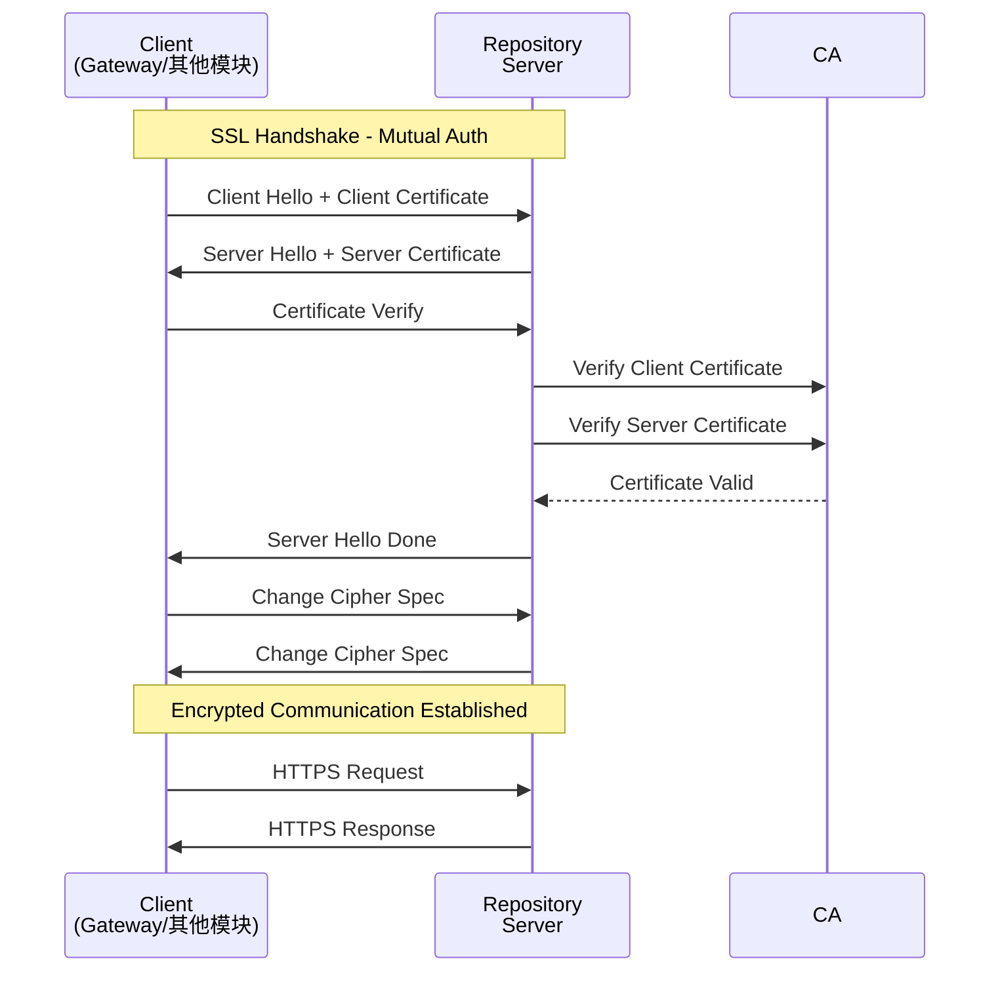

### 7.2 人机接口认证流程

人机接口（User API）通过 Gateway 路由，认证流程如下：

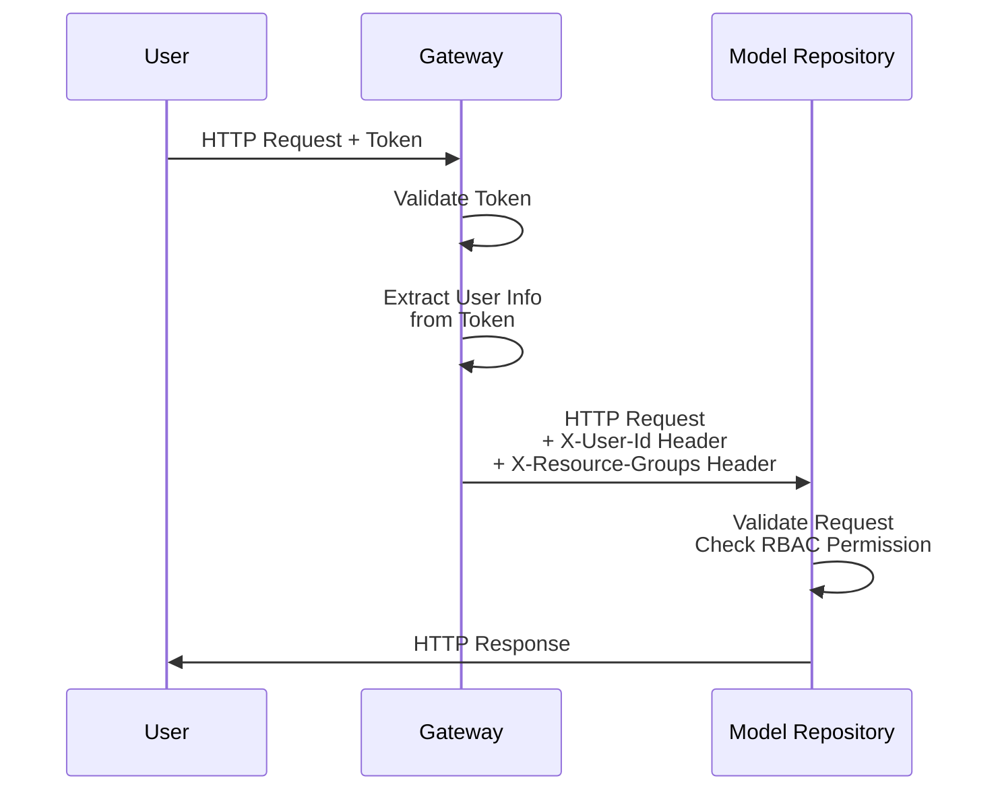

**Header 透传机制**：

| Header 名称 | 说明 | 示例 |
|-------------|------|------|
| X-User-Id | 用户 ID | user-123 |
| X-User-Name | 用户名 | john.doe |
| X-Resource-Groups | 用户所属资源组列表 | default,public |
| X-Is-Admin | 是否管理员 | true/false |

### 7.3 机机接口认证流程

机机接口（M2M API）不经过 Gateway，由调用方直接访问模型仓库 Pod URL，通过 SSL 双向证书认证：

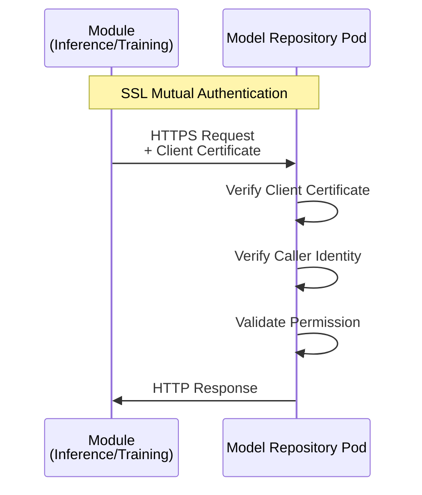

**M2M 接口安全约束**：

- 调用方必须使用有效的 SSL 客户端证书
- 客户端证书 CN 或 DNS 记录需在白名单中
- 每次请求需验证证书链和有效期

### 7.4 分权分域安全模型

模型仓库深度集成平台分权分域体系，实现资源级别的访问控制：

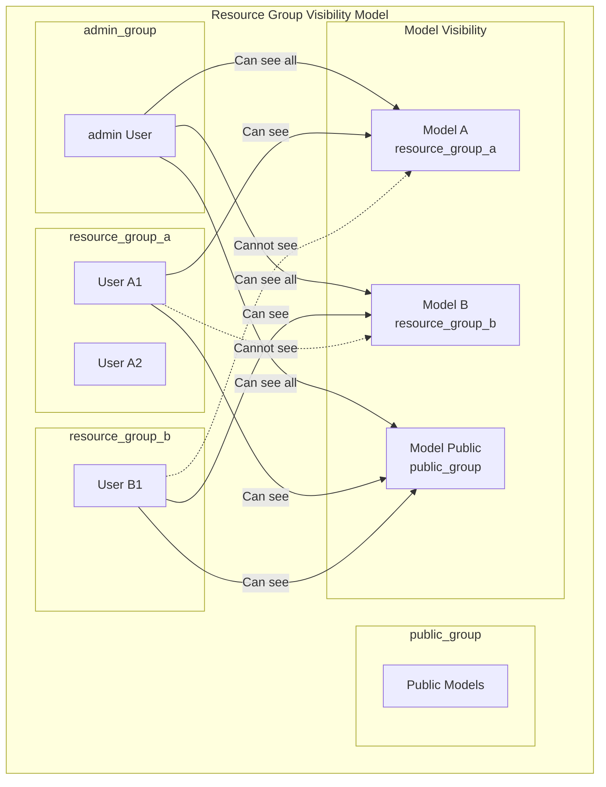

**资源组可见性规则**：

| 用户类型 | 可访问资源组 | 说明 |
|----------|-------------|------|
| admin | 所有资源组 | 超级管理员，可访问全部资源 |
| 普通用户 | 本资源组 + public 资源组 | 受资源组边界限制 |

### 7.5 文件上传安全

**白名单校验**：上传文件后缀必须位于 ConfigMap 中的白名单列表中，白名单以 Properties 格式存储：

```properties
# file-suffix-whitelist.properties
allowed-suffixes=.safetensors,.bin,.pt,.onnx,.pth,.ckpt,.h5,.msgpack,.json,.yaml,.yml
```

**安全风险提示**：即使文件后缀在白名单中，系统仍需检测文件名是否包含潜在风险（如路径穿越攻击 `../`）。

---

## 8. 异步任务架构

### 8.1 异步任务概述

模型仓库包含两类异步任务：上传任务和转换任务。异步任务采用 K8s Job + fabric8 Informer 架构实现。

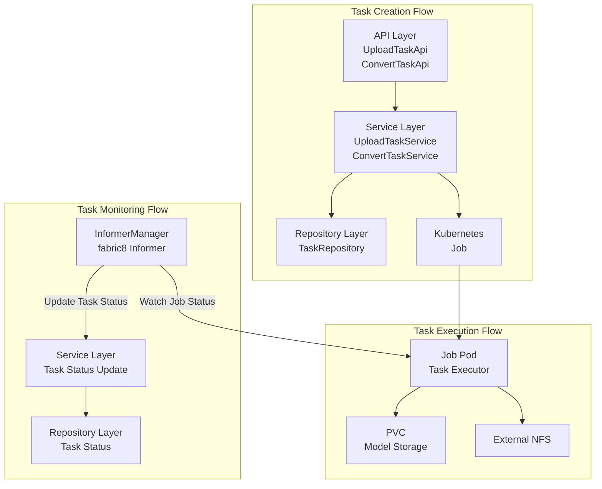

### 8.2 上传任务执行流程

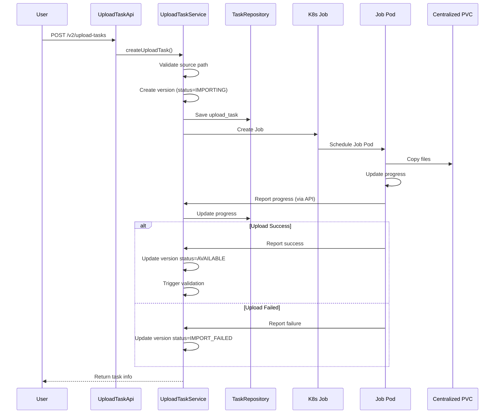

### 8.3 转换任务执行流程

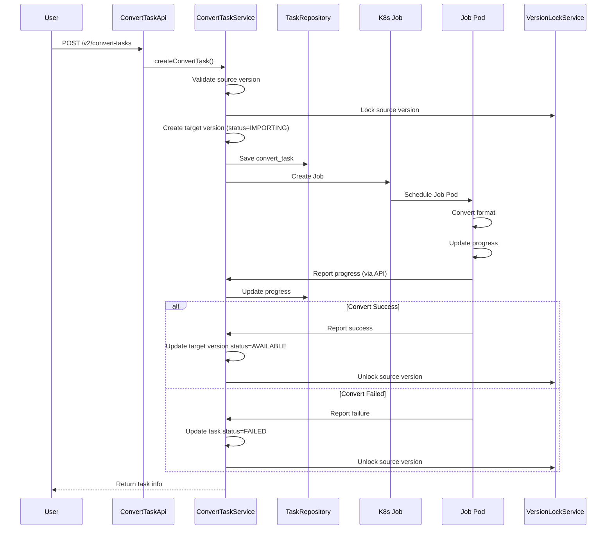

### 8.4 Leader Election 在任务管理中的应用

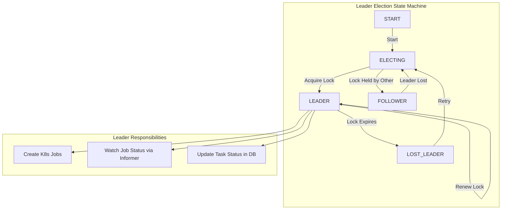

**Leader 节点职责**：
- 创建 K8s Job
- 通过 Informer 监听 Job 状态变化
- 更新任务状态到数据库

**Follower 节点职责**：
- 处理读请求
- 监听 Leader 状态，准备切换

### 8.5 任务状态同步机制

任务状态同步采用 Pull + Push 混合模式：

| 同步方式 | 实现 | 适用场景 |
|----------|------|----------|
| Pull | API 查询 Job 状态 | 定时同步、状态校正 |
| Push | Informer 实时监听 | 状态变更实时通知 |

**Informer 配置**：

```java
@Configuration
public class K8sInformerConfig {
    
    @Bean
    public SharedInformerFactory sharedInformerFactory(KubernetesClient client) {
        return new SharedInformerFactory();
    }
    
    @Bean
    public JobInformer jobInformer(SharedInformerFactory factory, String namespace) {
        return factory.sharedIndexInformerFor(
            new JobQuery().withNamespace(namespace),
            Job.class,
            30 * 1000L // resync period
        );
    }
}
```

---

## 9. 公共约定

### 9.1 日志规范

**日志框架**：使用 Log4j 2 进行日志管理，支持日志轮转。

**日志级别使用规范**：

| 级别 | 使用场景 |
|------|----------|
| ERROR | 系统异常、数据库错误、第三方服务调用失败 |
| WARN | 业务异常（如参数校验失败、资源不存在）、性能警告 |
| INFO | 关键业务操作（模型创建、版本发布、任务开始/完成） |
| DEBUG | 开发调试信息、详细执行路径 |

**日志格式**：

```
%d{yyyy-MM-dd HH:mm:ss.SSS} [%t] %-5level %logger{36} - %msg%n
```

示例：

```
2026-04-19 10:30:00.123 [http-nio-8080-exec-1] INFO  c.h.m.r.s.ModelService - Create model: id=xxx, name=xxx, user=xxx
```

**日志轮转配置**：

```xml
<RollingFile name="RollingFile" fileName="logs/model-lite-repository.log"
             filePattern="logs/model-lite-repository-%d{yyyy-MM-dd}-%i.log.gz">
    <Policies>
        <TimeBasedTriggeringPolicy interval="1" modulate="true"/>
        <SizeBasedTriggeringPolicy size="100MB"/>
    </Policies>
    <DefaultRolloverStrategy max="30"/>
</RollingFile>
```

### 9.2 操作日志规范

操作日志通过 Annotation 方式标记，同步 HTTP 上报到平台日志服务。

**操作日志注解**：

```java
@Target(ElementType.METHOD)
@Retention(RetentionPolicy.RUNTIME)
public @interface AuditLog {
    String operation();
    String targetType();
    String targetIdParam() default "id";
}
```

**使用示例**：

```java
@AuditLog(operation = "CREATE", targetType = "MODEL")
public ModelDTO createModel(CreateModelRequest request) {
    // business logic
}

@AuditLog(operation = "DELETE", targetType = "VERSION")
public void deleteVersion(String versionId) {
    // business logic
}
```

**日志上报格式**：

```json
{
    "service": "model-lite-repository",
    "timestamp": "2026-04-19T10:30:00Z",
    "operator": {
        "userId": "user-123",
        "userName": "john.doe",
        "resourceGroups": ["default", "public"]
    },
    "operation": "CREATE",
    "target": {
        "type": "MODEL",
        "id": "model-xxx",
        "name": "glm-5"
    },
    "result": "SUCCESS",
    "details": {
        "classification": "TextGeneration",
        "type": "glm-5"
    }
}
```

### 9.3 配置管理规范

**配置文件加载顺序**：

1. ConfigMap 挂载的配置文件（最高优先级）
2. application.yml
3. application-{profile}.yml

**ConfigMap 白名单配置**：

ConfigMap 挂载为 `/etc/config/whitelist.properties`，通过 Properties 方式读取：

```java
@Configuration
@PropertySource(value = "file:/etc/config/whitelist.properties", ignoreResourceNotFound = true)
public class WhitelistConfig {
    
    @Value("${allowed-suffixes:.safetensors,.bin,.pt}")
    private String allowedSuffixes;
    
    public List<String> getAllowedSuffixList() {
        return Arrays.asList(allowedSuffixes.split(","));
    }
}
```

### 9.4 异常处理规范

**异常类层次**：

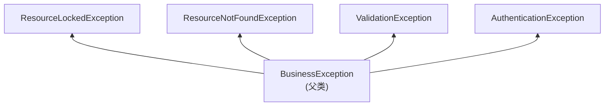

**全局异常处理器**：

```java
@RestControllerAdvice
public class GlobalExceptionHandler {
    
    @ExceptionHandler(BusinessException.class)
    public ErrorResponse handleBusinessException(BusinessException e) {
        return ErrorResponse.of(e.getCode(), e.getMessage());
    }
    
    @ExceptionHandler(MethodArgumentNotValidException.class)
    public ErrorResponse handleValidationException(MethodArgumentNotValidException e) {
        return ErrorResponse.of(1001001, "Validation failed");
    }
}
```

### 9.5 数据库事务规范

**事务传播行为**：

| 场景 | 传播行为 | 说明 |
|------|----------|------|
| 普通服务方法 | REQUIRED | 加入当前事务，无则创建新事务 |
| 日志记录 | REQUIRES_NEW | 独立事务，不影响主事务 |
| 外部调用 | NESTED | 保存点机制，部分回滚 |

**事务边界**：

```java
@Transactional(propagation = Propagation.REQUIRED)
public ModelDTO createModel(CreateModelRequest request) {
    // 事务边界：模型创建 + 版本创建 + 标签关联
    Model model = modelRepository.save(modelEntity);
    ModelVersion version = versionRepository.save(versionEntity);
    // ...
}
```

### 9.6 ID 生成规范

**ID 生成策略**：使用 UUID v4

**生成时机**：实体插入数据库前，由应用层生成

```java
public class UuidGenerator {
    
    public static UUID generate() {
        return UUID.randomUUID();
    }
}
```

---

## 10. 范围边界与约束

### 10.1 功能范围

**本次实现范围内**：

- 模型和模型版本的 CRUD 操作
- 权重文件上传和纳管
- 权重格式转换（Megatron → Safetensors）
- 模型分类和类型管理
- 模型标签管理
- 回收站和软删除/硬删除
- 版本锁定机制
- 分权分域（资源组可见性控制）
- 操作日志审计
- M2M 接口（路径查询、归档、锁定）

**本次实现范围外**：

- 模型量化任务管理
- 模型收藏/订阅功能
- 跨环境模型导入导出
- 模型版本对比功能
- 模型性能指标管理
- 插件框架机制

### 10.2 技术约束

| 约束项 | 说明 |
|--------|------|
| 开发框架 | Spring Boot 3.4.5 |
| 编程语言 | Java 21 |
| 数据库 | PostgreSQL |
| ORM 框架 | MyBatis |
| 连接池 | Druid |
| 部署环境 | Kubernetes |
| 异步任务 | K8s Job + fabric8 Informer |
| ID 生成 | UUID v4 |

### 10.3 设计约束

| 约束项 | 说明 |
|--------|------|
| 文件后缀白名单 | ConfigMap 挂载，不存数据库 |
| 操作日志 | HTTP 上报平台日志服务 |
| M2M 接口路由 | 不经过 Gateway |
| M2M 认证 | SSL 证书校验 |
| 纳管硬删除 | 不删除源文件 |
| 版本锁 TTL | 24 小时 |

### 10.4 假设与依赖

**假设条件**：

- 平台已具备统一的身份认证和 RBAC 鉴权体系
- 平台已具备统一的操作日志/审计服务
- 模型权重文件存储于平台统一管理的 PVC 或外部 NFS
- 模型分类和类型存在系统预设值

**外部依赖**：

- PostgreSQL 数据库
- Platform RBAC 服务
- Platform Log Service
- ConfigMap 白名单配置
- Centralized PVC
- SSL 证书

---

## 11. 可扩展性设计点

### 11.1 AI 资产扩展

模型仓库设计预留了扩展其他 AI 资产的能力，当前抽象了通用基类和接口。

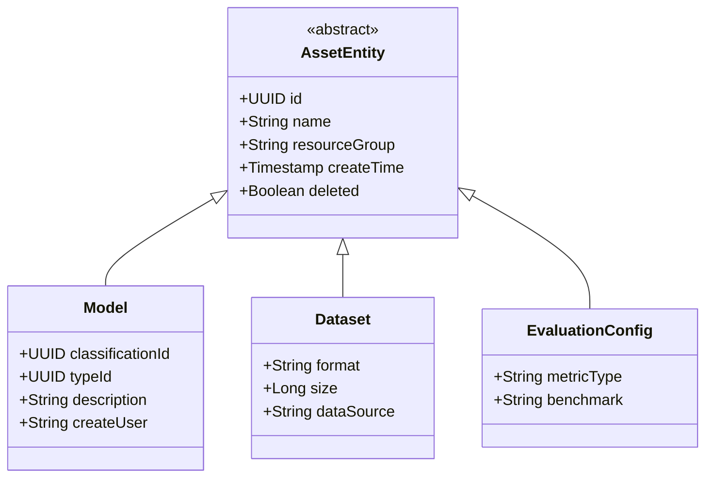

**扩展点**：未来可引入 Dataset（训练数据集）、EvaluationConfig（评测配置）等资产类型，通过继承通用基类实现。

### 11.2 校验机制扩展

权重完整性校验机制设计为可扩展架构，支持未来添加新的校验方式。

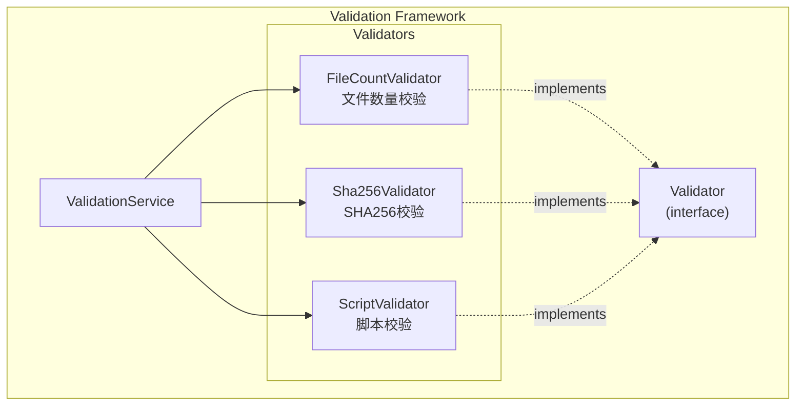

**扩展接口**：

```java
public interface WeightValidator {
    String getName();
    ValidationResult validate(WeightContext context);
    boolean supports(ValidationType type);
}
```

### 11.3 白名单动态调整

文件后缀白名单通过 ConfigMap 管理，支持动态调整而无需重启服务。

**实现机制**：

1. ConfigMap 挂载为文件
2. Spring FileSystemWatch 监听文件变化
3. 文件变化时重新加载配置
4. 无需重启即可生效

**备选逃生通道**：支持通过 kubectl 直接修改 ConfigMap，不依赖应用层。

### 11.4 资源组修改扩展

虽然当前设计不支持修改模型的资源组，但架构上已预留扩展点：

```java
public interface ResourceGroupChangeable {
    void changeResourceGroup(String newResourceGroup);
    
    // Hooks
    void beforeResourceGroupChange(String oldGroup, String newGroup);
    void afterResourceGroupChange(String oldGroup, String newGroup);
}
```

---

## 12. 关键设计决策总结

### 12.1 架构决策清单

| 序号 | 决策领域 | 决策内容 | 权衡因素 |
|------|----------|----------|----------|
| 1 | 版本锁机制 | 关系表 + TTL(24小时) + 巡检清理 | 简单可靠，支持多任务并发锁定；Leader 每 10 分钟清理过期锁 |
| 2 | 部署架构 | 多副本 + Leader Election | 保证高可用和写操作一致性；增加部署复杂度 |
| 3 | API 版本 | URL 路径 v2 | 明确版本边界，便于迭代；路径略显冗长 |
| 4 | 认证方式 | User API Header 透传<br/>M2M API SSL 证书 | 复用平台体系；证书管理增加运维负担 |
| 5 | 软删除 | 状态字段 + 部分索引 | 实现简单，查询性能好；删除记录仍占空间 |
| 6 | 错误码 | 数字格式 1XXYYY | 便于分类检索；可读性不如字符串 |
| 7 | 包名 | com.huawei.modellite.repository | 遵循公司规范 | |
| 8 | 操作日志 | Annotation + HTTP 上报 | 侵入性小；需依赖平台服务 |
| 9 | 白名单存储 | ConfigMap | 不占数据库资源；需运维配合 | |
| 10 | 训练归档 | 回调接口同步 | 响应快；调用方需实现回调 |
| 11 | 纳管硬删除 | 不删源文件 | 保留源数据；可能造成存储浪费 |

### 12.2 设计亮点

**多副本一致性**：通过 Leader Election 机制，在多副本部署环境下保证写操作一致性，避免数据冲突。

**版本锁 TTL + 巡检清理**：采用 TTL 自动过期机制，防止因异常导致锁无法释放的问题。同时 Leader 节点定期巡检清理过期锁记录，进一步保障版本锁系统的可靠性。

**异步任务可靠执行**：基于 K8s Job 实现任务执行，Job Pod 与主服务分离，任务执行不依赖主服务生命周期。

**Informer 高效同步**：通过 fabric8 Informer 实时监听 Job 状态变化，避免频繁轮询，提高响应效率。

**软删除可恢复**：所有删除操作均为软删除，保留数据恢复能力，同时通过部分索引保证查询性能。

### 12.3 已知限制

**纳管硬删除不删源文件**：当前设计纳管版本硬删除时只删除数据库记录，不删除源文件，可能造成存储浪费。未来可考虑增加清理策略。

**版本锁不支持公平锁**：当前版本锁实现不支持公平锁语义，高并发场景下可能出现锁饥饿问题。低概率事件，可接受。已增加 Leader 节点定期巡检清理过期锁机制，可缓解僵尸锁问题。

**M2M 接口无重试机制**：训练归档回调接口设计为同步接口，响应时间控制在 2 秒内。如接口失败，调用方需自行实现重试。

---

## 13. 需求追溯矩阵

### 13.1 功能需求追溯

| 需求编号 | 需求名称 | 优先级 | 架构组件 | 实现说明 |
|----------|----------|--------|----------|----------|
| REQ-MODEL-001 | 模型创建 | 高 | ModelService, ModelRepository | 创建模型及第一个版本，校验名称唯一性，支持模型属性字段（author、seriesName、modelSize、maxSeqLength） |
| REQ-MODEL-002 | 模型查看 | 高 | ModelService, ModelApi | 查询模型详情及版本列表，返回模型业务属性 |
| REQ-MODEL-003 | 模型修改 | 高 | ModelService | 修改描述、分类、类型、标签、模型属性字段 |
| REQ-VERSION-001 | 模型版本创建 | 高 | VersionService | 自动分配版本号，支持纳管/上传 |
| REQ-VERSION-002 | 模型版本查看 | 高 | VersionService | 返回版本详情、权重路径、状态、训练元数据等 |
| REQ-DELETE-001 | 模型软删除 | 高 | ModelService, VersionService | 检查锁定状态，执行软删除 |
| REQ-DELETE-002 | 模型硬删除 | 高 | ModelService, VersionService | 检查锁定，删除文件和元数据 |
| REQ-DELETE-003 | 模型恢复 | 高 | ModelService, VersionService | 恢复软删除的模型/版本 |
| REQ-RECYCLE-001 | 回收站管理 | 高 | RecycleBinApi, ModelService | 展示、恢复、硬删除回收站内容 |
| REQ-QUERY-001 | 模型列表查询 | 高 | ModelService, ModelApi | 分页、筛选、排序、全局搜索 |
| REQ-REGISTER-001 | 权重纳管 | 高 | VersionService | 记录存储路径，标记纳管类型 |
| REQ-REGISTER-002 | 纳管校验 | 高 | ValidationService | 自动触发文件完整性校验 |
| REQ-UPLOAD-001 | 上传任务创建 | 高 | UploadTaskService | 创建异步上传任务 |
| REQ-UPLOAD-002 | 上传任务管理 | 高 | UploadTaskService, UploadTaskApi | 查看、停止、恢复、删除任务 |
| REQ-INFO-001 | 权重类型识别 | 中 | ValidationService | 解析 config.json 识别类型 |
| REQ-INFO-002 | 权重文件完整性校验 | 中 | ValidationService | 校验文件数量、保留扩展点 |
| REQ-CATEGORY-001 | 模型分类管理 | 高 | ClassificationService | 两级分类体系管理，模型类型支持能力标记（supportFinetune） |
| REQ-TAG-001 | 模型标签管理 | 中 | TagService | 标签 CRUD 及模型关联 |
| REQ-CATEGORY-002 | 模型分类/类型修改 | 中 | ModelService | 修改后校验名称唯一性 |
| REQ-SECURITY-001 | 文件后缀白名单 | 高 | ValidationService | ConfigMap 读取，白名单校验 |
| REQ-SECURITY-002 | SSL/TLS 双向证书认证 | 高 | SecurityConfig | 所有接口强制 SSL 认证 |
| REQ-RBAC-001 | 资源组可见性控制 | 高 | RBACInterceptor | Header 解析，资源组过滤 |
| REQ-RBAC-002 | 模型资源组归属 | 高 | ModelRepository | 创建时指定，不可修改 |
| REQ-RBAC-003 | public 资源组权限 | 高 | RBACInterceptor | 特殊规则处理 |
| REQ-M2M-001 | 机机接口 — 查询权重路径 | 高 | PathQueryApi | M2M 认证，返回 PVC 路径 |
| REQ-M2M-002 | 机机接口 — 训练权重归档 | 高 | ArchiveApi | 创建版本，分配路径，回写训练元数据（trainFrame、trainType、trainStrategy、trainTime、finalLoss、sourceVersion） |
| REQ-M2M-003 | 机机接口 — 锁定/解锁 | 高 | LockApi | 版本锁机制，支持引用计数 |
| REQ-LOG-001 | 操作日志记录 | 中 | AuditLogAnnotation | 注解标记，HTTP 上报 |
| REQ-GENERAL-001 | 日志轮转 | 中 | Log4jConfig | 时间+大小轮转 |
| REQ-GENERAL-002 | 版本状态管理 | 高 | VersionStatusEnum | 5 种状态及转换规则 |
| REQ-CONVERT-001 | 权重格式转换 | 高 | ConvertTaskService | Megatron→Safetensors |
| REQ-CONVERT-002 | 转换任务管理 | 中 | ConvertTaskApi | 查看、删除任务 |

### 13.2 非功能需求追溯

| 需求编号 | 需求名称 | 指标 | 架构设计 | 验证方式 |
|----------|----------|------|-----------|----------|
| REQ-NFR-001 | 模型列表查询响应时间 | ≤500ms | 索引优化、分页限制 | 性能测试 |
| REQ-NFR-002 | 模型详情查询响应时间 | ≤200ms | 索引优化 | 性能测试 |
| REQ-NFR-003 | 并发上传任务数 | ≥10 | K8s Job 并行度 | 压力测试 |
| REQ-NFR-004 | 大文件上传支持 | ≥100GB | 断点续传、流式复制 | 集成测试 |
| REQ-NFR-005 | 断点续传 | 支持 | 上传任务状态持久化 | 故障恢复测试 |
| REQ-NFR-006 | 异常重启恢复 | 自动恢复 | K8s Job 自愈 | 故障测试 |
| REQ-NFR-007 | 事务一致性 | 保证 | 数据库事务管理 | 单元测试 |
| REQ-NFR-008 | AI 资产扩展 | 支持 | 抽象基类设计 | 代码审查 |
| REQ-NFR-009 | 资源组修改 | 预留 | 接口扩展点 | 代码审查 |
| REQ-NFR-010 | 校验机制扩展 | 支持 | Validator 接口 | 代码审查 |
| REQ-NFR-011 | 白名单动态调整 | 支持 | ConfigMap 热加载 | 动态测试 |
| REQ-NFR-012 | SSL/TLS 双向认证 | 必须 | SecurityConfig | 安全测试 |
| REQ-NFR-013 | 文件后缀校验 | 必须 | WhitelistValidator | 安全测试 |
| REQ-NFR-014 | 安全风险提示 | 必须 | FilenameValidator | 安全测试 |
| REQ-NFR-015 | 操作日志审计 | 必须 | AuditLog | 审计测试 |
| REQ-NFR-016 | M2M 接口兼容 | 必须 | 直接 Pod URL | 集成测试 |
| REQ-NFR-017 | RBAC 鉴权兼容 | 必须 | Header 透传 | 集成测试 |
| REQ-NFR-018 | 单资源组模型数量上限 | ≤100 | 业务层校验 | 功能测试 |
| REQ-NFR-019 | 单模型版本数量上限 | ≤50 | 业务层校验 | 功能测试 |
| REQ-NFR-020 | 全平台模型总量预期 | ≤1000 | 索引优化、分页设计 | 性能测试 |

---

## 14. 附录

### 14.1 术语表

| 术语 | 定义 |
|------|------|
| 模型（Model） | 模型仓库中的顶层实体，代表一个机器学习模型的元数据集合 |
| 模型版本（Model Version） | 模型的子实体，代表模型某一特定版本的权重文件集合及其路径信息 |
| 纳管（Register） | 将外部已有的可访问存储路径登记到模型仓库，作为模型版本的权重来源，不执行文件复制 |
| 上传（Upload） | 将权重文件从原路径拷贝到平台内置的 PVC 下 |
| 资源组（Resource Group） | 平台的分权分域单元 |
| 模型分类（Model Classification） | 模型的一级分类，如 TextGeneration |
| 模型类型（Model Type） | 模型的二级分类，从属于某一分类，如 glm-5 |
| 机机接口（M2M API） | 供平台其他模块调用的接口 |
| 人机接口（User API） | 供前端页面或用户直接调用的接口 |
| 版本锁（Version Lock） | 标记模型版本正被训推任务占用 |
| Leader Election | Kubernetes 中用于选主的机制 |
| fabric8 Informer | Kubernetes 官方 Java 客户端的缓存和事件处理框架 |

### 14.2 参考文档

| 文档名称 | 版本 | 说明 |
|----------|------|------|
| ModelLite 模型仓库需求规格说明书 | v1.1 | 本架构设计文档的依据 |
| Spring Boot Reference Guide | 3.4.5 | 开发框架文档 |
| MyBatis Documentation | 3.0+ | ORM 框架文档 |
| Kubernetes Documentation | 1.28+ | 容器编排文档 |
| fabric8 Kubernetes Client | 6.x | K8s Java 客户端文档 |
| PostgreSQL Documentation | 15+ | 数据库文档 |

### 14.3 配置参考

**application.yml 配置示例**：

```yaml
spring:
  application:
    name: model-lite-repository
  datasource:
    url: jdbc:postgresql://${DB_HOST}:${DB_PORT}/${DB_NAME}
    username: ${DB_USERNAME}
    password: ${DB_PASSWORD}
    driver-class-name: org.postgresql.Driver
    druid:
      initial-size: 5
      max-active: 20
      min-idle: 5

server:
  port: 8080
  ssl:
    enabled: true
    key-store: classpath:keystore.p12
    key-store-password: ${SSL_PASSWORD}
    key-store-type: PKCS12
    trust-store: classpath:truststore.p12
    trust-store-password: ${TRUST_PASSWORD}
    trust-store-type: PKCS12
    client-auth: need

repository:
  leader-election:
    lease-duration: 15s
    renew-deadline: 10s
    retry-period: 5s
  version-lock:
    ttl: 24h
  upload:
    chunk-size: 64MB
    max-concurrent: 10
  convert:
    timeout: 24h

management:
  endpoints:
    web:
      exposure:
        include: health,info,metrics
  endpoint:
    health:
      probes: true
```

**ConfigMap 白名单配置**：

```yaml
apiVersion: v1
kind: ConfigMap
metadata:
  name: file-suffix-whitelist
  namespace: model-lite
data:
  whitelist.properties: |
    allowed-suffixes=.safetensors,.bin,.pt,.onnx,.pth,.ckpt,.h5,.msgpack,.json,.yaml,.yml
```

### 14.4 部署清单

**Deployment 配置示例**：

```yaml
apiVersion: apps/v1
kind: Deployment
metadata:
  name: model-lite-repository
  namespace: model-lite
spec:
  replicas: 3
  selector:
    matchLabels:
      app: model-lite-repository
  template:
    metadata:
      labels:
        app: model-lite-repository
    spec:
      containers:
      - name: repository
        image: model-lite-repository:1.0.0
        ports:
        - containerPort: 8080
        resources:
          requests:
            cpu: "2"
            memory: "4Gi"
          limits:
            cpu: "4"
            memory: "8Gi"
        volumeMounts:
        - name: whitelist
          mountPath: /etc/config
          readOnly: true
        - name: model-storage
          mountPath: /mnt/models
        livenessProbe:
          httpGet:
            path: /actuator/health/liveness
            port: 8080
          initialDelaySeconds: 30
          periodSeconds: 10
        readinessProbe:
          httpGet:
            path: /actuator/health/readiness
            port: 8080
          initialDelaySeconds: 10
          periodSeconds: 5
      volumes:
      - name: whitelist
        configMap:
          name: file-suffix-whitelist
      - name: model-storage
        persistentVolumeClaim:
          claimName: model-lite-pvc
```

**Service 配置示例**：

```yaml
apiVersion: v1
kind: Service
metadata:
  name: model-lite-repository
  namespace: model-lite
spec:
  type: LoadBalancer
  ports:
  - port: 443
    targetPort: 8080
    protocol: TCP
  selector:
    app: model-lite-repository
---
apiVersion: v1
kind: Service
metadata:
  name: model-lite-repository-internal
  namespace: model-lite
spec:
  type: ClusterIP
  ports:
  - port: 8080
    targetPort: 8080
    protocol: TCP
  selector:
    app: model-lite-repository
```

---

**文档结束**
