# Feature 4: 权重导入（纳管/上传） — 特性设计文档

> **文档类型**: 特性设计文档
> **文档版本**: v1.1（增强版）
> **编写日期**: 2026-04-27
> **增强日期**: 2026-05-07
> **适用范围**: ModelLite 平台模型仓库模块 Feature 4
> **目标读者**: 后端开发工程师

---

## 1. 特性概述

### 1.1 目标

实现模型仓库的权重导入能力，包括两条核心路径：**纳管**（注册已有外部存储路径，不复制文件）和**上传**（通过 K8s Job 异步拷贝外部权重到平台 PVC）。同时提供训练归档的 M2M 接口，支持训练模块将产出权重纳入版本管理。

### 1.2 范围

**IN（包含）**:
- UploadTask 聚合根的领域模型实现（含 SourcePath、CifsCredentials 值对象）
- UploadTaskRepository 仓储接口与 MyBatis 实现
- UploadApplicationService 应用服务（编排跨上下文协作）
- 权重上传的人机接口（创建上传任务、查看任务、暂停/恢复/取消/删除任务）
- 训练归档的 M2M 接口（`POST /v2/models/{modelId}/versions/archive`）
- K8s Job 集成：Job 模板设计、ConfigMap/Secret 参数传递
- file-copier 镜像设计（rsync + 进度输出 + CIFS 挂载 + 拷贝前校验）
- Informer Watch + TaskReconciler 定时对账的双保险状态回调机制
- 上传进度上报（通过 Pod Log 解析）
- 文件后缀白名单校验（拷贝前，在 K8s Job 内执行）
- 源路径可达性校验（拷贝前，在 K8s Job 内执行）

**OUT（不包含）**:
- 纳管（注册模式创建版本）的 API — 已在 Feature 3 实现
- 权重完整性校验（REQ-INFO-002）— Feature 7
- 权重类型识别（REQ-INFO-001）— Feature 7
- 权重格式转换（REQ-CONVERT-001/002）— Feature 7
- 版本锁管理 — Feature 5
- 模型/版本软删除与回收站 — Feature 6
- 操作日志上报 — Feature 8
- file-copier 镜像的实际构建（本文档提供设计规范，镜像构建由运维/CI 完成）

### 1.3 依赖关系

| 依赖项 | 类型 | 说明 |
|--------|------|------|
| Feature 1: 基础设施与通用能力 | 特性 | 数据库 Schema（upload_task 表）、枚举定义（TaskStatus, SourceType）、错误码定义、TypeHandler、文件后缀白名单 ConfigMap |
| Feature 3: 模型与版本生命周期 | 特性 | Model 聚合（版本创建、状态更新）、ModelRepository、ModelApplicationService、版本状态机 |
| K8s 集群 | 外部系统 | 运行 K8s Job、存储 Informer |
| file-copier 镜像 | 外部依赖 | 自建镜像（rsync + 进度输出脚本 + cifs-utils），需预先构建推送至镜像仓库 |
| com.huawei.modellite.common 公共模块 | 外部依赖 | 提供 ModelLiteException、BaseResponse 等 |

### 1.4 需求追溯

| 需求编号 | 需求名称 | 本特性覆盖范围 |
|----------|----------|----------------|
| REQ-REGISTER-001 | 权重纳管 | 纳管已在 Feature 3 实现，本特性复用同一路径 |
| REQ-REGISTER-002 | 纳管校验 | 拷贝前校验（文件后缀+可达性）覆盖上传场景；纳管后校验归入 Feature 7 |
| REQ-UPLOAD-001 | 上传任务创建 | 完整实现（NFS/CIFS/PVC 三种源、K8s Job 异步执行、拷贝前校验） |
| REQ-UPLOAD-002 | 上传任务管理 | 完整实现（查看/暂停/恢复/取消/删除） |
| REQ-M2M-002 | 训练权重归档 | 完整实现（M2M 接口，纳管+训练元数据透传） |

### 1.5 设计决策记录

| 决策编号 | 决策内容 | 决策理由 |
|----------|----------|----------|
| F4-01 | Feature 4 的纳管与 Feature 3 的纳管是同一条路径 | 纳管本质是注册外部路径，Feature 3 已实现基础纳管能力 |
| F4-02 | UploadTask 作为独立聚合根，与 Model/ModelVersion 跨上下文引用 | UploadTask 有独立生命周期（6 种状态），与版本状态是两条独立的状态线 |
| F4-03 | 上传流程：先创建空版本（NoWeight）→ 再创建 UploadTask | 保持领域边界清晰；API 层提供便捷入口一步完成 |
| F4-04 | 训练归档是 M2M 接口，仓库不关心训练元数据语义，只做透传存储 | 职责分离：训练模块管理训练逻辑，仓库只管版本和存储 |
| F4-05 | CIFS 通过 mount.cifs 在容器内挂载，需 SYS_ADMIN capability | K8s 不原生支持 CIFS volume；自建镜像包含 cifs-utils |
| F4-06 | 校验在拷贝前执行（在 K8s Job 内两阶段：校验→拷贝） | 避免拷贝了无效文件后再回滚；版本状态更精确 |
| F4-07 | file-copier 镜像自建，包含 rsync + 进度输出脚本 + cifs-utils | 需要定制化拷贝逻辑和进度输出格式 |
| F4-08 | PVC 间拷贝限制在同 Namespace | 简化权限模型，避免跨 Namespace PVC 挂载问题 |
| F4-09 | K8s Job 不设置超时（不配置 activeDeadlineSeconds） | 上传 Job 执行时间可能非常长（TB级权重拷贝），K8s层面强制超时会导致正常拷贝被中断；超时监控由应用层面 TaskReconciler 软监控实现 |
| F4-10 | 暂停/恢复采用删 Job + 重建 Job 方式，依赖 rsync 续传 | K8s Job 不原生支持暂停；rsync --append-verify 保证续传正确性 |

---

## 2. 数据库设计

### 2.1 新增/变更表 DDL

> 本特性涉及的 upload_task 表已在 Feature 1 中创建。**本特性新增 `version` 字段用于乐观锁并发控制**。以下为 DDL 增量脚本及完整表结构说明。

#### upload_task（上传任务表）

**Feature 1 原始 DDL**: 见 Feature 1 §2.1。

**Feature 4 DDL 增量（新增 version 字段）**:

```sql
-- Feature 4 增强：upload_task 表增加乐观锁版本号字段
ALTER TABLE upload_task ADD COLUMN version BIGINT NOT NULL DEFAULT 0;

COMMENT ON COLUMN upload_task.version IS '乐观锁版本号，每次更新自动+1';
```

**完整 DDL（含 version 字段）**:

```sql
CREATE TABLE upload_task (
    id                  UUID PRIMARY KEY,
    model_id            UUID NOT NULL REFERENCES model(id),
    version_id          UUID NOT NULL REFERENCES model_version(id),
    source_type         VARCHAR(20) NOT NULL,
    source_path         VARCHAR(1024) NOT NULL,
    cifs_username       VARCHAR(200) DEFAULT NULL,
    cifs_password       VARCHAR(200) DEFAULT NULL,
    target_path         VARCHAR(1024) NOT NULL,
    progress            INTEGER DEFAULT 0,
    status              VARCHAR(20) NOT NULL DEFAULT 'Pending',
    error_message       VARCHAR(2000) DEFAULT NULL,
    version             BIGINT NOT NULL DEFAULT 0,     -- Feature 4 新增：乐观锁版本号
    create_user         VARCHAR(100) NOT NULL,
    create_time         TIMESTAMP WITH TIME ZONE NOT NULL DEFAULT NOW(),
    update_time         TIMESTAMP WITH TIME ZONE NOT NULL DEFAULT NOW()
);

COMMENT ON TABLE upload_task IS '上传任务表，跟踪权重文件从外部存储拷贝到平台 PVC 的异步过程';
COMMENT ON COLUMN upload_task.version IS '乐观锁版本号，每次更新自动+1，用于并发控制';
```

**本特性新增业务规则**:
- 同一模型同一版本下，只允许存在一个非终态（Pending/Running/Paused）的上传任务
- 任务创建时 status 初始为 Pending，K8s Job 启动且校验通过后更新为 Running
- 终态任务（Completed/Failed/Cancelled）不允许再执行状态变更操作
- 删除任务时，若文件已部分上传，需清理目标 PVC 中已拷贝的部分文件

### 2.2 表关系图（ER 图）

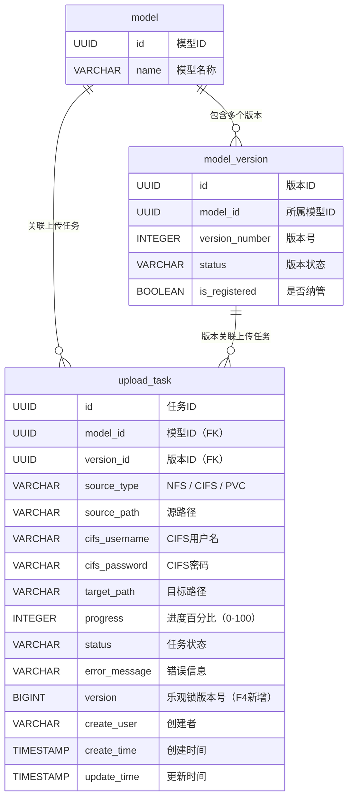

### 2.3 索引设计

> 索引已在 Feature 1 §2.3 中定义。本特性新增一个复合索引用于查询活跃任务。

| 表名 | 索引名 | 索引类型 | 索引字段 | 说明 | 状态 |
|------|--------|----------|----------|------|------|
| upload_task | idx_upload_active | B-tree | model_id, version_id WHERE status IN ('Pending','Running','Paused') | 查询某版本下的活跃上传任务 | **本特性新增** |
| upload_task | idx_upload_model | B-tree | model_id | 查询模型的上传任务 | Feature 1 已创建 |
| upload_task | idx_upload_status | B-tree | status | 按状态筛选 | Feature 1 已创建 |

**新增索引 DDL**:

```sql
CREATE INDEX idx_upload_active ON upload_task(model_id, version_id)
    WHERE status IN ('Pending', 'Running', 'Paused');
```

### 2.4 数据字典

#### upload_task 表

| 字段名 | 类型 | 是否必填 | 默认值 | 取值范围/说明 | 来源 |
|--------|------|----------|--------|---------------|------|
| id | UUID | Y | 应用侧生成 | 任务 ID，UUID v4 | Feature 1 |
| model_id | UUID | Y | — | 模型 ID（外键引用 model.id） | Feature 1 |
| version_id | UUID | Y | — | 版本 ID（外键引用 model_version.id） | Feature 1 |
| source_type | VARCHAR(20) | Y | — | 源路径类型：`NFS` / `CIFS` / `PVC` | Feature 1 |
| source_path | VARCHAR(1024) | Y | — | 源路径；NFS 格式为 `nfsServer:nfsPath`；CIFS 格式为 `//server/share/path`；PVC 格式为 `pvcName:internalPath` | Feature 1 |
| cifs_username | VARCHAR(200) | N | NULL | CIFS 认证用户名（仅 source_type=CIFS 时必填） | Feature 1 |
| cifs_password | VARCHAR(200) | N | NULL | CIFS 认证密码（仅 source_type=CIFS 时必填） | Feature 1 |
| target_path | VARCHAR(1024) | Y | — | 目标 PVC 内路径（格式：`pvcName:internalPath`） | Feature 1 |
| progress | INTEGER | N | 0 | 进度百分比，取值 0-100 | Feature 1 |
| status | VARCHAR(20) | Y | 'Pending' | 任务状态：`Pending` / `Running` / `Paused` / `Completed` / `Failed` / `Cancelled` | Feature 1 |
| error_message | VARCHAR(2000) | N | NULL | 失败时的错误信息 | Feature 1 |
| **version** | **BIGINT** | **Y** | **0** | **乐观锁版本号，每次状态更新自增 1，用于并发控制** | **Feature 4 新增** |
| create_user | VARCHAR(100) | Y | — | 创建用户标识 | Feature 1 |
| create_time | TIMESTAMP WITH TIME ZONE | Y | NOW() | 创建时间 | Feature 1 |
| update_time | TIMESTAMP WITH TIME ZONE | Y | NOW() | 更新时间 | Feature 1 |

---

## 3. 领域模型设计

### 3.1 类图

#### UploadTask 聚合

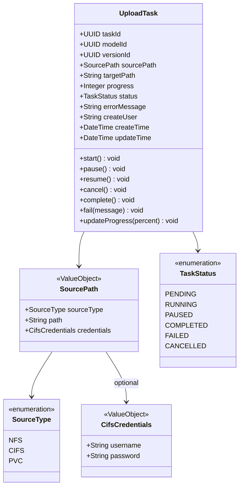

### 3.2 核心类定义

#### UploadTask（聚合根）

**包路径**: `com.huawei.modellite.repository.weighttask.domain.aggregate.uploadtask`

| 字段名 | 类型 | 说明 | 约束 |
|--------|------|------|------|
| taskId | UUID | 任务唯一标识 | 创建后不可修改 |
| modelId | UUID | 关联模型 ID | 创建后不可修改，引用有效模型 |
| versionId | UUID | 关联版本 ID | 创建后不可修改，引用有效版本 |
| sourcePath | SourcePath | 源路径信息 | 值对象，创建后不可修改 |
| targetPath | String | 目标 PVC 内路径 | 创建后不可修改 |
| progress | Integer | 进度百分比 | 取值 0-100，仅 Running 状态时可更新 |
| status | TaskStatus | 任务状态 | 状态机驱动，不可直接赋值 |
| errorMessage | String | 错误信息 | 仅 Failed 状态时有值 |
| createUser | String | 创建用户 | 创建后不可修改 |
| createTime | DateTime | 创建时间 | 自动填充 |
| updateTime | DateTime | 更新时间 | 自动填充 |

**方法定义**:

| 方法名 | 参数 | 返回类型 | 说明 | 业务规则 |
|--------|------|----------|------|----------|
| createUploadTask（静态工厂） | taskId, modelId, versionId, sourcePath, targetPath, createUser | UploadTask | 创建上传任务 | 前置：sourcePath 非空、targetPath 非空；后置：status=Pending, progress=0 |
| start | — | void | 启动任务 | 前置：status=Pending 或 status=Paused；后置：status=Running |
| pause | — | void | 暂停任务 | 前置：status=Running；后置：status=Paused |
| resume | — | void | 恢复任务 | 前置：status=Paused；后置：status=Running（实际是 Pending，等待 K8s Job 重建） |
| cancel | — | void | 取消任务 | 前置：status≠Completed 且 status≠Cancelled；后置：status=Cancelled |
| complete | — | void | 完成任务 | 前置：status=Running；后置：status=Completed, progress=100 |
| fail | message: String | void | 标记失败 | 前置：status=Running 或 status=Pending；后置：status=Failed, errorMessage=message |
| updateProgress | percent: Integer | void | 更新进度 | 前置：status=Running；校验：percent 0-100 且 ≥ 当前值；后置：progress=percent |
| isTerminal | — | boolean | 是否终态 | status ∈ {Completed, Failed, Cancelled} 返回 true |

#### 关键方法伪代码

**UploadTask 状态机校验**:

```java
private void ensureStatus(TaskStatus expected, String action) {
    if (this.status != expected) {
        throw new ModelLiteException(ErrorCode.UPLOAD_TASK_STATUS_CONFLICT,
                "任务状态为 " + this.status.getDisplayName() + "，无法执行 " + action);
    }
}
```

**UploadTask.start**:
```java
public void start() {
    // 前置：status = Pending 或 Paused
    if (this.status != TaskStatus.PENDING && this.status != TaskStatus.PAUSED) {
        throw new ModelLiteException(ErrorCode.UPLOAD_TASK_STATUS_CONFLICT,
                "只有 Pending 或 Paused 状态的任务才能启动");
    }
    this.status = TaskStatus.RUNNING;
    this.updateTime = DateTime.now();
}
```

**UploadTask.pause**:
```java
public void pause() {
    ensureStatus(TaskStatus.RUNNING, "暂停");
    this.status = TaskStatus.PAUSED;
    this.updateTime = DateTime.now();
}
```

**UploadTask.resume**:
```java
public void resume() {
    ensureStatus(TaskStatus.PAUSED, "恢复");
    // 恢复后回到 Pending，等待 TaskReconciler 重建 K8s Job
    this.status = TaskStatus.PENDING;
    this.updateTime = DateTime.now();
}
```

**UploadTask.cancel**:
```java
public void cancel() {
    if (this.status == TaskStatus.COMPLETED || this.status == TaskStatus.CANCELLED) {
        throw new ModelLiteException(ErrorCode.UPLOAD_TASK_STATUS_CONFLICT,
                "终态任务无法取消");
    }
    this.status = TaskStatus.CANCELLED;
    this.updateTime = DateTime.now();
}
```

**UploadTask.complete**:
```java
public void complete() {
    ensureStatus(TaskStatus.RUNNING, "完成");
    this.status = TaskStatus.COMPLETED;
    this.progress = 100;
    this.updateTime = DateTime.now();
}
```

**UploadTask.fail**:
```java
public void fail(String message) {
    if (this.status != TaskStatus.RUNNING && this.status != TaskStatus.PENDING) {
        throw new ModelLiteException(ErrorCode.UPLOAD_TASK_STATUS_CONFLICT,
                "只有 Running 或 Pending 状态的任务才能标记失败");
    }
    this.status = TaskStatus.FAILED;
    this.errorMessage = message;
    this.updateTime = DateTime.now();
}
```

**UploadTask.updateProgress**:
```java
public void updateProgress(Integer percent) {
    ensureStatus(TaskStatus.RUNNING, "更新进度");
    if (percent < 0 || percent > 100) {
        throw new ModelLiteException(ErrorCode.UPLOAD_TASK_INVALID_PROGRESS,
                "进度值必须在 0-100 之间");
    }
    if (percent < this.progress) {
        return; // 忽略回退的进度值（rsync 重算时可能出现）
    }
    this.progress = percent;
    this.updateTime = DateTime.now();
}
```

### 3.3 值对象定义

| 值对象名 | 字段名 | 类型 | 说明 | 校验规则 |
|----------|--------|------|------|----------|
| SourcePath | sourceType | SourceType | 源路径类型 | 枚举：NFS / CIFS / PVC |
| | path | String | 源路径 | 非空，最长 1024 字符 |
| | credentials | CifsCredentials | CIFS 凭证 | 仅 CIFS 模式非空 |
| CifsCredentials | username | String | CIFS 用户名 | CIFS 模式下非空，最长 200 字符 |
| | password | String | CIFS 密码 | CIFS 模式下非空，最长 200 字符 |

**值对象工厂方法**:

```java
// NFS 模式
public static SourcePath ofNfs(String nfsServer, String nfsPath) {
    // path = "nfsServer:nfsPath"
    return new SourcePath(SourceType.NFS, nfsServer + ":" + nfsPath, null);
}

// CIFS 模式
public static SourcePath ofCifs(String server, String share, String username, String password) {
    // path = "//server/share"
    CifsCredentials creds = new CifsCredentials(username, password);
    return new SourcePath(SourceType.CIFS, "//" + server + "/" + share, creds);
}

// PVC 模式
public static SourcePath ofPvc(String pvcName, String internalPath) {
    // path = "pvcName:internalPath"
    return new SourcePath(SourceType.PVC, pvcName + ":" + internalPath, null);
}
```

### 3.4 领域服务

本特性无需独立领域服务。UploadTask 聚合的业务逻辑均在聚合根内完成。跨上下文协作由 UploadApplicationService 编排。

### 3.5 仓储接口

#### UploadTaskRepository

**包路径**: `com.huawei.modellite.repository.weighttask.domain.repository`

| 方法名 | 参数 | 返回类型 | 说明 |
|--------|------|----------|------|
| save | UploadTask | void | 保存上传任务 |
| findById | UUID taskId | Optional\<UploadTask\> | 按 ID 查找任务 |
| findByModelId | UUID modelId | List\<UploadTask\> | 查询模型下的全部上传任务（按创建时间倒序） |
| findByVersionId | UUID versionId | List\<UploadTask\> | 查询版本下的全部上传任务 |
| findActiveByVersionId | UUID versionId | Optional\<UploadTask\> | 查询版本下当前活跃的任务（status ∈ {Pending, Running, Paused}） |
| findByStatus | TaskStatus status | List\<UploadTask\> | 按状态查询任务（用于 TaskReconciler 扫描） |
| update | UploadTask | void | 更新任务状态/进度 |
| deleteById | UUID taskId | void | 删除任务记录（硬删除） |

### 3.6 业务不变量

| 不变量名 | 说明 | 强制方式 |
|----------|------|----------|
| 任务状态机 | 任务状态变更必须遵循状态机规则 | 代码校验（聚合根方法内） |
| 同版本唯一活跃任务 | 同一版本下只能有一个非终态任务 | 代码校验（应用服务层查询 findActiveByVersionId） |
| 进度单调递增 | 进度值只能增加（或忽略回退值） | 代码校验（updateProgress 方法内） |
| 终态不可变更 | Completed/Failed/Cancelled 状态的任务不允许任何状态变更 | 代码校验（聚合根方法内） |
| 版本存在性 | versionId 必须引用有效的 ModelVersion | 代码校验（应用服务层） |
| 版本状态一致性 | UploadTask 状态变更须同步更新 ModelVersion 状态 | 应用服务层在同一事务中协调 |

### 3.7 错误码定义

> Feature 1 已定义的上传任务相关错误码（本特性复用）:

| 错误码 | 枚举名 | HTTP 状态码 | 说明 | 来源 |
|--------|--------|-------------|------|------|
| 0102010 | UPLOAD_TASK_NOT_FOUND | 404 | 上传任务不存在 | Feature 1 |
| 0102011 | FILE_SUFFIX_NOT_ALLOWED | 400 | 文件后缀不在白名单 | Feature 1 |
| 0102012 | UPLOAD_TASK_CONCURRENT_LIMIT | 400 | 并发上传任务数超限 | Feature 1 |

> 本特性新增错误码:

| 错误码 | 枚举名 | HTTP 状态码 | 说明 |
|--------|--------|-------------|------|
| 0102035 | UPLOAD_TASK_STATUS_CONFLICT | 409 | 任务状态不允许此操作 |
| 0102036 | UPLOAD_TASK_ACTIVE_EXISTS | 409 | 该版本下已存在活跃的上传任务 |
| 0102037 | UPLOAD_TASK_VERSION_NOT_NO_WEIGHT | 409 | 版本状态不是 NoWeight，无法创建上传任务 |
| 0102038 | UPLOAD_TASK_INVALID_PROGRESS | 400 | 无效的进度值 |
| 0102039 | UPLOAD_SOURCE_PATH_INVALID | 400 | 源路径格式无效 |
| 0102040 | UPLOAD_CIFS_CREDENTIALS_REQUIRED | 400 | CIFS 模式下用户名和密码不能为空 |
| 0102041 | UPLOAD_TASK_JOB_SUBMIT_FAILED | 500 | K8s Job 提交失败 |
| 0102042 | UPLOAD_TASK_ALREADY_TERMINATED | 409 | 任务已终态，无法操作 |

### 3.8 UploadTask状态机详细实现

> **对应计划任务**: Task 2
> **文档类型**: 增强设计文档
> **编写目的**: 将现有文档 §3.2 / §5.5 中简要的状态机描述升级为精确到方法级、字段级的详细实现设计

---

#### 3.8.1 状态机实现模式

##### 3.8.1.1 模式选择：enum + if/else 守卫条件

UploadTask 状态机采用 **enum 枚举定义状态 + 聚合方法内 if/else 守卫条件** 的实现模式，与现有 `VersionStatus`、`TaskStatus`、`SourceType` 等枚举保持一致的代码风格。

**不引入 State 模式**（见 DDD 技术设计 §3.1 决策 T-01：领域事件仅作文档记录，当前架构采用直接调用，非事件驱动）。State 模式会引入大量状态子类，增加不必要的复杂度，且与项目现有枚举 + 守卫的约定矛盾。

**实现层次**:

| 层次 | 职责 | 说明 |
|------|------|------|
| **枚举层** | `TaskStatus` 定义 6 种状态及 dbValue/displayName | Feature 1 §3.1 已定义，本特性复用 |
| **守卫层** | 聚合方法内通过 `if/else` 或 `switch` 校验当前状态 | 每个聚合方法独立校验，职责内聚 |
| **持久层** | MyBatis UPDATE 语句携带 `version = #{oldVersion}` 条件 | 乐观锁防并发覆盖 |
| **编排层** | `TaskReconciler` / `UploadApplicationService` 根据外部事件调用聚合方法 | 触发源与状态转换解耦 |

**伪代码框架**:

```java
public class UploadTask {
    private TaskStatus status;    // 当前状态
    private Long version;         // 乐观锁版本号，初始为 0

    // 每个聚合方法遵循相同结构：
    // 1. 终态检查（终态直接抛 UPLOAD_TASK_ALREADY_TERMINATED）
    // 2. 当前状态守卫（非法转换抛 UPLOAD_TASK_STATUS_CONFLICT）
    // 3. 状态赋值 + 附属字段更新
    // 4. version 自增（由持久层负责）
}
```

---

#### 3.8.2 状态转换触发源分类

状态转换由三类触发源发起，每类触发源对应不同的调用路径和并发场景：

##### 3.8.2.1 用户操作（同步请求）

| 触发源 | 调用入口 | 并发场景 | 乐观锁必要性 |
|--------|----------|----------|-------------|
| 用户暂停 | `POST /.../upload-tasks/{taskId}/pause` | 用户重复点击、多浏览器标签页 | 高 |
| 用户恢复 | `POST /.../upload-tasks/{taskId}/resume` | 用户重复点击、暂停与恢复竞态 | 高 |
| 用户取消 | `POST /.../upload-tasks/{taskId}/cancel` | 用户重复点击、取消与完成竞态 | 高 |

**特点**: 由 API 层同步调用，用户可能快速重复操作，必须依赖乐观锁保证幂等性。

##### 3.8.2.2 K8s 事件（异步回调）

| 触发源 | 调用入口 | 并发场景 | 乐观锁必要性 |
|--------|----------|----------|-------------|
| Job 校验通过 | Informer Watch → `TaskReconciler.onJobRunning()` | Informer 重连导致事件重复、与暂停操作竞态 | 高 |
| Job 校验失败 | Informer Watch → `TaskReconciler.onJobFailed()` | 同上 | 高 |
| rsync 完成 | Informer Watch → `TaskReconciler.onJobCompleted()` | Job 完成事件与用户取消操作竞态 | 高 |
| rsync 失败 | Informer Watch → `TaskReconciler.onJobFailed()` | 同上 | 高 |

**特点**: 由 K8s Informer 异步回调触发，存在网络分区导致的事件延迟/重复，以及 Informer 重连时的历史事件回放风险。

##### 3.8.2.3 TaskReconciler 定时对账

| 触发源 | 调用入口 | 并发场景 | 乐观锁必要性 |
|--------|----------|----------|-------------|
| 超时恢复（Pending） | `TaskReconciler.scanPendingTasks()` 定时扫描 | 与 Informer 事件、用户操作三方竞态 | 高 |
| 超时恢复（Paused） | `TaskReconciler.scanPausedTasks()` 定时扫描 | 与 Informer 事件、用户恢复操作竞态 | 高 |
| 进度检查（Running） | `TaskReconciler.scanRunningTasks()` 定时扫描 | 与 Informer 进度更新竞态 | 高 |
| 资源清理（终态） | `TaskReconciler.scanTerminalTasks()` 定时扫描 | 与删除操作竞态 | 中 |

**特点**: 由定时任务触发，作为 Informer Watch 的**兜底补偿机制**。扫描间隔建议 30 秒，Leader Election 保证单实例执行。

---

#### 3.8.3 完整状态转换守卫矩阵（6 状态 × 8 触发源）

下表覆盖全部 48 个状态-触发源组合。每个单元格格式为：

- **`→目标状态`**：允许转换，调用方执行目标状态对应的聚合方法
- **`❌ 错误码`**：拒绝转换，抛出 `ModelLiteException`，错误码和消息如下表所述
- **`—`（无操作）**：不触发状态转换，仅执行附属操作（如日志记录、资源清理）

##### 3.8.3.1 守卫矩阵总表

| 当前状态 ↓ \ 触发源 → | 用户暂停 | 用户恢复 | 用户取消 | Job 校验通过 | Job 校验失败 | rsync 完成 | rsync 失败 | TaskReconciler 超时恢复 |
|:---|:---:|:---:|:---:|:---:|:---:|:---:|:---:|:---:|
| **Pending** | ❌ 0102035 | ❌ 0102035 | **→ Cancelled** | **→ Running** | **→ Failed** | ❌ 0102035 | ❌ 0102035 | **→ Pending**（重建 Job） |
| **Running** | **→ Paused** | ❌ 0102035 | **→ Cancelled** | ❌ 0102035 | **→ Failed** | **→ Completed** | **→ Failed** | —（进度检查） |
| **Paused** | ❌ 0102035 | **→ Pending** | **→ Cancelled** | ❌ 0102035 | ❌ 0102035 | ❌ 0102035 | ❌ 0102035 | **→ Pending**（重建 Job） |
| **Completed** | ❌ 0102042 | ❌ 0102042 | ❌ 0102042 | ❌ 0102042 | ❌ 0102042 | ❌ 0102042 | ❌ 0102042 | —（清理资源） |
| **Failed** | ❌ 0102042 | ❌ 0102042 | ❌ 0102042 | ❌ 0102042 | ❌ 0102042 | ❌ 0102042 | ❌ 0102042 | —（清理资源） |
| **Cancelled** | ❌ 0102042 | ❌ 0102042 | ❌ 0102042 | ❌ 0102042 | ❌ 0102042 | ❌ 0102042 | ❌ 0102042 | —（清理资源） |

##### 3.8.3.2 单元格详细说明

#### Pending 行（4 个允许转换，4 个拒绝）

| 触发源 | 允许/拒绝 | 说明 |
|--------|----------|------|
| 用户暂停 | ❌ 0102035 | Pending 状态下无正在执行的 K8s Job，无内容可暂停。错误消息："任务尚未开始执行，无法暂停" |
| 用户恢复 | ❌ 0102035 | Pending 非暂停状态，无需恢复。错误消息："任务未处于暂停状态，无法恢复" |
| 用户取消 | **→ Cancelled** | 允许。取消尚未开始执行的任务，直接标记终态，无需删除 K8s Job（Job 尚未启动或尚未调度成功） |
| Job 校验通过 | **→ Running** | 允许。K8s Job Pod 启动并完成阶段 1 校验后，Informer 回调触发 start() |
| Job 校验失败 | **→ Failed** | 允许。校验失败（源路径不可达/后缀不在白名单），Pod exit(非0)，Informer 回调触发 fail() |
| rsync 完成 | ❌ 0102035 | Pending 状态下 rsync 尚未开始，不可能收到完成事件。错误消息："任务尚未开始拷贝，无法标记完成" |
| rsync 失败 | ❌ 0102035 | Pending 状态下 rsync 尚未开始。错误消息："任务尚未开始拷贝，无法标记失败" |
| TaskReconciler 超时恢复 | **→ Pending** | 允许。TaskReconciler 扫描发现 Pending 状态的 Job 已不存在（Informer 漏事件或 Job 被异常删除），重新创建 K8s Job，状态保持 Pending |

#### Running 行（4 个允许转换，1 个拒绝，1 个无操作）

| 触发源 | 允许/拒绝 | 说明 |
|--------|----------|------|
| 用户暂停 | **→ Paused** | 允许。删除 K8s Job，保留已拷贝文件，状态变为 Paused |
| 用户恢复 | ❌ 0102035 | Running 状态下任务正在执行，无需恢复。错误消息："任务正在执行中，无需恢复" |
| 用户取消 | **→ Cancelled** | 允许。删除 K8s Job，清理已拷贝的部分文件，状态变为 Cancelled |
| Job 校验通过 | ❌ 0102035 | Running 状态下校验早已通过，重复事件为幂等保护场景。错误消息："任务已在执行中，无需重复启动" |
| Job 校验失败 | **→ Failed** | 允许。拷贝阶段出现失败（rsync 错误、磁盘满等），Pod exit(非0) |
| rsync 完成 | **→ Completed** | 允许。rsync 成功完成，进度 100%，Informer 回调触发 complete() |
| rsync 失败 | **→ Failed** | 允许。rsync 过程中出现网络中断、磁盘空间不足等，Pod exit(非0) |
| TaskReconciler 超时恢复 | — | **无状态转换**。TaskReconciler 扫描 Running 任务，检查 Pod 日志是否有近期进度输出；若无（疑似卡死），尝试获取最新进度更新；若 Job 实际已消失，触发 fail() |

#### Paused 行（3 个允许转换，5 个拒绝）

| 触发源 | 允许/拒绝 | 说明 |
|--------|----------|------|
| 用户暂停 | ❌ 0102035 | 已经是 Paused 状态。错误消息："任务已处于暂停状态" |
| 用户恢复 | **→ Pending** | 允许。状态回退到 Pending，等待 TaskReconciler 扫描后重建 K8s Job（rsync --append-verify 续传） |
| 用户取消 | **→ Cancelled** | 允许。清理已拷贝的部分文件，状态变为 Cancelled |
| Job 校验通过 | ❌ 0102035 | Paused 状态下 K8s Job 已被删除，不可能收到校验通过事件。错误消息："任务已暂停，无法处理 Job 事件" |
| Job 校验失败 | ❌ 0102035 | 同上 |
| rsync 完成 | ❌ 0102035 | 同上 |
| rsync 失败 | ❌ 0102035 | 同上 |
| TaskReconciler 超时恢复 | **→ Pending** | 允许。TaskReconciler 扫描发现 Paused 任务长期未恢复（用户恢复后 TaskReconciler 未及时重建 Job），主动重建 K8s Job，状态变为 Pending |

#### Completed / Failed / Cancelled 行（终态，全部拒绝，3 个无操作）

| 触发源 | 允许/拒绝 | 说明 |
|--------|----------|------|
| 所有 8 个触发源 | ❌ 0102042 | 终态任务不允许任何状态变更操作。错误消息统一为："任务已处于终态（{status}），无法执行 {action}" |
| TaskReconciler 超时恢复（Completed） | — | 无状态转换。TaskReconciler 执行资源清理：删除 ConfigMap/Secret（CIFS 凭证） |
| TaskReconciler 超时恢复（Failed） | — | 无状态转换。TaskReconciler 执行资源清理：删除 ConfigMap/Secret，清理目标 PVC 中已拷贝的部分文件 |
| TaskReconciler 超时恢复（Cancelled） | — | 无状态转换。TaskReconciler 执行资源清理：同上 |

---

#### 3.8.4 非法状态转换统一错误处理

##### 3.8.4.1 错误码使用规则

| 错误码 | 枚举名 | HTTP 状态码 | 使用场景 | 使用条件 |
|--------|--------|-------------|----------|----------|
| **0102035** | `UPLOAD_TASK_STATUS_CONFLICT` | 409 | **非终态**下的非法状态转换 | 当前状态 ∈ {Pending, Running, Paused}，但当前状态不允许该操作 |
| **0102042** | `UPLOAD_TASK_ALREADY_TERMINATED` | 409 | **终态**下的任何操作尝试 | 当前状态 ∈ {Completed, Failed, Cancelled}，任何触发源均拒绝 |

**错误码复用原则**:
- 不新增错误码：两个错误码已覆盖全部 54 个拒绝场景
- 错误消息动态拼接：包含当前状态 displayName 和尝试的操作名称，便于问题定位
- 终态优先：若当前状态为终态，**直接抛 0102042**，不再检查具体操作是否合法（短路原则）

##### 3.8.4.2 错误消息模板

```java
// 终态拒绝（0102042）
"任务已处于终态（{displayName}），无法执行 {action}"
// 示例："任务已处于终态（已完成），无法执行 暂停"

// 非终态非法转换（0102035）
"任务状态为 {displayName}，无法执行 {action}"
// 示例："任务状态为 待执行，无法执行 暂停"
```

##### 3.8.4.3 统一守卫方法伪代码

```java
/**
 * 终态检查：终态任务禁止任何状态变更操作。
 * 每个聚合方法的第一行调用。
 */
private void ensureNotTerminal(String action) {
    if (this.status == TaskStatus.COMPLETED
            || this.status == TaskStatus.FAILED
            || this.status == TaskStatus.CANCELLED) {
        throw new ModelLiteException(ErrorCode.UPLOAD_TASK_ALREADY_TERMINATED,
                "任务已处于终态（" + this.status.getDisplayName() + "），无法执行 " + action);
    }
}

/**
 * 精确状态检查：要求当前状态必须等于 expected。
 * 用于只允许单一源状态的场景（如 pause 只允许 Running → Paused）。
 */
private void ensureStatus(TaskStatus expected, String action) {
    ensureNotTerminal(action);  // 先检查终态
    if (this.status != expected) {
        throw new ModelLiteException(ErrorCode.UPLOAD_TASK_STATUS_CONFLICT,
                "任务状态为 " + this.status.getDisplayName() + "，无法执行 " + action);
    }
}

/**
 * 多状态检查：要求当前状态必须在 allowed 集合中。
 * 用于允许多个源状态的场景（如 start 允许 Pending 或 Paused → Running）。
 */
private void ensureStatusIn(Set<TaskStatus> allowed, String action) {
    ensureNotTerminal(action);  // 先检查终态
    if (!allowed.contains(this.status)) {
        throw new ModelLiteException(ErrorCode.UPLOAD_TASK_STATUS_CONFLICT,
                "任务状态为 " + this.status.getDisplayName() + "，无法执行 " + action);
    }
}
```

---

#### 3.8.5 乐观锁策略（version 字段）

##### 3.8.5.1 设计决策

upload_task 表增加 `version` 字段（BIGINT，默认 0），每次状态变更时 `version` 自增。UPDATE 语句使用 `WHERE version = #{oldVersion}` 条件，实现乐观锁并发控制。

**决策理由**:
- 用户重复点击、Informer 事件延迟、TaskReconciler 定时扫描三方并发场景常见
- 不加锁会导致状态被覆盖（如用户取消与 rsync 完成竞态）
- 与现有项目不引入数据库悲观锁的约定一致

##### 3.8.5.2 数据库变更

```sql
-- upload_task 表增加 version 字段（DDL 增量脚本）
ALTER TABLE upload_task ADD COLUMN version BIGINT NOT NULL DEFAULT 0;

-- 创建索引（可选，version 仅在 UPDATE 条件中使用，已有主键索引）
-- 无需单独索引
```

**字段说明**:

| 字段名 | 类型 | 默认值 | 说明 |
|--------|------|--------|------|
| `version` | BIGINT | 0 | 乐观锁版本号，每次成功状态变更自增 1 |

##### 3.8.5.3 乐观锁执行流程

```
1. 应用服务加载 UploadTask（包含当前 version = N）
2. 应用服务调用聚合方法（如 uploadTask.pause()）
3. 聚合方法执行状态变更（仅修改内存对象状态）
4. 应用服务调用 repository.update(uploadTask)
5. MyBatis 执行 UPDATE ... SET status='Paused', version=version+1 WHERE id=? AND version=N
6. 若 affectedRows = 1：成功，version 变为 N+1
7. 若 affectedRows = 0：乐观锁冲突，抛出 ModelLiteException(0102035, "任务状态已被其他操作更新，请刷新后重试")
```

##### 3.8.5.4 Mapper XML 伪代码

```xml
<!-- UploadTaskMapper.xml -->
<update id="update">
    UPDATE upload_task
    SET
        status = #{status.dbValue},
        progress = #{progress},
        error_message = #{errorMessage},
        update_time = NOW(),
        version = version + 1
    WHERE id = #{taskId}
      AND version = #{version}
</update>
```

##### 3.8.5.5 乐观锁冲突处理

| 冲突场景 | 触发原因 | 处理策略 |
|----------|----------|----------|
| 用户快速重复点击暂停 | 第一次点击已更新 version，第二次点击条件不匹配 | 返回错误："任务状态已被其他操作更新，请刷新后重试"（复用 0102035） |
| 用户取消与 rsync 完成竞态 | 取消操作与 Informer 完成事件同时到达 | 先完成的操作成功，后完成的操作收到 affectedRows=0，返回乐观锁冲突错误 |
| TaskReconciler 与用户操作竞态 | Reconciler 扫描与暂停操作并发 | 同上，后到达者失败 |
| Informer 事件重复 | K8s 事件重放导致同一事件处理两次 | 第二次更新 affectedRows=0，忽略重复事件 |

**错误消息**（乐观锁冲突时）:
```
"任务状态已被其他操作更新，请刷新后重试"
```
错误码复用 **0102035**（`UPLOAD_TASK_STATUS_CONFLICT`），因为本质上是当前状态与预期不符。

##### 3.8.5.6 版本号加载策略

`UploadTaskRepository.findById()` 和 `findActiveByVersionId()` 等查询方法**必须加载 version 字段**，不能遗漏。否则乐观锁条件 `WHERE version = ?` 永远匹配不到记录。

```java
// MyBatis ResultMap 必须映射 version 字段
<resultMap id="uploadTaskResultMap" type="UploadTask">
    <id property="taskId" column="id"/>
    <result property="status" column="status" typeHandler="TaskStatusTypeHandler"/>
    <result property="progress" column="progress"/>
    <result property="version" column="version"/>  <!-- 不可遗漏 -->
    <!-- ... 其他字段 -->
</resultMap>
```

---

#### 3.8.6 聚合方法完整伪代码（含守卫条件与乐观锁）

以下伪代码与现有文档 §3.2 保持一致，补充了：
- `version` 字段参与乐观锁
- `ensureNotTerminal()` / `ensureStatus()` / `ensureStatusIn()` 统一守卫方法
- 每个方法的完整触发源映射说明
- 非法转换的精确错误码和消息

##### 3.8.6.1 UploadTask 聚合根字段定义

```java
public class UploadTask {
    private UUID taskId;
    private UUID modelId;
    private UUID versionId;
    private SourcePath sourcePath;
    private String targetPath;
    private Integer progress;
    private TaskStatus status;
    private String errorMessage;
    private String createUser;
    private DateTime createTime;
    private DateTime updateTime;
    private Long version;    // 乐观锁版本号，新增字段

    // 静态工厂方法
    public static UploadTask createUploadTask(
            UUID taskId, UUID modelId, UUID versionId,
            SourcePath sourcePath, String targetPath, String createUser) {
        // 前置校验...
        UploadTask task = new UploadTask();
        task.taskId = taskId;
        task.modelId = modelId;
        task.versionId = versionId;
        task.sourcePath = sourcePath;
        task.targetPath = targetPath;
        task.createUser = createUser;
        task.status = TaskStatus.PENDING;
        task.progress = 0;
        task.version = 0L;    // 初始版本号为 0
        task.createTime = DateTime.now();
        task.updateTime = DateTime.now();
        return task;
    }

    public boolean isTerminal() {
        return this.status == TaskStatus.COMPLETED
            || this.status == TaskStatus.FAILED
            || this.status == TaskStatus.CANCELLED;
    }

    // 统一守卫方法（见 3.8.4.3）
    private void ensureNotTerminal(String action) { ... }
    private void ensureStatus(TaskStatus expected, String action) { ... }
    private void ensureStatusIn(Set<TaskStatus> allowed, String action) { ... }
}
```

##### 3.8.6.2 start() — 启动任务

**守卫矩阵映射**: Pending × Job 校验通过 → Running；Paused × TaskReconciler 超时恢复 → Pending 后的启动由 Reconciler 调用 start()

**说明**: `start()` 由 `TaskReconciler` 在以下场景调用：
- Informer 感知到 Job Pod 启动且日志包含 `validated`（Pending → Running）
- TaskReconciler 重建 Paused 任务的 Job 后，Job 校验通过（Pending → Running）

```java
/**
 * 启动任务：Pending 或 Paused 状态下，Job 校验通过后转为 Running。
 *
 * @throws ModelLiteException 0102035 当前状态非 Pending/Paused
 * @throws ModelLiteException 0102042 当前状态为终态
 */
public void start() {
    ensureStatusIn(EnumSet.of(TaskStatus.PENDING, TaskStatus.PAUSED), "启动");

    this.status = TaskStatus.RUNNING;
    this.updateTime = DateTime.now();
    // version 不自增（由持久层 UPDATE ... version = version + 1 处理）
}
```

**触发源覆盖**:
- ✅ Pending × Job 校验通过
- ✅ Paused × TaskReconciler 重建 Job 后校验通过（Paused → Pending → start() → Running）
- ❌ 其他所有触发源由 ensureStatusIn 拒绝

##### 3.8.6.3 pause() — 暂停任务

**守卫矩阵映射**: Running × 用户暂停 → Paused

**说明**: `pause()` 仅由用户操作触发。应用服务在调用 `pause()` 后需同步删除 K8s Job。

```java
/**
 * 暂停任务：Running 状态下转为 Paused。
 *
 * @throws ModelLiteException 0102035 当前状态非 Running
 * @throws ModelLiteException 0102042 当前状态为终态
 */
public void pause() {
    ensureStatus(TaskStatus.RUNNING, "暂停");

    this.status = TaskStatus.PAUSED;
    this.updateTime = DateTime.now();
}
```

**触发源覆盖**:
- ✅ Running × 用户暂停
- ❌ 其他所有触发源由 ensureStatus 拒绝

##### 3.8.6.4 resume() — 恢复任务

**守卫矩阵映射**: Paused × 用户恢复 → Pending

**说明**: `resume()` 仅由用户操作触发。恢复后状态回退到 Pending（而非直接 Running），等待 TaskReconciler 扫描后重建 K8s Job。这是为了保证恢复操作轻量（不立即提交 Job），且 rsync 续传由 Reconciler 统一调度。

```java
/**
 * 恢复任务：Paused 状态下回退到 Pending，等待 TaskReconciler 重建 Job。
 *
 * @throws ModelLiteException 0102035 当前状态非 Paused
 * @throws ModelLiteException 0102042 当前状态为终态
 */
public void resume() {
    ensureStatus(TaskStatus.PAUSED, "恢复");

    this.status = TaskStatus.PENDING;
    this.updateTime = DateTime.now();
}
```

**触发源覆盖**:
- ✅ Paused × 用户恢复
- ❌ 其他所有触发源由 ensureStatus 拒绝

##### 3.8.6.5 cancel() — 取消任务

**守卫矩阵映射**: Pending/Running/Paused × 用户取消 → Cancelled

**说明**: `cancel()` 由用户操作触发，适用于所有非终态。应用服务在调用 `cancel()` 后需同步删除 K8s Job（若存在）并清理目标 PVC 中已拷贝的部分文件。

```java
/**
 * 取消任务：任何非终态下转为 Cancelled。
 *
 * @throws ModelLiteException 0102042 当前状态为终态（Completed/Failed/Cancelled）
 */
public void cancel() {
    ensureNotTerminal("取消");

    this.status = TaskStatus.CANCELLED;
    this.updateTime = DateTime.now();
}
```

**触发源覆盖**:
- ✅ Pending × 用户取消
- ✅ Running × 用户取消
- ✅ Paused × 用户取消
- ❌ 终态 × 任何操作由 ensureNotTerminal 拒绝（0102042）

##### 3.8.6.6 complete() — 完成任务

**守卫矩阵映射**: Running × rsync 完成 → Completed

**说明**: `complete()` 由 `TaskReconciler` 在 Informer 感知到 Job Complete 时调用。

```java
/**
 * 完成任务：Running 状态下转为 Completed，进度强制置为 100%。
 *
 * @throws ModelLiteException 0102035 当前状态非 Running
 * @throws ModelLiteException 0102042 当前状态为终态
 */
public void complete() {
    ensureStatus(TaskStatus.RUNNING, "完成");

    this.status = TaskStatus.COMPLETED;
    this.progress = 100;
    this.updateTime = DateTime.now();
}
```

**触发源覆盖**:
- ✅ Running × rsync 完成
- ❌ 其他所有触发源由 ensureStatus 拒绝

##### 3.8.6.7 fail() — 标记失败

**守卫矩阵映射**: Pending × Job 校验失败 → Failed；Running × Job 校验失败/rsync 失败 → Failed

**说明**: `fail()` 由 `TaskReconciler` 在以下场景调用：
- Informer 感知到 Job Failed（Pending/Running → Failed）

```java
/**
 * 标记失败：Pending 或 Running 状态下转为 Failed，记录错误信息。
 *
 * @param message 失败原因描述
 * @throws ModelLiteException 0102035 当前状态非 Pending/Running
 * @throws ModelLiteException 0102042 当前状态为终态
 */
public void fail(String message) {
    ensureStatusIn(EnumSet.of(TaskStatus.PENDING, TaskStatus.RUNNING), "标记失败");

    this.status = TaskStatus.FAILED;
    this.errorMessage = message;
    this.updateTime = DateTime.now();
}
```

**触发源覆盖**:
- ✅ Pending × Job 校验失败
- ✅ Running × Job 校验失败
- ✅ Running × rsync 失败
- ❌ 其他所有触发源由 ensureStatusIn 拒绝

##### 3.8.6.8 updateProgress() — 更新进度

**守卫矩阵映射**: Running × TaskReconciler 进度检查 → Running（进度值变化）

**说明**: `updateProgress()` 仅允许在 Running 状态下调用，由 `TaskReconciler` 定时读取 Pod 日志解析进度后调用。进度值单调递增（忽略回退值）。

```java
/**
 * 更新进度：Running 状态下更新 progress 字段。
 *
 * @param percent 进度百分比（0-100）
 * @throws ModelLiteException 0102035 当前状态非 Running
 * @throws ModelLiteException 0102038 进度值超出 0-100 范围
 * @throws ModelLiteException 0102042 当前状态为终态
 */
public void updateProgress(Integer percent) {
    ensureStatus(TaskStatus.RUNNING, "更新进度");

    if (percent < 0 || percent > 100) {
        throw new ModelLiteException(ErrorCode.UPLOAD_TASK_INVALID_PROGRESS,
                "进度值必须在 0-100 之间");
    }

    if (percent < this.progress) {
        // 忽略回退的进度值（rsync 重算或日志解析抖动时可能出现）
        return;
    }

    this.progress = percent;
    this.updateTime = DateTime.now();
}
```

**触发源覆盖**:
- ✅ Running × TaskReconciler 进度检查（进度更新）
- ❌ 其他所有状态由 ensureStatus 拒绝

---

#### 3.8.7 聚合方法 → 触发源映射速查表

| 聚合方法 | 允许源状态 | 目标状态 | 触发源 | 调用方 |
|----------|-----------|----------|--------|--------|
| `start()` | Pending, Paused | Running | Job 校验通过 | TaskReconciler |
| `pause()` | Running | Paused | 用户暂停 | UploadApplicationService |
| `resume()` | Paused | Pending | 用户恢复 | UploadApplicationService |
| `cancel()` | Pending, Running, Paused | Cancelled | 用户取消 | UploadApplicationService |
| `complete()` | Running | Completed | rsync 完成 | TaskReconciler |
| `fail(message)` | Pending, Running | Failed | Job 校验失败 / rsync 失败 | TaskReconciler |
| `updateProgress(p)` | Running | Running（progress 变化） | TaskReconciler 进度检查 | TaskReconciler |

---

#### 3.8.8 与现有文档的一致性说明

本章节是对现有文档 §3.2（核心类定义）和 §5.5（状态机）的**增强而非替换**：

| 现有内容 | 本章节增强 |
|----------|-----------|
| §3.2 中 `start()` 伪代码无 version 处理 | 补充乐观锁 version 字段及持久层策略 |
| §3.2 中 `cancel()` 对 Completed/Cancelled 抛 0102035 | 修正为终态统一抛 0102042，非终态非法转换抛 0102035 |
| §5.5 状态转换规则表格（11 行） | 扩展为完整 6×9 守卫矩阵（54 个单元格） |
| §5.5 无触发源分类 | 补充用户操作 / K8s 事件 / TaskReconciler 三类触发源及并发场景分析 |
| §3.2 无乐观锁设计 | 补充 version 字段、Mapper XML、冲突处理策略 |
| §3.2 守卫方法为私有工具方法 | 升级为 `ensureNotTerminal` / `ensureStatus` / `ensureStatusIn` 三层守卫体系 |

**未变更的约定**（与现有文档保持一致）：
- `TaskStatus` 枚举 6 个状态及 dbValue/displayName 不变
- 聚合方法命名（`start/pause/resume/cancel/complete/fail/updateProgress`）不变
- 包路径 `com.huawei.modellite.repository.weighttask.domain.aggregate.uploadtask` 不变
- 错误码 0102035/0102038/0102042 的定义和语义不变
- 不引入 State 模式、不设计事件发布/订阅的决策不变

---

**章节结束**


### 3.9 任务状态生命周期管理

> **章节定位**: 定义 UploadTask 从创建到终态的完整生命周期，覆盖阶段划分、状态机驱动、持久化策略、并发控制、异常恢复与超时处理。
> **适用范围**: Feature 4 权重上传（含 NFS/CIFS/PVC 三种源类型）
> **设计原则**: 最终一致性、乐观锁并发控制、无分布式事务、无状态历史表

---

#### 3.9.1 生命周期阶段总览

UploadTask 的生命周期划分为 **7 个阶段**，按执行顺序为：

| 序号 | 阶段名称 | 英文标识 | 核心职责 | 对应状态转换 |
|------|----------|----------|----------|--------------|
| 1 | 创建阶段 | Creation | 接收请求、参数校验、持久化任务记录 | — → Pending |
| 2 | 提交阶段 | Submission | 创建 K8s Job、ConfigMap、Secret | Pending（保持） |
| 3 | 校验阶段 | Validation | Job Pod 内执行 entrypoint.sh 阶段1（源路径可达性 + 文件后缀白名单） | Pending → Running / Pending → Failed |
| 4 | 执行阶段 | Execution | rsync 拷贝 + 定时进度更新 | Running（保持） |
| 5 | 完成阶段 | Completion | rsync 完成、写入完成标记、更新版本状态 | Running → Completed |
| 6 | 失败处理 | Failure Handling | 任意阶段失败后的状态收敛与资源清理 | * → Failed |
| 7 | 用户干预 | User Intervention | 暂停、恢复、取消的完整分支生命周期 | Running ↔ Paused / * → Cancelled |

**状态机总览**:

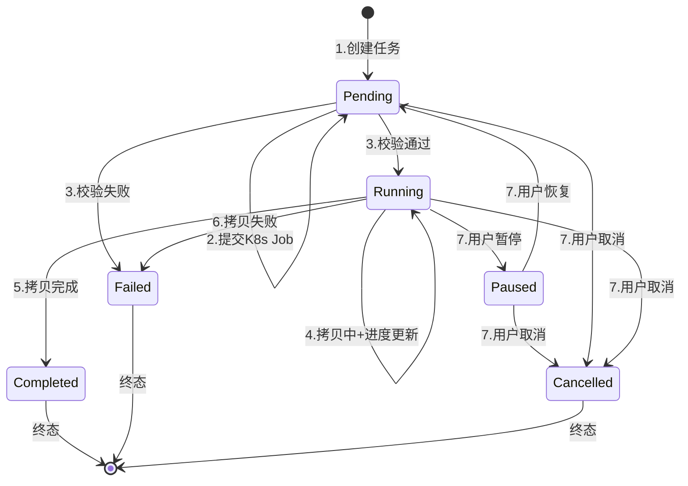

---

#### 3.9.2 七阶段详细定义

每个阶段包含：**进入条件**、**执行动作**、**退出条件**、**状态变更**、**版本状态联动**。

---

##### 阶段 1：创建阶段（Creation）

**进入条件**:
- API 接收到有效的 `POST /v2/ui/models/{modelId}/upload-tasks` 请求
- 参数校验通过：sourceType 及对应必填字段（NFS: nfsServer+nfsPath；CIFS: cifsServer+cifsShare+cifsUsername+cifsPassword；PVC: sourcePvcName+sourceInternalPath）
- 模型存在且版本容量未满（< 50 个版本）
- 该版本下无活跃上传任务（findActiveByVersionId 返回 empty）

**执行动作**:
1. 应用服务调用模型权重上下文创建空版本（status=NoWeight, isRegistered=false）
2. 生成 taskId = UUID.randomUUID()
3. 调用 `UploadTask.createUploadTask()` 工厂方法创建聚合根
4. 调用 `uploadTaskRepository.save()` 持久化到数据库（status=Pending, progress=0, version=0）
5. 返回 UploadTaskDTO 给调用方

**退出条件**:
- 数据库写入成功 → 进入阶段 2
- 数据库写入失败 → 抛出异常，事务回滚，不创建 K8s 资源

**状态变更**:
- UploadTask: — → Pending
- ModelVersion: — → NoWeight（在步骤 1 中完成，独立事务）

**事务边界**:
- UploadTask.save 与 ModelVersion.create 为**独立事务**（遵循跨聚合最终一致性原则）
- 若 ModelVersion 创建成功但 UploadTask 创建失败，由 TaskReconciler 对账时识别孤儿版本并清理

---

##### 阶段 2：提交阶段（Submission）

**进入条件**:
- 阶段 1 成功完成，UploadTask 已持久化且 status=Pending

**执行动作**:
1. 应用服务调用 `K8sJobService.createUploadJob()`:
   - 创建 ConfigMap（upload-params-{taskId}）：注入 SOURCE_TYPE、ALLOWED_SUFFIXES 等参数
   - 创建 Secret（upload-secret-{taskId}，仅 CIFS 模式）：注入 username、password
   - 创建 Job（upload-{taskId}）：挂载源/目标 volume
2. K8s API 返回 Job created
3. **不立即更新 UploadTask 状态**（保持 Pending，等待 Pod 启动后的校验结果）

**退出条件**:
- K8s Job 创建成功 → 进入阶段 3（异步等待 Pod 启动）
- K8s Job 创建失败 → 抛出 UPLOAD_TASK_JOB_SUBMIT_FAILED(0102041)，UploadTask 保持 Pending，由 TaskReconciler 对账时重建

**状态变更**:
- UploadTask: Pending（保持）
- 无版本状态变更

**关键设计决策**:
- K8s Job 创建与 UploadTask 状态更新**不在同一事务中**（K8s API 调用不可回滚）
- 若 Job 创建成功但 API 响应超时，TaskReconciler 通过 30 秒对账识别并同步状态

---

##### 阶段 3：校验阶段（Validation）

**进入条件**:
- K8s Job Pod 已启动（Informer 感知到 Job status=Running）
- 或 TaskReconciler 扫描到 Pending 任务已存在对应的 K8s Job

**执行动作**（在 K8s Job Pod 内执行 entrypoint.sh）:
1. **源路径挂载**：按 SOURCE_TYPE 挂载 NFS/CIFS/PVC 到 /source
2. **源路径可达性校验**：
   - 检查 /source/{subPath} 目录存在且非空
   - 失败时 Pod exit(1)，输出 `{"error": "source directory not found/empty"}`
3. **文件后缀白名单校验**：
   - 调用 python3 validate_suffixes.py 扫描目录内所有文件后缀
   - 失败时 Pod exit(2)，输出 `{"error": "files with disallowed suffix found"}`
4. **输出校验通过信号**：`echo '{"phase": "validated"}'`

**退出条件**:
- 校验通过 → Pod 继续执行阶段 4，TaskReconciler 感知到日志包含 `"phase": "validated"` 后调用 `uploadTask.start()` → 进入阶段 4
- 校验失败 → Pod exit(非0)，Informer 感知 Job Failed，TaskReconciler 调用 `uploadTask.fail(errorMessage)` → 进入阶段 6

**状态变更**:
- 校验通过: UploadTask Pending → Running
- 校验失败: UploadTask Pending → Failed
- 版本状态联动: NoWeight → Uploading（校验通过时） / NoWeight → UploadFailed（校验失败时）

**进度更新**:
- 校验阶段 progress 保持 0（尚未开始拷贝）

---

##### 阶段 4：执行阶段（Execution）

**进入条件**:
- UploadTask.status=Running
- K8s Job Pod 内 entrypoint.sh 已输出 `"phase": "validated"`

**执行动作**（在 K8s Job Pod 内）:
1. 执行 `rsync -av --append-verify --info=progress2 /source/ /target/`
2. `progress_reporter.py` 每 5 秒解析 rsync 输出，打印 JSON 进度到 stdout:
   ```json
   {"progress": 45}
   ```
3. Pod 日志持续输出进度

**执行动作**（在应用侧，TaskReconciler）:
1. Informer 感知 Job 仍为 Running
2. TaskReconciler 每 30 秒读取 Pod 最近日志（`getJobPodLogs(taskId, 10)`）
3. 解析日志中的最新 progress JSON
4. 调用 `uploadTask.updateProgress(percent)` 更新进度
5. 调用 `uploadTaskRepository.update()` 持久化进度（带乐观锁）

**退出条件**:
- rsync 拷贝完成 → Pod 输出 `{"progress": 100, "phase": "completed"}`，写入 `/target/.upload-complete` 标记文件，Job Complete → 进入阶段 5
- rsync 拷贝失败 → Pod exit(非0)，Job Failed → 进入阶段 6
- 用户暂停 → 进入阶段 7（暂停分支）
- 用户取消 → 进入阶段 7（取消分支）

**状态变更**:
- UploadTask: Running（保持）
- ModelVersion: Uploading（保持）

**进度单调递增约束**:
- `updateProgress()` 方法内校验：新 progress ≥ 当前 progress，忽略回退值（rsync 重算时可能出现）
- 非法值（<0 或 >100）抛出 UPLOAD_TASK_INVALID_PROGRESS(0102038)

---

##### 阶段 5：完成阶段（Completion）

**进入条件**:
- K8s Job 状态变为 Complete（Informer 感知或 TaskReconciler 对账发现）
- UploadTask.status=Running

**执行动作**:
1. TaskReconciler 调用 `uploadTask.complete()`:
   - status: Running → Completed
   - progress: 自动设为 100
   - updateTime: 更新为当前时间
2. 调用 `uploadTaskRepository.update()` 持久化（带乐观锁）
3. 调用模型权重上下文更新版本状态：Uploading → Available
4. 清理 Secret（CIFS 凭证立即删除，避免残留）
5. Job 由 `ttlSecondsAfterFinished: 86400` 在 24h 后自动清理

**退出条件**:
- 数据库更新成功 → 生命周期结束（终态：Completed）
- 数据库更新冲突（乐观锁失败）→ 记录日志，下次对账重试
- 版本状态更新失败 → 记录日志，下次对账重试（UploadTask 已终态，不影响一致性）

**状态变更**:
- UploadTask: Running → Completed
- ModelVersion: Uploading → Available

**终态约束**:
- Completed 状态的任务不允许任何状态变更操作（pause/resume/cancel/start/fail/updateProgress 均拒绝）

---

##### 阶段 6：失败处理（Failure Handling）

**进入条件**:
- 任意阶段发生不可恢复错误：
  - 阶段 3：校验失败（源路径不可达 / 文件后缀不在白名单）
  - 阶段 4：rsync 拷贝失败（网络中断 / 磁盘满 / 权限不足）
  - 阶段 2：K8s Job 提交后，Pod 启动失败（镜像拉取失败 / 资源不足）

**执行动作**:
1. Informer 感知 Job Failed，或 TaskReconciler 对账发现异常
2. TaskReconciler 读取 Pod 最近 50 行日志，解析错误信息
3. 调用 `uploadTask.fail(errorMessage)`:
   - status: 当前状态 → Failed
   - errorMessage: 填充解析后的错误信息
   - updateTime: 更新为当前时间
4. 调用 `uploadTaskRepository.update()` 持久化（带乐观锁）
5. 调用模型权重上下文更新版本状态 → UploadFailed
6. 清理 Secret（CIFS 凭证立即删除）

**退出条件**:
- 数据库更新成功 → 生命周期结束（终态：Failed）
- 数据库更新冲突 → 记录日志，下次对账重试
- 版本状态更新失败 → 记录日志，下次对账重试

**状态变更**:
- UploadTask: * → Failed（* = Pending / Running）
- ModelVersion: NoWeight / Uploading → UploadFailed

**终态约束**:
- Failed 状态的任务不允许任何状态变更操作
- 用户可删除任务记录（需先确认终态），但不可重试（自动重试机制超出范围）

---

##### 阶段 7：用户干预（User Intervention）

用户干预提供三条分支：**暂停**、**恢复**、**取消**。每条分支有独立的进入条件、执行动作和状态变更。

###### 分支 7a：暂停（Pause）

**进入条件**:
- UploadTask.status=Running
- 用户调用 `POST /.../upload-tasks/{taskId}/pause`

**执行动作**:
1. 应用服务调用 `uploadTask.pause()`:
   - status: Running → Paused
   - updateTime: 更新
2. 调用 `uploadTaskRepository.update()` 持久化
3. 调用 `K8sJobService.deleteJob(taskId)`：删除 K8s Job + Pod
4. 调用 `K8sJobService.deleteJobResources(taskId)`：删除 ConfigMap + Secret
5. **保留目标 PVC 中已拷贝的部分文件**（支持后续 rsync 续传）

**退出条件**:
- 数据库更新成功且 K8s 资源删除成功 → 进入 Paused 子状态
- K8s 资源删除失败 → 记录日志，TaskReconciler 对账时重试删除

**状态变更**:
- UploadTask: Running → Paused
- ModelVersion: Uploading（保持，不变更）

---

###### 分支 7b：恢复（Resume）

**进入条件**:
- UploadTask.status=Paused
- 用户调用 `POST /.../upload-tasks/{taskId}/resume`

**执行动作**:
1. 应用服务调用 `uploadTask.resume()`:
   - status: Paused → Pending
   - updateTime: 更新
2. 调用 `uploadTaskRepository.update()` 持久化
3. **不立即创建 K8s Job**（由 TaskReconciler 下次扫描 Pending 任务时重建）

**退出条件**:
- 数据库更新成功 → 进入 Pending 子状态，等待 TaskReconciler 重建 Job
- 下次 TaskReconciler 扫描到该 Pending 任务 → 重新创建 ConfigMap + Secret + Job
- Job 重建后 rsync `--append-verify` 自动续传已拷贝的部分文件

**状态变更**:
- UploadTask: Paused → Pending
- ModelVersion: Uploading（保持）

---

###### 分支 7c：取消（Cancel）

**进入条件**:
- UploadTask.status ≠ Completed 且 ≠ Cancelled（即：Pending / Running / Paused 均可取消）
- 用户调用 `POST /.../upload-tasks/{taskId}/cancel`

**执行动作**:
1. 应用服务调用 `uploadTask.cancel()`:
   - status: 当前状态 → Cancelled
   - updateTime: 更新
2. 调用 `uploadTaskRepository.update()` 持久化
3. 若 K8s Job 仍存在，调用 `K8sJobService.deleteJob(taskId)` 删除
4. 调用 `K8sJobService.cleanupTargetPvc(targetPath)` 清理目标 PVC 中已拷贝的部分文件
5. 调用模型权重上下文更新版本状态 → UploadFailed
6. 清理 Secret（CIFS 凭证立即删除）

**退出条件**:
- 数据库更新成功且 K8s 资源清理完成 → 生命周期结束（终态：Cancelled）
- PVC 清理失败 → 记录日志，人工介入

**状态变更**:
- UploadTask: * → Cancelled（* = Pending / Running / Paused）
- ModelVersion: * → UploadFailed

**终态约束**:
- Cancelled 状态的任务不允许任何状态变更操作
- 用户可删除任务记录（需确认终态）

---

#### 3.9.3 持久化策略

##### 立即持久化原则

所有状态变更操作遵循**写后持久化（Write-Through）**策略：领域对象状态变更后立即通过 Repository 写入数据库，不依赖缓存或批量写入。

| 操作场景 | 持久化时机 | 说明 |
|----------|-----------|------|
| 创建任务 | `save()` 在工厂方法调用后立即执行 | 保证任务记录存在后，K8s Job 才能引用 taskId |
| 状态变更 | `update()` 在聚合根方法调用后立即执行 | start/pause/resume/cancel/complete/fail 后均立即持久化 |
| 进度更新 | `update()` 在 TaskReconciler 解析到最新进度后执行 | 每 30 秒一次，降低数据库压力 |
| 终态清理 | 异步清理，不阻塞状态变更 | Secret 删除、ConfigMap 清理在状态更新后异步执行 |

##### 持久化接口

```java
// UploadTaskRepository 接口
void save(UploadTask task);           // INSERT，用于创建阶段
void update(UploadTask task);         // UPDATE，用于所有状态变更（带乐观锁）
void deleteById(UUID taskId);         // 删除任务记录，仅终态任务可调用
```

##### Mapper XML 更新语句（乐观锁）

```xml
<!-- 带版本号的乐观锁更新 -->
<update id="update" parameterType="UploadTask">
    UPDATE upload_task
    SET status = #{status.dbValue},
        progress = #{progress},
        error_message = #{errorMessage},
        version = version + 1,
        update_time = NOW()
    WHERE id = #{taskId}
      AND version = #{version}
</update>

<!-- 进度单独更新（减少锁冲突） -->
<update id="updateProgress">
    UPDATE upload_task
    SET progress = #{progress},
        version = version + 1,
        update_time = NOW()
    WHERE id = #{taskId}
      AND status = 'Running'
      AND version = #{version}
</update>
```

---

#### 3.9.4 并发控制

##### 乐观锁机制

upload_task 表增加 `version` 字段，所有状态更新通过**版本号比较**实现乐观锁。

###### DDL 变更

```sql
-- Feature 4 增强：upload_task 表增加乐观锁版本号字段
ALTER TABLE upload_task ADD COLUMN version INT NOT NULL DEFAULT 0;

COMMENT ON COLUMN upload_task.version IS '乐观锁版本号，每次更新自动+1';
```

###### 完整 DDL（含 version 字段）

```sql
CREATE TABLE upload_task (
    id                  UUID PRIMARY KEY,
    model_id            UUID NOT NULL REFERENCES model(id),
    version_id          UUID NOT NULL REFERENCES model_version(id),
    source_type         VARCHAR(20) NOT NULL,
    source_path         VARCHAR(1024) NOT NULL,
    cifs_username       VARCHAR(200) DEFAULT NULL,
    cifs_password       VARCHAR(200) DEFAULT NULL,
    target_path         VARCHAR(1024) NOT NULL,
    progress            INTEGER DEFAULT 0,
    status              VARCHAR(20) NOT NULL DEFAULT 'Pending',
    error_message       VARCHAR(2000) DEFAULT NULL,
    version             INT NOT NULL DEFAULT 0,          -- 乐观锁版本号
    create_user         VARCHAR(100) NOT NULL,
    create_time         TIMESTAMP WITH TIME ZONE NOT NULL DEFAULT NOW(),
    update_time         TIMESTAMP WITH TIME ZONE NOT NULL DEFAULT NOW()
);

COMMENT ON TABLE upload_task IS '上传任务表，跟踪权重文件从外部存储拷贝到平台 PVC 的异步过程';
COMMENT ON COLUMN upload_task.version IS '乐观锁版本号，每次更新自动+1，用于并发控制';
```

##### 冲突检测与处理

```java
// MyBatis UploadTaskRepository 实现
@Override
public void update(UploadTask task) {
    int affectedRows = uploadTaskMapper.update(task);
    if (affectedRows == 0) {
        // 乐观锁冲突：version 不匹配或记录已被删除
        throw new ModelLiteException(ErrorCode.UPLOAD_TASK_CONCURRENT_UPDATE,
            "任务状态已被其他进程更新，请刷新后重试");
    }
}
```

| 冲突场景 | 触发条件 | 处理方式 |
|----------|----------|----------|
| Informer 与 TaskReconciler 同时更新 | Informer 回调和 30s 对账扫描同时命中同一任务 | 先执行者成功，后执行者收到 affectedRows=0，记录日志后放弃 |
| 用户操作与 TaskReconciler 并发 | 用户点击暂停时，TaskReconciler 恰好正在更新进度 | 用户操作优先级更高（前端按钮置灰 + 后端乐观锁保证） |
| 双实例部署竞争 | 两个服务实例的 TaskReconciler 同时扫描同一任务 | Leader Election 保证仅一个实例执行写操作（Feature 5） |

##### 冲突处理伪代码

```java
// TaskReconciler 状态更新（带冲突处理）
public void reconcileTask(UUID taskId) {
    UploadTask task = uploadTaskRepository.findById(taskId)
        .orElseThrow(() -> new ModelLiteException(ErrorCode.UPLOAD_TASK_NOT_FOUND));
    
    try {
        // 尝试状态变更
        task.start(); // 或 complete() / fail() / updateProgress()
        uploadTaskRepository.update(task);
        
        // 同步更新版本状态（独立事务）
        modelApplicationService.updateVersionStatus(task.getVersionId(), newStatus);
        
    } catch (ModelLiteException e) {
        if (e.getErrorCode().equals(ErrorCode.UPLOAD_TASK_CONCURRENT_UPDATE)) {
            // 乐观锁冲突：记录日志，放弃本次更新，等待下次对账
            log.warn("任务 [{}] 乐观锁冲突，跳过本次对账", taskId);
            return;
        }
        throw e;
    }
}
```

---

#### 3.9.5 异常恢复机制

异常恢复遵循**最终一致性**原则：不追求每次操作 100% 成功，而是通过**定时对账 + 日志记录 + 下次重试**保证最终收敛到正确状态。

##### 恢复场景 1：服务重启

**问题**: 服务实例重启时，内存中缓存的 Informer Watch 状态丢失，可能错过重启期间发生的 K8s Job 状态变化事件。

**恢复机制**:
1. 服务启动时，TaskReconciler 执行**全量扫描**：
   ```java
   // 启动时扫描所有非终态任务
   List<UploadTask> nonTerminalTasks = uploadTaskRepository
       .findByStatusIn(List.of(TaskStatus.PENDING, TaskStatus.RUNNING, TaskStatus.PAUSED));
   
   for (UploadTask task : nonTerminalTasks) {
       reconcileTask(task.getTaskId());
   }
   ```
2. 扫描逻辑：
   - **Pending 任务**：查询 K8s Job 是否存在；若不存在则重建，若存在则同步状态
   - **Running 任务**：查询 Job 当前状态；若 Job 已 Complete/Failed 则同步终态，若 Job 仍在 Running 则更新进度
   - **Paused 任务**：仅记录日志（避免长时间暂停被遗忘）

**启动扫描频率**: 仅服务启动时执行一次，后续由定时对账接管。

---

##### 恢复场景 2：K8s 事件丢失

**问题**: Informer Watch 可能因网络闪断、K8s API Server 重启等原因丢失事件，导致 Job 已 Complete/Failed 但应用侧未感知。

**恢复机制**:
1. TaskReconciler **每 30 秒执行一次定时对账**（与 Informer Watch 形成双保险）
2. 对账逻辑：

| 扫描对象 | 条件 | 处理动作 |
|----------|------|----------|
| Pending 任务 | 存在超过 5 分钟 | 查询 K8s Job 状态：不存在则重建，存在但异常则同步失败状态 |
| Running 任务 | 始终扫描 | 读取 Pod 日志更新进度；若 Job 已终态则同步状态 |
| Paused 任务 | 存在超过 1 小时 | 打印 WARN 日志（`任务 [{}] 已暂停超过 1 小时，建议检查`） |
| 终态任务关联资源 | 任务终态超过 24h | 清理残留的 ConfigMap / Secret |

3. 对账扫描 SQL：
```sql
-- 查询所有非终态任务（用于启动扫描和定时对账）
SELECT * FROM upload_task
WHERE status IN ('Pending', 'Running', 'Paused');

-- 查询 Pending 超过 5 分钟的任务
SELECT * FROM upload_task
WHERE status = 'Pending'
  AND update_time < NOW() - INTERVAL '5 minutes';

-- 查询 Paused 超过 1 小时的任务
SELECT * FROM upload_task
WHERE status = 'Paused'
  AND update_time < NOW() - INTERVAL '1 hour';
```

---

##### 恢复场景 3：事务失败

**问题**: 跨聚合操作（UploadTask 状态更新 + ModelVersion 状态更新）不在同一事务中，可能出现 UploadTask 更新成功但 ModelVersion 更新失败的情况。

**恢复机制**:
1. **记录失败日志**：每次操作失败的详细上下文（taskId、期望状态、实际异常）写入结构化日志
2. **下次对账重试**：TaskReconciler 下次扫描到该任务时，检测到 UploadTask 状态与 ModelVersion 状态不一致，自动补偿更新
3. **幂等性保证**：所有状态更新操作均为幂等（同一状态重复更新无副作用）

```java
// 跨聚合状态同步（带失败日志记录）
public void syncVersionStatus(UUID versionId, VersionStatus expectedStatus) {
    try {
        modelApplicationService.updateVersionStatus(versionId, expectedStatus);
    } catch (Exception e) {
        // 记录结构化日志，供对账时识别
        log.error("版本状态同步失败: versionId={}, expectedStatus={}, error={}",
            versionId, expectedStatus, e.getMessage());
        // 不抛异常，不影响 UploadTask 状态更新的事务
    }
}
```

##### 恢复优先级

| 优先级 | 恢复场景 | 触发频率 | 自动/人工 |
|--------|----------|----------|-----------|
| P0 | 服务启动全量扫描 | 服务启动时 | 自动 |
| P0 | K8s 事件丢失对账 | 每 30 秒 | 自动 |
| P1 | Pending 超时重建 Job | 每 30 秒（命中条件时） | 自动 |
| P1 | 事务失败补偿 | 下次对账时 | 自动 |
| P2 | Paused 超 1 小时告警 | 每 30 秒（命中条件时） | 自动（仅日志告警） |
| P2 | PVC 清理失败 | 取消操作时 | 人工介入 |

---

#### 3.9.6 超时处理策略

> **设计决策**: K8s Job **不设置** `activeDeadlineSeconds`（即无 K8s 层面硬超时），原因如下：
> - 上传 Job 执行时间可能非常长（TB级权重拷贝），K8s层面强制超时会导致正常拷贝被中断
> - 超时监控完全由应用层面 TaskReconciler 软监控实现

##### 应用层面超时

应用层面通过 **TaskReconciler 定时扫描** 实现软监控，不强制终止任务，仅触发告警或补偿动作。

| 监控项 | 阈值 | 触发条件 | 处理动作 |
|--------|------|----------|----------|
| Pending 无 Job | 5 分钟 | status=Pending 且 K8s Job 不存在超过 5 分钟 | 自动重建 K8s Job + ConfigMap + Secret |
| Pending Job 未启动 | 10 分钟 | status=Pending 且 K8s Job 存在但 Pod 未启动超过 10 分钟 | 记录 WARN 日志，通知运维检查 K8s 资源配额/镜像拉取 |
| Running 无进度 | 1 小时 | status=Running 且 progress 未变化超过 1 小时 | 记录 WARN 日志（`任务 [{}] 1小时无进度，可能卡死`） |
| Paused 遗忘 | 1 小时 | status=Paused 超过 1 小时 | 记录 WARN 日志（`任务 [{}] 已暂停超过 1 小时`） |

**应用超时伪代码**:
```java
// TaskReconciler 定时对账中的超时检查
public void checkTimeouts(UploadTask task) {
    Instant now = Instant.now();
    
    switch (task.getStatus()) {
        case PENDING:
            // 检查 Job 是否存在
            boolean jobExists = k8sJobService.getJobStatus(task.getTaskId()) != null;
            if (!jobExists && Duration.between(task.getUpdateTime(), now).toMinutes() > 5) {
                log.warn("Pending 任务 [{}] 超过 5 分钟无 Job，自动重建", task.getTaskId());
                k8sJobService.createUploadJob(task, task.getSourcePath(), targetPvcName);
            }
            break;
            
        case RUNNING:
            // 检查进度是否停滞
            if (Duration.between(task.getUpdateTime(), now).toMinutes() > 60) {
                log.warn("Running 任务 [{}] 超过 1 小时无进度更新，可能卡死", task.getTaskId());
                // 仅告警，不强制终止（TaskReconciler 仅做软监控，不终止 Job）
            }
            break;
            
        case PAUSED:
            if (Duration.between(task.getUpdateTime(), now).toMinutes() > 60) {
                log.warn("Paused 任务 [{}] 已暂停超过 1 小时，建议检查", task.getTaskId());
            }
            break;
            
        default:
            // 终态任务不检查
    }
}
```

---

#### 3.9.7 状态历史记录策略

##### 设计决策：不引入状态历史表

**决策**: UploadTask 状态变更**不保存历史记录**，通过 `update_time` 字段推断最近变更时间。

**理由**:
- 当前业务场景不需要审计级状态历史（操作日志由 Feature 8 覆盖）
- 减少数据库表数量和写入压力
- `update_time` 已足够支撑故障排查（可结合应用日志定位具体状态变更点）

##### 推断规则

| 排查场景 | 推断方式 | 精确度 |
|----------|----------|--------|
| 任务何时进入当前状态 | `update_time` 最近一次更新时间 | 分钟级（受对账频率影响） |
| 任务在某一状态停留多久 | 当前时间 - `update_time` | 近似值 |
| 任务经历了哪些状态 | 不可直接推断 | 需结合应用日志 |

##### 补偿机制：结构化日志

虽然数据库不保存历史，但所有状态变更均记录**结构化日志**，供 ELK/Loki 查询：

```java
// 状态变更日志格式（JSON）
log.info("{}", Map.of(
    "event", "TASK_STATUS_CHANGED",
    "taskId", task.getTaskId(),
    "fromStatus", oldStatus,
    "toStatus", newStatus,
    "trigger", "INFORMER_WATCH",  // 或 USER_ACTION / RECONCILER_SCAN
    "timestamp", Instant.now()
));
```

**日志查询示例**:
```bash
# 查询某任务的所有状态变更
{app="model-lite-repository"} |= `TASK_STATUS_CHANGED` | json | taskId=`uuid-task-001`
```

##### 未来扩展点

若后续需求要求保存完整状态历史，可引入 `upload_task_history` 表（超出当前范围）：

```sql
-- 预留设计（当前不实现）
CREATE TABLE upload_task_history (
    id              UUID PRIMARY KEY,
    task_id         UUID NOT NULL REFERENCES upload_task(id),
    from_status     VARCHAR(20) NOT NULL,
    to_status       VARCHAR(20) NOT NULL,
    trigger_type    VARCHAR(50) NOT NULL,  -- INFORMER / USER / RECONCILER
    trigger_detail  VARCHAR(500),
    create_time     TIMESTAMP WITH TIME ZONE NOT NULL DEFAULT NOW()
);
```

---

#### 3.9.8 阶段定义速查表

| 阶段 | 进入条件 | 执行动作 | 退出条件 | 下一状态 | 版本状态联动 |
|------|----------|----------|----------|----------|--------------|
| 1.创建 | API请求+参数校验+版本容量未满 | 创建空版本+创建UploadTask+save() | DB写入成功 | Pending | NoWeight |
| 2.提交 | status=Pending | 创建K8s ConfigMap+Secret+Job | Job创建成功 | Pending（保持） | 无 |
| 3.校验 | Pod启动+entrypoint.sh执行 | 源路径可达性+后缀白名单校验 | 校验通过/失败 | Running/Failed | Uploading/UploadFailed |
| 4.执行 | status=Running | rsync拷贝+进度上报+定时更新 | 拷贝完成/失败/用户干预 | Completed/Failed/Paused/Cancelled | Available/UploadFailed |
| 5.完成 | Job Complete | complete()+版本状态更新+清理Secret | DB更新成功 | Completed（终态） | Available |
| 6.失败 | 任意阶段异常 | fail()+解析错误日志+版本状态更新+清理Secret | DB更新成功 | Failed（终态） | UploadFailed |
| 7a.暂停 | status=Running+用户请求 | pause()+删除Job+保留PVC文件 | DB更新+Job删除成功 | Paused | 无 |
| 7b.恢复 | status=Paused+用户请求 | resume()→Pending+等待重建Job | DB更新成功 | Pending | 无 |
| 7c.取消 | status≠Completed/Cancelled | cancel()+删除Job+清理PVC+版本状态更新 | DB更新+清理成功 | Cancelled（终态） | UploadFailed |

---

#### 3.9.9 设计约束汇总

| 约束项 | 决策 | 理由 |
|--------|------|------|
| 不引入状态历史表 | 通过 update_time + 结构化日志推断 | 减少复杂度；操作日志由 Feature 8 覆盖 |
| 不设计自动重试机制 | 失败后进入 Failed 终态，由用户重新创建任务 | 简化状态机；避免无限重试导致资源浪费 |
| 不使用分布式事务 | 跨聚合用最终一致性 + 补偿机制 | 遵循 DDD 聚合边界设计原则；K8s API 不可回滚 |
| 乐观锁而非悲观锁 | version 字段 + UPDATE WHERE version=? | 减少数据库锁竞争；适合读多写少场景 |
| 双保险状态同步 | Informer Watch + TaskReconciler 30s 对账 | 避免单点故障导致状态丢失 |
| K8s Job 无硬超时 | 不设置 activeDeadlineSeconds，超时监控由应用层面 TaskReconciler 软监控实现 | 上传 Job 执行时间可能非常长，K8s层面强制超时会导致正常拷贝被中断 |
| 暂停=删Job+恢复=重建Job | K8s Job 不原生支持暂停 | rsync --append-verify 保证续传正确性 |

---

#### 3.9.10 相关文档索引

| 参考文档 | 章节 | 内容 |
|----------|------|------|
| feature-4-weight-import-design.md | §5.1 | 上传任务完整流程（Sequence Diagram） |
| feature-4-weight-import-design.md | §5.5 | UploadTask 状态机（State Diagram） |
| feature-4-weight-import-design.md | §5.6 | 版本状态机（Feature 4 覆盖范围） |
| feature-4-weight-import-design.md | §6.6 | Informer + TaskReconciler 双保险机制 |
| ModelLite-Repository-DDD-Tech-Design.md | §3.2 | 跨聚合事务边界（最终一致性 + 补偿） |
| feature-1-infrastructure-design.md | §2.1 | upload_task 表原始 DDL |
| feature-1-infrastructure-design.md | §3.1 | TaskStatus / SourceType 枚举定义 |


---

## 4. 接口设计

### 4.1 人机接口（User API）

#### 4.1.1 创建上传任务

| 属性 | 值 |
|------|-----|
| URL | `POST /v2/ui/models/{modelId}/upload-tasks` |
| Method | POST |
| 描述 | 创建权重上传任务（便捷入口：内部自动创建空版本 + 创建 UploadTask + 提交 K8s Job） |

**Path Parameters**:

| 参数名 | 类型 | 必填 | 说明 |
|--------|------|------|------|
| modelId | UUID | Y | 模型 ID |

**Request Body — NFS 模式**:
```json
{
    "sourceType": "NFS",
    "nfsServer": "10.0.1.100",                 // NFS 服务器地址，必填
    "nfsPath": "/data/models/glm-5/v2",        // NFS 共享路径，必填
    "weightType": "safetensors",               // 权重类型，可选
    "trainingMetadata": {                      // 训练元数据，可选（透传存储）
        "trainFrame": "PyTorch",
        "trainType": "SFT",
        "trainStrategy": "LoRA",
        "trainTime": 36000,
        "finalLoss": "0.0023",
        "sourceVersion": "v1.0-base"
    }
}
```

**Request Body — CIFS 模式**:
```json
{
    "sourceType": "CIFS",
    "cifsServer": "file-server.example.com",   // CIFS 服务器地址，必填
    "cifsShare": "models",                     // CIFS 共享名，必填
    "cifsPath": "/glm-5/v2",                   // CIFS 共享内路径，必填
    "cifsUsername": "user",                    // CIFS 用户名，必填
    "cifsPassword": "pass",                    // CIFS 密码，必填
    "weightType": "safetensors",               // 权重类型，可选
    "trainingMetadata": { }                    // 可选
}
```

**Request Body — PVC 模式**:
```json
{
    "sourceType": "PVC",
    "sourcePvcName": "source-pvc",             // 源 PVC 名称，必填
    "sourceInternalPath": "/models/glm-5",     // 源 PVC 内路径，必填
    "weightType": "safetensors",               // 权重类型，可选
    "trainingMetadata": { }                    // 可选
}
```

**Response Body**（成功）:
```json
{
    "code": 0,
    "message": "success",
    "data": {
        "taskId": "uuid-task-new",
        "modelId": "uuid-model-001",
        "versionId": "uuid-version-new",
        "versionNumber": 3,
        "sourceType": "NFS",
        "sourcePath": "10.0.1.100:/data/models/glm-5/v2",
        "targetPath": "pvc-uuid-model-001-v3:/weights",
        "progress": 0,
        "status": "Pending",
        "createTime": "2026-04-27T10:00:00Z",
        "updateTime": "2026-04-27T10:00:00Z"
    },
    "timestamp": "2026-04-27T10:00:00Z",
    "requestId": "req-uuid-xxx"
}
```

**错误码**:

| 错误码 | HTTP 状态码 | 说明 |
|--------|-------------|------|
| 0102001 | 404 | 模型不存在 |
| 0102009 | 400 | 版本数量超出限制（≥50） |
| 0102036 | 409 | 该版本下已存在活跃的上传任务 |
| 0102039 | 400 | 源路径格式无效 |
| 0102040 | 400 | CIFS 模式下用户名和密码不能为空 |
| 0102041 | 500 | K8s Job 提交失败 |

**业务规则**:
- **前置条件**: 模型存在、版本容量未满（<50）、该版本下无活跃上传任务
- **内部流程**: 应用服务先创建空版本（status=NoWeight）→ 创建 UploadTask（status=Pending）→ 提交 K8s Job
- **RBAC**: 只有模型所属资源组的用户可创建上传任务
- **源 PVC 限制**: sourceType=PVC 时，源 PVC 必须与目标 PVC 在同一 Namespace

---

#### 4.1.2 查询上传任务详情

| 属性 | 值 |
|------|-----|
| URL | `GET /v2/ui/models/{modelId}/upload-tasks/{taskId}` |
| Method | GET |
| 描述 | 查询指定上传任务的详情 |

**Path Parameters**:

| 参数名 | 类型 | 必填 | 说明 |
|--------|------|------|------|
| modelId | UUID | Y | 模型 ID |
| taskId | UUID | Y | 任务 ID |

**Response Body**（成功）:
```json
{
    "code": 0,
    "message": "success",
    "data": {
        "taskId": "uuid-task-001",
        "modelId": "uuid-model-001",
        "versionId": "uuid-version-003",
        "versionNumber": 3,
        "sourceType": "NFS",
        "sourcePath": "10.0.1.100:/data/models/glm-5/v2",
        "targetPath": "pvc-uuid-model-001-v3:/weights",
        "progress": 65,
        "status": "Running",
        "errorMessage": null,
        "createUser": "user-001",
        "createTime": "2026-04-27T10:00:00Z",
        "updateTime": "2026-04-27T10:30:00Z"
    },
    "timestamp": "2026-04-27T10:30:00Z",
    "requestId": "req-uuid-xxx"
}
```

**错误码**:

| 错误码 | HTTP 状态码 | 说明 |
|--------|-------------|------|
| 0102001 | 404 | 模型不存在 |
| 0102010 | 404 | 上传任务不存在 |

---

#### 4.1.3 查询模型的上传任务列表

| 属性 | 值 |
|------|-----|
| URL | `GET /v2/ui/models/{modelId}/upload-tasks` |
| Method | GET |
| 描述 | 查询指定模型下的全部上传任务（按创建时间倒序） |

**Path Parameters**:

| 参数名 | 类型 | 必填 | 说明 |
|--------|------|------|------|
| modelId | UUID | Y | 模型 ID |

**Query Parameters**:

| 参数名 | 类型 | 必填 | 默认值 | 说明 |
|--------|------|------|--------|------|
| status | String | N | — | 按状态筛选：Pending / Running / Paused / Completed / Failed / Cancelled |

**Response Body**（成功）:
```json
{
    "code": 0,
    "message": "success",
    "data": [
        {
            "taskId": "uuid-task-001",
            "versionId": "uuid-version-003",
            "versionNumber": 3,
            "sourceType": "NFS",
            "sourcePath": "10.0.1.100:/data/models/glm-5/v2",
            "progress": 65,
            "status": "Running",
            "createUser": "user-001",
            "createTime": "2026-04-27T10:00:00Z",
            "updateTime": "2026-04-27T10:30:00Z"
        }
    ],
    "timestamp": "2026-04-27T10:30:00Z",
    "requestId": "req-uuid-xxx"
}
```

**错误码**:

| 错误码 | HTTP 状态码 | 说明 |
|--------|-------------|------|
| 0102001 | 404 | 模型不存在 |

---

#### 4.1.4 暂停上传任务

| 属性 | 值 |
|------|-----|
| URL | `POST /v2/ui/models/{modelId}/upload-tasks/{taskId}/pause` |
| Method | POST |
| 描述 | 暂停正在执行的上传任务（删除 K8s Job，保留已拷贝文件，支持后续恢复） |

**Response Body**（成功）:
```json
{
    "code": 0,
    "message": "success",
    "data": null,
    "timestamp": "2026-04-27T10:30:00Z",
    "requestId": "req-uuid-xxx"
}
```

**错误码**:

| 错误码 | HTTP 状态码 | 说明 |
|--------|-------------|------|
| 0102001 | 404 | 模型不存在 |
| 0102010 | 404 | 上传任务不存在 |
| 0102035 | 409 | 任务状态不是 Running，无法暂停 |

**业务规则**:
- **前置条件**: 任务存在且 status=Running
- **后置条件**: K8s Job 被删除，UploadTask.status=Paused，目标 PVC 中已拷贝文件保留
- **RBAC**: 只有任务创建者或模型资源组用户可操作

---

#### 4.1.5 恢复上传任务

| 属性 | 值 |
|------|-----|
| URL | `POST /v2/ui/models/{modelId}/upload-tasks/{taskId}/resume` |
| Method | POST |
| 描述 | 恢复已暂停的上传任务（重建 K8s Job，rsync 续传） |

**Response Body**（成功）:
```json
{
    "code": 0,
    "message": "success",
    "data": null,
    "timestamp": "2026-04-27T11:00:00Z",
    "requestId": "req-uuid-xxx"
}
```

**错误码**:

| 错误码 | HTTP 状态码 | 说明 |
|--------|-------------|------|
| 0102001 | 404 | 模型不存在 |
| 0102010 | 404 | 上传任务不存在 |
| 0102035 | 409 | 任务状态不是 Paused，无法恢复 |
| 0102041 | 500 | K8s Job 提交失败 |

**业务规则**:
- **前置条件**: 任务存在且 status=Paused
- **后置条件**: UploadTask.status=Pending（等待 TaskReconciler 重建 K8s Job），K8s Job 重建后 rsync --append-verify 续传

---

#### 4.1.6 取消上传任务

| 属性 | 值 |
|------|-----|
| URL | `POST /v2/ui/models/{modelId}/upload-tasks/{taskId}/cancel` |
| Method | POST |
| 描述 | 取消上传任务（删除 K8s Job，清理已拷贝的部分文件） |

**Response Body**（成功）:
```json
{
    "code": 0,
    "message": "success",
    "data": null,
    "timestamp": "2026-04-27T11:00:00Z",
    "requestId": "req-uuid-xxx"
}
```

**错误码**:

| 错误码 | HTTP 状态码 | 说明 |
|--------|-------------|------|
| 0102001 | 404 | 模型不存在 |
| 0102010 | 404 | 上传任务不存在 |
| 0102042 | 409 | 任务已终态，无法取消 |

**业务规则**:
- **前置条件**: 任务存在且非终态（非 Completed/Cancelled）
- **后置条件**: K8s Job 被删除，UploadTask.status=Cancelled，清理目标 PVC 中已拷贝的部分文件
- **版本状态**: 版本状态更新为 UploadFailed

---

#### 4.1.7 删除上传任务记录

| 属性 | 值 |
|------|-----|
| URL | `DELETE /v2/ui/models/{modelId}/upload-tasks/{taskId}` |
| Method | DELETE |
| 描述 | 删除上传任务记录 |

**Response Body**（成功）:
```json
{
    "code": 0,
    "message": "success",
    "data": null,
    "timestamp": "2026-04-27T12:00:00Z",
    "requestId": "req-uuid-xxx"
}
```

**错误码**:

| 错误码 | HTTP 状态码 | 说明 |
|--------|-------------|------|
| 0102001 | 404 | 模型不存在 |
| 0102010 | 404 | 上传任务不存在 |
| 0102035 | 409 | 任务仍在运行中，请先取消或等待完成 |

**业务规则**:
- **前置条件**: 任务存在且为终态（Completed/Failed/Cancelled）
- **后置条件**: 从数据库中删除任务记录
- **非终态任务**: 需先取消才能删除

---

### 4.2 机机接口（M2M API）

#### 4.2.1 训练权重归档

| 属性 | 值 |
|------|-----|
| URL | `POST /v2/models/{modelId}/versions/archive` |
| Method | POST |
| 描述 | 训练模块调用，将训练产出的权重归档为新版本（纳管模式，isRegistered=true） |

**Path Parameters**:

| 参数名 | 类型 | 必填 | 说明 |
|--------|------|------|------|
| modelId | UUID | Y | 模型 ID |

**Request Body — PVC 模式**:
```json
{
    "sourceType": "PVC",
    "pvcName": "training-output-pvc",           // 训练产出 PVC 名称，必填
    "internalPath": "/output/checkpoint-100",   // PVC 内路径，必填
    "weightType": "safetensors",                // 权重类型，可选
    "trainingMetadata": {                       // 训练元数据，可选（透传存储，仓库不关心语义）
        "trainFrame": "PyTorch",
        "trainType": "SFT",
        "trainStrategy": "LoRA",
        "trainTime": 36000,
        "finalLoss": "0.0023",
        "sourceVersion": "v1.0-base"
    }
}
```

**Request Body — NFS 模式**:
```json
{
    "sourceType": "NFS",
    "nfsServer": "10.0.1.100",
    "nfsPath": "/training/output/checkpoint-100",
    "weightType": "safetensors",
    "trainingMetadata": { }
}
```

**Response Body**（成功）:
```json
{
    "code": 0,
    "message": "success",
    "data": {
        "versionId": "uuid-version-new",
        "versionNumber": 3,
        "status": "Available",
        "isRegistered": true,
        "sourceType": "PVC",
        "pvcName": "training-output-pvc",
        "internalPath": "/output/checkpoint-100",
        "weightType": "safetensors",
        "trainingMetadata": {
            "trainFrame": "PyTorch",
            "trainType": "SFT",
            "trainStrategy": "LoRA",
            "trainTime": 36000,
            "finalLoss": "0.0023",
            "sourceVersion": "v1.0-base"
        },
        "createTime": "2026-04-27T14:00:00Z"
    },
    "timestamp": "2026-04-27T14:00:00Z",
    "requestId": "req-uuid-xxx"
}
```

**错误码**:

| 错误码 | HTTP 状态码 | 说明 |
|--------|-------------|------|
| 0102001 | 404 | 模型不存在 |
| 0102009 | 400 | 版本数量超出限制（≥50） |
| 0102033 | 400 | PVC 模式下 pvcName 不能为空 |
| 0102034 | 400 | NFS 模式下 nfsServer 和 nfsPath 不能为空 |

**业务规则**:
- **认证方式**: SSL 证书校验（非 Gateway 路由）
- **本质**: 与 Feature 3 的注册模式创建版本同路径（纳管）
- **训练元数据**: 仓库不关心语义，只做透传存储（全可选字段，原样持久化到 model_version 表）
- **后置条件**: 版本 status=Available（纳管成功，直接可用），isRegistered=true

---

## 5. 核心业务流程

### 5.1 上传任务完整流程

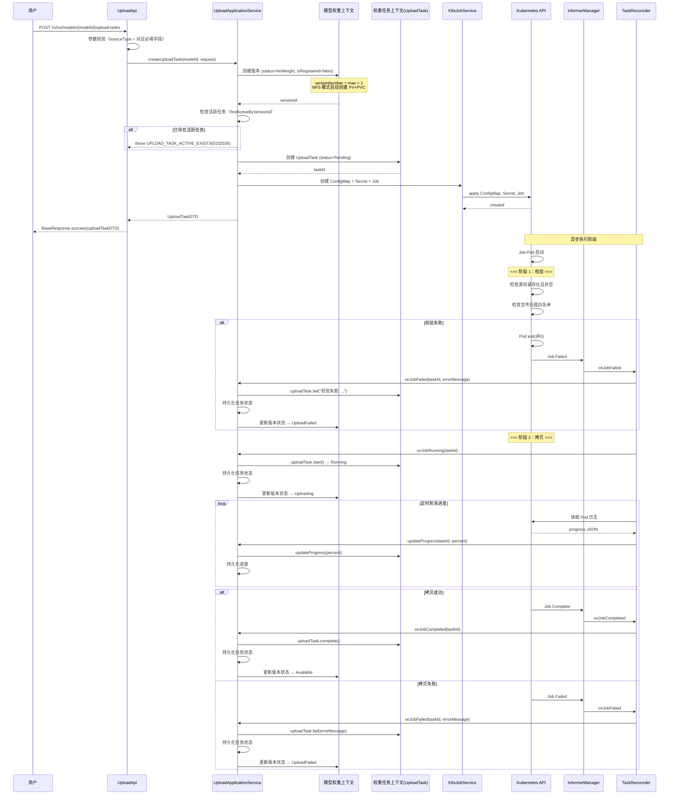

**流程说明**:
1. API 层校验参数（sourceType 及对应必填字段）
2. 应用服务先调用 MW 上下文创建空版本（status=NoWeight）
3. 检查该版本下无活跃上传任务
4. 创建 UploadTask 聚合（status=Pending）
5. 通过 K8sJobService 创建 ConfigMap（源路径参数）、Secret（CIFS 凭证）、Job
6. 返回 taskId 给用户，后续异步执行
7. K8s Job 内部两阶段：先校验（源路径可达性 + 文件后缀白名单），校验通过后 rsync 拷贝
8. Informer Watch 感知 Job 状态变化，TaskReconciler 更新 UploadTask 和 ModelVersion 状态
9. 拷贝完成后版本状态变为 Available；失败则变为 UploadFailed

### 5.2 暂停/恢复流程

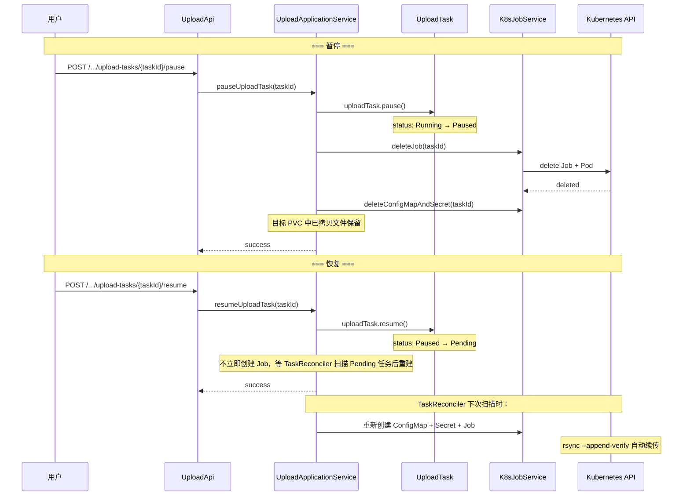

**流程说明**:
1. **暂停**: 聚合根状态 Paused → 删除 K8s Job → 保留 PVC 中已拷贝文件
2. **恢复**: 聚合根状态 Pending → 等待 TaskReconciler 扫描 → 重建 K8s Job → rsync 续传
3. rsync `--append-verify` 参数保证续传正确性

### 5.3 取消/删除流程

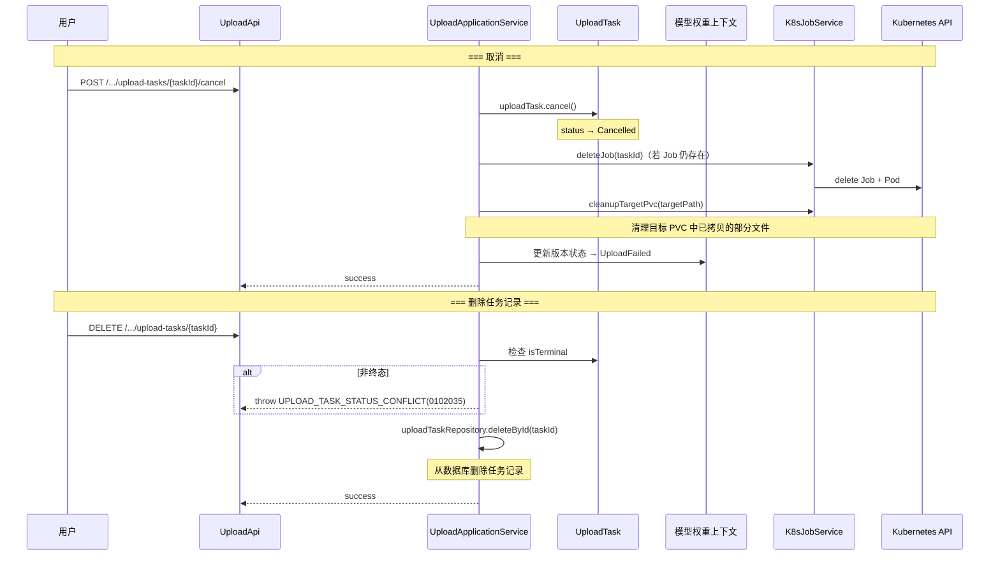

### 5.4 训练归档流程（M2M）

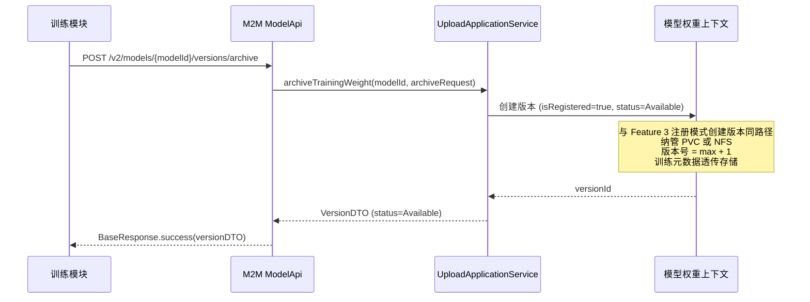

**流程说明**:
1. 训练模块调用 M2M 接口，传入源路径 + 训练元数据
2. 应用服务调用 MW 上下文创建版本（纳管模式），训练元数据透传存储
3. 版本创建后直接 status=Available（纳管不复制文件）

### 5.5 UploadTask 状态机

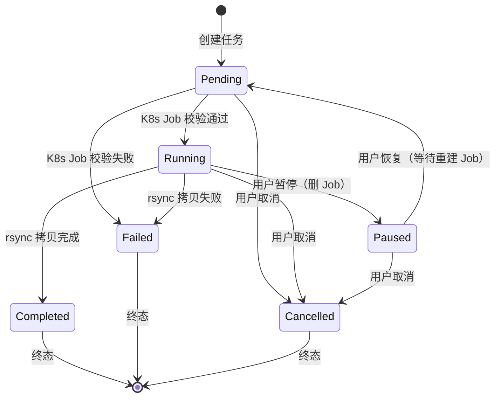

**状态转换规则**:

| 当前状态 | 触发条件 | 目标状态 | 说明 |
|----------|----------|----------|------|
| — | 创建上传任务 | Pending | 任务已创建，K8s Job 已提交 |
| Pending | K8s Job 校验通过，rsync 开始 | Running | 文件拷贝进行中 |
| Pending | K8s Job 校验失败（源路径不可达/后缀不在白名单） | Failed | 记录错误信息 |
| Pending | 用户取消 | Cancelled | 清理 K8s 资源 |
| Running | 用户暂停 | Paused | 删除 K8s Job，保留已拷贝文件 |
| Running | rsync 拷贝完成 | Completed | 进度 100% |
| Running | rsync 拷贝失败 | Failed | 记录错误信息 |
| Running | 用户取消 | Cancelled | 清理 K8s 资源 + 清理已拷贝文件 |
| Paused | 用户恢复 | Pending | 等待 TaskReconciler 重建 Job |
| Paused | 用户取消 | Cancelled | 清理已拷贝文件 |

### 5.6 版本状态机（本特性覆盖范围）

> Feature 1 已定义完整版本状态机，本特性负责以下转换：

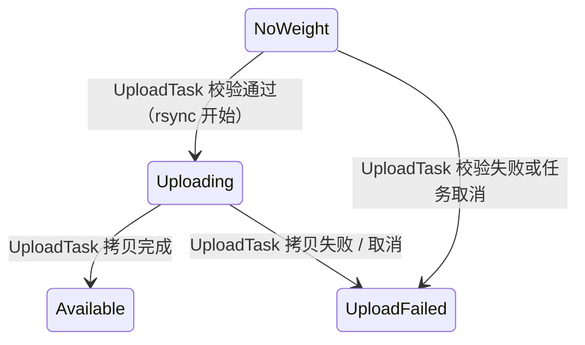

**与 Feature 3 的状态转换对比**:

| 触发场景 | 起始状态 | 目标状态 | 所属特性 |
|----------|----------|----------|----------|
| 创建模型（自动创建首版本） | — | NoWeight | Feature 3 |
| 注册模式创建版本（纳管） | — | Available | Feature 3 |
| 上传任务校验通过，rsync 开始 | NoWeight | Uploading | **Feature 4** |
| 上传任务校验失败 | NoWeight | UploadFailed | **Feature 4** |
| 上传任务拷贝完成 | Uploading | Available | **Feature 4** |
| 上传任务拷贝失败/取消 | Uploading | UploadFailed | **Feature 4** |

### 5.7 层边界与防腐层设计

> **对应计划任务**: Task 1
> **文档类型**: 增强设计文档
> **编写目的**: 明确基础设施层与权重任务子域的职责划分，定义 K8sJobService 在 domain 层的接口位置，规范跨层防腐层设计

---

#### 5.7.1 设计原则

本节遵循 DDD 分层架构的核心约束：

| 原则 | 说明 |
|------|------|
| **依赖方向** | Domain → Infrastructure（依赖倒置），Domain 层定义接口，Infrastructure 层提供实现 |
| **无泄漏** | Infrastructure 层不直接引用 Domain 层的聚合根、实体或值对象 |
| **防腐层** | 跨层边界通过 DTO 传递纯数据，Infrastructure 层负责 K8s API 对象与纯数据 DTO 之间的双向转换 |
| **单一职责** | Infrastructure 层只负责 K8s 资源的技术编排，不感知 UploadTask 状态机、版本状态等业务语义 |

---

#### 5.7.2 职责矩阵表

##### 5.7.2.1 基础设施层职责（Infrastructure Layer）

基础设施层提供通用的技术能力，**不包含任何业务逻辑**，仅负责 K8s 资源的生命周期管理：

| 能力模块 | 职责范围 | 技术实现 |
|----------|----------|----------|
| **K8s Job 编排** | Job 的创建、监控、删除、批量清理 | fabric8 Kubernetes Client |
| **Informer Watch** | 监听 K8s Job Pod 状态变化事件 | fabric8 Informer API |
| **TaskReconciler 定时对账** | 定时扫描数据库任务状态与 K8s Job 实际状态的差异，触发补偿 | Spring Scheduler + 数据库查询 |
| **Leader Election** | 多副本部署时确保仅 Leader 节点执行写操作（创建/删除 Job）和定时对账 | K8s Lease API |
| **断点续传** | 大文件上传中断后恢复的技术支持 | 在 Job Spec 中配置 resume 参数 |

**基础设施层禁止行为**（红线）：
- 禁止解析 UploadTask 状态机的业务语义（如判断 `PENDING→RUNNING` 是否合法）
- 禁止直接更新 ModelVersion 的版本状态
- 禁止包含权重校验、类型识别等 ML 领域逻辑

##### 5.7.2.2 权重任务子域职责（WeightTask Subdomain）

权重任务子域作为领域层，管理所有与权重导入相关的业务规则和状态生命周期：

| 能力模块 | 职责范围 | 领域对象 |
|----------|----------|----------|
| **UploadTask 状态机** | 定义 6 种状态（Pending/Running/Paused/Completed/Failed/Cancelled）及合法转换路径 | `UploadTask` 聚合根 |
| **状态生命周期管理** | 驱动状态转换（start/pause/resume/cancel/complete/fail）并维护进度 | `UploadTask` 聚合方法 |
| **领域规则校验** | 上传前白名单校验、纳管路径目录校验、并发任务数限制等 | `WeightValidationService` |
| **版本状态协调** | 上传/校验完成后调用模型权重子域更新版本状态（UPLOADING/AVAILABLE/UPLOAD_FAILED） | 应用服务编排 |
| **任务执行决策** | 决定何时创建/删除 K8s Job，何时触发对账 | `UploadApplicationService` |

##### 5.7.2.3 职责对比矩阵

| 职责项 | 权重任务子域（Domain） | 基础设施层（Infrastructure） |
|--------|----------------------|---------------------------|
| 任务状态转换规则 | ✅ 定义与执行 | ❌ 不感知 |
| 上传进度计算 | ✅ 聚合内维护 | ❌ 不感知 |
| 版本状态协调 | ✅ 应用服务编排 | ❌ 不感知 |
| K8s Job CRUD | ❌ 不直接操作 | ✅ 负责执行 |
| Pod 状态监听 | ❌ 不直接监听 | ✅ Informer 监听 |
| Job 资源清理 | ❌ 不直接操作 | ✅ 定时清理 + 对账 |
| Leader Election | ❌ 不感知 | ✅ 提供锁能力 |
| 断点续传参数配置 | ❌ 不直接配置 | ✅ 在 Job Spec 中注入 |
| 文件后缀白名单校验 | ✅ 领域规则 | ❌ 不感知 |
| 并发任务数限制 | ✅ 领域规则 | ❌ 不感知 |

---

#### 5.7.3 K8sJobService 接口定义

##### 5.7.3.1 修正说明

**现有文档 §6.5 将 `K8sJobService` 放在 `com.huawei.modellite.repository.modelweight.infrastructure.k8s`，这是错误的。**

根据 DDD 分层架构的依赖倒置原则：
- **Domain 层**定义接口（契约）
- **Infrastructure 层**提供实现

因此 `K8sJobService` 作为权重任务上下文对外部 K8s 能力的抽象，其接口定义应位于 **权重任务上下文的 domain 层**，而非基础设施层或模型权重上下文。

##### 5.7.3.2 接口位置

| 层级 | 包路径 | 类型 |
|------|--------|------|
| **接口** | `com.huawei.modellite.repository.weighttask.domain.service` | `K8sJobService.java`（接口） |
| **实现** | `com.huawei.modellite.repository.infrastructure.k8s` | `Fabric8K8sJobService.java`（实现类） |

##### 5.7.3.3 接口定义

```java
package com.huawei.modellite.repository.weighttask.domain.service;

/**
 * K8s Job 编排服务接口
 *
 * 定义在权重任务上下文的 domain 层，由基础设施层实现。
 * 接口参数使用纯数据 DTO（不依赖 K8s API），返回值同样为纯数据 DTO。
 * 该接口是 domain 层与基础设施层之间的防腐层契约。
 */
public interface K8sJobService {

    /**
     * 创建 K8s Job 执行上传/转换任务
     *
     * @param jobSpec 任务规格（纯数据 DTO）
     * @return 创建结果，包含 Job 名称和初始状态
     */
    JobCreateResult createJob(UploadJobSpec jobSpec);

    /**
     * 查询 Job 当前状态
     *
     * @param jobName Job 名称
     * @return Job 状态 DTO
     */
    JobStatusDTO getJobStatus(String jobName);

    /**
     * 删除 K8s Job 及其关联资源
     *
     * @param jobName Job 名称
     * @return 是否删除成功
     */
    boolean deleteJob(String jobName);

    /**
     * 批量清理已完成的 Job（Completed/Failed 状态）
     *
     * @param maxAgeHours 最大保留时长（小时）
     * @return 清理的 Job 数量
     */
    int cleanupFinishedJobs(int maxAgeHours);

    /**
     * 强制终止运行中的 Job
     *
     * @param jobName Job 名称
     * @return 是否终止成功
     */
    boolean killJob(String jobName);
}
```

##### 5.7.3.4 DTO 定义（Domain 层）

接口使用以下纯数据 DTO，定义在 domain 层或共用模块：

```java
package com.huawei.modellite.repository.weighttask.domain.dto;

/**
 * 上传任务 Job 规格
 *
 * 纯数据对象，不包含 K8s API 依赖。
 * 由 domain 层构造，传递给 infrastructure 层实现。
 */
public class UploadJobSpec {
    private String taskId;              // 业务任务 ID（作为 Job label）
    private String modelId;             // 模型 ID
    private String versionId;           // 版本 ID
    private String sourcePath;          // 源路径（NFS/CIFS/PVC）
    private String targetPath;          // 目标路径（平台 PVC）
    private SourceType sourceType;      // 源类型枚举
    private String jobImage;            // 执行镜像
    private Map<String, String> envVars; // 环境变量
    private String cpuRequest;          // CPU 请求
    private String memoryRequest;       // 内存请求
    private String storageRequest;      // 存储请求
    private boolean resumeEnabled;      // 是否启用断点续传

    // constructor, getters, setters...
}
```

```java
package com.huawei.modellite.repository.weighttask.domain.dto;

/**
 * Job 创建结果
 */
public class JobCreateResult {
    private String jobName;     // 生成的 K8s Job 名称
    private String namespace;   // 命名空间
    private JobStatusDTO initialStatus; // 初始状态

    // constructor, getters, setters...
}
```

```java
package com.huawei.modellite.repository.weighttask.domain.dto;

/**
 * Job 状态 DTO
 *
 * 将 K8s Job 状态抽象为业务可理解的纯数据状态。
 */
public class JobStatusDTO {
    private String jobName;
    private JobPhase phase;     // PENDING / RUNNING / SUCCEEDED / FAILED / UNKNOWN
    private Integer completionCount;
    private Integer failedCount;
    private String podMessage;  // Pod 终止消息（失败原因）
    private Instant startTime;
    private Instant completionTime;

    // constructor, getters, setters...
}

public enum JobPhase {
    PENDING,    // Job 已创建，Pod 尚未调度
    RUNNING,    // Pod 正在运行
    SUCCEEDED,  // Job 成功完成
    FAILED,     // Job 失败
    UNKNOWN     // 状态未知
}
```

---

#### 5.7.4 防腐层设计

##### 5.7.4.1 防腐层定位

防腐层（Anti-Corruption Layer, ACL）位于 **domain 层与 infrastructure 层之间**，由 `K8sJobService` 接口及其 DTO 构成。

其核心作用是：
1. **隔离外部模型**：防止 K8s API 的对象模型（如 `io.fabric8.kubernetes.api.model.Job`）渗透到 domain 层
2. **转换语义差异**：将 K8s 的技术状态（`Active`, `Succeeded`, `Failed`）转换为业务可理解的语义（`JobPhase`）
3. **保护领域不变量**：确保 infrastructure 层无法绕过 domain 层直接修改 UploadTask 聚合

##### 5.7.4.2 DTO 映射关系

```
┌─────────────────────────────────────────────────────────────┐
│                      Domain 层                               │
│  ┌─────────────────┐      ┌─────────────────────────────┐  │
│  │  UploadTask      │      │  K8sJobService (接口)        │  │
│  │  聚合根          │─────▶│  createJob(UploadJobSpec)    │  │
│  │  - status        │      │  getJobStatus(jobName)       │  │
│  │  - progress      │      │  deleteJob(jobName)          │  │
│  └─────────────────┘      └─────────────────────────────┘  │
│           │                          ▲                      │
│           │    防腐层边界            │                      │
│           ▼                          │                      │
│  ┌─────────────────┐      ┌─────────────────────────────┐  │
│  │ UploadJobSpec    │      │ JobStatusDTO                │  │
│  │ (纯数据 DTO)     │      │ (纯数据 DTO)                │  │
│  └─────────────────┘      └─────────────────────────────┘  │
└─────────────────────────────────────────────────────────────┘
                           │
                           │ 跨层调用（仅通过 DTO）
                           ▼
┌─────────────────────────────────────────────────────────────┐
│                   Infrastructure 层                          │
│  ┌─────────────────────────────────────────────────────┐   │
│  │  Fabric8K8sJobService (实现)                         │   │
│  │  - createJob(): UploadJobSpec → fabric8 Job API      │   │
│  │  - getJobStatus(): fabric8 Job → JobStatusDTO        │   │
│  │  - deleteJob(): 调用 fabric8 delete API              │   │
│  └─────────────────────────────────────────────────────┘   │
│                          │                                  │
│                          ▼                                  │
│  ┌─────────────────────────────────────────────────────┐   │
│  │  K8s API 对象（不跨越防腐层）                        │   │
│  │  - io.fabric8.kubernetes.api.model.Job              │   │
│  │  - io.fabric8.kubernetes.api.model.JobStatus        │   │
│  │  - Pod 状态 / Container 状态                        │   │
│  └─────────────────────────────────────────────────────┘   │
└─────────────────────────────────────────────────────────────┘
```

##### 5.7.4.3 映射规则

**UploadJobSpec → K8s Job Spec（正向映射）**：

| Domain DTO 字段 | K8s API 字段 | 说明 |
|----------------|-------------|------|
| `taskId` | `metadata.labels["task-id"]` | 作为标签用于反向查找 |
| `modelId` | `metadata.labels["model-id"]` | 元数据标签 |
| `versionId` | `metadata.labels["version-id"]` | 元数据标签 |
| `jobImage` | `spec.template.spec.containers[0].image` | 执行容器镜像 |
| `envVars` | `spec.template.spec.containers[0].env` | 环境变量列表 |
| `cpuRequest` | `spec.template.spec.containers[0].resources.requests.cpu` | CPU 资源请求 |
| `memoryRequest` | `spec.template.spec.containers[0].resources.requests.memory` | 内存资源请求 |
| `storageRequest` | `spec.template.spec.volumes[].pvc.resources.requests.storage` | PVC 存储请求 |
| `resumeEnabled` | `spec.template.spec.containers[0].env["RESUME_ENABLED"]` | 断点续传开关 |

**K8s Job Status → JobStatusDTO（反向映射）**：

| K8s API 字段 | JobStatusDTO 字段 | 转换规则 |
|-------------|------------------|----------|
| `status.active` > 0 | `phase = RUNNING` | Pod 正在运行 |
| `status.succeeded` > 0 | `phase = SUCCEEDED` | Job 成功完成 |
| `status.failed` > 0 | `phase = FAILED` | Job 失败 |
| `status.conditions[].message` | `podMessage` | 失败原因提取 |
| `status.startTime` | `startTime` | 直接透传 |
| `status.completionTime` | `completionTime` | 直接透传 |

---

#### 5.7.5 数据流图

##### 5.7.5.1 上传任务完整数据流

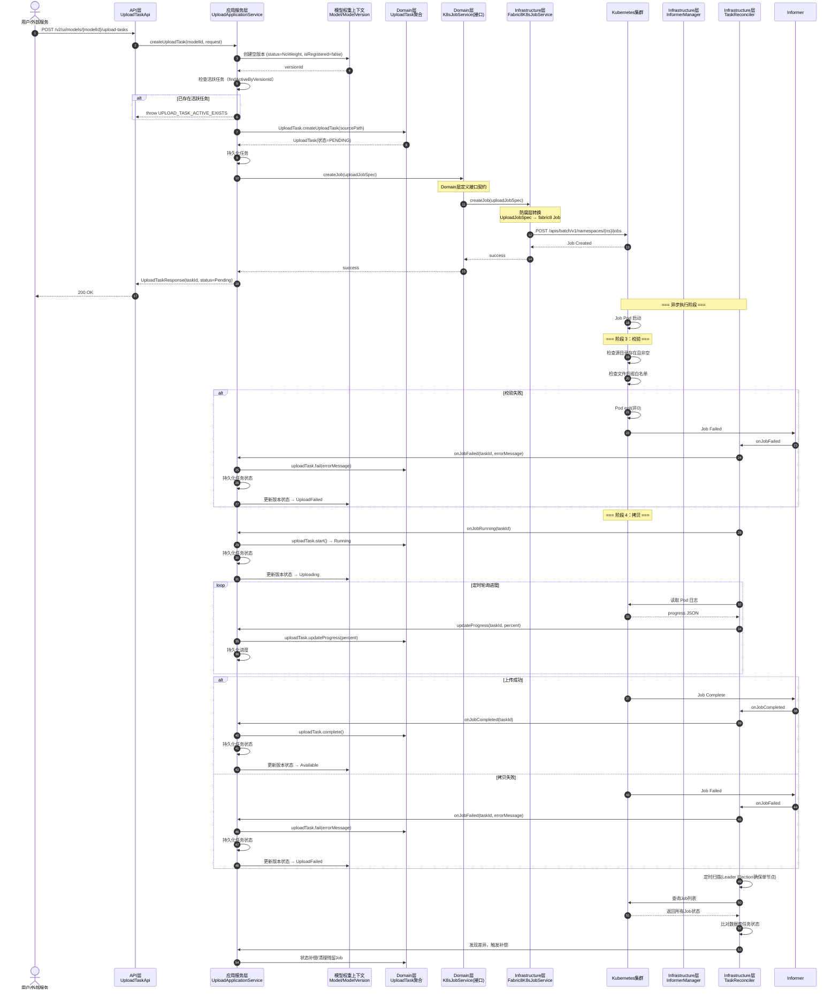

##### 5.7.5.2 数据流关键点说明

| 序号 | 阶段 | 关键点 |
|------|------|--------|
| 1-5 | 任务创建 + Job 下发 | 同一请求流内完成：创建版本 → 创建 UploadTask → 持久化 → 自动创建 K8s Job。**无独立的 `/start` 接口** |
| 6 | K8s API 调用 | 仅在 Infrastructure 层内部发生，使用 fabric8 client |
| 7-10 | 状态监听 | Informer 在 Infrastructure 层监听，通过回调将 Job 状态传递给 TaskReconciler |
| 11-13 | 状态转换 | Domain 层聚合方法负责状态守卫，TaskReconciler 负责版本状态协调 |
| 14-16 | 定时对账 | TaskReconciler 在 Infrastructure 层运行，Leader Election 确保单节点执行 |

---

#### 5.7.6 跨层调用规则

##### 5.7.6.1 调用方向规则

```
允许的调用方向:
    API 层 ──────▶ AppSvc 层
    AppSvc 层 ───▶ Domain 层（聚合、领域服务）
    AppSvc 层 ───▶ Domain 层（K8sJobService 接口）
    Domain 层 ───▶ Infrastructure 层（通过接口，依赖倒置）
    Infrastructure 层 ───▶ K8s API

禁止的调用方向:
    Domain 层 ───▶ API 层（❌ 上层不应知悉下层）
    Infrastructure 层 ───▶ Domain 层聚合根（❌ 防腐层要求）
    API 层 ───▶ Domain 层（❌ 应通过 AppSvc 编排）
    Domain 层 ───▶ K8s API 直接（❌ 应通过 K8sJobService 接口）
```

##### 5.7.6.2 包引用规则

| 层级 | 允许引用的包 | 禁止引用的包 |
|------|------------|------------|
| **API 层** | `*.application.*`, `*.common.dto.*` | `*.domain.*`, `*.infrastructure.*` |
| **AppSvc 层** | `*.domain.*`, `*.common.dto.*` | `*.infrastructure.*`（除接口外） |
| **Domain 层** | `*.common.*`（仅 util/dto） | `*.infrastructure.*`, `io.fabric8.*` |
| **Infrastructure 层** | `*.domain.dto.*`（仅 DTO）, `io.fabric8.*` | `*.domain.aggregate.*`, `*.domain.service.*`（除接口实现外） |

##### 5.7.6.3 具体约束清单

1. **Domain 层绝不依赖 fabric8**：
   - `weighttask.domain` 包中不出现 `io.fabric8` 的 import
   - 所有 K8s 相关操作通过 `K8sJobService` 接口抽象

2. **Infrastructure 层绝不引用聚合根**：
   - `infrastructure.k8s` 包中不出现 `UploadTask` 的 import
   - 仅通过 `UploadJobSpec`、`JobStatusDTO` 等纯数据 DTO 交互

3. **接口参数使用 primitive 或值对象**：
   - `K8sJobService` 接口方法接受 `String taskId` 而非 `UploadTask` 对象
   - 返回 `JobStatusDTO` 而非 `io.fabric8.kubernetes.api.model.Job`

4. **Leader Election 仅用于 Infrastructure 层写操作**：
   - Leader Election 锁由 Infrastructure 层管理
   - Domain/AppSvc 层不感知 Leader Election 的存在
   - 仅 Leader 节点执行：创建 Job、删除 Job、TaskReconciler 对账

5. **Informer 回调通过应用服务层转发**：
   - Informer 在 Infrastructure 层收到事件后，调用 AppSvc 层方法
   - AppSvc 层再调用 Domain 层聚合方法更新状态
   - Informer 不直接修改 Domain 聚合

---

#### 5.7.7 与现有文档的衔接

##### 5.7.7.1 修正记录

| 现有文档 | 原错误描述 | 修正后 |
|----------|-----------|--------|
| §6.5 | `K8sJobService` 放在 `modelweight.infrastructure.k8s` | 接口移至 `weighttask.domain.service`，实现放在 `infrastructure.k8s` |

##### 5.7.7.2 关联章节

| 关联文档 | 章节 | 关联内容 |
|----------|------|----------|
| 限界上下文设计 | §3.2 | UploadTask 聚合定义 |
| 限界上下文设计 | §4.3.1 | 权重上传流程 |
| 子域建模 | §3.2 | 权重任务子域职责 |
| 子域建模 | §3.4 | 基础设施层职责 |
| 技术设计 | §4.1 | 包结构规范 |
| 本特性文档 | §3.8 | UploadTask 状态机实现 |
| 本特性文档 | §5.5 | 任务生命周期管理 |

---

#### 5.7.8 决策记录

| 决策编号 | 决策内容 | 决策理由 |
|----------|----------|----------|
| LB-01 | `K8sJobService` 接口定义在 `weighttask.domain.service` | 依赖倒置原则：Domain 层定义契约，Infrastructure 层提供实现；该接口服务权重任务上下文 |
| LB-02 | 实现类放在 `infrastructure.k8s` | 基础设施层负责所有 K8s API 调用，与业务上下文解耦 |
| LB-03 | 接口参数使用纯数据 DTO（`UploadJobSpec`） | 防腐层要求：防止 K8s API 对象模型渗透到 domain 层 |
| LB-04 | 返回 `JobStatusDTO` 而非 K8s Job 对象 | 反向隔离：将 K8s 技术状态转换为业务语义 |
| LB-05 | Infrastructure 层不引用 `UploadTask` 聚合 | 防腐层完整性：infrastructure 层不感知领域聚合结构 |
| LB-06 | 状态转换由 Domain 聚合方法守卫 | 业务不变量保护：只有 Domain 层了解状态机合法转换 |
| LB-07 | Leader Election 限制在 Infrastructure 层 | 职责隔离：Leader Election 是技术问题，不应泄漏到业务层 |

---

**文档结束**


---

## 6. K8s Job 集成设计


> **文档类型**: 详细设计文档（Feature 4 增强版）
> **对应计划任务**: Task 4
> **目标读者**: 后端开发工程师
> **范围**: K8sJobService 接口、Informer、TaskReconciler、错误处理、资源清理、边界情况

---

### 6.5 K8sJobService 完整接口设计

#### 6.5.1 接口定位与分层

**Domain 层接口定义**:

```java
// 包路径: com.huawei.modellite.repository.weighttask.domain.service
public interface K8sJobService {
    // ... 7 个方法定义见下表
}
```

**Infrastructure 层实现**:

```java
// 包路径: com.huawei.modellite.repository.infrastructure.k8s
@Component
public class Fabric8K8sJobService implements K8sJobService {
    // ... 基于 fabric8 kubernetes-client 实现
}
```

**分层原则**:
- Domain 层定义接口，保持领域纯净，不依赖 K8s SDK
- Infrastructure 层提供实现，封装所有 K8s API 调用细节
- Domain 层通过依赖注入使用接口，符合依赖倒置原则（DIP）

#### 6.5.2 UploadJobSpec DTO 定义

**设计原则**: 纯数据传输对象，无领域依赖，作为 K8sJobService 接口的输入参数。

**包路径**: `com.huawei.modellite.repository.weighttask.domain.dto`

```java
@Data
@Builder
@NoArgsConstructor
@AllArgsConstructor
public class UploadJobSpec {

    // ===== 任务标识 =====
    /** 任务 ID，用于生成 Job/ConfigMap/Secret 名称 */
    private String taskId;

    /** 模型 ID，注入 Job Label */
    private String modelId;

    /** 版本 ID，注入 Job Label */
    private String versionId;

    // ===== 源路径信息 =====
    /** 源类型: NFS / CIFS / PVC */
    private String sourceType;

    /** 源路径（格式因 sourceType 而异）
     * - NFS: "nfsServer:nfsPath"
     * - CIFS: "//server/share"
     * - PVC: "pvcName:internalPath"
     */
    private String sourcePath;

    // ===== 目标路径信息 =====
    /** 目标 PVC 名称 */
    private String targetPvcName;

    /** 目标 PVC 内子路径（可选，默认空字符串） */
    private String targetSubPath;

    // ===== CIFS 专用凭证（仅 sourceType=CIFS 时必填） =====
    /** CIFS 用户名 */
    private String cifsUsername;

    /** CIFS 密码 */
    private String cifsPassword;

    // ===== 镜像与运行时配置 =====
    /** file-copier 镜像地址（含 tag） */
    private String image;

    /** 任务所属 Namespace */
    private String namespace;

    // ===== 校验配置 =====
    /** 允许的文件后缀列表，逗号分隔（如 ".safetensors,.bin,.pt"） */
    private String allowedSuffixes;

    /** 构建方法 */
    public static UploadJobSpec ofNfs(String taskId, String modelId, String versionId,
                                       String nfsServer, String nfsPath,
                                       String targetPvcName, String image, String namespace) {
        return UploadJobSpec.builder()
                .taskId(taskId)
                .modelId(modelId)
                .versionId(versionId)
                .sourceType("NFS")
                .sourcePath(nfsServer + ":" + nfsPath)
                .targetPvcName(targetPvcName)
                .image(image)
                .namespace(namespace)
                .build();
    }

    public static UploadJobSpec ofCifs(String taskId, String modelId, String versionId,
                                        String server, String share, String subPath,
                                        String username, String password,
                                        String targetPvcName, String image, String namespace) {
        return UploadJobSpec.builder()
                .taskId(taskId)
                .modelId(modelId)
                .versionId(versionId)
                .sourceType("CIFS")
                .sourcePath("//" + server + "/" + share)
                .cifsUsername(username)
                .cifsPassword(password)
                .targetPvcName(targetPvcName)
                .image(image)
                .namespace(namespace)
                .build();
    }

    public static UploadJobSpec ofPvc(String taskId, String modelId, String versionId,
                                       String sourcePvcName, String sourceInternalPath,
                                       String targetPvcName, String image, String namespace) {
        return UploadJobSpec.builder()
                .taskId(taskId)
                .modelId(modelId)
                .versionId(versionId)
                .sourceType("PVC")
                .sourcePath(sourcePvcName + ":" + sourceInternalPath)
                .targetPvcName(targetPvcName)
                .image(image)
                .namespace(namespace)
                .build();
    }
}
```

**字段约束说明**:

| 字段 | 类型 | 必填 | 说明 |
|------|------|------|------|
| taskId | String | Y | UUID 字符串，Job 命名前缀 |
| modelId | String | Y | UUID 字符串，Label 注入 |
| versionId | String | Y | UUID 字符串，Label 注入 |
| sourceType | String | Y | 枚举值: `NFS` / `CIFS` / `PVC` |
| sourcePath | String | Y | 源路径字符串，格式见上文 |
| targetPvcName | String | Y | 目标 PVC 名称（已在版本创建时生成） |
| targetSubPath | String | N | 目标子路径，默认 `""` |
| cifsUsername | String | 条件 | sourceType=CIFS 时必填 |
| cifsPassword | String | 条件 | sourceType=CIFS 时必填 |
| image | String | Y | file-copier 完整镜像地址 |
| namespace | String | Y | K8s Namespace，默认 `default` |
| allowedSuffixes | String | Y | 文件后缀白名单，从 ConfigMap 读取 |

#### 6.5.3 K8sJobService 完整方法列表

| # | 方法名 | 签名 | 返回类型 | 幂等性 | 说明 |
|---|--------|------|----------|--------|------|
| 1 | **createUploadJob** | `void createUploadJob(UploadJobSpec spec)` | void | ✅ 幂等：先调用 `jobExists()` 检查，存在则直接返回 | 创建 ConfigMap → Secret（CIFS 模式）→ Job；任一资源已存在时跳过创建 |
| 2 | **deleteJob** | `void deleteJob(String taskId)` | void | ✅ 幂等：Job 不存在则静默返回 | 删除 Job（级联删除 Pod）；不删除 ConfigMap/Secret |
| 3 | **deleteJobResources** | `void deleteJobResources(String taskId)` | void | ✅ 幂等：资源不存在则静默返回 | 删除 ConfigMap + Secret；用于任务终态后清理 |
| 4 | **getJobStatus** | `JobStatus getJobStatus(String taskId)` | JobStatus | ✅ 安全读：Job 不存在返回 `NOT_FOUND` | 查询 Job 当前状态（Pending/Running/Complete/Failed/NotFound） |
| 5 | **getJobPodLogs** | `String getJobPodLogs(String taskId, int tailLines)` | String | ✅ 安全读：Pod 不存在返回空字符串 | 获取 Job 关联 Pod 的最近 N 行日志 |
| 6 | **jobExists** | `boolean jobExists(String taskId)` | boolean | ✅ 安全读 | 检查 Job 资源是否存在；幂等性的基础依赖方法 |
| 7 | **getJobPodName** | `String getJobPodName(String taskId)` | String（nullable） | ✅ 安全读 | 获取 Job 当前关联的 Pod 名称；用于日志读取和调试 |

**JobStatus 枚举定义**:

```java
public enum JobStatus {
    PENDING,      // Job 已创建，Pod 尚未调度或启动
    RUNNING,      // Pod 正在运行（校验中或拷贝中）
    COMPLETE,     // Job 成功完成（exit 0）
    FAILED,       // Job 失败（exit 非 0）
    NOT_FOUND     // Job 资源不存在
}
```

#### 6.5.4 方法详细设计

##### 6.5.4.1 createUploadJob

**前置条件**:
1. `spec` 非空且必填字段已校验
2. `spec.taskId` 符合 K8s 资源命名规范（小写字母、数字、连字符）

**执行流程**:

```
Step 1: 调用 jobExists(taskId)
        ├─ true → 记录日志"Job已存在，跳过创建" → 直接返回（幂等）
        └─ false → 继续

Step 2: 构建并创建 ConfigMap（upload-params-{taskId}）
        ├─ 已存在 → 跳过，记录 warn 日志
        └─ 创建成功 → 继续

Step 3: 若 sourceType=CIFS，构建并创建 Secret（upload-secret-{taskId}）
        ├─ 已存在 → 跳过，记录 warn 日志
        └─ 创建成功 → 继续
        （NFS/PVC 模式跳过此步）

Step 4: 构建并创建 Job（upload-{taskId}）
        ├─ 创建失败 → 抛出 ModelLiteException(0102041, "K8s Job提交失败")
        └─ 创建成功 → 返回
```

**异常处理**:
- K8s API 连接失败 → 按 6.9 节错误分类处理
- 资源创建超时 → 重试 3 次（指数退避），仍失败则抛异常
- 命名冲突（409 Conflict）→ 视为已存在，幂等处理

##### 6.5.4.2 deleteJob

**前置条件**: `taskId` 非空

**执行流程**:

```
Step 1: 查询 Job（upload-{taskId}）
        ├─ 不存在 → 记录日志"Job不存在，无需删除" → 直接返回（幂等）
        └─ 存在 → 继续

Step 2: 调用 K8s API 删除 Job（设置 propagationPolicy=Foreground 级联删除 Pod）
        ├─ 删除成功 → 记录 info 日志
        └─ 删除失败 → 按 6.9 节错误分类处理
```

**幂等性保证**: 删除操作天然幂等，K8s 对不存在的资源返回 404，方法内捕获并静默处理。

##### 6.5.4.3 deleteJobResources

**清理范围**: ConfigMap + Secret（CIFS 模式）

**执行流程**:

```
Step 1: 删除 ConfigMap（upload-params-{taskId}）
        ├─ 不存在 → 记录 warn 日志，继续
        └─ 删除成功 → 记录 info 日志

Step 2: 删除 Secret（upload-secret-{taskId}）
        ├─ 不存在 → 记录 warn 日志，继续
        └─ 删除成功 → 记录 info 日志

Step 3: 返回（任一失败不抛异常，记录 error 日志后继续）
```

**设计理由**: 任务终态后，ConfigMap 和 Secret 已完成使命，应清理以释放资源。该方法在 TaskReconciler 终态扫描时调用。

##### 6.5.4.4 getJobStatus

**状态映射规则**:

| K8s Job 条件 | 映射结果 | 说明 |
|--------------|----------|------|
| 资源不存在 | `NOT_FOUND` | 查询返回 404 |
| `status.active > 0` | `RUNNING` | 有活跃 Pod |
| `status.succeeded > 0` | `COMPLETE` | 成功完成 |
| `status.failed > 0` | `FAILED` | 失败 |
| 仅 `status.conditions[type=Suspended]` | `PENDING` | 已创建但尚未调度 |

**执行流程**:

```
Step 1: 查询 Job（upload-{taskId}）
        ├─ 404 → 返回 NOT_FOUND
        └─ 成功 → 解析 status 字段

Step 2: 按优先级判断状态
        1. succeeded > 0 → COMPLETE
        2. failed > 0 → FAILED
        3. active > 0 → RUNNING
        4. 其他 → PENDING

Step 3: 返回 JobStatus
```

##### 6.5.4.5 getJobPodLogs

**执行流程**:

```
Step 1: 获取 Job 关联的 Pod 名称（getJobPodName）
        ├─ null → 返回空字符串
        └─ 有值 → 继续

Step 2: 调用 K8s API 读取 Pod 日志（tailLines 限制）
        ├─ Pod 不存在 → 返回空字符串
        ├─ Pod 尚未启动 → 返回空字符串
        └─ 成功 → 返回日志内容

Step 3: 异常时返回空字符串（不抛异常，避免中断对账流程）
```

**日志解析**: 返回的原始日志字符串由调用方（TaskReconciler）解析，提取 `{"progress": N}` 或 `{"phase": "validated"}` 等 JSON 片段。

##### 6.5.4.6 jobExists

**执行流程**:

```
Step 1: 查询 Job（upload-{taskId}）
        ├─ 200 → 返回 true
        ├─ 404 → 返回 false
        └─ 其他错误 → 按 6.9 节处理，最终返回 false（保守策略）
```

**用途**: 作为 `createUploadJob` 幂等性的基础；也用于 TaskReconciler 判断是否需要重建 Job。

##### 6.5.4.7 getJobPodName

**执行流程**:

```
Step 1: 查询 Job 的 selector 标签
Step 2: 按标签查询 Pod 列表
Step 3: 返回第一个 Pod 的 name（Job 的 Pod 通常只有一个）
Step 4: 无 Pod → 返回 null
```

#### 6.5.5 Job 生命周期管理流程

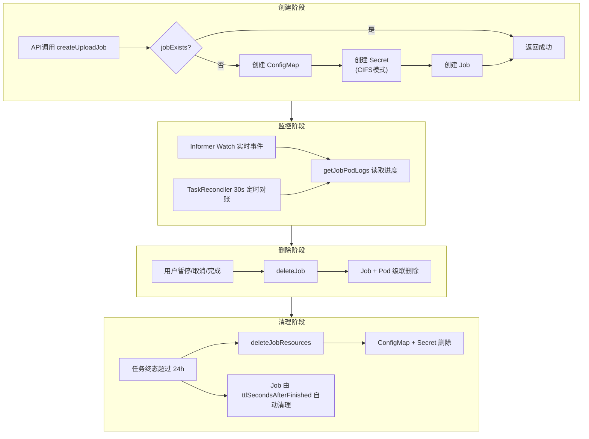

---

### 6.6 Informer 详细设计

#### 6.6.1 整体架构

Informer 作为 K8s Job 状态变化的实时感知通道，与 TaskReconciler 定时对账构成"双保险"机制。

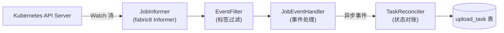

#### 6.6.2 Informer 配置

```java
@Component
public class JobInformerManager {

    private static final String WATCH_LABEL_KEY = "app";
    private static final String WATCH_LABEL_VALUE = "modellite-file-copier";
    private static final long RESYNC_PERIOD_MS = 5 * 60 * 1000L;  // 5 分钟

    @PostConstruct
    public void start() {
        SharedIndexInformer<Job> informer = kubernetesClient.batch()
                .v1()
                .jobs()
                .inNamespace(namespace)
                .withLabel(WATCH_LABEL_KEY, WATCH_LABEL_VALUE)
                .inform(new JobEventHandler(), RESYNC_PERIOD_MS);

        // 注册到 InformerFactory 便于生命周期管理
        informerFactory.addInformer(informer);
    }
}
```

**关键配置说明**:

| 配置项 | 值 | 说明 |
|--------|-----|------|
| Watch Label Key | `app` | 固定标签键 |
| Watch Label Value | `modellite-file-copier` | 固定标签值，所有 Upload Job 必须携带 |
| Resync Period | 5 分钟（300,000 ms） | 定期全量同步，修复可能丢失的事件 |
| Namespace Scope | 应用配置指定 | 限定单一 Namespace，避免跨 NS 权限问题 |

#### 6.6.3 事件过滤机制

Informer Watch 的 Label Selector 为 `app=modellite-file-copier`，该过滤在 K8s API Server 侧完成，仅将匹配 Job 的事件推送到客户端。

**二次过滤（客户端）**:

```java
public class JobEventHandler implements ResourceEventHandler<Job> {

    @Override
    public void onAdd(Job job) {
        // 新增过滤：仅处理带有 modellite/upload-task-id 标签的 Job
        String taskId = job.getMetadata().getLabels().get("modellite/upload-task-id");
        if (taskId == null || taskId.isBlank()) {
            return; // 忽略无任务标签的 Job（防御性编程）
        }
        // 新创建 Job 通常状态为 Pending，暂不触发业务逻辑
        // 等待 Pod 启动后通过 onUpdate 处理
        log.debug("Job added: taskId={}, name={}", taskId, job.getMetadata().getName());
    }

    @Override
    public void onUpdate(Job oldJob, Job newJob) {
        String taskId = newJob.getMetadata().getLabels().get("modellite/upload-task-id");
        if (taskId == null) return;

        JobStatus oldStatus = extractStatus(oldJob);
        JobStatus newStatus = extractStatus(newJob);

        // 仅处理状态发生变化的情况
        if (oldStatus == newStatus) {
            return;
        }

        log.info("Job status changed: taskId={}, {} → {}", taskId, oldStatus, newStatus);

        // 提交到异步处理队列（避免阻塞 Informer 回调线程）
        eventExecutor.submit(() -> taskReconciler.handleJobEvent(taskId, newStatus));
    }

    @Override
    public void onDelete(Job job, boolean deletedFinalStateUnknown) {
        String taskId = job.getMetadata().getLabels().get("modellite/upload-task-id");
        if (taskId == null) return;

        log.warn("Job deleted unexpectedly: taskId={}, deletedFinalStateUnknown={}",
                taskId, deletedFinalStateUnknown);

        // Job 被意外删除（非业务触发），提交对账处理
        eventExecutor.submit(() -> taskReconciler.handleJobEvent(taskId, JobStatus.NOT_FOUND));
    }
}
```

**过滤规则总结**:

| 过滤层级 | 过滤条件 | 执行位置 | 目的 |
|----------|----------|----------|------|
| 一级 | `app=modellite-file-copier` | K8s API Server | 减少网络传输，仅关注 Upload Job |
| 二级 | `modellite/upload-task-id` 标签存在 | 客户端 onAdd/onUpdate/onDelete | 防御性过滤，确保事件可关联到业务任务 |
| 三级 | 状态实际发生变化 | 客户端 onUpdate | 避免无意义的状态重复处理 |

#### 6.6.4 Resync 机制

**Resync 周期**: 5 分钟

**Resync 行为**:
- fabric8 Informer 在 Resync 周期到达时，会重新 List 所有匹配的 Job 资源
- 对每个资源触发 `onUpdate(old, new)` 回调
- 由于三级过滤（状态变化检测），状态未变的 Job 不会触发业务处理

**Resync 的作用**:
1. **修复丢失事件**: 如果网络闪断导致某个 Watch 事件丢失，Resync 可重新同步当前状态
2. **防御状态漂移**: 确保 Informer 本地缓存与 K8s 实际状态一致
3. **兜底机制**: 作为 TaskReconciler 30 秒对账的补充，提供更长周期的状态校验

#### 6.6.5 错误处理与容错

##### 6.6.5.1 Watch 连接断开

```
场景: K8s API Server 重启或网络分区导致 Watch 连接断开
处理:
  1. fabric8 Informer 自动重连（指数退避，最大间隔 30s）
  2. 重连成功后，自动触发 List + Watch 恢复
  3. 重连期间丢失的事件由 Resync（5min）和 TaskReconciler（30s）兜底
  4. 记录 warn 日志: "Watch connection lost, reconnecting..."
```

##### 6.6.5.2 Informer 回调阻塞

```
场景: onUpdate 中执行耗时操作阻塞 Informer 回调线程
处理:
  1. 所有回调仅做轻量级事件封装，立即提交到 eventExecutor 线程池
  2. 线程池配置: core=4, max=16, queue=1000, rejection=CallerRunsPolicy
  3. 队列满时主线程执行，保证不丢事件（可能短暂阻塞 Watch，可接受）
  4. 线程池满时记录 error 日志并告警
```

##### 6.6.5.3 事件乱序

```
场景: 网络延迟导致事件到达顺序与发生顺序不一致
处理:
  1. 业务层（TaskReconciler）以数据库状态为权威，不依赖事件顺序
  2. 每个事件处理前重新查询 Job 当前状态（getJobStatus）
  3. 基于最新状态执行对账逻辑，忽略事件携带的"旧状态"
  4. 乐观锁（数据库 version 字段）防止并发状态覆盖
```

---

### 6.7 TaskReconciler 详细算法

#### 6.7.1 整体架构

TaskReconciler 是后台定时任务，负责 UploadTask 状态与 K8s Job 状态的对账，以及资源清理。

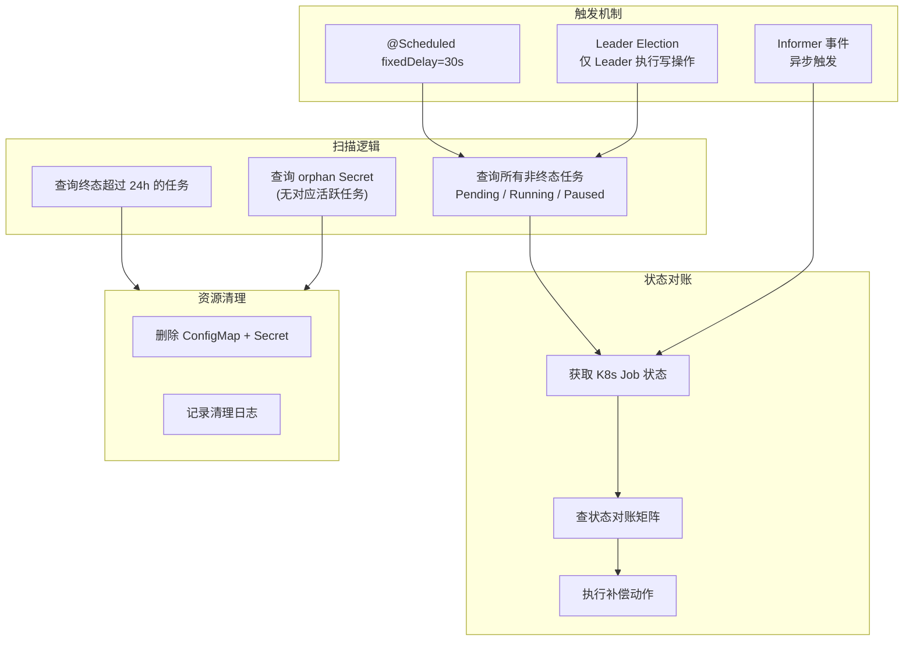

#### 6.7.2 执行触发机制

```java
@Component
public class TaskReconciler {

    private static final long RECONCILE_INTERVAL_MS = 30_000L;  // 30 秒
    private static final long PENDING_TIMEOUT_MS = 5 * 60 * 1000L;  // 5 分钟
    private static final long PAUSED_WARN_MS = 60 * 60 * 1000L;  // 1 小时
    private static final long TERMINAL_CLEANUP_MS = 24 * 60 * 60 * 1000L;  // 24 小时

    @Scheduled(fixedDelay = RECONCILE_INTERVAL_MS)
    public void reconcile() {
        // Leader Election: 仅 Leader 执行写操作
        if (!leaderElection.isLeader()) {
            log.debug("当前节点非 Leader，跳过 TaskReconciler");
            return;
        }

        try {
            reconcileNonTerminalTasks();
            reconcileTerminalTasks();
            cleanupOrphanSecrets();
        } catch (Exception e) {
            log.error("TaskReconciler 执行异常", e);
            // 异常不中断定时任务，下次继续执行
        }
    }
}
```

#### 6.7.3 扫描逻辑

##### 6.7.3.1 非终态任务扫描

```java
private void reconcileNonTerminalTasks() {
    // 查询所有非终态任务: Pending / Running / Paused
    List<UploadTask> nonTerminalTasks = uploadTaskRepository
            .findByStatusIn(List.of(TaskStatus.PENDING, TaskStatus.RUNNING, TaskStatus.PAUSED));

    for (UploadTask task : nonTerminalTasks) {
        try {
            reconcileSingleTask(task);
        } catch (Exception e) {
            log.error("对账单个任务失败: taskId={}", task.getTaskId(), e);
            // 单个任务失败不影响其他任务
        }
    }
}
```

##### 6.7.3.2 终态任务扫描（资源清理）

```java
private void reconcileTerminalTasks() {
    // 查询终态超过 24 小时的任务
    List<UploadTask> terminalTasks = uploadTaskRepository
            .findTerminalTasksOlderThan(TERMINAL_CLEANUP_MS);

    for (UploadTask task : terminalTasks) {
        try {
            // 清理 ConfigMap + Secret
            k8sJobService.deleteJobResources(task.getTaskId());
            log.info("已清理终态任务资源: taskId={}, status={}",
                    task.getTaskId(), task.getStatus());
        } catch (Exception e) {
            log.error("清理终态任务资源失败: taskId={}", task.getTaskId(), e);
        }
    }
}
```

##### 6.7.3.3 Orphan Secret 扫描

```java
private void cleanupOrphanSecrets() {
    // 获取所有带有 modellite/upload-task-id 标签的 Secret
    List<Secret> secrets = kubernetesClient.secrets()
            .inNamespace(namespace)
            .withLabel("modellite/upload-task-id")
            .list()
            .getItems();

    for (Secret secret : secrets) {
        String taskId = secret.getMetadata().getLabels().get("modellite/upload-task-id");
        // 检查对应任务是否存在且为活跃状态
        Optional<UploadTask> taskOpt = uploadTaskRepository.findById(UUID.fromString(taskId));

        if (taskOpt.isEmpty() || taskOpt.get().isTerminal()) {
            // 任务不存在或已终态 → Secret 为 orphan，安全删除
            try {
                kubernetesClient.secrets()
                        .inNamespace(namespace)
                        .withName(secret.getMetadata().getName())
                        .delete();
                log.info("清理 orphan Secret: taskId={}, secretName={}",
                        taskId, secret.getMetadata().getName());
            } catch (Exception e) {
                log.error("清理 orphan Secret 失败: taskId={}", taskId, e);
            }
        }
    }
}
```

#### 6.7.4 状态对账矩阵（9 种组合）

**核心方法**:

```java
private void reconcileSingleTask(UploadTask task) {
    JobStatus jobStatus = k8sJobService.getJobStatus(task.getTaskId().toString());

    switch (task.getStatus()) {
        case PENDING:
            reconcilePendingTask(task, jobStatus);
            break;
        case RUNNING:
            reconcileRunningTask(task, jobStatus);
            break;
        case PAUSED:
            reconcilePausedTask(task, jobStatus);
            break;
        default:
            log.warn("未知任务状态: taskId={}, status={}", task.getTaskId(), task.getStatus());
    }
}
```

#### 完整状态对账矩阵

| UploadTask 状态 | K8s Job 状态 | 处理动作 | 说明 |
|-----------------|--------------|----------|------|
| **Pending** | 不存在 | **重建 Job** | 调用 `createUploadJob` 重新创建；若连续重建失败 3 次，标记任务失败 |
| **Pending** | Running | `uploadTask.start()` → Running | Job 已启动且 Pod 运行中，任务进入 Running 状态 |
| **Pending** | Complete | **解析日志判断** → complete() 或 fail() | Job 在 Pending 期间快速完成（极少见）；读取日志判断成功/失败原因 |
| **Pending** | Failed | **读取日志** → `uploadTask.fail(message)` | 校验失败或启动失败；更新版本状态 → UploadFailed |
| **Running** | 不存在 | `uploadTask.fail("Job 异常终止")` | Job 被意外删除或 Pod 被驱逐；更新版本状态 → UploadFailed |
| **Running** | Running | **读取日志更新进度** | 正常执行中；解析 Pod 日志中的 progress JSON 更新进度 |
| **Running** | Complete | `uploadTask.complete()` → 版本 Available | 拷贝成功完成；更新版本状态 → Available |
| **Running** | Failed | **读取日志** → `uploadTask.fail(message)` | 拷贝失败；更新版本状态 → UploadFailed |
| **Paused** | 存在 | **删除 Job（补偿）** | 暂停后 Job 应被删除；若仍存在则补偿删除 |
| **Paused** | 不存在 | **正常，等待恢复** | 符合预期，不做任何操作 |

##### 6.7.4.1 Pending 任务对账

```java
private void reconcilePendingTask(UploadTask task, JobStatus jobStatus) {
    String taskId = task.getTaskId().toString();

    switch (jobStatus) {
        case NOT_FOUND:
            // 重建 Job
            log.warn("Pending 任务对应的 Job 不存在，重建: taskId={}", taskId);
            UploadJobSpec spec = rebuildSpec(task);  // 从任务数据重建 Spec
            try {
                k8sJobService.createUploadJob(spec);
            } catch (Exception e) {
                log.error("重建 Job 失败: taskId={}", taskId, e);
                // 连续失败计数器 +1，超过阈值则标记失败
                if (incrementRebuildFailure(taskId) >= 3) {
                    task.fail("Job 重建失败超过 3 次: " + e.getMessage());
                    uploadTaskRepository.update(task);
                    updateVersionStatus(task.getVersionId(), VersionStatus.UPLOAD_FAILED);
                }
            }
            break;

        case RUNNING:
            log.info("Pending 任务 Job 已运行: taskId={}", taskId);
            task.start();
            uploadTaskRepository.update(task);
            updateVersionStatus(task.getVersionId(), VersionStatus.UPLOADING);
            break;

        case COMPLETE:
            log.info("Pending 任务 Job 已完成: taskId={}", taskId);
            String logs = k8sJobService.getJobPodLogs(taskId, 50);
            if (logs.contains("completed")) {
                task.complete();
                uploadTaskRepository.update(task);
                updateVersionStatus(task.getVersionId(), VersionStatus.AVAILABLE);
            } else {
                task.fail("Job 完成但无完成标记，日志: " + logs);
                uploadTaskRepository.update(task);
                updateVersionStatus(task.getVersionId(), VersionStatus.UPLOAD_FAILED);
            }
            break;

        case FAILED:
            log.warn("Pending 任务 Job 失败: taskId={}", taskId);
            String errorLogs = k8sJobService.getJobPodLogs(taskId, 50);
            String errorMessage = parseErrorFromLogs(errorLogs);
            task.fail(errorMessage);
            uploadTaskRepository.update(task);
            updateVersionStatus(task.getVersionId(), VersionStatus.UPLOAD_FAILED);
            break;

        case PENDING:
            // Job 已创建但 Pod 尚未启动，检查是否超时
            if (isPendingTimeout(task)) {
                log.error("Pending 任务超时（5分钟）: taskId={}", taskId);
                task.fail("Job 启动超时（5分钟），Pod 未能正常调度");
                uploadTaskRepository.update(task);
                k8sJobService.deleteJob(taskId);  // 清理失败的 Job
                updateVersionStatus(task.getVersionId(), VersionStatus.UPLOAD_FAILED);
            }
            break;
    }
}
```

##### 6.7.4.2 Running 任务对账

```java
private void reconcileRunningTask(UploadTask task, JobStatus jobStatus) {
    String taskId = task.getTaskId().toString();

    switch (jobStatus) {
        case NOT_FOUND:
            log.error("Running 任务对应的 Job 不存在: taskId={}", taskId);
            task.fail("Job 异常终止（可能被手动删除或 Pod 被驱逐）");
            uploadTaskRepository.update(task);
            updateVersionStatus(task.getVersionId(), VersionStatus.UPLOAD_FAILED);
            break;

        case RUNNING:
            // 正常执行中，读取日志更新进度
            String logs = k8sJobService.getJobPodLogs(taskId, 10);
            Integer progress = parseProgressFromLogs(logs);
            if (progress != null && progress > task.getProgress()) {
                task.updateProgress(progress);
                uploadTaskRepository.update(task);
                log.debug("更新进度: taskId={}, progress={}%", taskId, progress);
            }

            // 检查无进度告警
            if (isNoProgressWarning(task)) {
                log.warn("任务长时间无进度: taskId={}, lastProgress={}, lastUpdate={}",
                        taskId, task.getProgress(), task.getUpdateTime());
                // 仅记录告警日志，不自动失败（见 6.11 边界情况 2）
            }
            break;

        case COMPLETE:
            log.info("Running 任务完成: taskId={}", taskId);
            task.complete();
            uploadTaskRepository.update(task);
            updateVersionStatus(task.getVersionId(), VersionStatus.AVAILABLE);
            // 立即清理 Secret（凭证安全）
            k8sJobService.deleteJobResources(taskId);
            break;

        case FAILED:
            log.warn("Running 任务失败: taskId={}", taskId);
            String errorLogs = k8sJobService.getJobPodLogs(taskId, 50);
            String errorMessage = parseErrorFromLogs(errorLogs);
            task.fail(errorMessage);
            uploadTaskRepository.update(task);
            updateVersionStatus(task.getVersionId(), VersionStatus.UPLOAD_FAILED);
            break;

        case PENDING:
            // Running 任务对应的 Job 为 Pending（Pod 被重建）
            log.warn("Running 任务 Job 变为 Pending（Pod 重建）: taskId={}", taskId);
            // 等待 Pod 重新启动，不做状态变更
            break;
    }
}
```

##### 6.7.4.3 Paused 任务对账

```java
private void reconcilePausedTask(UploadTask task, JobStatus jobStatus) {
    String taskId = task.getTaskId().toString();

    switch (jobStatus) {
        case NOT_FOUND:
            // 符合预期，暂停后 Job 已被删除
            // 检查是否暂停超过 1 小时，打印告警
            if (isPausedTooLong(task)) {
                log.warn("任务已暂停超过 1 小时: taskId={}", taskId);
            }
            break;

        case RUNNING:
        case PENDING:
        case COMPLETE:
        case FAILED:
            // 暂停后 Job 仍存在（异常），补偿删除
            log.warn("Paused 任务对应的 Job 仍存在，补偿删除: taskId={}, jobStatus={}",
                    taskId, jobStatus);
            k8sJobService.deleteJob(taskId);
            k8sJobService.deleteJobResources(taskId);
            break;
    }
}
```

#### 6.7.5 Leader Election 设计

```java
@Component
public class K8sLeaderElection implements LeaderElection {

    private final AtomicBoolean isLeader = new AtomicBoolean(false);

    @PostConstruct
    public void init() {
        // 使用 fabric8 的 LeaderElection 机制
        kubernetesClient.leaderElector()
                .withConfig(new LeaderElectionConfigBuilder()
                        .withName("modellite-task-reconciler")
                        .withLeaseDuration(Duration.ofSeconds(15))
                        .withRenewDeadline(Duration.ofSeconds(10))
                        .withRetryPeriod(Duration.ofSeconds(2))
                        .withLock(new ConfigMapLock(namespace, "task-reconciler-leader"))
                        .build())
                .withOnNewLeader(leader -> {
                    boolean me = leader.equals(podName);
                    isLeader.set(me);
                    log.info("Leader 变更: current={}, isMe={}", leader, me);
                })
                .build()
                .start();
    }

    @Override
    public boolean isLeader() {
        return isLeader.get();
    }
}
```

**Leader Election 参数**:

| 参数 | 值 | 说明 |
|------|-----|------|
| Lease Duration | 15s | 租约有效期 |
| Renew Deadline | 10s | 续约截止时间 |
| Retry Period | 2s | 重试间隔 |
| Lock 资源 | ConfigMap | `task-reconciler-leader` |

**作用**:
- 多副本部署时仅一个 Pod 执行 TaskReconciler 写操作
- 避免并发对账导致状态竞争
- 读操作（查询任务列表等）不受 Leader Election 限制

#### 6.7.6 乐观锁防并发

```java
// UploadTask 聚合根增加 version 字段（乐观锁）
public class UploadTask {
    // ... 其他字段
    private Long version;  // 乐观锁版本号
}

// Repository update 使用乐观锁
<update id="update" parameterType="UploadTask">
    UPDATE upload_task
    SET status = #{status},
        progress = #{progress},
        error_message = #{errorMessage},
        update_time = NOW(),
        version = version + 1
    WHERE id = #{taskId}
      AND version = #{version}
</update>
```

**乐观锁作用**:
- 防止 TaskReconciler 与用户操作（取消/暂停）并发修改任务状态
- `update` 返回影响行数为 0 时，表示并发冲突，当前操作放弃并记录日志
- 下次对账周期重新读取最新状态再处理

---

### 6.8 资源清理策略（补充章节）

#### 6.8.1 清理责任矩阵

| 资源类型 | 清理触发时机 | 清理执行方 | 清理方式 | 备注 |
|----------|-------------|------------|----------|------|
| **Job + Pod** | 任务完成 24h 后 | K8s 自动 | `ttlSecondsAfterFinished: 86400` | Job spec 中配置，无需应用干预 |
| **Job + Pod** | 用户暂停/取消时 | K8sJobService.deleteJob | API 调用级联删除 | 立即执行 |
| **ConfigMap** | 任务终态超过 24h | TaskReconciler | `deleteJobResources` | 避免过早清理导致日志读取失败 |
| **Secret（CIFS 凭证）** | 任务终态时 | TaskReconciler / Informer 回调 | `deleteJobResources` | **立即清理**，凭证安全优先 |
| **目标 PVC 中部分文件** | 任务取消时 | UploadApplicationService | 调用 PVC 清理接口 | 删除已拷贝的部分文件 |
| **目标 PVC 中部分文件** | 任务失败时 | 不自动清理 | — | 保留现场便于排查 |
| **目标 PVC（整体）** | 版本删除时 | Feature 6 版本删除流程 | — | 超出本特性范围 |

#### 6.8.2 清理时序图

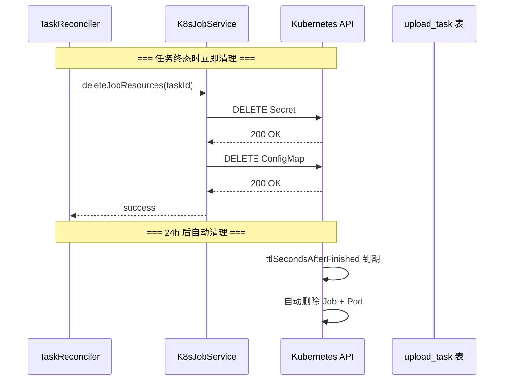

#### 6.8.3 清理失败处理

```java
// deleteJobResources 内部实现
public void deleteJobResources(String taskId) {
    String configMapName = "upload-params-" + taskId;
    String secretName = "upload-secret-" + taskId;

    // 删除 ConfigMap（失败不中断）
    try {
        kubernetesClient.configMaps()
                .inNamespace(namespace)
                .withName(configMapName)
                .delete();
    } catch (Exception e) {
        log.error("删除 ConfigMap 失败: name={}", configMapName, e);
        // 继续执行，不中断
    }

    // 删除 Secret（失败不中断）
    try {
        kubernetesClient.secrets()
                .inNamespace(namespace)
                .withName(secretName)
                .delete();
    } catch (Exception e) {
        log.error("删除 Secret 失败: name={}", secretName, e);
        // 继续执行
    }
}
```

**设计理由**: 资源清理是"尽力而为"操作，失败不抛异常。Orphan Secret 扫描（6.7.3.3）作为兜底机制，定期清理残留资源。

---

### 6.9 错误分类和处理策略

#### 6.9.1 K8s API 错误分类

| 错误码 | 错误类型 | 触发场景 | 处理策略 | 重试策略 |
|--------|----------|----------|----------|----------|
| **Timeout** | 连接/读取超时 | K8s API Server 响应慢、网络拥塞 | 指数退避重试 | **重试 3 次**，间隔: 1s → 2s → 4s |
| **404 Not Found** | 资源不存在 | Job/ConfigMap/Secret 已被删除 | 按"已删除"处理，静默返回 | **不重试** |
| **409 Conflict** | 资源已存在 | 同名 Job/ConfigMap 已创建 | 视为幂等，按已存在处理 | **不重试** |
| **403 Forbidden** | 权限不足 | ServiceAccount 无操作权限 | 记录错误日志，告警通知运维 | **不重试** |
| **500 Internal Server Error** | K8s 内部错误 | API Server 内部异常、etcd 问题 | 记录错误日志，等待 K8s 恢复 | **重试 3 次**，间隔: 2s → 4s → 8s |
| **503 Service Unavailable** | 服务不可用 | API Server 过载或重启中 | 记录错误日志，等待恢复 | **重试 3 次**，间隔: 2s → 4s → 8s |

#### 6.9.2 错误处理统一封装

```java
@Component
public class K8sApiErrorHandler {

    private static final int MAX_RETRIES = 3;
    private static final long INITIAL_BACKOFF_MS = 1000L;

    public <T> T executeWithRetry(String operation, Supplier<T> action) {
        int attempt = 0;
        long backoff = INITIAL_BACKOFF_MS;

        while (true) {
            try {
                return action.get();
            } catch (KubernetesClientException e) {
                int code = e.getCode();

                // 404: 资源不存在 → 按已删除处理
                if (code == 404) {
                    log.warn("{}: 资源不存在 (404)，按已删除处理", operation);
                    return null;  // 调用方需处理 null（如返回 NOT_FOUND / false）
                }

                // 409: 资源冲突 → 幂等处理
                if (code == 409) {
                    log.warn("{}: 资源已存在 (409)，幂等跳过", operation);
                    return null;  // 调用方按已存在处理
                }

                // 403: 权限不足 → 不重试，直接告警
                if (code == 403) {
                    log.error("{}: 权限不足 (403)，请检查 RBAC 配置", operation, e);
                    throw new ModelLiteException("0102041", "K8s 权限不足: " + operation);
                }

                // 超时/500/503 → 重试
                if (isRetryable(code)) {
                    attempt++;
                    if (attempt >= MAX_RETRIES) {
                        log.error("{}: 重试 {} 次后仍失败 (code={})", operation, MAX_RETRIES, code, e);
                        throw new ModelLiteException("0102041",
                                "K8s 操作失败（已重试 " + MAX_RETRIES + " 次）: " + operation);
                    }
                    log.warn("{}: 第 {} 次失败 (code={})，{}ms 后重试",
                            operation, attempt, code, backoff);
                    sleep(backoff);
                    backoff *= 2;  // 指数退避
                    continue;
                }

                // 其他错误 → 直接抛异常
                log.error("{}: 未预期的 K8s 错误 (code={})", operation, code, e);
                throw new ModelLiteException("0102041", "K8s 操作失败: " + operation);
            }
        }
    }

    private boolean isRetryable(int code) {
        return code == 0      // 连接超时（code=0 表示无 HTTP 响应）
                || code == 408  // Request Timeout
                || code == 500  // Internal Server Error
                || code == 502  // Bad Gateway
                || code == 503  // Service Unavailable
                || code == 504; // Gateway Timeout
    }

    private void sleep(long ms) {
        try {
            Thread.sleep(ms);
        } catch (InterruptedException e) {
            Thread.currentThread().interrupt();
            throw new ModelLiteException("0102041", "重试被中断");
        }
    }
}
```

#### 6.9.3 各方法的错误处理对照

| K8sJobService 方法 | 404 处理 | 409 处理 | 超时/500 处理 |
|-------------------|----------|----------|---------------|
| createUploadJob | 不可能出现（先查后建） | 幂等：跳过创建 | 重试 3 次后抛异常 |
| deleteJob | 幂等：静默返回 | 不可能出现 | 重试 3 次后抛异常 |
| deleteJobResources | 幂等：静默返回 | 不可能出现 | 记录日志，不抛异常 |
| getJobStatus | 返回 NOT_FOUND | 不可能出现 | 重试 3 次后返回 NOT_FOUND（保守） |
| getJobPodLogs | 返回空字符串 | 不可能出现 | 重试 3 次后返回空字符串 |
| jobExists | 返回 false | 不可能出现 | 重试 3 次后返回 false（保守） |
| getJobPodName | 返回 null | 不可能出现 | 重试 3 次后返回 null |

#### 6.9.4 告警策略

| 告警场景 | 告警级别 | 通知方式 | 处理建议 |
|----------|----------|----------|----------|
| K8s API 500/503 连续失败 > 10 次 | **Critical** | 邮件 + 短信 | 检查 K8s 集群状态 |
| K8s API 403 权限不足 | **Critical** | 邮件 + 短信 | 检查 ServiceAccount RBAC |
| Job 重建失败 > 3 次 | **Warning** | 邮件 | 检查镜像可用性、资源配额 |
| Pending 任务超时 > 5 分钟 | **Warning** | 邮件 | 检查节点资源、调度器状态 |
| Orphan Secret 数量 > 10 | **Info** | 日志 | 检查 TaskReconciler 是否正常执行 |

---

### 6.10 性能与资源考虑（补充章节）

#### 6.10.1 并发控制

| 控制点 | 策略 | 说明 |
|--------|------|------|
| TaskReconciler 执行 | Leader Election 单点执行 | 避免多副本并发对账 |
| Informer 事件处理 | 线程池异步处理（max=16） | 避免阻塞 Watch 连接 |
| K8s API 调用 | 连接池复用（fabric8 默认） | 减少 TCP 连接开销 |
| 数据库查询 | 单次对账全量查询非终态任务 | 数据量小（活跃任务通常 < 100），全量查询可接受 |

#### 6.10.2 资源估算

| 资源 | 估算值 | 说明 |
|------|--------|------|
| Informer 内存占用 | ~10MB | 缓存 Namespace 内所有匹配 Job 的元数据 |
| TaskReconciler 单次执行时间 | < 5s | 典型场景下（活跃任务 < 50） |
| K8s API QPS | < 10/s | 30s 对账周期 + Informer Watch（长连接，低 QPS） |
| 数据库 QPS | < 5/s | 每次对账一次批量查询 + 逐任务更新 |

---

### 6.11 关键边界情况处理

#### 6.11.1 边界 1: Job 创建但 Pod never starts

**场景描述**:
- K8s Job 创建成功，但 Pod 因资源不足、镜像拉取失败、节点污点等原因一直无法启动
- UploadTask 状态保持 Pending，Job 状态也保持 Pending

**检测机制**:
- TaskReconciler 扫描 Pending 任务时检查创建时间
- Pending 超过 5 分钟（`PENDING_TIMEOUT_MS`）视为超时

**处理策略**:

```java
if (isPendingTimeout(task)) {
    log.error("Pending 任务超时（5分钟）: taskId={}", taskId);
    task.fail("Job 启动超时（5分钟），Pod 未能正常调度，请检查集群资源");
    uploadTaskRepository.update(task);
    k8sJobService.deleteJob(taskId);  // 清理失败的 Job
    updateVersionStatus(task.getVersionId(), VersionStatus.UPLOAD_FAILED);
}
```

**用户反馈**: 用户查看任务详情时，errorMessage 显示超时原因，可尝试重新创建任务。

#### 6.11.2 边界 2: Pod 启动但无进度输出

**场景描述**:
- Pod 正常启动且正在拷贝，但 rsync 输出格式异常或进度解析失败
- UploadTask 状态为 Running，但 progress 长时间不更新

**检测机制**:
- TaskReconciler 记录每次进度更新的时间戳
- 超过 30 分钟无进度更新触发告警

**处理策略**:

```java
if (isNoProgressWarning(task)) {
    log.warn("任务长时间无进度更新: taskId={}, currentProgress={}%, "
            + "lastProgressUpdate={}min ago",
            taskId, task.getProgress(), minutesSinceLastUpdate);
    // 仅记录告警日志，不自动标记失败
    // 原因: 大文件拷贝可能长时间无输出（rsync 计算校验和阶段）
    // 用户可手动取消任务后重新创建
}
```

**人工介入**: 告警通知运维人员，可手动查看 Pod 日志确认实际状态。若确认卡死，用户可取消任务后重新创建。

#### 6.11.3 边界 3: Informer 丢失 Job 完成事件

**场景描述**:
- 网络闪断或 Informer 重启导致 Job Complete/Failed 事件丢失
- UploadTask 状态未能及时更新

**兜底机制**:

| 兜底层级 | 机制 | 周期 | 覆盖范围 |
|----------|------|------|----------|
| 第一层 | Informer Resync | 5 分钟 | 全量 Job 状态重新同步 |
| 第二层 | TaskReconciler 定时对账 | 30 秒 | 所有非终态任务重新查询 Job 状态 |
| 第三层 | K8s Job ttlSecondsAfterFinished | 24 小时 | Job 自动清理，避免资源泄漏 |

**处理策略**:
- TaskReconciler 每次扫描都调用 `getJobStatus()` 查询最新状态
- 即使丢失事件，30 秒内下一次对账会纠正状态
- 用户查询 API 时也会触发实时状态查询（非写操作，无需 Leader）

#### 6.11.4 边界 4: 用户取消与 TaskReconciler 竞态

**场景描述**:
- 用户点击"取消"的同时，TaskReconciler 正在执行对账
- 两者同时读取 UploadTask（status=Running），同时尝试更新状态

**处理策略**:

```java
// 用户取消流程
public void cancelUploadTask(UUID taskId) {
    UploadTask task = uploadTaskRepository.findById(taskId)
            .orElseThrow(() -> new ModelLiteException("0102010", "任务不存在"));

    task.cancel();  // 领域校验：非终态才能取消

    // 乐观锁更新
    int updated = uploadTaskRepository.updateWithVersion(task);
    if (updated == 0) {
        // 版本号不匹配 → 并发修改
        log.warn("取消任务时乐观锁冲突: taskId={}", taskId);
        throw new ModelLiteException("0102035", "任务状态已被修改，请刷新后重试");
    }

    // 删除 K8s Job
    k8sJobService.deleteJob(taskId.toString());
    // 清理 PVC 文件...
}
```

**TaskReconciler 侧**:
- 同样使用乐观锁更新数据库
- 更新失败时记录 warn 日志，放弃当前操作
- 下次对账周期重新读取最新状态处理

#### 6.11.5 边界 5: 同一版本多个非终态任务

**场景描述**:
- 应用层 BUG 或并发绕过校验，导致同一 versionId 下出现多个 Pending/Running/Paused 任务
- 违反"同版本唯一活跃任务"业务不变量

**检测机制**:
- TaskReconciler 扫描时按 versionId 分组统计非终态任务数

**处理策略**:

```java
// 在 reconcileNonTerminalTasks 中增加异常检测
Map<UUID, List<UploadTask>> tasksByVersion = nonTerminalTasks.stream()
        .collect(Collectors.groupingBy(UploadTask::getVersionId));

for (Map.Entry<UUID, List<UploadTask>> entry : tasksByVersion.entrySet()) {
    if (entry.getValue().size() > 1) {
        UUID versionId = entry.getKey();
        List<String> taskIds = entry.getValue().stream()
                .map(t -> t.getTaskId().toString())
                .collect(Collectors.toList());

        log.error("同一版本存在多个非终态任务: versionId={}, taskIds={}",
                versionId, taskIds);

        // 保留最新创建的任务，其他任务标记失败
        entry.getValue().stream()
                .sorted(Comparator.comparing(UploadTask::getCreateTime).reversed())
                .skip(1)
                .forEach(duplicateTask -> {
                    duplicateTask.fail("检测到重复活跃任务，已自动清理");
                    uploadTaskRepository.update(duplicateTask);
                    k8sJobService.deleteJob(duplicateTask.getTaskId().toString());
                    log.warn("已清理重复任务: taskId={}", duplicateTask.getTaskId());
                });
    }
}
```

**告警**: 记录 error 日志并触发告警，通知开发人员排查应用层 BUG。

#### 6.11.6 边界 6: 应用崩溃后 Secret 泄漏

**场景描述**:
- 应用在任务完成但尚未清理 Secret 时崩溃
- 重启后 TaskReconciler 需识别并清理这些"孤儿 Secret"

**检测机制**:
- TaskReconciler 每次执行时扫描所有带 `modellite/upload-task-id` 标签的 Secret
- 检查对应任务是否存在且为活跃状态

**处理策略**:

```java
// 见 6.7.3.3 cleanupOrphanSecrets
// 逻辑: Secret 存在但对应任务不存在或已终态 → 安全删除
```

**启动时清理**:

```java
@PostConstruct
public void cleanupOnStartup() {
    // 应用启动时执行一次 orphan 资源清理
    if (leaderElection.isLeader()) {
        log.info("应用启动，执行 orphan 资源清理");
        cleanupOrphanSecrets();
        cleanupOrphanConfigMaps();
    }
}
```

#### 6.11.7 边界 7: rsync 100% 但文件损坏

**场景描述**:
- rsync 进程 exit 0，报告 100% 完成
- 但实际文件损坏（源文件在拷贝过程中被修改、网络静默丢包等）
- rsync 的 `--append-verify` 在续传场景下可能无法检测所有损坏

**当前策略**:
- **当前特性（Feature 4）**: 仅依赖 rsync 退出码（exit 0 = 成功）
- rsync 本身使用校验和确保拷贝一致性，在单线程顺序拷贝场景下可靠性较高
- 不引入额外校验逻辑，避免增加复杂度

**Feature 7 覆盖**:
- Feature 7（权重完整性校验）将提供文件级 SHA256 校验
- 上传完成后，Feature 7 的校验任务会扫描目标目录，计算文件哈希值
- 若发现文件损坏，标记版本状态为 ValidationFailed

**日志记录**:
- rsync 详细日志通过 `getJobPodLogs` 保存，便于事后审计
- 若用户报告文件异常，可通过日志回溯具体原因

---

### 6.12 接口与实现类汇总

#### 6.12.1 Domain 层接口

| 类/接口 | 包路径 | 说明 |
|---------|--------|------|
| `K8sJobService` | `com.huawei.modellite.repository.weighttask.domain.service` | Domain 层接口定义 |
| `UploadJobSpec` | `com.huawei.modellite.repository.weighttask.domain.dto` | Job 创建参数 DTO |
| `JobStatus` | `com.huawei.modellite.repository.weighttask.domain.dto` | Job 状态枚举 |

#### 6.12.2 Infrastructure 层实现

| 类 | 包路径 | 说明 |
|----|--------|------|
| `Fabric8K8sJobService` | `com.huawei.modellite.repository.infrastructure.k8s` | K8sJobService 基于 fabric8 的实现 |
| `JobInformerManager` | `com.huawei.modellite.repository.infrastructure.k8s` | Informer 生命周期管理 |
| `JobEventHandler` | `com.huawei.modellite.repository.infrastructure.k8s` | Informer 事件处理 |
| `TaskReconciler` | `com.huawei.modellite.repository.infrastructure.k8s` | 定时对账任务 |
| `K8sLeaderElection` | `com.huawei.modellite.repository.infrastructure.k8s` | Leader Election 实现 |
| `K8sApiErrorHandler` | `com.huawei.modellite.repository.infrastructure.k8s` | K8s API 错误统一处理 |

---

**文档结束**


## 7. 测试用例

### 7.1 单元测试（领域模型）

#### 7.1.1 UploadTask.createUploadTask — 正常创建

**Given**:
- 有效的参数：modelId, versionId, sourcePath(NFS), targetPath, createUser="user1"

**When**:
- 调用 `UploadTask.createUploadTask(taskId, modelId, versionId, sourcePath, targetPath, "user1")`

**Then**:
- 返回 UploadTask 对象
- status = Pending
- progress = 0

---

#### 7.1.2 UploadTask.createUploadTask — sourcePath 为空拒绝

**Given**:
- sourcePath = null

**When**:
- 调用 `UploadTask.createUploadTask(taskId, modelId, versionId, null, targetPath, "user1")`

**Then**:
- 抛出异常，提示源路径不能为空

---

#### 7.1.3 UploadTask.start — Pending → Running

**Given**:
- UploadTask，status = Pending

**When**:
- 调用 `uploadTask.start()`

**Then**:
- status = Running

---

#### 7.1.4 UploadTask.start — Completed 状态拒绝

**Given**:
- UploadTask，status = Completed

**When**:
- 调用 `uploadTask.start()`

**Then**:
- 抛出 ModelLiteException，ErrorCode = UPLOAD_TASK_STATUS_CONFLICT(0102035)

---

#### 7.1.5 UploadTask.pause — Running → Paused

**Given**:
- UploadTask，status = Running

**When**:
- 调用 `uploadTask.pause()`

**Then**:
- status = Paused

---

#### 7.1.6 UploadTask.pause — Pending 状态拒绝

**Given**:
- UploadTask，status = Pending

**When**:
- 调用 `uploadTask.pause()`

**Then**:
- 抛出 ModelLiteException，ErrorCode = UPLOAD_TASK_STATUS_CONFLICT

---

#### 7.1.7 UploadTask.resume — Paused → Pending

**Given**:
- UploadTask，status = Paused

**When**:
- 调用 `uploadTask.resume()`

**Then**:
- status = Pending（等待 TaskReconciler 重建 K8s Job）

---

#### 7.1.8 UploadTask.cancel — Running → Cancelled

**Given**:
- UploadTask，status = Running

**When**:
- 调用 `uploadTask.cancel()`

**Then**:
- status = Cancelled

---

#### 7.1.9 UploadTask.cancel — Completed 状态拒绝

**Given**:
- UploadTask，status = Completed

**When**:
- 调用 `uploadTask.cancel()`

**Then**:
- 抛出 ModelLiteException，ErrorCode = UPLOAD_TASK_ALREADY_TERMINATED(0102042)

---

#### 7.1.10 UploadTask.complete — Running → Completed

**Given**:
- UploadTask，status = Running，progress = 95

**When**:
- 调用 `uploadTask.complete()`

**Then**:
- status = Completed
- progress = 100（自动设置）

---

#### 7.1.11 UploadTask.fail — Running → Failed

**Given**:
- UploadTask，status = Running

**When**:
- 调用 `uploadTask.fail("rsync: connection timed out")`

**Then**:
- status = Failed
- errorMessage = "rsync: connection timed out"

---

#### 7.1.12 UploadTask.fail — Pending → Failed（校验失败场景）

**Given**:
- UploadTask，status = Pending

**When**:
- 调用 `uploadTask.fail("source directory is empty")`

**Then**:
- status = Failed
- errorMessage = "source directory is empty"

---

#### 7.1.13 UploadTask.updateProgress — 正常更新

**Given**:
- UploadTask，status = Running，progress = 30

**When**:
- 调用 `uploadTask.updateProgress(50)`

**Then**:
- progress = 50

---

#### 7.1.14 UploadTask.updateProgress — 回退值忽略

**Given**:
- UploadTask，status = Running，progress = 50

**When**:
- 调用 `uploadTask.updateProgress(30)`

**Then**:
- progress = 50（不变，忽略回退值）

---

#### 7.1.15 UploadTask.updateProgress — 超范围拒绝

**Given**:
- UploadTask，status = Running

**When**:
- 调用 `uploadTask.updateProgress(150)`

**Then**:
- 抛出 ModelLiteException，ErrorCode = UPLOAD_TASK_INVALID_PROGRESS(0102038)

---

#### 7.1.16 UploadTask.updateProgress — 非 Running 状态拒绝

**Given**:
- UploadTask，status = Pending

**When**:
- 调用 `uploadTask.updateProgress(50)`

**Then**:
- 抛出 ModelLiteException，ErrorCode = UPLOAD_TASK_STATUS_CONFLICT

---

#### 7.1.17 UploadTask.isTerminal — 终态判断

**Given**:
- 分别创建 status = Completed / Failed / Cancelled / Running / Pending 的 UploadTask

**When**:
- 分别调用 `uploadTask.isTerminal()`

**Then**:
- Completed: true
- Failed: true
- Cancelled: true
- Running: false
- Pending: false

---

#### 7.1.18 SourcePath.ofNfs — 正常创建

**Given**:
- nfsServer = "10.0.1.100"，nfsPath = "/data/models"

**When**:
- 调用 `SourcePath.ofNfs("10.0.1.100", "/data/models")`

**Then**:
- sourceType = NFS
- path = "10.0.1.100:/data/models"
- credentials = null

---

#### 7.1.19 SourcePath.ofCifs — 正常创建

**Given**:
- server = "file-server"，share = "models"，username = "user"，password = "pass"

**When**:
- 调用 `SourcePath.ofCifs("file-server", "models", "user", "pass")`

**Then**:
- sourceType = CIFS
- path = "//file-server/models"
- credentials.username = "user"
- credentials.password = "pass"

---

#### 7.1.20 SourcePath.ofCifs — 凭证为空拒绝

**Given**:
- username = null，password = null

**When**:
- 调用 `SourcePath.ofCifs("file-server", "models", null, null)`

**Then**:
- 抛出异常，提示 CIFS 模式下用户名和密码不能为空

---

#### 7.1.21 SourcePath.ofPvc — 正常创建

**Given**:
- pvcName = "source-pvc"，internalPath = "/data"

**When**:
- 调用 `SourcePath.ofPvc("source-pvc", "/data")`

**Then**:
- sourceType = PVC
- path = "source-pvc:/data"
- credentials = null

---

### 7.2 集成测试（仓储）

#### 7.2.1 UploadTaskRepository.save — 保存任务

**Given**:
- H2 内存数据库已初始化

**When**:
- 调用 `uploadTaskRepository.save(uploadTask)` 保存一个 Pending 状态的 NFS 类型任务
- 再调用 `uploadTaskRepository.findById(taskId)`

**Then**:
- 查询结果存在
- status = Pending，sourceType = NFS，progress = 0

---

#### 7.2.2 UploadTaskRepository.findActiveByVersionId — 查询活跃任务

**Given**:
- H2 数据库中某版本下有 1 个 Running 任务和 1 个 Completed 任务

**When**:
- 调用 `uploadTaskRepository.findActiveByVersionId(versionId)`

**Then**:
- 返回 Running 状态的任务

---

#### 7.2.3 UploadTaskRepository.findActiveByVersionId — 无活跃任务

**Given**:
- H2 数据库中某版本下只有 Completed 任务

**When**:
- 调用 `uploadTaskRepository.findActiveByVersionId(versionId)`

**Then**:
- 返回 Optional.empty()

---

#### 7.2.4 UploadTaskRepository.findByStatus — 按状态查询

**Given**:
- H2 数据库中有 3 个 Running 任务和 2个 Pending 任务

**When**:
- 调用 `uploadTaskRepository.findByStatus(TaskStatus.RUNNING)`

**Then**:
- 返回 3 个任务

---

#### 7.2.5 UploadTaskRepository.update — 更新状态

**Given**:
- H2 数据库中有 Pending 状态的任务

**When**:
- 调用 `uploadTask.start()` → `uploadTaskRepository.update(uploadTask)`
- 再调用 `uploadTaskRepository.findById(taskId)`

**Then**:
- status = Running

---

### 7.3 API 测试（接口层）

#### 7.3.1 POST /v2/ui/models/{modelId}/upload-tasks — 创建上传任务成功（NFS）

**Given**:
- 数据库中存在模型（id=modelId，当前 2 个版本）
- 请求参数:
```json
{
    "sourceType": "NFS",
    "nfsServer": "10.0.1.100",
    "nfsPath": "/data/models/glm-5/v2"
}
```

**When**:
- 调用 `POST /v2/ui/models/{modelId}/upload-tasks`

**Then**:
- HTTP 状态码 = 200
- Response.code = 0
- Response.data.taskId 不为空
- Response.data.versionNumber = 3
- Response.data.status = "Pending"
- 数据库验证：model_version 表新增 1 条（version_number=3, status='NoWeight'），upload_task 表新增 1 条（status='Pending'）

---

#### 7.3.2 POST /v2/ui/models/{modelId}/upload-tasks — 创建上传任务成功（CIFS）

**Given**:
- 数据库中存在模型
- 请求参数:
```json
{
    "sourceType": "CIFS",
    "cifsServer": "file-server",
    "cifsShare": "models",
    "cifsPath": "/glm-5",
    "cifsUsername": "user",
    "cifsPassword": "pass"
}
```

**When**:
- 调用 `POST /v2/ui/models/{modelId}/upload-tasks`

**Then**:
- HTTP 状态码 = 200
- Response.data.sourceType = "CIFS"

---

#### 7.3.3 POST /v2/ui/models/{modelId}/upload-tasks — 模型不存在

**Given**:
- 数据库中无该模型

**When**:
- 调用 `POST /v2/ui/models/non-existent/upload-tasks`

**Then**:
- HTTP 状态码 = 404
- Response.code = 0102001

---

#### 7.3.4 POST /v2/ui/models/{modelId}/upload-tasks — CIFS 凭证缺失

**Given**:
- 请求参数 sourceType=CIFS 但未提供 cifsUsername

**When**:
- 调用 `POST /v2/ui/models/{modelId}/upload-tasks`

**Then**:
- HTTP 状态码 = 400
- Response.code = 0102040

---

#### 7.3.5 POST /v2/ui/models/{modelId}/upload-tasks — 已存在活跃任务

**Given**:
- 数据库中该版本下已有 1 个 Running 状态的上传任务

**When**:
- 调用 `POST /v2/ui/models/{modelId}/upload-tasks`

**Then**:
- HTTP 状态码 = 409
- Response.code = 0102036

---

#### 7.3.6 GET /v2/ui/models/{modelId}/upload-tasks/{taskId} — 查询任务详情

**Given**:
- 数据库中存在上传任务（id=taskId，status=Running，progress=65）

**When**:
- 调用 `GET /v2/ui/models/{modelId}/upload-tasks/{taskId}`

**Then**:
- HTTP 状态码 = 200
- Response.data.status = "Running"
- Response.data.progress = 65

---

#### 7.3.7 GET /v2/ui/models/{modelId}/upload-tasks — 查询任务列表

**Given**:
- 数据库中某模型下有 3 个上传任务

**When**:
- 调用 `GET /v2/ui/models/{modelId}/upload-tasks`

**Then**:
- HTTP 状态码 = 200
- Response.data 包含 3 个任务

---

#### 7.3.8 GET /v2/ui/models/{modelId}/upload-tasks?status=Running — 按状态筛选

**Given**:
- 数据库中某模型下有 2 个 Running 任务和 1 个 Completed 任务

**When**:
- 调用 `GET /v2/ui/models/{modelId}/upload-tasks?status=Running`

**Then**:
- Response.data 包含 2 个任务

---

#### 7.3.9 POST /v2/ui/models/{modelId}/upload-tasks/{taskId}/pause — 暂停成功

**Given**:
- 数据库中存在 Running 状态的上传任务

**When**:
- 调用 `POST /v2/ui/models/{modelId}/upload-tasks/{taskId}/pause`

**Then**:
- HTTP 状态码 = 200
- Response.code = 0
- 数据库 upload_task.status = "Paused"

---

#### 7.3.10 POST /v2/ui/models/{modelId}/upload-tasks/{taskId}/pause — 非 Running 状态拒绝

**Given**:
- 数据库中存在 Pending 状态的上传任务

**When**:
- 调用 `POST /v2/ui/models/{modelId}/upload-tasks/{taskId}/pause`

**Then**:
- HTTP 状态码 = 409
- Response.code = 0102035

---

#### 7.3.11 POST /v2/ui/models/{modelId}/upload-tasks/{taskId}/resume — 恢复成功

**Given**:
- 数据库中存在 Paused 状态的上传任务

**When**:
- 调用 `POST /v2/ui/models/{modelId}/upload-tasks/{taskId}/resume`

**Then**:
- HTTP 状态码 = 200
- 数据库 upload_task.status = "Pending"

---

#### 7.3.12 POST /v2/ui/models/{modelId}/upload-tasks/{taskId}/cancel — 取消成功

**Given**:
- 数据库中存在 Running 状态的上传任务

**When**:
- 调用 `POST /v2/ui/models/{modelId}/upload-tasks/{taskId}/cancel`

**Then**:
- HTTP 状态码 = 200
- 数据库 upload_task.status = "Cancelled"
- 数据库 model_version.status = "UploadFailed"

---

#### 7.3.13 DELETE /v2/ui/models/{modelId}/upload-tasks/{taskId} — 删除终态任务

**Given**:
- 数据库中存在 Completed 状态的上传任务

**When**:
- 调用 `DELETE /v2/ui/models/{modelId}/upload-tasks/{taskId}`

**Then**:
- HTTP 状态码 = 200
- 数据库 upload_task 记录已被删除

---

#### 7.3.14 DELETE /v2/ui/models/{modelId}/upload-tasks/{taskId} — 删除非终态任务拒绝

**Given**:
- 数据库中存在 Running 状态的上传任务

**When**:
- 调用 `DELETE /v2/ui/models/{modelId}/upload-tasks/{taskId}`

**Then**:
- HTTP 状态码 = 409
- Response.code = 0102035

---

#### 7.3.15 POST /v2/models/{modelId}/versions/archive — 训练归档成功

**Given**:
- 数据库中存在模型（id=modelId，当前 2 个版本）
- 请求参数:
```json
{
    "sourceType": "PVC",
    "pvcName": "training-output-pvc",
    "internalPath": "/output/checkpoint-100",
    "trainingMetadata": {
        "trainFrame": "PyTorch",
        "trainType": "SFT"
    }
}
```

**When**:
- 调用 `POST /v2/models/{modelId}/versions/archive`

**Then**:
- HTTP 状态码 = 200
- Response.data.versionNumber = 3
- Response.data.status = "Available"
- Response.data.isRegistered = true
- Response.data.trainingMetadata.trainFrame = "PyTorch"
- 数据库验证：model_version 表新增 1 条（status='Available', is_registered=true）

---

#### 7.3.16 POST /v2/models/{modelId}/versions/archive — 模型不存在

**Given**:
- 数据库中无该模型

**When**:
- 调用 `POST /v2/models/non-existent/versions/archive`

**Then**:
- HTTP 状态码 = 404
- Response.code = 0102001

---

#### 7.3.17 POST /v2/models/{modelId}/versions/archive — 版本数量超限

**Given**:
- 数据库中某模型已有 50 个版本

**When**:
- 调用 `POST /v2/models/{modelId}/versions/archive`

**Then**:
- HTTP 状态码 = 400
- Response.code = 0102009

---

#### 7.3.18 POST /v2/ui/models/{modelId}/upload-tasks — 创建上传任务成功（PVC）

**Given**:
- 数据库中存在模型（id=modelId，当前 2 个版本）
- 请求参数:
```json
{
    "sourceType": "PVC",
    "sourcePvcName": "source-pvc",
    "sourceInternalPath": "/models/glm-5"
}
```

**When**:
- 调用 `POST /v2/ui/models/{modelId}/upload-tasks`

**Then**:
- HTTP 状态码 = 200
- Response.data.sourceType = "PVC"
- Response.data.sourcePath = "source-pvc:/models/glm-5"

---

#### 7.3.19 POST /v2/ui/models/{modelId}/upload-tasks/{taskId}/cancel — 终态拒绝

**Given**:
- 数据库中存在 Completed 状态的上传任务

**When**:
- 调用 `POST /v2/ui/models/{modelId}/upload-tasks/{taskId}/cancel`

**Then**:
- HTTP 状态码 = 409
- Response.code = 0102042（UPLOAD_TASK_ALREADY_TERMINATED）

---

### 7.4 K8s Job 服务测试

> 使用 `@EnableKubernetesMockClient(crud = true)` + `KubernetesMockServer` 进行集成测试。
> Mock server 在 JVM 进程内自动启动，模拟 K8s API Server 行为，无需安装 K8s 集群。

#### 7.4.1 Fabric8K8sJobService.createUploadJob — NFS 模式成功创建

**Given**:
- KubernetesMockServer 已启动（crud = true）
- UploadJobSpec 使用 NFS 模式:
  ```java
  UploadJobSpec spec = UploadJobSpec.ofNfs("task-001", "model-001", "version-001",
          "10.0.1.100", "/data/models", "pvc-target", "file-copier:latest", "default");
  ```

**When**:
- 调用 `k8sJobService.createUploadJob(spec)`

**Then**:
- 无异常抛出
- 通过 mock server 验证 Job 已创建:
  ```java
  Job job = client.batch().v1().jobs()
          .inNamespace("default")
          .withName("upload-task-001")
          .get();
  assertNotNull(job);
  assertEquals("task-001", job.getMetadata().getLabels().get("modellite/upload-task-id"));
  ```
- ConfigMap 已创建: `upload-params-task-001`
- Secret 未创建（NFS 模式不需要）

---

#### 7.4.2 Fabric8K8sJobService.createUploadJob — 幂等性（重复创建）

**Given**:
- KubernetesMockServer 已启动（crud = true）
- 已调用 `createUploadJob(spec)` 创建了一次 Job

**When**:
- 再次调用 `k8sJobService.createUploadJob(spec)`（相同 taskId）

**Then**:
- 无异常抛出（幂等处理）
- Job 仍然只有一个（未被重复创建）
- 记录 warn 日志

---

#### 7.4.3 Fabric8K8sJobService.getJobStatus — 5 种状态映射

**Given**:
- KubernetesMockServer 已启动（crud = true）

**When / Then**（分 5 个子场景）:

| 子场景 | 操作 | 预期返回 |
|--------|------|----------|
| NOT_FOUND | 查询不存在的 Job | `JobStatus.NOT_FOUND` |
| PENDING | 创建 Job 但 Pod 未调度 | `JobStatus.PENDING` |
| RUNNING | Job 的 `status.active > 0` | `JobStatus.RUNNING` |
| COMPLETE | Job 的 `status.succeeded > 0` | `JobStatus.COMPLETE` |
| FAILED | Job 的 `status.failed > 0` | `JobStatus.FAILED` |

---

#### 7.4.4 Fabric8K8sJobService.deleteJob — 幂等删除

**Given**:
- KubernetesMockServer 已启动（crud = true）
- 已创建 Job `upload-task-001`

**When**:
- 调用 `k8sJobService.deleteJob("task-001")`

**Then**:
- Job 被删除（通过 mock server 验证 `get()` 返回 null）
- 再次调用 `deleteJob("task-001")` 不抛异常（幂等）

---

#### 7.4.5 Fabric8K8sJobService.deleteJobResources — ConfigMap + Secret 清理

**Given**:
- KubernetesMockServer 已启动（crud = true）
- 已创建 ConfigMap `upload-params-task-001` 和 Secret `upload-secret-task-001`

**When**:
- 调用 `k8sJobService.deleteJobResources("task-001")`

**Then**:
- ConfigMap 被删除
- Secret 被删除
- 任一资源不存在时不抛异常（静默处理）

---

#### 7.4.6 Fabric8K8sJobService.getJobPodLogs — 读取 Pod 日志

**Given**:
- KubernetesMockServer 已启动
- 已创建 Job 且 Pod 有日志输出

**When**:
- 调用 `k8sJobService.getJobPodLogs("task-001", 10)`

**Then**:
- 返回日志字符串（非 null）
- 日志内容包含进度 JSON 格式: `{"progress": 45}` 或 `{"phase": "validated"}`

---

#### 7.4.7 Fabric8K8sJobService.jobExists — 存在性检查

**Given**:
- KubernetesMockServer 已启动（crud = true）

**When / Then**:
- 已创建 Job → `jobExists("task-001")` 返回 `true`
- 未创建 Job → `jobExists("task-999")` 返回 `false`
- Job 被删除后 → `jobExists("task-001")` 返回 `false`

---

### 7.5 版本状态同步测试

> 测试 UploadTask 状态变更与 ModelVersion 状态之间的跨上下文协调。

#### 7.5.1 ModelVersion.updateStatus — NoWeight→Uploading

**Given**:
- ModelVersion，status = NoWeight

**When**:
- 调用 `version.updateStatus(VersionStatus.UPLOADING)`

**Then**:
- status = Uploading
- 无异常抛出

---

#### 7.5.2 ModelVersion.updateStatus — Uploading→Available

**Given**:
- ModelVersion，status = Uploading

**When**:
- 调用 `version.updateStatus(VersionStatus.AVAILABLE)`

**Then**:
- status = Available
- 无异常抛出

---

#### 7.5.3 ModelVersion.updateStatus — Uploading→UploadFailed

**Given**:
- ModelVersion，status = Uploading

**When**:
- 调用 `version.updateStatus(VersionStatus.UPLOAD_FAILED)`

**Then**:
- status = UploadFailed
- 无异常抛出

---

#### 7.5.4 ModelVersion.updateStatus — NoWeight→UploadFailed

**Given**:
- ModelVersion，status = NoWeight

**When**:
- 调用 `version.updateStatus(VersionStatus.UPLOAD_FAILED)`

**Then**:
- status = UploadFailed
- 无异常抛出

---

#### 7.5.5 ModelVersion.updateStatus — 非法转换拒绝

**Given**:
- 分别创建 status = Available / ValidationFailed 的 ModelVersion

**When / Then**（分多个子场景）:

| 起始状态 | 目标状态 | 预期结果 |
|---------|---------|---------|
| Available | Uploading | 抛 ModelLiteException |
| Available | UploadFailed | 抛 ModelLiteException |
| ValidationFailed | Uploading | 抛 ModelLiteException |
| UploadFailed | Uploading | 抛 ModelLiteException |

---

#### 7.5.6 UploadApplicationService — 创建任务后版本状态为 NoWeight

**Given**:
- ModelRepository 返回有效模型（当前 2 个版本）
- UploadTaskRepository 返回 empty（无活跃任务）

**When**:
- 调用 `uploadApplicationService.createUploadTask(modelId, nfsRequest, "user1")`

**Then**:
- 返回 UploadTaskResponse，status = Pending
- 验证 ModelRepository.updateVersion 被调用，版本状态为 NoWeight
- 验证 K8sJobService.createUploadJob 被调用

---

#### 7.5.7 UploadApplicationService — 取消任务后版本状态为 UploadFailed

**Given**:
- UploadTaskRepository 返回 Running 状态的任务
- ModelRepository 返回有效模型

**When**:
- 调用 `uploadApplicationService.cancelUploadTask(modelId, taskId)`

**Then**:
- 验证 UploadTask.cancel() 被调用
- 验证 ModelRepository.updateVersion 被调用，版本状态更新为 UploadFailed
- 验证 K8sJobService.deleteJob 被调用

---

#### 7.5.8 UploadApplicationService — 乐观锁冲突时版本状态不被错误更新

**Given**:
- UploadTaskRepository.update 模拟乐观锁冲突（throw ModelLiteException）
- UploadTaskRepository 返回 Running 状态的任务

**When**:
- 调用 `uploadApplicationService.cancelUploadTask(modelId, taskId)`

**Then**:
- 抛出 ModelLiteException（乐观锁冲突）
- 验证 ModelRepository.updateVersion **未被调用**（事务回滚保护）
- 版本状态保持不变

---

### 7.6 补充测试用例

#### 7.2.6 UploadTaskRepository.update — 乐观锁 version 自增验证

**Given**:
- H2 数据库中有 Pending 状态的任务（version = 0）

**When**:
- 调用 `uploadTask.start()` → `uploadTaskRepository.update(uploadTask)`
- 再调用 `uploadTaskRepository.findById(taskId)`

**Then**:
- status = Running
- version = 1（自增 1）

---

#### 7.2.7 UploadTaskRepository.update — 乐观锁冲突抛异常

**Given**:
- H2 数据库中有 Pending 状态的任务（version = 0）
- 两个线程同时加载该任务（version 都为 0）

**When**:
- 线程 A: `uploadTask.start()` → `uploadTaskRepository.update(uploadTask)` → 成功
- 线程 B: `uploadTask.cancel()` → `uploadTaskRepository.update(uploadTask)` → version 仍为 0

**Then**:
- 线程 B 的 update 抛 ModelLiteException（乐观锁冲突）
- 数据库中 version = 1，status = Running（线程 A 的结果）

---

#### 7.1.22 UploadTask.start — Paused→Running

**Given**:
- UploadTask，status = Paused

**When**:
- 调用 `uploadTask.start()`

**Then**:
- status = Running
- 无异常抛出

---

#### 7.1.23 UploadTask.fail — Failed 状态再次 fail 拒绝（终态保护）

**Given**:
- UploadTask，status = Failed

**When**:
- 调用 `uploadTask.fail("another error")`

**Then**:
- 抛出 ModelLiteException，ErrorCode = UPLOAD_TASK_ALREADY_TERMINATED(0102042)
- errorMessage 保持原值不变

---

### 7.7 全流程集成测试

> 使用 `@SpringBootTest` + H2 + `@EnableKubernetesMockClient(crud = true)` 搭建轻量级集成测试环境。
> 验证从用户创建上传任务到 Job 状态变化、Informer 感知、TaskReconciler 对账、最终状态更新的完整生命周期。
> 
> **测试环境说明**:
> - H2 内存数据库：提供持久层
> - KubernetesMockServer（crud=true）：模拟 K8s API Server，支持 Job 创建/状态修改/Watch 事件
> - TaskReconciler：测试中通过 `@TestPropertySource` 覆盖定时扫描间隔为 100ms，或手动调用 `reconcile()` 方法
> - Informer：连接到 mock server，Job 状态变化时自动触发事件回调

#### 7.7.1 FF-1 — 完整成功流程：创建 → 校验通过 → 拷贝完成

**Given**:
- 数据库中存在模型（id=modelId，当前 2 个版本）
- KubernetesMockServer 已启动（crud = true）
- 请求参数（NFS 模式）:
  ```json
  {
      "sourceType": "NFS",
      "nfsServer": "10.0.1.100",
      "nfsPath": "/data/models/glm-5/v2"
  }
  ```

**When**（阶段 1: 创建上传任务）:
- 调用 `POST /v2/ui/models/{modelId}/upload-tasks`

**Then**（阶段 1 验证）:
- HTTP 状态码 = 200
- Response.data.status = "Pending"
- 数据库 upload_task 表新增 1 条记录（status='Pending', progress=0, version=0）
- 数据库 model_version 表新增 1 条记录（status='NoWeight'）
- KubernetesMockServer 中存在对应的 Job（label `modellite/upload-task-id` 匹配 taskId）

**When**（阶段 2: 模拟 Job 校验通过，Informer 感知）:
- 修改 mock server 中 Job 的状态为 Running（`status.active = 1`）
- 手动触发 `TaskReconciler.reconcile()`（或等待 100ms 定时扫描）

**Then**（阶段 2 验证）:
- 数据库 upload_task.status = "Running"
- 数据库 model_version.status = "Uploading"
- upload_task.version = 1（乐观锁自增）

**When**（阶段 3: 模拟 Job 拷贝完成）:
- 修改 mock server 中 Job 的状态为 Complete（`status.succeeded = 1`, `status.active = null`）
- 手动触发 `TaskReconciler.reconcile()`

**Then**（阶段 3 验证）:
- 数据库 upload_task.status = "Completed"
- 数据库 upload_task.progress = 100
- 数据库 upload_task.version = 2
- 数据库 model_version.status = "Available"
- KubernetesMockServer 中 Secret 已被清理（CIFS 凭证安全）

---

#### 7.7.2 FF-2 — 校验失败流程：创建 → 校验失败 → 终态

**Given**:
- 数据库中存在模型
- KubernetesMockServer 已启动（crud = true）

**When**（阶段 1: 创建上传任务）:
- 调用 `POST /v2/ui/models/{modelId}/upload-tasks`

**Then**（阶段 1 验证）:
- Response.data.status = "Pending"
- mock server 中存在对应 Job

**When**（阶段 2: 模拟 Job 校验失败）:
- 修改 mock server 中 Job 的状态为 Failed（`status.failed = 1`）
- 手动触发 `TaskReconciler.reconcile()`

**Then**（阶段 2 验证）:
- 数据库 upload_task.status = "Failed"
- 数据库 upload_task.error_message 不为空（包含失败原因）
- 数据库 model_version.status = "UploadFailed"

---

#### 7.7.3 FF-3 — 暂停恢复流程：创建 → 运行 → 暂停 → 恢复 → 完成

**Given**:
- 数据库中存在模型
- KubernetesMockServer 已启动（crud = true）

**When**（阶段 1-2: 创建 → 运行，同 FF-1 前两阶段）:
- 创建任务 → 模拟 Job Running → 触发对账

**Then**（阶段 2 验证）:
- upload_task.status = "Running"

**When**（阶段 3: 用户暂停）:
- 调用 `POST /v2/ui/models/{modelId}/upload-tasks/{taskId}/pause`

**Then**（阶段 3 验证）:
- HTTP 状态码 = 200
- 数据库 upload_task.status = "Paused"
- mock server 中 Job 已被删除（`jobExists(taskId)` = false）

**When**（阶段 4: 用户恢复）:
- 调用 `POST /v2/ui/models/{modelId}/upload-tasks/{taskId}/resume`

**Then**（阶段 4 验证）:
- HTTP 状态码 = 200
- 数据库 upload_task.status = "Pending"（等待 TaskReconciler 重建 Job）

**When**（阶段 5: TaskReconciler 重建 Job 并完成）:
- 手动触发 `TaskReconciler.reconcile()`（重建 Job）
- 修改 mock server 中 Job 状态为 Running → 触发对账 → status=Running
- 修改 mock server 中 Job 状态为 Complete → 触发对账

**Then**（阶段 5 验证）:
- 数据库 upload_task.status = "Completed"
- 数据库 upload_task.progress = 100
- 数据库 model_version.status = "Available"

---

#### 7.7.4 FF-4 — 取消流程：创建 → 运行 → 用户取消

**Given**:
- 数据库中存在模型
- KubernetesMockServer 已启动（crud = true）

**When**（阶段 1-2: 创建 → 运行，同 FF-1 前两阶段）:
- 创建任务 → 模拟 Job Running → 触发对账

**Then**（阶段 2 验证）:
- upload_task.status = "Running"

**When**（阶段 3: 用户取消）:
- 调用 `POST /v2/ui/models/{modelId}/upload-tasks/{taskId}/cancel`

**Then**（阶段 3 验证）:
- HTTP 状态码 = 200
- 数据库 upload_task.status = "Cancelled"
- mock server 中 Job 已被删除
- 数据库 model_version.status = "UploadFailed"

---

#### 7.7.5 FF-5 — 拷贝失败流程：创建 → 运行 → 拷贝失败

**Given**:
- 数据库中存在模型
- KubernetesMockServer 已启动（crud = true）

**When**（阶段 1-2: 创建 → 运行，同 FF-1 前两阶段）:
- 创建任务 → 模拟 Job Running → 触发对账

**Then**（阶段 2 验证）:
- upload_task.status = "Running"

**When**（阶段 3: 模拟 rsync 拷贝失败）:
- 修改 mock server 中 Job 的状态为 Failed（`status.failed = 1`）
- 手动触发 `TaskReconciler.reconcile()`

**Then**（阶段 3 验证）:
- 数据库 upload_task.status = "Failed"
- 数据库 upload_task.error_message 不为空
- 数据库 model_version.status = "UploadFailed"

---

#### 7.7.6 FF-6 — 进度更新流程：创建 → 运行 → 进度更新 → 完成

**Given**:
- 数据库中存在模型
- KubernetesMockServer 已启动（crud = true）

**When**（阶段 1-2: 创建 → 运行，同 FF-1 前两阶段）:
- 创建任务 → 模拟 Job Running → 触发对账

**Then**（阶段 2 验证）:
- upload_task.status = "Running"
- upload_task.progress = 0

**When**（阶段 3: 模拟进度更新）:
- 在 mock server 中为 Pod 添加日志: `{"progress": 45}`
- 手动触发 `TaskReconciler.reconcile()`

**Then**（阶段 3 验证）:
- 数据库 upload_task.progress = 45
- upload_task.version 自增

**When**（阶段 4: 模拟进度继续更新）:
- 在 mock server 中为 Pod 添加日志: `{"progress": 78}`
- 手动触发 `TaskReconciler.reconcile()`

**Then**（阶段 4 验证）:
- 数据库 upload_task.progress = 78

**When**（阶段 5: 模拟 Job 完成）:
- 修改 mock server 中 Job 状态为 Complete
- 手动触发 `TaskReconciler.reconcile()`

**Then**（阶段 5 验证）:
- 数据库 upload_task.status = "Completed"
- 数据库 upload_task.progress = 100（强制置为 100）
- 数据库 model_version.status = "Available"

---

**文档结束**
