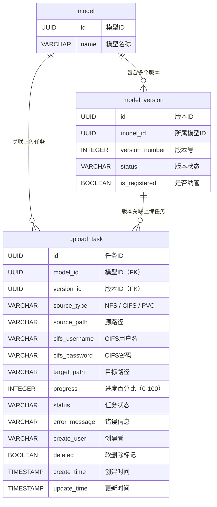
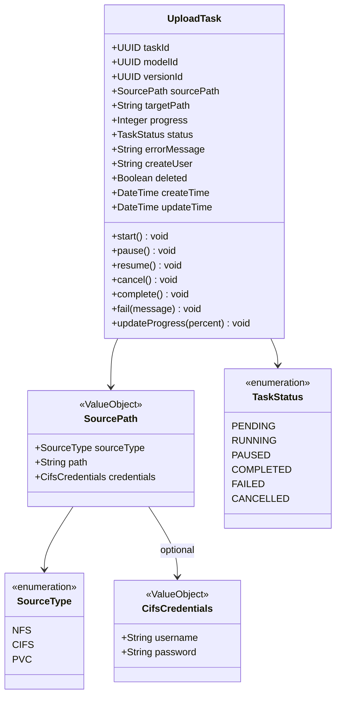
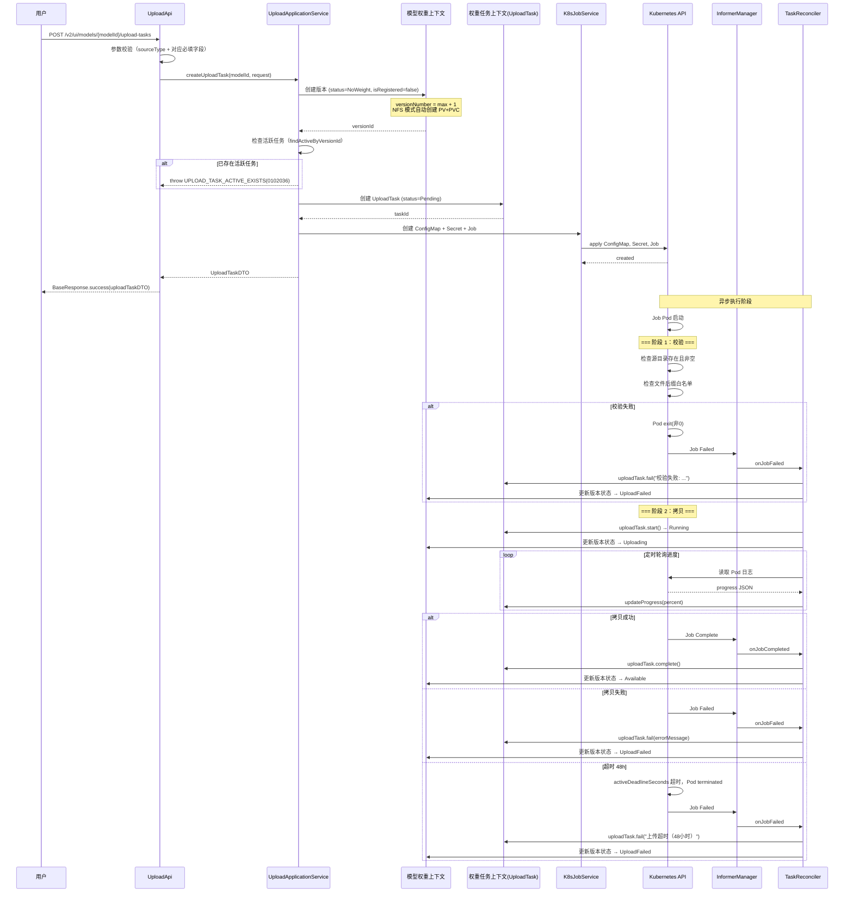
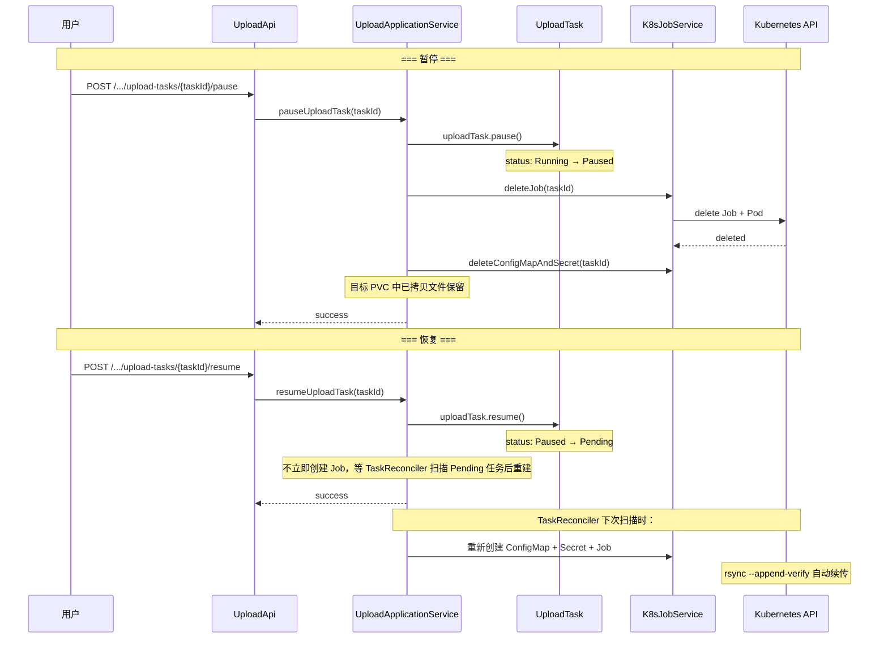
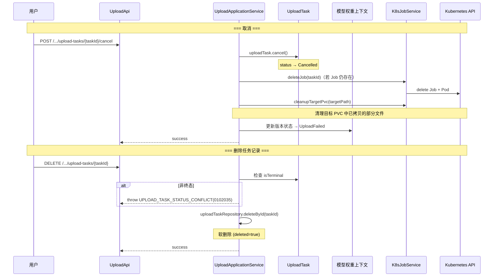
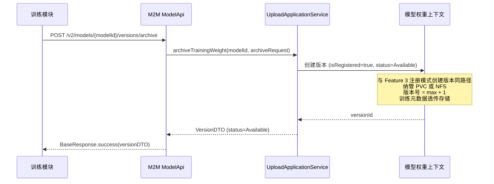
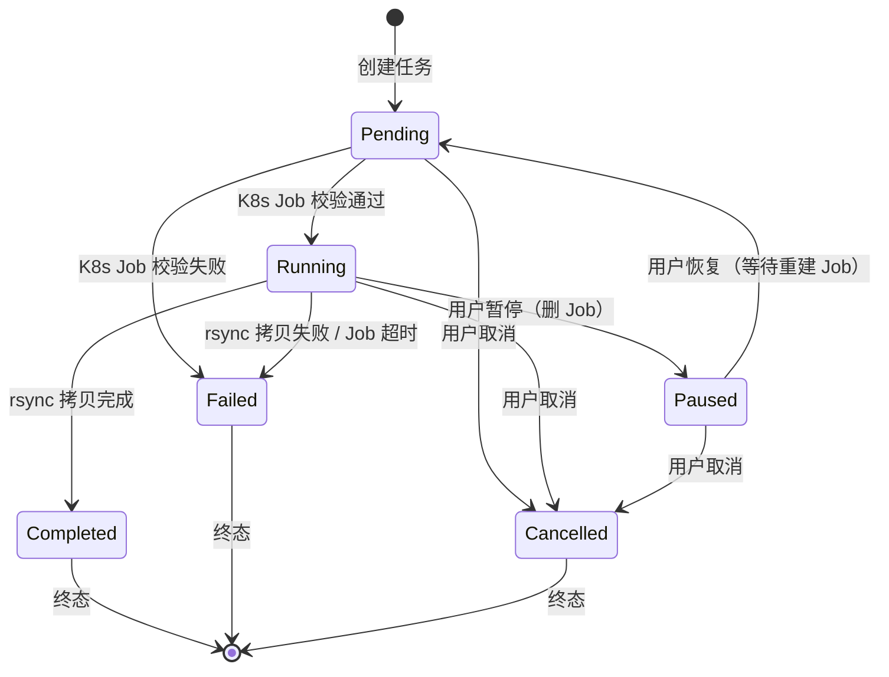
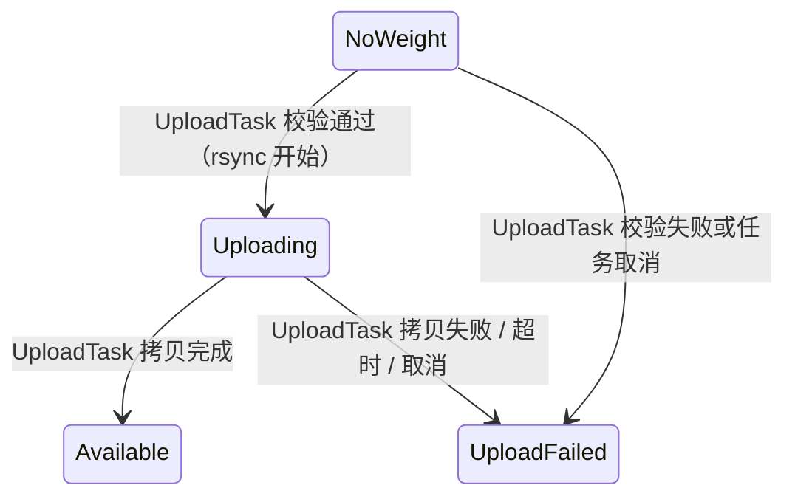
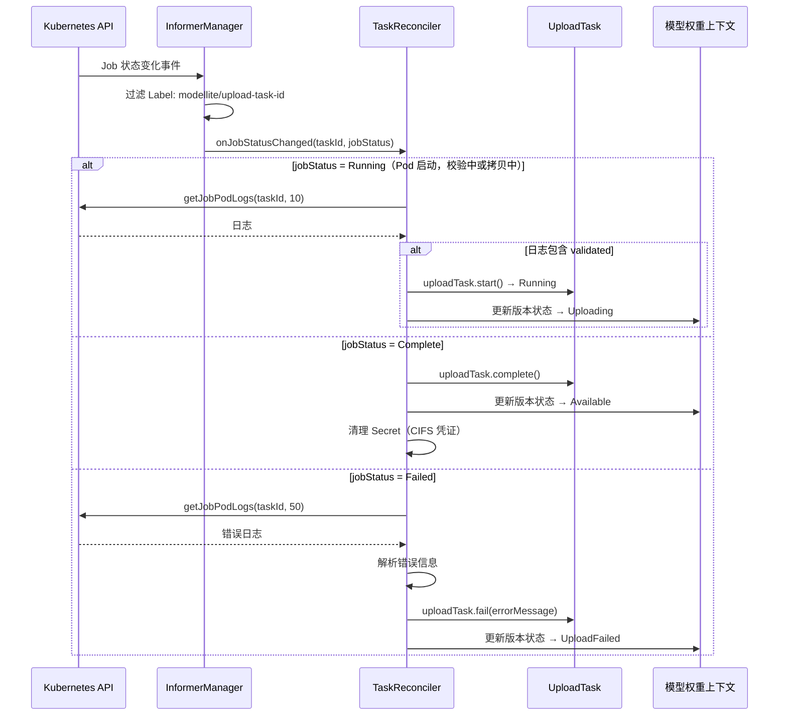

# Feature 4: 权重导入（纳管/上传） — 特性设计文档

> **文档类型**: 特性设计文档
> **文档版本**: v1.0
> **编写日期**: 2026-04-27
> **适用范围**: ModelLite 平台模型仓库模块 Feature 4
> **目标读者**: 后端开发工程师

---

## 1. 特性概述

### 1.1 目标

实现模型仓库的权重导入能力，包括两条核心路径：**纳管**（注册已有外部存储路径，不复制文件）和**上传**（通过 K8s Job 异步拷贝外部权重到平台 PVC）。同时提供训练归档的 M2M 接口，支持训练模块将产出权重纳入版本管理。

### 1.2 范围

**IN（包含）**:
- UploadTask 聚合根的领域模型实现（含 SourcePath、CifsCredentials 值对象）
- UploadTaskRepository 仓储接口与 MyBatis 实现
- UploadApplicationService 应用服务（编排跨上下文协作）
- 权重上传的人机接口（创建上传任务、查看任务、暂停/恢复/取消/删除任务）
- 训练归档的 M2M 接口（`POST /v2/models/{modelId}/versions/archive`）
- K8s Job 集成：Job 模板设计、ConfigMap/Secret 参数传递
- file-copier 镜像设计（rsync + 进度输出 + CIFS 挂载 + 拷贝前校验）
- Informer Watch + TaskReconciler 定时对账的双保险状态回调机制
- 上传进度上报（通过 Pod Log 解析）
- 文件后缀白名单校验（拷贝前，在 K8s Job 内执行）
- 源路径可达性校验（拷贝前，在 K8s Job 内执行）

**OUT（不包含）**:
- 纳管（注册模式创建版本）的 API — 已在 Feature 3 实现
- 权重完整性校验（REQ-INFO-002）— Feature 7
- 权重类型识别（REQ-INFO-001）— Feature 7
- 权重格式转换（REQ-CONVERT-001/002）— Feature 7
- 版本锁管理 — Feature 5
- 模型/版本软删除与回收站 — Feature 6
- 操作日志上报 — Feature 8
- file-copier 镜像的实际构建（本文档提供设计规范，镜像构建由运维/CI 完成）

### 1.3 依赖关系

| 依赖项 | 类型 | 说明 |
|--------|------|------|
| Feature 1: 基础设施与通用能力 | 特性 | 数据库 Schema（upload_task 表）、枚举定义（TaskStatus, SourceType）、错误码定义、TypeHandler、文件后缀白名单 ConfigMap |
| Feature 3: 模型与版本生命周期 | 特性 | Model 聚合（版本创建、状态更新）、ModelRepository、ModelApplicationService、版本状态机 |
| K8s 集群 | 外部系统 | 运行 K8s Job、存储 Informer |
| file-copier 镜像 | 外部依赖 | 自建镜像（rsync + 进度输出脚本 + cifs-utils），需预先构建推送至镜像仓库 |
| com.huawei.modellite.common 公共模块 | 外部依赖 | 提供 ModelLiteException、BaseResponse 等 |

### 1.4 需求追溯

| 需求编号 | 需求名称 | 本特性覆盖范围 |
|----------|----------|----------------|
| REQ-REGISTER-001 | 权重纳管 | 纳管已在 Feature 3 实现，本特性复用同一路径 |
| REQ-REGISTER-002 | 纳管校验 | 拷贝前校验（文件后缀+可达性）覆盖上传场景；纳管后校验归入 Feature 7 |
| REQ-UPLOAD-001 | 上传任务创建 | 完整实现（NFS/CIFS/PVC 三种源、K8s Job 异步执行、拷贝前校验） |
| REQ-UPLOAD-002 | 上传任务管理 | 完整实现（查看/暂停/恢复/取消/删除） |
| REQ-M2M-002 | 训练权重归档 | 完整实现（M2M 接口，纳管+训练元数据透传） |

### 1.5 设计决策记录

| 决策编号 | 决策内容 | 决策理由 |
|----------|----------|----------|
| F4-01 | Feature 4 的纳管与 Feature 3 的纳管是同一条路径 | 纳管本质是注册外部路径，Feature 3 已实现基础纳管能力 |
| F4-02 | UploadTask 作为独立聚合根，与 Model/ModelVersion 跨上下文引用 | UploadTask 有独立生命周期（6 种状态），与版本状态是两条独立的状态线 |
| F4-03 | 上传流程：先创建空版本（NoWeight）→ 再创建 UploadTask | 保持领域边界清晰；API 层提供便捷入口一步完成 |
| F4-04 | 训练归档是 M2M 接口，仓库不关心训练元数据语义，只做透传存储 | 职责分离：训练模块管理训练逻辑，仓库只管版本和存储 |
| F4-05 | CIFS 通过 mount.cifs 在容器内挂载，需 SYS_ADMIN capability | K8s 不原生支持 CIFS volume；自建镜像包含 cifs-utils |
| F4-06 | 校验在拷贝前执行（在 K8s Job 内两阶段：校验→拷贝） | 避免拷贝了无效文件后再回滚；版本状态更精确 |
| F4-07 | file-copier 镜像自建，包含 rsync + 进度输出脚本 + cifs-utils | 需要定制化拷贝逻辑和进度输出格式 |
| F4-08 | PVC 间拷贝限制在同 Namespace | 简化权限模型，避免跨 Namespace PVC 挂载问题 |
| F4-09 | K8s Job 超时设为 48 小时 | TB 级权重拷贝耗时较长，48h 覆盖极端场景 |
| F4-10 | 暂停/恢复采用删 Job + 重建 Job 方式，依赖 rsync 续传 | K8s Job 不原生支持暂停；rsync --append-verify 保证续传正确性 |

---

## 2. 数据库设计

### 2.1 新增/变更表 DDL

> 本特性涉及的 upload_task 表已在 Feature 1 中创建，DDL 不变更。此处补充数据字典和业务约束说明。

#### upload_task（上传任务表）

**DDL**: 见 Feature 1 §2.1。

**本特性新增业务规则**:
- 同一模型同一版本下，只允许存在一个非终态（Pending/Running/Paused）的上传任务
- 任务创建时 status 初始为 Pending，K8s Job 启动且校验通过后更新为 Running
- 终态任务（Completed/Failed/Cancelled）不允许再执行状态变更操作
- 删除任务时，若文件已部分上传，需清理目标 PVC 中已拷贝的部分文件

### 2.2 表关系图（ER 图）



### 2.3 索引设计

> 索引已在 Feature 1 §2.3 中定义。本特性新增一个复合索引用于查询活跃任务。

| 表名 | 索引名 | 索引类型 | 索引字段 | 说明 | 状态 |
|------|--------|----------|----------|------|------|
| upload_task | idx_upload_active | B-tree | model_id, version_id WHERE status IN ('Pending','Running','Paused') AND deleted = FALSE | 查询某版本下的活跃上传任务 | **本特性新增** |
| upload_task | idx_upload_model | B-tree | model_id WHERE deleted = FALSE | 查询模型的上传任务 | Feature 1 已创建 |
| upload_task | idx_upload_status | B-tree | status WHERE deleted = FALSE | 按状态筛选 | Feature 1 已创建 |

**新增索引 DDL**:

```sql
CREATE INDEX idx_upload_active ON upload_task(model_id, version_id)
    WHERE status IN ('Pending', 'Running', 'Paused') AND deleted = FALSE;
```

### 2.4 数据字典

#### upload_task 表

| 字段名 | 类型 | 是否必填 | 默认值 | 取值范围/说明 |
|--------|------|----------|--------|---------------|
| id | UUID | Y | 应用侧生成 | 任务 ID，UUID v4 |
| model_id | UUID | Y | — | 模型 ID（外键引用 model.id） |
| version_id | UUID | Y | — | 版本 ID（外键引用 model_version.id） |
| source_type | VARCHAR(20) | Y | — | 源路径类型：`NFS` / `CIFS` / `PVC` |
| source_path | VARCHAR(1024) | Y | — | 源路径；NFS 格式为 `nfsServer:nfsPath`；CIFS 格式为 `//server/share/path`；PVC 格式为 `pvcName:internalPath` |
| cifs_username | VARCHAR(200) | N | NULL | CIFS 认证用户名（仅 source_type=CIFS 时必填） |
| cifs_password | VARCHAR(200) | N | NULL | CIFS 认证密码（仅 source_type=CIFS 时必填） |
| target_path | VARCHAR(1024) | Y | — | 目标 PVC 内路径（格式：`pvcName:internalPath`） |
| progress | INTEGER | N | 0 | 进度百分比，取值 0-100 |
| status | VARCHAR(20) | Y | 'Pending' | 任务状态：`Pending` / `Running` / `Paused` / `Completed` / `Failed` / `Cancelled` |
| error_message | VARCHAR(2000) | N | NULL | 失败时的错误信息 |
| create_user | VARCHAR(100) | Y | — | 创建用户标识 |
| deleted | BOOLEAN | Y | FALSE | 软删除标记 |
| create_time | TIMESTAMP WITH TIME ZONE | Y | NOW() | 创建时间 |
| update_time | TIMESTAMP WITH TIME ZONE | Y | NOW() | 更新时间 |

---

## 3. 领域模型设计

### 3.1 类图

#### UploadTask 聚合



### 3.2 核心类定义

#### UploadTask（聚合根）

**包路径**: `com.huawei.modellite.repository.modelweight.domain.aggregate.uploadtask`

| 字段名 | 类型 | 说明 | 约束 |
|--------|------|------|------|
| taskId | UUID | 任务唯一标识 | 创建后不可修改 |
| modelId | UUID | 关联模型 ID | 创建后不可修改，引用有效模型 |
| versionId | UUID | 关联版本 ID | 创建后不可修改，引用有效版本 |
| sourcePath | SourcePath | 源路径信息 | 值对象，创建后不可修改 |
| targetPath | String | 目标 PVC 内路径 | 创建后不可修改 |
| progress | Integer | 进度百分比 | 取值 0-100，仅 Running 状态时可更新 |
| status | TaskStatus | 任务状态 | 状态机驱动，不可直接赋值 |
| errorMessage | String | 错误信息 | 仅 Failed 状态时有值 |
| createUser | String | 创建用户 | 创建后不可修改 |
| deleted | Boolean | 软删除标记 | 默认 false |
| createTime | DateTime | 创建时间 | 自动填充 |
| updateTime | DateTime | 更新时间 | 自动填充 |

**方法定义**:

| 方法名 | 参数 | 返回类型 | 说明 | 业务规则 |
|--------|------|----------|------|----------|
| createUploadTask（静态工厂） | taskId, modelId, versionId, sourcePath, targetPath, createUser | UploadTask | 创建上传任务 | 前置：sourcePath 非空、targetPath 非空；后置：status=Pending, progress=0 |
| start | — | void | 启动任务 | 前置：status=Pending 或 status=Paused；后置：status=Running |
| pause | — | void | 暂停任务 | 前置：status=Running；后置：status=Paused |
| resume | — | void | 恢复任务 | 前置：status=Paused；后置：status=Running（实际是 Pending，等待 K8s Job 重建） |
| cancel | — | void | 取消任务 | 前置：status≠Completed 且 status≠Cancelled；后置：status=Cancelled |
| complete | — | void | 完成任务 | 前置：status=Running；后置：status=Completed, progress=100 |
| fail | message: String | void | 标记失败 | 前置：status=Running 或 status=Pending；后置：status=Failed, errorMessage=message |
| updateProgress | percent: Integer | void | 更新进度 | 前置：status=Running；校验：percent 0-100 且 ≥ 当前值；后置：progress=percent |
| isTerminal | — | boolean | 是否终态 | status ∈ {Completed, Failed, Cancelled} 返回 true |

#### 关键方法伪代码

**UploadTask 状态机校验**:

```java
private void ensureStatus(TaskStatus expected, String action) {
    if (this.status != expected) {
        throw new ModelLiteException(ErrorCode.UPLOAD_TASK_STATUS_CONFLICT,
                "任务状态为 " + this.status.getDisplayName() + "，无法执行 " + action);
    }
}
```

**UploadTask.start**:
```java
public void start() {
    // 前置：status = Pending 或 Paused
    if (this.status != TaskStatus.PENDING && this.status != TaskStatus.PAUSED) {
        throw new ModelLiteException(ErrorCode.UPLOAD_TASK_STATUS_CONFLICT,
                "只有 Pending 或 Paused 状态的任务才能启动");
    }
    this.status = TaskStatus.RUNNING;
    this.updateTime = DateTime.now();
}
```

**UploadTask.pause**:
```java
public void pause() {
    ensureStatus(TaskStatus.RUNNING, "暂停");
    this.status = TaskStatus.PAUSED;
    this.updateTime = DateTime.now();
}
```

**UploadTask.resume**:
```java
public void resume() {
    ensureStatus(TaskStatus.PAUSED, "恢复");
    // 恢复后回到 Pending，等待 TaskReconciler 重建 K8s Job
    this.status = TaskStatus.PENDING;
    this.updateTime = DateTime.now();
}
```

**UploadTask.cancel**:
```java
public void cancel() {
    if (this.status == TaskStatus.COMPLETED || this.status == TaskStatus.CANCELLED) {
        throw new ModelLiteException(ErrorCode.UPLOAD_TASK_STATUS_CONFLICT,
                "终态任务无法取消");
    }
    this.status = TaskStatus.CANCELLED;
    this.updateTime = DateTime.now();
}
```

**UploadTask.complete**:
```java
public void complete() {
    ensureStatus(TaskStatus.RUNNING, "完成");
    this.status = TaskStatus.COMPLETED;
    this.progress = 100;
    this.updateTime = DateTime.now();
}
```

**UploadTask.fail**:
```java
public void fail(String message) {
    if (this.status != TaskStatus.RUNNING && this.status != TaskStatus.PENDING) {
        throw new ModelLiteException(ErrorCode.UPLOAD_TASK_STATUS_CONFLICT,
                "只有 Running 或 Pending 状态的任务才能标记失败");
    }
    this.status = TaskStatus.FAILED;
    this.errorMessage = message;
    this.updateTime = DateTime.now();
}
```

**UploadTask.updateProgress**:
```java
public void updateProgress(Integer percent) {
    ensureStatus(TaskStatus.RUNNING, "更新进度");
    if (percent < 0 || percent > 100) {
        throw new ModelLiteException(ErrorCode.UPLOAD_TASK_INVALID_PROGRESS,
                "进度值必须在 0-100 之间");
    }
    if (percent < this.progress) {
        return; // 忽略回退的进度值（rsync 重算时可能出现）
    }
    this.progress = percent;
    this.updateTime = DateTime.now();
}
```

### 3.3 值对象定义

| 值对象名 | 字段名 | 类型 | 说明 | 校验规则 |
|----------|--------|------|------|----------|
| SourcePath | sourceType | SourceType | 源路径类型 | 枚举：NFS / CIFS / PVC |
| | path | String | 源路径 | 非空，最长 1024 字符 |
| | credentials | CifsCredentials | CIFS 凭证 | 仅 CIFS 模式非空 |
| CifsCredentials | username | String | CIFS 用户名 | CIFS 模式下非空，最长 200 字符 |
| | password | String | CIFS 密码 | CIFS 模式下非空，最长 200 字符 |

**值对象工厂方法**:

```java
// NFS 模式
public static SourcePath ofNfs(String nfsServer, String nfsPath) {
    // path = "nfsServer:nfsPath"
    return new SourcePath(SourceType.NFS, nfsServer + ":" + nfsPath, null);
}

// CIFS 模式
public static SourcePath ofCifs(String server, String share, String username, String password) {
    // path = "//server/share"
    CifsCredentials creds = new CifsCredentials(username, password);
    return new SourcePath(SourceType.CIFS, "//" + server + "/" + share, creds);
}

// PVC 模式
public static SourcePath ofPvc(String pvcName, String internalPath) {
    // path = "pvcName:internalPath"
    return new SourcePath(SourceType.PVC, pvcName + ":" + internalPath, null);
}
```

### 3.4 领域服务

本特性无需独立领域服务。UploadTask 聚合的业务逻辑均在聚合根内完成。跨上下文协作由 UploadApplicationService 编排。

### 3.5 仓储接口

#### UploadTaskRepository

**包路径**: `com.huawei.modellite.repository.modelweight.domain.repository`

| 方法名 | 参数 | 返回类型 | 说明 |
|--------|------|----------|------|
| save | UploadTask | void | 保存上传任务 |
| findById | UUID taskId | Optional\<UploadTask\> | 按 ID 查找任务 |
| findByModelId | UUID modelId | List\<UploadTask\> | 查询模型下的全部上传任务（按创建时间倒序） |
| findByVersionId | UUID versionId | List\<UploadTask\> | 查询版本下的全部上传任务 |
| findActiveByVersionId | UUID versionId | Optional\<UploadTask\> | 查询版本下当前活跃的任务（status ∈ {Pending, Running, Paused}） |
| findByStatus | TaskStatus status | List\<UploadTask\> | 按状态查询任务（用于 TaskReconciler 扫描） |
| update | UploadTask | void | 更新任务状态/进度 |
| deleteById | UUID taskId | void | 软删除任务 |

### 3.6 业务不变量

| 不变量名 | 说明 | 强制方式 |
|----------|------|----------|
| 任务状态机 | 任务状态变更必须遵循状态机规则 | 代码校验（聚合根方法内） |
| 同版本唯一活跃任务 | 同一版本下只能有一个非终态任务 | 代码校验（应用服务层查询 findActiveByVersionId） |
| 进度单调递增 | 进度值只能增加（或忽略回退值） | 代码校验（updateProgress 方法内） |
| 终态不可变更 | Completed/Failed/Cancelled 状态的任务不允许任何状态变更 | 代码校验（聚合根方法内） |
| 版本存在性 | versionId 必须引用有效的 ModelVersion | 代码校验（应用服务层） |
| 版本状态一致性 | UploadTask 状态变更须同步更新 ModelVersion 状态 | 应用服务层在同一事务中协调 |

### 3.7 错误码定义

> Feature 1 已定义的上传任务相关错误码（本特性复用）:

| 错误码 | 枚举名 | HTTP 状态码 | 说明 | 来源 |
|--------|--------|-------------|------|------|
| 0102010 | UPLOAD_TASK_NOT_FOUND | 404 | 上传任务不存在 | Feature 1 |
| 0102011 | FILE_SUFFIX_NOT_ALLOWED | 400 | 文件后缀不在白名单 | Feature 1 |
| 0102012 | UPLOAD_TASK_CONCURRENT_LIMIT | 400 | 并发上传任务数超限 | Feature 1 |

> 本特性新增错误码:

| 错误码 | 枚举名 | HTTP 状态码 | 说明 |
|--------|--------|-------------|------|
| 0102035 | UPLOAD_TASK_STATUS_CONFLICT | 409 | 任务状态不允许此操作 |
| 0102036 | UPLOAD_TASK_ACTIVE_EXISTS | 409 | 该版本下已存在活跃的上传任务 |
| 0102037 | UPLOAD_TASK_VERSION_NOT_NO_WEIGHT | 409 | 版本状态不是 NoWeight，无法创建上传任务 |
| 0102038 | UPLOAD_TASK_INVALID_PROGRESS | 400 | 无效的进度值 |
| 0102039 | UPLOAD_SOURCE_PATH_INVALID | 400 | 源路径格式无效 |
| 0102040 | UPLOAD_CIFS_CREDENTIALS_REQUIRED | 400 | CIFS 模式下用户名和密码不能为空 |
| 0102041 | UPLOAD_TASK_JOB_SUBMIT_FAILED | 500 | K8s Job 提交失败 |
| 0102042 | UPLOAD_TASK_ALREADY_TERMINATED | 409 | 任务已终态，无法操作 |

---

## 4. 接口设计

### 4.1 人机接口（User API）

#### 4.1.1 创建上传任务

| 属性 | 值 |
|------|-----|
| URL | `POST /v2/ui/models/{modelId}/upload-tasks` |
| Method | POST |
| 描述 | 创建权重上传任务（便捷入口：内部自动创建空版本 + 创建 UploadTask + 提交 K8s Job） |

**Path Parameters**:

| 参数名 | 类型 | 必填 | 说明 |
|--------|------|------|------|
| modelId | UUID | Y | 模型 ID |

**Request Body — NFS 模式**:
```json
{
    "sourceType": "NFS",
    "nfsServer": "10.0.1.100",                 // NFS 服务器地址，必填
    "nfsPath": "/data/models/glm-5/v2",        // NFS 共享路径，必填
    "weightType": "safetensors",               // 权重类型，可选
    "trainingMetadata": {                      // 训练元数据，可选（透传存储）
        "trainFrame": "PyTorch",
        "trainType": "SFT",
        "trainStrategy": "LoRA",
        "trainTime": 36000,
        "finalLoss": "0.0023",
        "sourceVersion": "v1.0-base"
    }
}
```

**Request Body — CIFS 模式**:
```json
{
    "sourceType": "CIFS",
    "cifsServer": "file-server.example.com",   // CIFS 服务器地址，必填
    "cifsShare": "models",                     // CIFS 共享名，必填
    "cifsPath": "/glm-5/v2",                   // CIFS 共享内路径，必填
    "cifsUsername": "user",                    // CIFS 用户名，必填
    "cifsPassword": "pass",                    // CIFS 密码，必填
    "weightType": "safetensors",               // 权重类型，可选
    "trainingMetadata": { }                    // 可选
}
```

**Request Body — PVC 模式**:
```json
{
    "sourceType": "PVC",
    "sourcePvcName": "source-pvc",             // 源 PVC 名称，必填
    "sourceInternalPath": "/models/glm-5",     // 源 PVC 内路径，必填
    "weightType": "safetensors",               // 权重类型，可选
    "trainingMetadata": { }                    // 可选
}
```

**Response Body**（成功）:
```json
{
    "code": 0,
    "message": "success",
    "data": {
        "taskId": "uuid-task-new",
        "modelId": "uuid-model-001",
        "versionId": "uuid-version-new",
        "versionNumber": 3,
        "sourceType": "NFS",
        "sourcePath": "10.0.1.100:/data/models/glm-5/v2",
        "targetPath": "pvc-uuid-model-001-v3:/weights",
        "progress": 0,
        "status": "Pending",
        "createTime": "2026-04-27T10:00:00Z",
        "updateTime": "2026-04-27T10:00:00Z"
    },
    "timestamp": "2026-04-27T10:00:00Z",
    "requestId": "req-uuid-xxx"
}
```

**错误码**:

| 错误码 | HTTP 状态码 | 说明 |
|--------|-------------|------|
| 0102001 | 404 | 模型不存在 |
| 0102009 | 400 | 版本数量超出限制（≥50） |
| 0102036 | 409 | 该版本下已存在活跃的上传任务 |
| 0102039 | 400 | 源路径格式无效 |
| 0102040 | 400 | CIFS 模式下用户名和密码不能为空 |
| 0102041 | 500 | K8s Job 提交失败 |

**业务规则**:
- **前置条件**: 模型存在、版本容量未满（<50）、该版本下无活跃上传任务
- **内部流程**: 应用服务先创建空版本（status=NoWeight）→ 创建 UploadTask（status=Pending）→ 提交 K8s Job
- **RBAC**: 只有模型所属资源组的用户可创建上传任务
- **源 PVC 限制**: sourceType=PVC 时，源 PVC 必须与目标 PVC 在同一 Namespace

---

#### 4.1.2 查询上传任务详情

| 属性 | 值 |
|------|-----|
| URL | `GET /v2/ui/models/{modelId}/upload-tasks/{taskId}` |
| Method | GET |
| 描述 | 查询指定上传任务的详情 |

**Path Parameters**:

| 参数名 | 类型 | 必填 | 说明 |
|--------|------|------|------|
| modelId | UUID | Y | 模型 ID |
| taskId | UUID | Y | 任务 ID |

**Response Body**（成功）:
```json
{
    "code": 0,
    "message": "success",
    "data": {
        "taskId": "uuid-task-001",
        "modelId": "uuid-model-001",
        "versionId": "uuid-version-003",
        "versionNumber": 3,
        "sourceType": "NFS",
        "sourcePath": "10.0.1.100:/data/models/glm-5/v2",
        "targetPath": "pvc-uuid-model-001-v3:/weights",
        "progress": 65,
        "status": "Running",
        "errorMessage": null,
        "createUser": "user-001",
        "createTime": "2026-04-27T10:00:00Z",
        "updateTime": "2026-04-27T10:30:00Z"
    },
    "timestamp": "2026-04-27T10:30:00Z",
    "requestId": "req-uuid-xxx"
}
```

**错误码**:

| 错误码 | HTTP 状态码 | 说明 |
|--------|-------------|------|
| 0102001 | 404 | 模型不存在 |
| 0102010 | 404 | 上传任务不存在 |

---

#### 4.1.3 查询模型的上传任务列表

| 属性 | 值 |
|------|-----|
| URL | `GET /v2/ui/models/{modelId}/upload-tasks` |
| Method | GET |
| 描述 | 查询指定模型下的全部上传任务（按创建时间倒序） |

**Path Parameters**:

| 参数名 | 类型 | 必填 | 说明 |
|--------|------|------|------|
| modelId | UUID | Y | 模型 ID |

**Query Parameters**:

| 参数名 | 类型 | 必填 | 默认值 | 说明 |
|--------|------|------|--------|------|
| status | String | N | — | 按状态筛选：Pending / Running / Paused / Completed / Failed / Cancelled |

**Response Body**（成功）:
```json
{
    "code": 0,
    "message": "success",
    "data": [
        {
            "taskId": "uuid-task-001",
            "versionId": "uuid-version-003",
            "versionNumber": 3,
            "sourceType": "NFS",
            "sourcePath": "10.0.1.100:/data/models/glm-5/v2",
            "progress": 65,
            "status": "Running",
            "createUser": "user-001",
            "createTime": "2026-04-27T10:00:00Z",
            "updateTime": "2026-04-27T10:30:00Z"
        }
    ],
    "timestamp": "2026-04-27T10:30:00Z",
    "requestId": "req-uuid-xxx"
}
```

**错误码**:

| 错误码 | HTTP 状态码 | 说明 |
|--------|-------------|------|
| 0102001 | 404 | 模型不存在 |

---

#### 4.1.4 暂停上传任务

| 属性 | 值 |
|------|-----|
| URL | `POST /v2/ui/models/{modelId}/upload-tasks/{taskId}/pause` |
| Method | POST |
| 描述 | 暂停正在执行的上传任务（删除 K8s Job，保留已拷贝文件，支持后续恢复） |

**Response Body**（成功）:
```json
{
    "code": 0,
    "message": "success",
    "data": null,
    "timestamp": "2026-04-27T10:30:00Z",
    "requestId": "req-uuid-xxx"
}
```

**错误码**:

| 错误码 | HTTP 状态码 | 说明 |
|--------|-------------|------|
| 0102001 | 404 | 模型不存在 |
| 0102010 | 404 | 上传任务不存在 |
| 0102035 | 409 | 任务状态不是 Running，无法暂停 |

**业务规则**:
- **前置条件**: 任务存在且 status=Running
- **后置条件**: K8s Job 被删除，UploadTask.status=Paused，目标 PVC 中已拷贝文件保留
- **RBAC**: 只有任务创建者或模型资源组用户可操作

---

#### 4.1.5 恢复上传任务

| 属性 | 值 |
|------|-----|
| URL | `POST /v2/ui/models/{modelId}/upload-tasks/{taskId}/resume` |
| Method | POST |
| 描述 | 恢复已暂停的上传任务（重建 K8s Job，rsync 续传） |

**Response Body**（成功）:
```json
{
    "code": 0,
    "message": "success",
    "data": null,
    "timestamp": "2026-04-27T11:00:00Z",
    "requestId": "req-uuid-xxx"
}
```

**错误码**:

| 错误码 | HTTP 状态码 | 说明 |
|--------|-------------|------|
| 0102001 | 404 | 模型不存在 |
| 0102010 | 404 | 上传任务不存在 |
| 0102035 | 409 | 任务状态不是 Paused，无法恢复 |
| 0102041 | 500 | K8s Job 提交失败 |

**业务规则**:
- **前置条件**: 任务存在且 status=Paused
- **后置条件**: UploadTask.status=Pending（等待 TaskReconciler 重建 K8s Job），K8s Job 重建后 rsync --append-verify 续传

---

#### 4.1.6 取消上传任务

| 属性 | 值 |
|------|-----|
| URL | `POST /v2/ui/models/{modelId}/upload-tasks/{taskId}/cancel` |
| Method | POST |
| 描述 | 取消上传任务（删除 K8s Job，清理已拷贝的部分文件） |

**Response Body**（成功）:
```json
{
    "code": 0,
    "message": "success",
    "data": null,
    "timestamp": "2026-04-27T11:00:00Z",
    "requestId": "req-uuid-xxx"
}
```

**错误码**:

| 错误码 | HTTP 状态码 | 说明 |
|--------|-------------|------|
| 0102001 | 404 | 模型不存在 |
| 0102010 | 404 | 上传任务不存在 |
| 0102042 | 409 | 任务已终态，无法取消 |

**业务规则**:
- **前置条件**: 任务存在且非终态（非 Completed/Cancelled）
- **后置条件**: K8s Job 被删除，UploadTask.status=Cancelled，清理目标 PVC 中已拷贝的部分文件
- **版本状态**: 版本状态更新为 UploadFailed

---

#### 4.1.7 删除上传任务记录

| 属性 | 值 |
|------|-----|
| URL | `DELETE /v2/ui/models/{modelId}/upload-tasks/{taskId}` |
| Method | DELETE |
| 描述 | 删除上传任务记录（软删除） |

**Response Body**（成功）:
```json
{
    "code": 0,
    "message": "success",
    "data": null,
    "timestamp": "2026-04-27T12:00:00Z",
    "requestId": "req-uuid-xxx"
}
```

**错误码**:

| 错误码 | HTTP 状态码 | 说明 |
|--------|-------------|------|
| 0102001 | 404 | 模型不存在 |
| 0102010 | 404 | 上传任务不存在 |
| 0102035 | 409 | 任务仍在运行中，请先取消或等待完成 |

**业务规则**:
- **前置条件**: 任务存在且为终态（Completed/Failed/Cancelled）
- **后置条件**: 软删除标记 deleted=true
- **非终态任务**: 需先取消才能删除

---

### 4.2 机机接口（M2M API）

#### 4.2.1 训练权重归档

| 属性 | 值 |
|------|-----|
| URL | `POST /v2/models/{modelId}/versions/archive` |
| Method | POST |
| 描述 | 训练模块调用，将训练产出的权重归档为新版本（纳管模式，isRegistered=true） |

**Path Parameters**:

| 参数名 | 类型 | 必填 | 说明 |
|--------|------|------|------|
| modelId | UUID | Y | 模型 ID |

**Request Body — PVC 模式**:
```json
{
    "sourceType": "PVC",
    "pvcName": "training-output-pvc",           // 训练产出 PVC 名称，必填
    "internalPath": "/output/checkpoint-100",   // PVC 内路径，必填
    "weightType": "safetensors",                // 权重类型，可选
    "trainingMetadata": {                       // 训练元数据，可选（透传存储，仓库不关心语义）
        "trainFrame": "PyTorch",
        "trainType": "SFT",
        "trainStrategy": "LoRA",
        "trainTime": 36000,
        "finalLoss": "0.0023",
        "sourceVersion": "v1.0-base"
    }
}
```

**Request Body — NFS 模式**:
```json
{
    "sourceType": "NFS",
    "nfsServer": "10.0.1.100",
    "nfsPath": "/training/output/checkpoint-100",
    "weightType": "safetensors",
    "trainingMetadata": { }
}
```

**Response Body**（成功）:
```json
{
    "code": 0,
    "message": "success",
    "data": {
        "versionId": "uuid-version-new",
        "versionNumber": 3,
        "status": "Available",
        "isRegistered": true,
        "sourceType": "PVC",
        "pvcName": "training-output-pvc",
        "internalPath": "/output/checkpoint-100",
        "weightType": "safetensors",
        "trainingMetadata": {
            "trainFrame": "PyTorch",
            "trainType": "SFT",
            "trainStrategy": "LoRA",
            "trainTime": 36000,
            "finalLoss": "0.0023",
            "sourceVersion": "v1.0-base"
        },
        "createTime": "2026-04-27T14:00:00Z"
    },
    "timestamp": "2026-04-27T14:00:00Z",
    "requestId": "req-uuid-xxx"
}
```

**错误码**:

| 错误码 | HTTP 状态码 | 说明 |
|--------|-------------|------|
| 0102001 | 404 | 模型不存在 |
| 0102009 | 400 | 版本数量超出限制（≥50） |
| 0102033 | 400 | PVC 模式下 pvcName 不能为空 |
| 0102034 | 400 | NFS 模式下 nfsServer 和 nfsPath 不能为空 |

**业务规则**:
- **认证方式**: SSL 证书校验（非 Gateway 路由）
- **本质**: 与 Feature 3 的注册模式创建版本同路径（纳管）
- **训练元数据**: 仓库不关心语义，只做透传存储（全可选字段，原样持久化到 model_version 表）
- **后置条件**: 版本 status=Available（纳管成功，直接可用），isRegistered=true

---

## 5. 核心业务流程

### 5.1 上传任务完整流程



**流程说明**:
1. API 层校验参数（sourceType 及对应必填字段）
2. 应用服务先调用 MW 上下文创建空版本（status=NoWeight）
3. 检查该版本下无活跃上传任务
4. 创建 UploadTask 聚合（status=Pending）
5. 通过 K8sJobService 创建 ConfigMap（源路径参数）、Secret（CIFS 凭证）、Job
6. 返回 taskId 给用户，后续异步执行
7. K8s Job 内部两阶段：先校验（源路径可达性 + 文件后缀白名单），校验通过后 rsync 拷贝
8. Informer Watch 感知 Job 状态变化，TaskReconciler 更新 UploadTask 和 ModelVersion 状态
9. 拷贝完成后版本状态变为 Available；失败则变为 UploadFailed

### 5.2 暂停/恢复流程



**流程说明**:
1. **暂停**: 聚合根状态 Paused → 删除 K8s Job → 保留 PVC 中已拷贝文件
2. **恢复**: 聚合根状态 Pending → 等待 TaskReconciler 扫描 → 重建 K8s Job → rsync 续传
3. rsync `--append-verify` 参数保证续传正确性

### 5.3 取消/删除流程



### 5.4 训练归档流程（M2M）



**流程说明**:
1. 训练模块调用 M2M 接口，传入源路径 + 训练元数据
2. 应用服务调用 MW 上下文创建版本（纳管模式），训练元数据透传存储
3. 版本创建后直接 status=Available（纳管不复制文件）

### 5.5 UploadTask 状态机



**状态转换规则**:

| 当前状态 | 触发条件 | 目标状态 | 说明 |
|----------|----------|----------|------|
| — | 创建上传任务 | Pending | 任务已创建，K8s Job 已提交 |
| Pending | K8s Job 校验通过，rsync 开始 | Running | 文件拷贝进行中 |
| Pending | K8s Job 校验失败（源路径不可达/后缀不在白名单） | Failed | 记录错误信息 |
| Pending | 用户取消 | Cancelled | 清理 K8s 资源 |
| Running | 用户暂停 | Paused | 删除 K8s Job，保留已拷贝文件 |
| Running | rsync 拷贝完成 | Completed | 进度 100% |
| Running | rsync 拷贝失败 | Failed | 记录错误信息 |
| Running | Job 超时 48h | Failed | 记录"上传超时" |
| Running | 用户取消 | Cancelled | 清理 K8s 资源 + 清理已拷贝文件 |
| Paused | 用户恢复 | Pending | 等待 TaskReconciler 重建 Job |
| Paused | 用户取消 | Cancelled | 清理已拷贝文件 |

### 5.6 版本状态机（本特性覆盖范围）

> Feature 1 已定义完整版本状态机，本特性负责以下转换：



**与 Feature 3 的状态转换对比**:

| 触发场景 | 起始状态 | 目标状态 | 所属特性 |
|----------|----------|----------|----------|
| 创建模型（自动创建首版本） | — | NoWeight | Feature 3 |
| 注册模式创建版本（纳管） | — | Available | Feature 3 |
| 上传任务校验通过，rsync 开始 | NoWeight | Uploading | **Feature 4** |
| 上传任务校验失败 | NoWeight | UploadFailed | **Feature 4** |
| 上传任务拷贝完成 | Uploading | Available | **Feature 4** |
| 上传任务拷贝失败/超时/取消 | Uploading | UploadFailed | **Feature 4** |

---

## 6. K8s Job 集成设计

### 6.1 file-copier 镜像规范

**镜像名称**: `modellite-file-copier:{version}`

**包含组件**:
- `rsync` — 文件拷贝（支持 --append-verify 续传）
- `cifs-utils` — CIFS 挂载支持（提供 mount.cifs 命令）
- `python3` — 进度输出脚本解析
- `/app/entrypoint.sh` — 入口脚本（校验 + 拷贝 + 进度输出）

**入口脚本 `entrypoint.sh` 核心逻辑**:

```bash
#!/bin/bash
set -e

# ========== 阶段 1：源路径挂载（按 SOURCE_TYPE） ==========
case "$SOURCE_TYPE" in
    NFS)
        # NFS 已通过 K8s volume 挂载到 /source
        SOURCE_DIR="/source/${SOURCE_SUB_PATH:-}"
        ;;
    CIFS)
        # CIFS 需要容器内手动挂载
        mkdir -p /source
        mount.cifs "//${CIFS_SERVER}/${CIFS_SHARE}" /source \
            -o username="${CIFS_USERNAME}",password="${CIFS_PASSWORD}",vers=3.0,iocharset=utf8
        SOURCE_DIR="/source/${CIFS_SUB_PATH:-}"
        ;;
    PVC)
        # PVC 已通过 K8s volume 挂载到 /source
        SOURCE_DIR="/source/${SOURCE_SUB_PATH:-}"
        ;;
esac

# ========== 阶段 2：校验 ==========
# 2.1 源路径可达性校验
if [ ! -d "$SOURCE_DIR" ]; then
    echo "{\"error\": \"source directory not found: $SOURCE_DIR\"}"
    exit 1
fi

if [ -z "$(ls -A $SOURCE_DIR 2>/dev/null)" ]; then
    echo "{\"error\": \"source directory is empty\"}"
    exit 1
fi

# 2.2 文件后缀白名单校验
# ALLOWED_SUFFIXES 从 ConfigMap 注入，格式：".safetensors,.bin,.pt,.pth,.json,.txt,.model,.index.json,.data-00000-of-00001"
python3 /app/validate_suffixes.py "$SOURCE_DIR" "$ALLOWED_SUFFIXES"
if [ $? -ne 0 ]; then
    echo "{\"error\": \"files with disallowed suffix found\"}"
    exit 2
fi

# ========== 阶段 3：输出校验通过信号 ==========
echo '{"phase": "validated"}'

# ========== 阶段 4：rsync 拷贝 + 进度输出 ==========
rsync -av --append-verify --info=progress2 "$SOURCE_DIR/" "/target/" 2>&1 | \
    python3 /app/progress_reporter.py

# ========== 阶段 5：写入完成标记 ==========
echo "completed" > /target/.upload-complete

echo '{"progress": 100, "phase": "completed"}'
```

**`progress_reporter.py` 核心逻辑**:

```python
import sys, re, json, time

last_report = 0
for line in sys.stdin:
    # 解析 rsync --info=progress2 输出
    # 格式: "  1,234,567,890  45%  123.45MB/s    0:02:30"
    match = re.search(r'(\d+)%', line)
    if match:
        percent = int(match.group(1))
        now = time.time()
        if now - last_report >= 5:  # 每 5 秒输出一次
            print(json.dumps({"progress": percent}))
            sys.stdout.flush()
            last_report = now
```

### 6.2 K8s Job 模板

**Job 命名规则**: `upload-{taskId}`（用 taskId 保证全局唯一）

**Label 规范**:

| Label | 值 | 说明 |
|-------|-----|------|
| `modellite/upload-task-id` | {taskId} | 任务 ID，用于 Informer 过滤 |
| `modellite/model-id` | {modelId} | 模型 ID |
| `modellite/version-id` | {versionId} | 版本 ID |
| `app` | `modellite-file-copier` | 应用标识 |

**NFS 模式 Job 模板**:

```yaml
apiVersion: batch/v1
kind: Job
metadata:
  name: upload-{taskId}
  labels:
    modellite/upload-task-id: "{taskId}"
    modlette/model-id: "{modelId}"
    modellite/version-id: "{versionId}"
    app: modellite-file-copier
spec:
  backoffLimit: 0
  activeDeadlineSeconds: 172800          # 48 小时超时
  ttlSecondsAfterFinished: 86400         # 完成 24h 后自动清理
  template:
    spec:
      restartPolicy: Never
      containers:
        - name: file-copier
          image: {modellite-file-copier-image}
          envFrom:
            - configMapRef:
                name: upload-params-{taskId}
          volumeMounts:
            - name: target-pvc
              mountPath: /target
            - name: source-nfs
              mountPath: /source
              readOnly: true
      volumes:
        - name: target-pvc
          persistentVolumeClaim:
            claimName: {targetPvcName}
        - name: source-nfs
          nfs:
            server: {nfsServer}
            path: {nfsPath}
            readOnly: true
```

**CIFS 模式 Job 模板**:

```yaml
apiVersion: batch/v1
kind: Job
metadata:
  name: upload-{taskId}
  labels:
    modellite/upload-task-id: "{taskId}"
    modellite/model-id: "{modelId}"
    modellite/version-id: "{versionId}"
    app: modellite-file-copier
spec:
  backoffLimit: 0
  activeDeadlineSeconds: 172800
  ttlSecondsAfterFinished: 86400
  template:
    spec:
      restartPolicy: Never
      containers:
        - name: file-copier
          image: {modellite-file-copier-image}
          securityContext:
            capabilities:
              add: ["SYS_ADMIN"]        # CIFS 挂载需要
          envFrom:
            - configMapRef:
                name: upload-params-{taskId}
          env:
            - name: CIFS_USERNAME
              valueFrom:
                secretKeyRef:
                  name: upload-secret-{taskId}
                  key: username
            - name: CIFS_PASSWORD
              valueFrom:
                secretKeyRef:
                  name: upload-secret-{taskId}
                  key: password
          volumeMounts:
            - name: target-pvc
              mountPath: /target
      volumes:
        - name: target-pvc
          persistentVolumeClaim:
            claimName: {targetPvcName}
```

**PVC 模式 Job 模板**:

```yaml
# 与 NFS 模式类似，source volume 改为 persistentVolumeClaim
spec:
  template:
    spec:
      containers:
        - name: file-copier
          volumeMounts:
            - name: target-pvc
              mountPath: /target
            - name: source-pvc
              mountPath: /source
              readOnly: true
      volumes:
        - name: target-pvc
          persistentVolumeClaim:
            claimName: {targetPvcName}
        - name: source-pvc
          persistentVolumeClaim:
            claimName: {sourcePvcName}
            readOnly: true
```

> **约束**: PVC 模式下源 PVC 和目标 PVC 必须在同一 Namespace。

### 6.3 ConfigMap 模板

```yaml
apiVersion: v1
kind: ConfigMap
metadata:
  name: upload-params-{taskId}
  labels:
    modellite/upload-task-id: "{taskId}"
data:
  SOURCE_TYPE: "NFS"                         # NFS / CIFS / PVC
  SOURCE_SUB_PATH: ""                        # NFS 源子路径（如有）
  TARGET_PATH: "/target"                     # 容器内目标挂载点
  ALLOWED_SUFFIXES: ".safetensors,.bin,.pt,.pth,.json,.txt,.model,.index"  # 文件后缀白名单
  CIFS_SERVER: ""                            # CIFS 服务器（仅 CIFS 模式）
  CIFS_SHARE: ""                             # CIFS 共享名（仅 CIFS 模式）
  CIFS_SUB_PATH: ""                          # CIFS 共享内子路径（仅 CIFS 模式）
```

### 6.4 Secret 模板（CIFS 模式）

```yaml
apiVersion: v1
kind: Secret
metadata:
  name: upload-secret-{taskId}
  labels:
    modellite/upload-task-id: "{taskId}"
type: Opaque
data:
  username: {base64-encoded-username}
  password: {base64-encoded-password}
```

### 6.5 K8sJobService 接口

**包路径**: `com.huawei.modellite.repository.modelweight.infrastructure.k8s`

| 方法名 | 参数 | 返回类型 | 说明 |
|--------|------|----------|------|
| createUploadJob | UploadTask, SourcePath, String targetPvcName | void | 创建 ConfigMap + Secret + Job |
| deleteJob | String taskId | void | 删除 Job + Pod |
| deleteJobResources | String taskId | void | 删除 ConfigMap + Secret |
| getJobPodLogs | String taskId, int tailLines | String | 获取 Job Pod 最近 N 行日志 |
| getJobStatus | String taskId | JobStatus | 查询 Job 当前状态 |

### 6.6 状态回调机制：Informer + 对账双保险

#### Informer Watch（实时感知）

InformerManager（基础设施层已设计）Watch `modellite/file-copier` Label 的 Job 状态变化：



#### TaskReconciler 定时对账（兜底保障）

**执行频率**: 每 30 秒

**扫描逻辑**:

| 扫描对象 | 条件 | 处理 |
|----------|------|------|
| Pending 任务 | 存在超过 5 分钟 | 查询 K8s Job 状态；若 Job 不存在则重建，若 Job 存在则同步状态 |
| Running 任务 | 存在 | 读取 Pod 日志获取进度；更新 uploadTask.progress |
| Paused 任务 | 存在超过 1 小时 | 打印告警日志（避免遗忘） |
| 终态任务关联的 ConfigMap/Secret | 任务终态超过 24h | 清理 K8s 资源 |

### 6.7 资源清理策略

| 资源 | 清理时机 | 清理方式 |
|------|----------|----------|
| Job + Pod | 任务完成 24h 后 | `ttlSecondsAfterFinished: 86400` 自动清理 |
| ConfigMap | 任务终态 24h 后 | TaskReconciler 定时扫描清理 |
| Secret（CIFS 凭证） | 任务终态时立即清理 | 避免凭证残留 |
| 目标 PVC 中部分文件 | 任务取消时 | 删除 Job 后清理目标 PVC 中已拷贝文件 |
| 目标 PVC | 版本删除时 | 跟随版本生命周期（Feature 6） |

---

## 7. 测试用例

### 7.1 单元测试（领域模型）

#### 7.1.1 UploadTask.createUploadTask — 正常创建

**Given**:
- 有效的参数：modelId, versionId, sourcePath(NFS), targetPath, createUser="user1"

**When**:
- 调用 `UploadTask.createUploadTask(taskId, modelId, versionId, sourcePath, targetPath, "user1")`

**Then**:
- 返回 UploadTask 对象
- status = Pending
- progress = 0
- deleted = false

---

#### 7.1.2 UploadTask.createUploadTask — sourcePath 为空拒绝

**Given**:
- sourcePath = null

**When**:
- 调用 `UploadTask.createUploadTask(taskId, modelId, versionId, null, targetPath, "user1")`

**Then**:
- 抛出异常，提示源路径不能为空

---

#### 7.1.3 UploadTask.start — Pending → Running

**Given**:
- UploadTask，status = Pending

**When**:
- 调用 `uploadTask.start()`

**Then**:
- status = Running

---

#### 7.1.4 UploadTask.start — Completed 状态拒绝

**Given**:
- UploadTask，status = Completed

**When**:
- 调用 `uploadTask.start()`

**Then**:
- 抛出 ModelLiteException，ErrorCode = UPLOAD_TASK_STATUS_CONFLICT(0102035)

---

#### 7.1.5 UploadTask.pause — Running → Paused

**Given**:
- UploadTask，status = Running

**When**:
- 调用 `uploadTask.pause()`

**Then**:
- status = Paused

---

#### 7.1.6 UploadTask.pause — Pending 状态拒绝

**Given**:
- UploadTask，status = Pending

**When**:
- 调用 `uploadTask.pause()`

**Then**:
- 抛出 ModelLiteException，ErrorCode = UPLOAD_TASK_STATUS_CONFLICT

---

#### 7.1.7 UploadTask.resume — Paused → Pending

**Given**:
- UploadTask，status = Paused

**When**:
- 调用 `uploadTask.resume()`

**Then**:
- status = Pending（等待 TaskReconciler 重建 K8s Job）

---

#### 7.1.8 UploadTask.cancel — Running → Cancelled

**Given**:
- UploadTask，status = Running

**When**:
- 调用 `uploadTask.cancel()`

**Then**:
- status = Cancelled

---

#### 7.1.9 UploadTask.cancel — Completed 状态拒绝

**Given**:
- UploadTask，status = Completed

**When**:
- 调用 `uploadTask.cancel()`

**Then**:
- 抛出 ModelLiteException，ErrorCode = UPLOAD_TASK_ALREADY_TERMINATED(0102042)

---

#### 7.1.10 UploadTask.complete — Running → Completed

**Given**:
- UploadTask，status = Running，progress = 95

**When**:
- 调用 `uploadTask.complete()`

**Then**:
- status = Completed
- progress = 100（自动设置）

---

#### 7.1.11 UploadTask.fail — Running → Failed

**Given**:
- UploadTask，status = Running

**When**:
- 调用 `uploadTask.fail("rsync: connection timed out")`

**Then**:
- status = Failed
- errorMessage = "rsync: connection timed out"

---

#### 7.1.12 UploadTask.fail — Pending → Failed（校验失败场景）

**Given**:
- UploadTask，status = Pending

**When**:
- 调用 `uploadTask.fail("source directory is empty")`

**Then**:
- status = Failed
- errorMessage = "source directory is empty"

---

#### 7.1.13 UploadTask.updateProgress — 正常更新

**Given**:
- UploadTask，status = Running，progress = 30

**When**:
- 调用 `uploadTask.updateProgress(50)`

**Then**:
- progress = 50

---

#### 7.1.14 UploadTask.updateProgress — 回退值忽略

**Given**:
- UploadTask，status = Running，progress = 50

**When**:
- 调用 `uploadTask.updateProgress(30)`

**Then**:
- progress = 50（不变，忽略回退值）

---

#### 7.1.15 UploadTask.updateProgress — 超范围拒绝

**Given**:
- UploadTask，status = Running

**When**:
- 调用 `uploadTask.updateProgress(150)`

**Then**:
- 抛出 ModelLiteException，ErrorCode = UPLOAD_TASK_INVALID_PROGRESS(0102038)

---

#### 7.1.16 UploadTask.updateProgress — 非 Running 状态拒绝

**Given**:
- UploadTask，status = Pending

**When**:
- 调用 `uploadTask.updateProgress(50)`

**Then**:
- 抛出 ModelLiteException，ErrorCode = UPLOAD_TASK_STATUS_CONFLICT

---

#### 7.1.17 UploadTask.isTerminal — 终态判断

**Given**:
- 分别创建 status = Completed / Failed / Cancelled / Running / Pending 的 UploadTask

**When**:
- 分别调用 `uploadTask.isTerminal()`

**Then**:
- Completed: true
- Failed: true
- Cancelled: true
- Running: false
- Pending: false

---

#### 7.1.18 SourcePath.ofNfs — 正常创建

**Given**:
- nfsServer = "10.0.1.100"，nfsPath = "/data/models"

**When**:
- 调用 `SourcePath.ofNfs("10.0.1.100", "/data/models")`

**Then**:
- sourceType = NFS
- path = "10.0.1.100:/data/models"
- credentials = null

---

#### 7.1.19 SourcePath.ofCifs — 正常创建

**Given**:
- server = "file-server"，share = "models"，username = "user"，password = "pass"

**When**:
- 调用 `SourcePath.ofCifs("file-server", "models", "user", "pass")`

**Then**:
- sourceType = CIFS
- path = "//file-server/models"
- credentials.username = "user"
- credentials.password = "pass"

---

#### 7.1.20 SourcePath.ofCifs — 凭证为空拒绝

**Given**:
- username = null，password = null

**When**:
- 调用 `SourcePath.ofCifs("file-server", "models", null, null)`

**Then**:
- 抛出异常，提示 CIFS 模式下用户名和密码不能为空

---

#### 7.1.21 SourcePath.ofPvc — 正常创建

**Given**:
- pvcName = "source-pvc"，internalPath = "/data"

**When**:
- 调用 `SourcePath.ofPvc("source-pvc", "/data")`

**Then**:
- sourceType = PVC
- path = "source-pvc:/data"
- credentials = null

---

### 7.2 集成测试（仓储）

#### 7.2.1 UploadTaskRepository.save — 保存任务

**Given**:
- H2 内存数据库已初始化

**When**:
- 调用 `uploadTaskRepository.save(uploadTask)` 保存一个 Pending 状态的 NFS 类型任务
- 再调用 `uploadTaskRepository.findById(taskId)`

**Then**:
- 查询结果存在
- status = Pending，sourceType = NFS，progress = 0

---

#### 7.2.2 UploadTaskRepository.findActiveByVersionId — 查询活跃任务

**Given**:
- H2 数据库中某版本下有 1 个 Running 任务和 1 个 Completed 任务

**When**:
- 调用 `uploadTaskRepository.findActiveByVersionId(versionId)`

**Then**:
- 返回 Running 状态的任务

---

#### 7.2.3 UploadTaskRepository.findActiveByVersionId — 无活跃任务

**Given**:
- H2 数据库中某版本下只有 Completed 任务

**When**:
- 调用 `uploadTaskRepository.findActiveByVersionId(versionId)`

**Then**:
- 返回 Optional.empty()

---

#### 7.2.4 UploadTaskRepository.findByStatus — 按状态查询

**Given**:
- H2 数据库中有 3 个 Running 任务和 2个 Pending 任务

**When**:
- 调用 `uploadTaskRepository.findByStatus(TaskStatus.RUNNING)`

**Then**:
- 返回 3 个任务

---

#### 7.2.5 UploadTaskRepository.update — 更新状态

**Given**:
- H2 数据库中有 Pending 状态的任务

**When**:
- 调用 `uploadTask.start()` → `uploadTaskRepository.update(uploadTask)`
- 再调用 `uploadTaskRepository.findById(taskId)`

**Then**:
- status = Running

---

### 7.3 API 测试（接口层）

#### 7.3.1 POST /v2/ui/models/{modelId}/upload-tasks — 创建上传任务成功（NFS）

**Given**:
- 数据库中存在模型（id=modelId，当前 2 个版本）
- 请求参数:
```json
{
    "sourceType": "NFS",
    "nfsServer": "10.0.1.100",
    "nfsPath": "/data/models/glm-5/v2"
}
```

**When**:
- 调用 `POST /v2/ui/models/{modelId}/upload-tasks`

**Then**:
- HTTP 状态码 = 200
- Response.code = 0
- Response.data.taskId 不为空
- Response.data.versionNumber = 3
- Response.data.status = "Pending"
- 数据库验证：model_version 表新增 1 条（version_number=3, status='NoWeight'），upload_task 表新增 1 条（status='Pending'）

---

#### 7.3.2 POST /v2/ui/models/{modelId}/upload-tasks — 创建上传任务成功（CIFS）

**Given**:
- 数据库中存在模型
- 请求参数:
```json
{
    "sourceType": "CIFS",
    "cifsServer": "file-server",
    "cifsShare": "models",
    "cifsPath": "/glm-5",
    "cifsUsername": "user",
    "cifsPassword": "pass"
}
```

**When**:
- 调用 `POST /v2/ui/models/{modelId}/upload-tasks`

**Then**:
- HTTP 状态码 = 200
- Response.data.sourceType = "CIFS"

---

#### 7.3.3 POST /v2/ui/models/{modelId}/upload-tasks — 模型不存在

**Given**:
- 数据库中无该模型

**When**:
- 调用 `POST /v2/ui/models/non-existent/upload-tasks`

**Then**:
- HTTP 状态码 = 404
- Response.code = 0102001

---

#### 7.3.4 POST /v2/ui/models/{modelId}/upload-tasks — CIFS 凭证缺失

**Given**:
- 请求参数 sourceType=CIFS 但未提供 cifsUsername

**When**:
- 调用 `POST /v2/ui/models/{modelId}/upload-tasks`

**Then**:
- HTTP 状态码 = 400
- Response.code = 0102040

---

#### 7.3.5 POST /v2/ui/models/{modelId}/upload-tasks — 已存在活跃任务

**Given**:
- 数据库中该版本下已有 1 个 Running 状态的上传任务

**When**:
- 调用 `POST /v2/ui/models/{modelId}/upload-tasks`

**Then**:
- HTTP 状态码 = 409
- Response.code = 0102036

---

#### 7.3.6 GET /v2/ui/models/{modelId}/upload-tasks/{taskId} — 查询任务详情

**Given**:
- 数据库中存在上传任务（id=taskId，status=Running，progress=65）

**When**:
- 调用 `GET /v2/ui/models/{modelId}/upload-tasks/{taskId}`

**Then**:
- HTTP 状态码 = 200
- Response.data.status = "Running"
- Response.data.progress = 65

---

#### 7.3.7 GET /v2/ui/models/{modelId}/upload-tasks — 查询任务列表

**Given**:
- 数据库中某模型下有 3 个上传任务

**When**:
- 调用 `GET /v2/ui/models/{modelId}/upload-tasks`

**Then**:
- HTTP 状态码 = 200
- Response.data 包含 3 个任务

---

#### 7.3.8 GET /v2/ui/models/{modelId}/upload-tasks?status=Running — 按状态筛选

**Given**:
- 数据库中某模型下有 2 个 Running 任务和 1 个 Completed 任务

**When**:
- 调用 `GET /v2/ui/models/{modelId}/upload-tasks?status=Running`

**Then**:
- Response.data 包含 2 个任务

---

#### 7.3.9 POST /v2/ui/models/{modelId}/upload-tasks/{taskId}/pause — 暂停成功

**Given**:
- 数据库中存在 Running 状态的上传任务

**When**:
- 调用 `POST /v2/ui/models/{modelId}/upload-tasks/{taskId}/pause`

**Then**:
- HTTP 状态码 = 200
- Response.code = 0
- 数据库 upload_task.status = "Paused"

---

#### 7.3.10 POST /v2/ui/models/{modelId}/upload-tasks/{taskId}/pause — 非 Running 状态拒绝

**Given**:
- 数据库中存在 Pending 状态的上传任务

**When**:
- 调用 `POST /v2/ui/models/{modelId}/upload-tasks/{taskId}/pause`

**Then**:
- HTTP 状态码 = 409
- Response.code = 0102035

---

#### 7.3.11 POST /v2/ui/models/{modelId}/upload-tasks/{taskId}/resume — 恢复成功

**Given**:
- 数据库中存在 Paused 状态的上传任务

**When**:
- 调用 `POST /v2/ui/models/{modelId}/upload-tasks/{taskId}/resume`

**Then**:
- HTTP 状态码 = 200
- 数据库 upload_task.status = "Pending"

---

#### 7.3.12 POST /v2/ui/models/{modelId}/upload-tasks/{taskId}/cancel — 取消成功

**Given**:
- 数据库中存在 Running 状态的上传任务

**When**:
- 调用 `POST /v2/ui/models/{modelId}/upload-tasks/{taskId}/cancel`

**Then**:
- HTTP 状态码 = 200
- 数据库 upload_task.status = "Cancelled"
- 数据库 model_version.status = "UploadFailed"

---

#### 7.3.13 DELETE /v2/ui/models/{modelId}/upload-tasks/{taskId} — 删除终态任务

**Given**:
- 数据库中存在 Completed 状态的上传任务

**When**:
- 调用 `DELETE /v2/ui/models/{modelId}/upload-tasks/{taskId}`

**Then**:
- HTTP 状态码 = 200
- 数据库 upload_task.deleted = true

---

#### 7.3.14 DELETE /v2/ui/models/{modelId}/upload-tasks/{taskId} — 删除非终态任务拒绝

**Given**:
- 数据库中存在 Running 状态的上传任务

**When**:
- 调用 `DELETE /v2/ui/models/{modelId}/upload-tasks/{taskId}`

**Then**:
- HTTP 状态码 = 409
- Response.code = 0102035

---

#### 7.3.15 POST /v2/models/{modelId}/versions/archive — 训练归档成功

**Given**:
- 数据库中存在模型（id=modelId，当前 2 个版本）
- 请求参数:
```json
{
    "sourceType": "PVC",
    "pvcName": "training-output-pvc",
    "internalPath": "/output/checkpoint-100",
    "trainingMetadata": {
        "trainFrame": "PyTorch",
        "trainType": "SFT"
    }
}
```

**When**:
- 调用 `POST /v2/models/{modelId}/versions/archive`

**Then**:
- HTTP 状态码 = 200
- Response.data.versionNumber = 3
- Response.data.status = "Available"
- Response.data.isRegistered = true
- Response.data.trainingMetadata.trainFrame = "PyTorch"
- 数据库验证：model_version 表新增 1 条（status='Available', is_registered=true）

---

#### 7.3.16 POST /v2/models/{modelId}/versions/archive — 模型不存在

**Given**:
- 数据库中无该模型

**When**:
- 调用 `POST /v2/models/non-existent/versions/archive`

**Then**:
- HTTP 状态码 = 404
- Response.code = 0102001

---

#### 7.3.17 POST /v2/models/{modelId}/versions/archive — 版本数量超限

**Given**:
- 数据库中某模型已有 50 个版本

**When**:
- 调用 `POST /v2/models/{modelId}/versions/archive`

**Then**:
- HTTP 状态码 = 400
- Response.code = 0102009

---

**文档结束**
