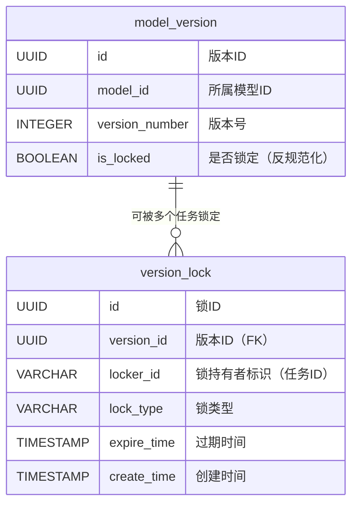
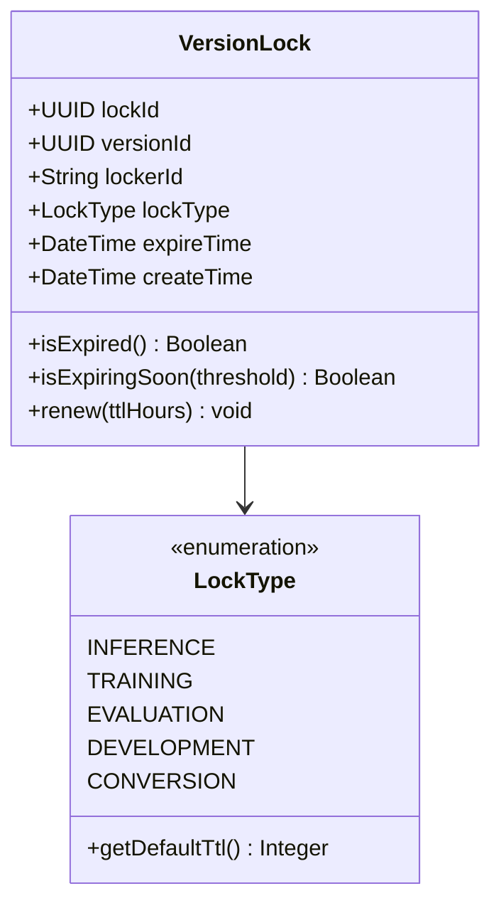
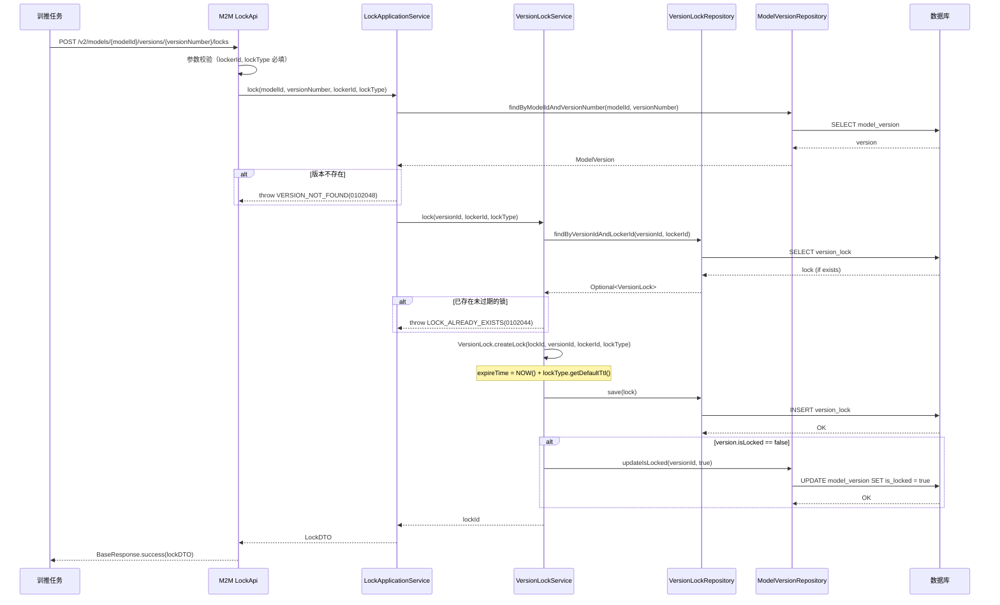
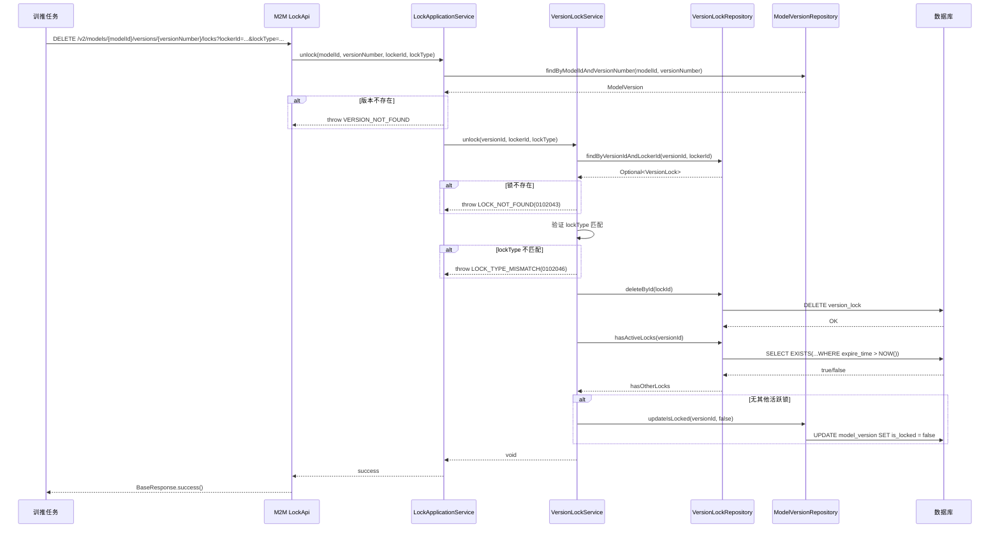
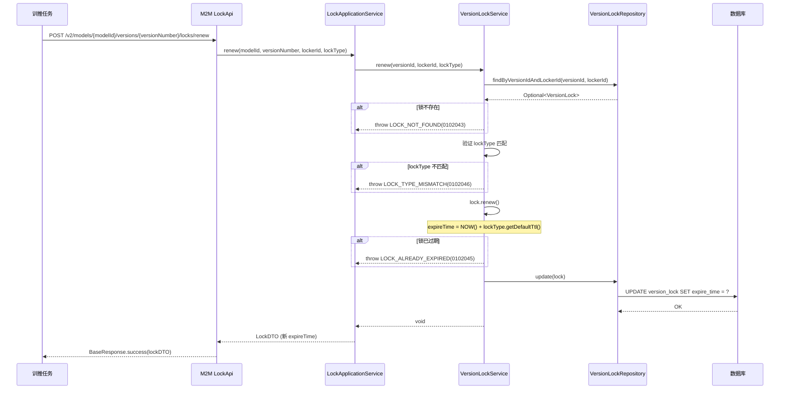
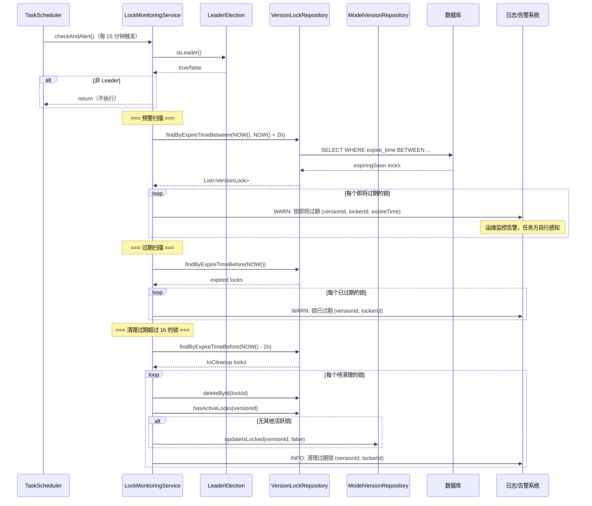
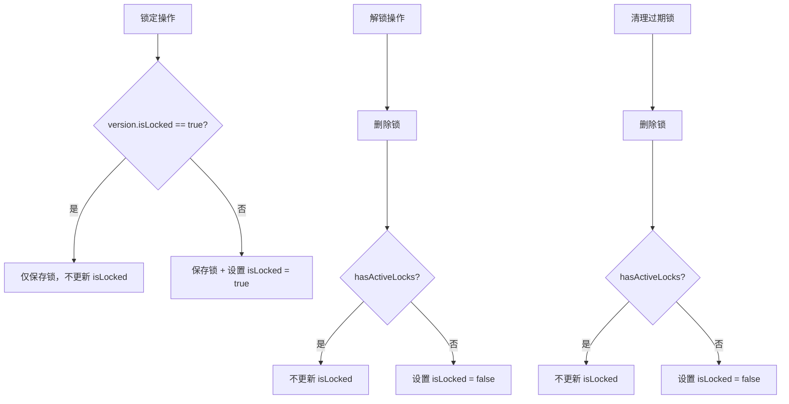

# Feature 5: 版本锁管理 — 特性设计文档

> **文档类型**: 特性设计文档
> **文档版本**: v1.0
> **编写日期**: 2026-04-28
> **适用范围**: ModelLite 平台模型仓库模块 Feature 5
> **目标读者**: 后端开发工程师

---

## 1. 特性概述

### 1.1 目标

实现版本锁管理能力，保护正在被平台任务使用的权重版本不被误删。提供 M2M 接口供推理/训练/评测/开发模块锁定和解锁版本，支持锁续约、过期清理、过期预警等生命周期管理能力。

### 1.2 范围

**IN（包含）**:
- VersionLock 聚合根的领域模型实现（含 LockType 枚举）
- VersionLockRepository 仓储接口与 MyBatis 实现
- VersionLockService 领域服务（锁定/解锁/续约核心逻辑 + isLocked 反规范化字段一致性维护）
- LockMonitoringService 领域服务（过期锁清理、过期预警、僵尸锁巡检）
- 锁定/解锁/续约的 M2M 接口
- Leader Election 机制（过期清理和预警巡检由 Leader 节点执行）
- 按 LockType 分级的 TTL 设计
- 锁过期后延迟清理策略

**OUT（不包含）**:
- 版本删除时的锁检查 — Feature 6（删除前检查 isLocked）
- 权重转换时的锁定 — Feature 7（ConvertTask 创建时自动锁定源版本）
- 操作日志上报 — Feature 8
- 人机接口（用户不直接操作锁，仅通过 M2M 接口）

### 1.3 依赖关系

| 依赖项 | 类型 | 说明 |
|--------|------|------|
| Feature 1: 基础设施与通用能力 | 特性 | 数据库 Schema（version_lock 表）、枚举定义（LockType）、索引设计、错误码定义（0102008 VERSION_LOCKED）、Leader Election 配置 |
| Feature 3: 模型与版本生命周期 | 特性 | Model 聚合（isLocked 反规范化字段）、ModelRepository（版本删除前检查锁）、版本删除校验逻辑 |
| 外部模块（推理/训练/评测/开发） | 外部依赖 | 通过 M2M 接口调用锁定/解锁/续约功能 |
| com.huawei.modellite.common 公共模块 | 外部依赖 | 提供 ModelLiteException、BaseResponse 等 |

### 1.4 需求追溯

| 需求编号 | 需求名称 | 本特性覆盖范围 |
|----------|----------|----------------|
| REQ-M2M-003 | 机机接口 — 权重版本锁定/解锁 | 完整实现（锁定、解锁、续约、过期清理、过期预警） |

### 1.5 设计决策记录

| 决策编号 | 决策内容 | 决策理由 |
|----------|----------|----------|
| F5-01 | lockerId 单独标识一个锁，lockType 是元数据（不存在同一任务对同一版本持有多种类型锁） | 简化锁标识逻辑，lockerId 与任务 ID 对应 |
| F5-02 | 任务方主动续约（调用 M2M 续约接口） | 任务方自己掌握续约时机，平台不依赖心跳机制 |
| F5-03 | 过期预警暂时以日志/告警方式（无事件总线） | 简化实现，运维监控告警，任务方自行感知 |
| F5-04 | isLocked 反规范化字段由 VersionLockService 在同一事务中维护 | 保证 isLocked 与 version_lock 表一致性 |
| F5-05 | TTL 按 LockType 分级：INFERENCE 24h, TRAINING 48h, EVALUATION 24h, DEVELOPMENT 12h | 覆盖各类型任务的最长运行时长，减少不必要的续约 |
| F5-06 | 巡检频率每 15 分钟，预警提前 2h，过期后延迟 1h 再清理 | 给任务方 1h 补救窗口，避免极端情况下的任务中断 |
| F5-07 | 续约每次延长当前 LockType 的默认 TTL | 简化逻辑，任务方只需定期调用续约接口 |
| F5-08 | 解锁只允许锁持有者调用，验证 lockerId + lockType 匹配 | 防止误解锁，保证锁的安全性 |
| F5-09 | 禁止删除被锁定的版本（Feature 3 已覆盖） | 锁的核心作用是保护版本不被删除 |
| F5-10 | 权重转换时平台内部锁定，新增 CONVERSION LockType | 转换是平台内部流程，不走 M2M 接口，CONVERSION 区分外部任务锁和内部流程锁 |

---

## 2. 数据库设计

### 2.1 新增/变更表 DDL

> 本特性涉及的 version_lock 表已在 Feature 1 中创建，DDL 不变更。此处补充数据字典、业务约束和索引说明。

#### version_lock（版本锁表）

**DDL**: 见 Feature 1 §2.1。

**本特性新增业务规则**:
- 同一 `(version_id, locker_id)` 组合下只允许存在一个锁（唯一约束）
- 锁创建时根据 lockType 设置 TTL（INFERENCE 24h, TRAINING 48h, EVALUATION 24h, DEVELOPMENT 12h, CONVERSION 48h）
- 锁过期后不立即删除，等待 1h 后由 Leader 巡检清理
- 解锁操作需验证 lockerId + lockType 匹配
- 锁删除后需同步更新 model_version.is_locked 字段

### 2.2 表关系图（ER 图）



### 2.3 索引设计

> 索引已在 Feature 1 §2.3 中定义。本特性新增一个唯一约束。

| 表名 | 縕引名 | 索引类型 | 索引字段 | 说明 | 状态 |
|------|--------|----------|----------|------|------|
| version_lock | uk_version_locker | UNIQUE | version_id, locker_id | 同一版本下同一任务只能有一个锁 | **本特性新增** |
| version_lock | idx_lock_version | B-tree | version_id | 查询版本的所有锁 | Feature 1 已创建 |
| version_lock | idx_lock_expire | B-tree | expire_time | Leader 巡检过期锁 | Feature 1 已创建 |
| version_lock | idx_lock_locker | B-tree | locker_id, lock_type | 按任务查锁 | Feature 1 已创建 |

**新增唯一约束 DDL**:

```sql
CREATE UNIQUE INDEX uk_version_locker ON version_lock(version_id, locker_id);
```

### 2.4 数据字典

#### version_lock 表

| 字段名 | 类型 | 是否必填 | 默认值 | 取值范围/说明 |
|--------|------|----------|--------|---------------|
| id | UUID | Y | 应用侧生成 | 锁 ID，UUID v4 |
| version_id | UUID | Y | — | 版本 ID（外键引用 model_version.id） |
| locker_id | VARCHAR(200) | Y | — | 锁持有者标识（任务 ID，如 `train-xxx`、`infer-xxx`） |
| lock_type | VARCHAR(30) | Y | — | 锁类型：`INFERENCE` / `TRAINING` / `EVALUATION` / `DEVELOPMENT` / `CONVERSION` |
| expire_time | TIMESTAMP WITH TIME ZONE | Y | 创建时间 + TTL | 锁过期时间；TTL 按 lockType 分级 |
| create_time | TIMESTAMP WITH TIME ZONE | Y | NOW() | 创建时间 |

#### LockType 枚举与 TTL 映射

| LockType | 说明 | 默认 TTL |
|----------|------|---------|
| INFERENCE | 推理服务锁定 | 24 小时 |
| TRAINING | 训练任务锁定 | 48 小时 |
| EVALUATION | 评测任务锁定 | 24 小时 |
| DEVELOPMENT | 开发环境锁定 | 12 小时 |
| CONVERSION | 权重转换锁定（平台内部） | 48 小时 |

---

## 3. 领域模型设计

### 3.1 类图

#### VersionLock 聚合



### 3.2 核心类定义

#### VersionLock（聚合根）

**包路径**: `com.huawei.modellite.repository.modelweight.domain.aggregate.versionlock`

| 字段名 | 类型 | 说明 | 约束 |
|--------|------|------|------|
| lockId | UUID | 锁唯一标识 | 创建后不可修改 |
| versionId | UUID | 关联版本 ID | 创建后不可修改 |
| lockerId | String | 锁持有者标识（任务 ID） | 创建后不可修改，最长 200 字符 |
| lockType | LockType | 锁类型 | 创建后不可修改 |
| expireTime | DateTime | 过期时间 | 续约时可延长 |
| createTime | DateTime | 创建时间 | 自动填充 |

**方法定义**:

| 方法名 | 参数 | 返回类型 | 说明 | 业务规则 |
|--------|------|----------|------|----------|
| createLock（静态工厂） | lockId, versionId, lockerId, lockType | VersionLock | 创建版本锁 | 前置：lockerId 非空；后置：expireTime = createTime + lockType.getDefaultTtl() |
| isExpired | — | boolean | 判断是否已过期 | expireTime < NOW() 返回 true |
| isExpiringSoon | thresholdHours: Integer | boolean | 判断是否即将过期 | expireTime < NOW() + thresholdHours 返回 true |
| renew | — | void | 续约锁 | 前置：未过期；后置：expireTime = NOW() + lockType.getDefaultTtl() |

#### LockType 枚举

**包路径**: `com.huawei.modellite.repository.modelweight.domain.enums`

| 枚举值 | 说明 | getDefaultTtl() 返回值 |
|--------|------|----------------------|
| INFERENCE | 推理服务 | 24（小时） |
| TRAINING | 训练任务 | 48（小时） |
| EVALUATION | 评测任务 | 24（小时） |
| DEVELOPMENT | 开发环境 | 12（小时） |
| CONVERSION | 权重转换（平台内部） | 48（小时） |

#### 关键方法伪代码

**VersionLock.createLock**:
```java
public static VersionLock createLock(UUID lockId, UUID versionId, String lockerId, LockType lockType) {
    if (lockerId == null || lockerId.trim().isEmpty()) {
        throw new ModelLiteException(ErrorCode.LOCK_LOCKER_ID_REQUIRED, "lockerId 不能为空");
    }
    DateTime createTime = DateTime.now();
    DateTime expireTime = createTime.plusHours(lockType.getDefaultTtl());
    return new VersionLock(lockId, versionId, lockerId.trim(), lockType, expireTime, createTime);
}
```

**VersionLock.isExpired**:
```java
public boolean isExpired() {
    return expireTime.isBefore(DateTime.now());
}
```

**VersionLock.isExpiringSoon**:
```java
public boolean isExpiringSoon(int thresholdHours) {
    return expireTime.isBefore(DateTime.now().plusHours(thresholdHours));
}
```

**VersionLock.renew**:
```java
public void renew() {
    if (isExpired()) {
        throw new ModelLiteException(ErrorCode.LOCK_ALREADY_EXPIRED, "锁已过期，无法续约");
    }
    this.expireTime = DateTime.now().plusHours(lockType.getDefaultTtl());
}
```

### 3.3 领域服务

#### VersionLockService

**包路径**: `com.huawei.modellite.repository.modelweight.domain.service`

**职责**: 锁定/解锁/续约的核心业务逻辑，协调 VersionLock 聚合与 Model 聚合的 isLocked 字段同步。

| 方法名 | 参数 | 返回类型 | 说明 |
|--------|------|----------|------|
| lock | versionId, lockerId, lockType | UUID | 锁定版本，返回 lockId |
| unlock | versionId, lockerId, lockType | void | 解锁版本（验证身份） |
| renew | versionId, lockerId, lockType | void | 续约锁（验证身份） |
| hasActiveLocks | versionId | boolean | 检查版本是否有活跃锁（未过期） |
| getLockByLocker | versionId, lockerId | Optional\<VersionLock\> | 查询指定任务的锁 |

**关键方法伪代码**:

**VersionLockService.lock**:
```java
public UUID lock(UUID versionId, String lockerId, LockType lockType) {
    // 1. 检查版本是否存在
    ModelVersion version = modelVersionRepository.findById(versionId)
        .orElseThrow(() -> new ModelLiteException(ErrorCode.VERSION_NOT_FOUND));
    
    // 2. 检查是否已存在同一 lockerId 的锁
    Optional<VersionLock> existingLock = versionLockRepository.findByVersionIdAndLockerId(versionId, lockerId);
    if (existingLock.isPresent() && !existingLock.get().isExpired()) {
        throw new ModelLiteException(ErrorCode.LOCK_ALREADY_EXISTS, "该任务已锁定此版本");
    }
    
    // 3. 创建锁
    UUID lockId = UUID.randomUUID();
    VersionLock lock = VersionLock.createLock(lockId, versionId, lockerId, lockType);
    
    // 4. 保存锁 + 更新 isLocked（同一事务）
    versionLockRepository.save(lock);
    if (!version.isLocked()) {
        modelVersionRepository.updateIsLocked(versionId, true);
    }
    
    return lockId;
}
```

**VersionLockService.unlock**:
```java
public void unlock(UUID versionId, String lockerId, LockType lockType) {
    // 1. 查询锁
    VersionLock lock = versionLockRepository.findByVersionIdAndLockerId(versionId, lockerId)
        .orElseThrow(() -> new ModelLiteException(ErrorCode.LOCK_NOT_FOUND, "未找到该任务的锁"));
    
    // 2. 验证 lockType 匹配
    if (lock.getLockType() != lockType) {
        throw new ModelLiteException(ErrorCode.LOCK_TYPE_MISMATCH, "锁类型不匹配");
    }
    
    // 3. 删除锁 + 更新 isLocked（同一事务）
    versionLockRepository.deleteById(lock.getLockId());
    
    // 4. 检查是否还有其他活跃锁
    boolean hasOtherLocks = versionLockRepository.hasActiveLocks(versionId);
    if (!hasOtherLocks) {
        modelVersionRepository.updateIsLocked(versionId, false);
    }
}
```

**VersionLockService.renew**:
```java
public void renew(UUID versionId, String lockerId, LockType lockType) {
    // 1. 查询锁
    VersionLock lock = versionLockRepository.findByVersionIdAndLockerId(versionId, lockerId)
        .orElseThrow(() -> new ModelLiteException(ErrorCode.LOCK_NOT_FOUND, "未找到该任务的锁"));
    
    // 2. 验证 lockType 匹配
    if (lock.getLockType() != lockType) {
        throw new ModelLiteException(ErrorCode.LOCK_TYPE_MISMATCH, "锁类型不匹配");
    }
    
    // 3. 续约
    lock.renew();
    
    // 4. 更新锁
    versionLockRepository.update(lock);
}
```

#### LockMonitoringService

**包路径**: `com.huawei.modellite.repository.modelweight.domain.service`

**职责**: 僵尸锁巡检、过期预警、过期锁清理。仅 Leader 节点执行。

| 方法名 | 参数 | 返回类型 | 说明 |
|--------|------|----------|------|
| scanExpiringSoonLocks | thresholdHours | List\<VersionLock\> | 扫描即将过期的锁（用于预警） |
| scanExpiredLocks | — | List\<VersionLock\> | 扫描已过期的锁（标记为待清理） |
| cleanupExpiredLocks | delayHours | void | 清理过期超过 delayHours 的锁 |
| checkAndAlert | — | void | Leader 巡检主入口：预警 + 标记过期 + 清理 |

**巡检主流程伪代码**:
```java
public void checkAndAlert() {
    // 仅 Leader 节点执行
    if (!leaderElection.isLeader()) {
        return;
    }
    
    // 1. 扫描即将过期的锁（expire_time < NOW() + 2h）
    List<VersionLock> expiringSoon = scanExpiringSoonLocks(2);
    for (VersionLock lock : expiringSoon) {
        // 发出预警（日志 + 告警）
        log.warn("锁即将过期: versionId={}, lockerId={}, expireTime={}", 
                lock.getVersionId(), lock.getLockerId(), lock.getExpireTime());
        // 发布事件（可选，当前仅日志）
        eventPublisher.publish(new VersionLockExpiringSoonEvent(lock));
    }
    
    // 2. 扫描已过期的锁（expire_time < NOW()）
    List<VersionLock> expired = scanExpiredLocks();
    for (VersionLock lock : expired) {
        log.warn("锁已过期: versionId={}, lockerId={}", 
                lock.getVersionId(), lock.getLockerId());
        eventPublisher.publish(new VersionLockExpiredEvent(lock));
    }
    
    // 3. 清理过期超过 1h 的锁（expire_time < NOW() - 1h）
    cleanupExpiredLocks(1);
}
```

**清理过期锁伪代码**:
```java
public void cleanupExpiredLocks(int delayHours) {
    List<VersionLock> toCleanup = versionLockRepository.findByExpireTimeBefore(
            DateTime.now().minusHours(delayHours));
    
    for (VersionLock lock : toCleanup) {
        // 删除锁 + 更新 isLocked（同一事务）
        versionLockRepository.deleteById(lock.getLockId());
        
        boolean hasOtherLocks = versionLockRepository.hasActiveLocks(lock.getVersionId());
        if (!hasOtherLocks) {
            modelVersionRepository.updateIsLocked(lock.getVersionId(), false);
        }
        
        log.info("清理过期锁: versionId={}, lockerId={}", 
                lock.getVersionId(), lock.getLockerId());
    }
}
```

### 3.4 仓储接口

#### VersionLockRepository

**包路径**: `com.huawei.modellite.repository.modelweight.domain.repository`

| 方法名 | 参数 | 返回类型 | 说明 |
|--------|------|----------|------|
| save | VersionLock | void | 保存锁 |
| findById | UUID lockId | Optional\<VersionLock\> | 按 ID 查询锁 |
| findByVersionId | UUID versionId | List\<VersionLock\> | 查询版本的所有锁 |
| findByVersionIdAndLockerId | UUID versionId, String lockerId | Optional\<VersionLock\> | 查询指定版本下指定任务的锁 |
| findByLockerId | String lockerId | List\<VersionLock\> | 查询任务持有的所有锁 |
| findByExpireTimeBefore | DateTime expireTimeThreshold | List\<VersionLock\> | 查询过期时间早于阈值的锁 |
| findByExpireTimeBetween | DateTime start, DateTime end | List\<VersionLock\> | 查询过期时间在范围内的锁（用于预警） |
| hasActiveLocks | UUID versionId | boolean | 检查版本是否有未过期的锁 |
| update | VersionLock | void | 更新锁（续约） |
| deleteById | UUID lockId | void | 删除锁 |
| deleteByVersionId | UUID versionId | void | 删除版本的所有锁（版本删除时调用） |

### 3.5 业务不变量

| 不变量名 | 说明 | 强制方式 |
|----------|------|----------|
| lockerId 唯一性 | 同一版本下同一 lockerId 只能有一个锁 | 数据库唯一约束 `uk_version_locker` + 代码校验 |
| TTL 按 LockType 分级 | 创建锁时根据 lockType 设置对应 TTL | VersionLock.createLock 方法保证 |
| 续约固定延长 TTL | 每次续约延长 lockType.getDefaultTtl() | VersionLock.renew 方法保证 |
| 解锁身份验证 | 只有锁持有者可解锁，验证 lockerId + lockType 匹配 | VersionLockService.unlock 方法保证 |
| isLocked 一致性 | isLocked 由 version_lock 表驱动，在同一事务中更新 | VersionLockService 在 lock/unlock 方法中保证 |
| 过期延迟清理 | 锁过期后等待 1h 再清理，给任务方补救窗口 | LockMonitoringService.cleanupExpiredLocks 保证 |
| 删除前检查锁 | 删除版本前必须检查 isLocked，锁定状态禁止删除 | Feature 3 Model 删除逻辑保证 |
| 仅 Leader 执行巡检 | 过期预警和清理只由 Leader 节点执行 | LockMonitoringService.checkAndAlert 方法保证 |

### 3.6 错误码定义

> Feature 1 已定义的版本锁相关错误码（本特性复用）:

| 错误码 | 枚举名 | HTTP 状态码 | 说明 | 来源 |
|--------|--------|-------------|------|------|
| 0102008 | VERSION_LOCKED | 400 | 版本已锁定，禁止删除 | Feature 1 |

> 本特性新增错误码:

| 错误码 | 枚举名 | HTTP 状态码 | 说明 |
|--------|--------|-------------|------|
| 0102043 | LOCK_NOT_FOUND | 404 | 未找到该任务的锁 |
| 0102044 | LOCK_ALREADY_EXISTS | 409 | 该任务已锁定此版本 |
| 0102045 | LOCK_ALREADY_EXPIRED | 400 | 锁已过期，无法续约 |
| 0102046 | LOCK_TYPE_MISMATCH | 400 | 锁类型不匹配，无法解锁/续约 |
| 0102047 | LOCK_LOCKER_ID_REQUIRED | 400 | lockerId 不能为空 |
| 0102048 | LOCK_VERSION_NOT_FOUND | 404 | 版本不存在 |

---

## 4. 接口设计

### 4.1 机机接口（M2M API）

#### 4.1.1 锁定版本

| 属性 | 值 |
|------|-----|
| URL | `POST /v2/models/{modelId}/versions/{versionNumber}/locks` |
| Method | POST |
| 描述 | 训推任务锁定指定版本，防止被删除 |

**Path Parameters**:

| 参数名 | 类型 | 必填 | 说明 |
|--------|------|------|------|
| modelId | UUID | Y | 模型 ID |
| versionNumber | Integer | Y | 版本号 |

**Request Body**:
```json
{
    "lockerId": "train-001",                   // 锁持有者标识（任务ID），必填
    "lockType": "TRAINING"                     // 锁类型，必填：INFERENCE / TRAINING / EVALUATION / DEVELOPMENT
}
```

**Response Body**（成功）:
```json
{
    "code": 0,
    "message": "success",
    "data": {
        "lockId": "uuid-lock-new",
        "versionId": "uuid-version-001",
        "lockerId": "train-001",
        "lockType": "TRAINING",
        "expireTime": "2026-04-30T10:00:00Z",
        "createTime": "2026-04-28T10:00:00Z"
    },
    "timestamp": "2026-04-28T10:00:00Z",
    "requestId": "req-uuid-xxx"
}
```

**错误码**:

| 错误码 | HTTP 状态码 | 说明 |
|--------|-------------|------|
| 0102001 | 404 | 模型不存在 |
| 0102006 | 404 | 版本不存在 |
| 0102048 | 404 | 版本不存在（按 versionNumber 查询） |
| 0102044 | 409 | 该任务已锁定此版本（且未过期） |
| 0102047 | 400 | lockerId 不能为空 |

**业务规则**:
- **前置条件**: 模型存在、版本存在、该任务未锁定此版本（或锁已过期）
- **TTL 设置**: 根据 lockType 设置默认 TTL（INFERENCE 24h, TRAINING 48h, EVALUATION 24h, DEVELOPMENT 12h）
- **认证方式**: SSL 证书校验（非 Gateway 路由）
- **isLocked 更新**: 如果版本原本无锁，设置 isLocked=true

---

#### 4.1.2 解锁版本

| 属性 | 值 |
|------|-----|
| URL | `DELETE /v2/models/{modelId}/versions/{versionNumber}/locks` |
| Method | DELETE |
| 描述 | 训推任务解锁指定版本 |

**Path Parameters**:

| 参数名 | 类型 | 必填 | 说明 |
|--------|------|------|------|
| modelId | UUID | Y | 模型 ID |
| versionNumber | Integer | Y | 版本号 |

**Query Parameters**:

| 参数名 | 类型 | 必填 | 说明 |
|--------|------|------|------|
| lockerId | String | Y | 锁持有者标识（任务ID） |
| lockType | String | Y | 锁类型 |

**Response Body**（成功）:
```json
{
    "code": 0,
    "message": "success",
    "data": null,
    "timestamp": "2026-04-28T12:00:00Z",
    "requestId": "req-uuid-xxx"
}
```

**错误码**:

| 错误码 | HTTP 状态码 | 说明 |
|--------|-------------|------|
| 0102001 | 404 | 模型不存在 |
| 0102006 | 404 | 版本不存在 |
| 0102043 | 404 | 未找到该任务的锁 |
| 0102046 | 400 | 锁类型不匹配 |

**业务规则**:
- **前置条件**: 锁存在、lockerId + lockType 匹配
- **身份验证**: 只有锁持有者可解锁
- **isLocked 更新**: 如果版本无其他活跃锁，设置 isLocked=false

---

#### 4.1.3 续约锁

| 属性 | 值 |
|------|-----|
| URL | `POST /v2/models/{modelId}/versions/{versionNumber}/locks/renew` |
| Method | POST |
| 描述 | 任务方续约锁，延长有效期 |

**Path Parameters**:

| 参数名 | 类型 | 必填 | 说明 |
|--------|------|------|------|
| modelId | UUID | Y | 模型 ID |
| versionNumber | Integer | Y | 版本号 |

**Request Body**:
```json
{
    "lockerId": "train-001",                   // 锁持有者标识，必填
    "lockType": "TRAINING"                     // 锁类型，必填
}
```

**Response Body**（成功）:
```json
{
    "code": 0,
    "message": "success",
    "data": {
        "lockId": "uuid-lock-001",
        "versionId": "uuid-version-001",
        "lockerId": "train-001",
        "lockType": "TRAINING",
        "expireTime": "2026-04-30T14:00:00Z",   // 新的过期时间
        "createTime": "2026-04-28T10:00:00Z"
    },
    "timestamp": "2026-04-28T14:00:00Z",
    "requestId": "req-uuid-xxx"
}
```

**错误码**:

| 错误码 | HTTP 状态码 | 说明 |
|--------|-------------|------|
| 0102001 | 404 | 模型不存在 |
| 0102006 | 404 | 版本不存在 |
| 0102043 | 404 | 未找到该任务的锁 |
| 0102045 | 400 | 锁已过期，无法续约 |
| 0102046 | 400 | 锁类型不匹配 |

**业务规则**:
- **前置条件**: 锁存在、未过期、lockerId + lockType 匹配
- **续约时长**: 延长 lockType.getDefaultTtl()（如 TRAINING 延长 48h）
- **新 expireTime**: NOW() + TTL

---

#### 4.1.4 查询版本的锁列表

| 属性 | 值 |
|------|-----|
| URL | `GET /v2/models/{modelId}/versions/{versionNumber}/locks` |
| Method | GET |
| 描述 | 查询指定版本的所有锁（供运维/调试使用） |

**Response Body**（成功）:
```json
{
    "code": 0,
    "message": "success",
    "data": [
        {
            "lockId": "uuid-lock-001",
            "lockerId": "train-001",
            "lockType": "TRAINING",
            "expireTime": "2026-04-30T10:00:00Z",
            "createTime": "2026-04-28T10:00:00Z",
            "expired": false,
            "expiringSoon": true
        },
        {
            "lockId": "uuid-lock-002",
            "lockerId": "infer-001",
            "lockType": "INFERENCE",
            "expireTime": "2026-04-29T10:00:00Z",
            "createTime": "2026-04-28T10:00:00Z",
            "expired": false,
            "expiringSoon": false
        }
    ],
    "timestamp": "2026-04-28T10:00:00Z",
    "requestId": "req-uuid-xxx"
}
```

**业务规则**:
- 返回所有锁（含已过期的，便于运维排查）
- 每个锁包含 expired 和 expiringSoon 字段（expiringSoon 阈值 2h）

---

#### 4.1.5 查询任务持有的锁

| 属性 | 值 |
|------|-----|
| URL | `GET /v2/locks?lockerId={lockerId}` |
| Method | GET |
| 描述 | 查询指定任务持有的所有锁 |

**Query Parameters**:

| 参数名 | 类型 | 必填 | 说明 |
|--------|------|------|------|
| lockerId | String | Y | 锁持有者标识（任务ID） |

**Response Body**（成功）:
```json
{
    "code": 0,
    "message": "success",
    "data": [
        {
            "lockId": "uuid-lock-001",
            "modelId": "uuid-model-001",
            "modelName": "glm-5-9b",
            "versionNumber": 3,
            "versionId": "uuid-version-003",
            "lockerId": "train-001",
            "lockType": "TRAINING",
            "expireTime": "2026-04-30T10:00:00Z",
            "createTime": "2026-04-28T10:00:00Z"
        }
    ],
    "timestamp": "2026-04-28T10:00:00Z",
    "requestId": "req-uuid-xxx"
}
```

**业务规则**:
- 返回该任务持有的所有锁（跨模型、跨版本）
- 便于任务方管理自己的锁

---

## 5. 核心业务流程

### 5.1 锁定流程



**流程说明**:
1. API 层校验参数（lockerId、lockType 必填）
2. 应用服务查询版本（按 modelId + versionNumber）
3. VersionLockService 检查是否已存在锁
4. 创建锁（TTL 根据 lockType 设置）
5. 保存锁 + 更新 isLocked（同一事务）
6. 返回 lockId 和锁信息

### 5.2 解锁流程



**流程说明**:
1. 查询版本和锁
2. 验证 lockerId + lockType 匹配（身份验证）
3. 删除锁
4. 检查是否还有其他活跃锁
5. 如果无其他锁，更新 isLocked=false

### 5.3 续约流程



**流程说明**:
1. 查询锁
2. 验证 lockerId + lockType 匹配
3. 检查锁未过期
4. 续约：expireTime = NOW() + TTL
5. 更新锁并返回新的过期时间

### 5.4 Leader 巡检流程



**流程说明**:
1. TaskScheduler 每 15 分钟触发巡检
2. 仅 Leader 节点执行
3. 扫描即将过期的锁（expire_time < NOW() + 2h）：发出预警日志
4. 扫描已过期的锁（expire_time < NOW()）：记录日志
5. 清理过期超过 1h 的锁（expire_time < NOW() - 1h）：删除锁 + 更新 isLocked

### 5.5 锁生命周期状态图

```mermaid
stateDiagram-v2
    [*] --> Active: 锁定（创建锁）
    Active --> Active: 续约（延长 expireTime）
    Active --> ExpiringSoon: expire_time < NOW() + 2h
    ExpiringSoon --> Active: 续约
    ExpiringSoon --> Expired: expire_time < NOW()
    Expired --> [*]: 清理（过期超过 1h）
    Active --> [*]: 解锁（任务方主动调用）
    ExpiringSoon --> [*]: 解锁
    Expired --> [*]: 解锁
```



**状态说明**:

| 状态 | 条件 | 说明 |
|------|------|------|
| Active | expire_time >= NOW() + 2h | 锁正常活跃 |
| ExpiringSoon | expire_time < NOW() + 2h 且 >= NOW() | 锁即将过期，触发预警 |
| Expired | expire_time < NOW() | 锁已过期，等待清理窗口 |

### 5.6 isLocked 一致性维护



**一致性规则**:
- 锁定：只有当版本原本无锁时才设置 isLocked=true
- 解锁/清理：只有当版本无其他活跃锁时才设置 isLocked=false
- 所有操作在同一事务中完成

---

## 6. 测试用例

### 6.1 单元测试（领域模型）

#### 6.1.1 VersionLock.createLock — 正常创建

**Given**:
- 有效的参数：versionId, lockerId="train-001", lockType=TRAINING

**When**:
- 调用 `VersionLock.createLock(lockId, versionId, "train-001", LockType.TRAINING)`

**Then**:
- 返回 VersionLock 对象
- lockType = TRAINING
- expireTime = createTime + 48h（TRAINING 默认 TTL）

---

#### 6.1.2 VersionLock.createLock — 各 LockType TTL 验证

**Given**:
- 各种 LockType

**When**:
- 分别调用 `VersionLock.createLock(..., lockType)`

**Then**:
- INFERENCE: expireTime = createTime + 24h
- TRAINING: expireTime = createTime + 48h
- EVALUATION: expireTime = createTime + 24h
- DEVELOPMENT: expireTime = createTime + 12h
- CONVERSION: expireTime = createTime + 48h

---

#### 6.1.3 VersionLock.createLock — lockerId 为空拒绝

**Given**:
- lockerId = null

**When**:
- 调用 `VersionLock.createLock(lockId, versionId, null, LockType.TRAINING)`

**Then**:
- 抛出 ModelLiteException，ErrorCode = LOCK_LOCKER_ID_REQUIRED(0102047)

---

#### 6.1.4 VersionLock.isExpired — 未过期

**Given**:
- VersionLock，expireTime = NOW() + 10h

**When**:
- 调用 `lock.isExpired()`

**Then**:
- 返回 false

---

#### 6.1.5 VersionLock.isExpired — 已过期

**Given**:
- VersionLock，expireTime = NOW() - 1h

**When**:
- 调用 `lock.isExpired()`

**Then**:
- 返回 true

---

#### 6.1.6 VersionLock.isExpiringSoon — 即将过期

**Given**:
- VersionLock，expireTime = NOW() + 1h

**When**:
- 调用 `lock.isExpiringSoon(2)`（阈值 2h）

**Then**:
- 返回 true（expireTime < NOW() + 2h）

---

#### 6.1.7 VersionLock.isExpiringSoon — 未即将过期

**Given**:
- VersionLock，expireTime = NOW() + 5h

**When**:
- 调用 `lock.isExpiringSoon(2)`

**Then**:
- 返回 false

---

#### 6.1.8 VersionLock.renew — 正常续约

**Given**:
- VersionLock，lockType=TRAINING，expireTime = NOW() + 10h（未过期）

**When**:
- 调用 `lock.renew()`

**Then**:
- expireTime = NOW() + 48h（TRAINING 默认 TTL）

---

#### 6.1.9 VersionLock.renew — 已过期拒绝

**Given**:
- VersionLock，expireTime = NOW() - 1h（已过期）

**When**:
- 调用 `lock.renew()`

**Then**:
- 抛出 ModelLiteException，ErrorCode = LOCK_ALREADY_EXPIRED(0102045)

---

#### 6.1.10 LockType.getDefaultTtl — 各类型 TTL

**Given**:
- 各 LockType 枚举值

**When**:
- 分别调用 `lockType.getDefaultTtl()`

**Then**:
- INFERENCE: 24
- TRAINING: 48
- EVALUATION: 24
- DEVELOPMENT: 12
- CONVERSION: 48

---

### 6.2 集成测试（仓储）

#### 6.2.1 VersionLockRepository.save — 保存锁

**Given**:
- H2 内存数据库已初始化

**When**:
- 调用 `versionLockRepository.save(lock)` 保存一个 TRAINING 类型锁
- 再调用 `versionLockRepository.findById(lockId)`

**Then**:
- 查询结果存在
- lockType = TRAINING
- expireTime 正确

---

#### 6.2.2 VersionLockRepository.findByVersionIdAndLockerId — 查询锁

**Given**:
- H2 数据库中某版本下有 lockerId="train-001" 的锁

**When**:
- 调用 `versionLockRepository.findByVersionIdAndLockerId(versionId, "train-001")`

**Then**:
- 返回 Optional 包含该锁

---

#### 6.2.3 VersionLockRepository.findByVersionIdAndLockerId — 无锁

**Given**:
- H2 数据库中某版本下无 lockerId="train-002" 的锁

**When**:
- 调用 `versionLockRepository.findByVersionIdAndLockerId(versionId, "train-002")`

**Then**:
- 返回 Optional.empty()

---

#### 6.2.4 VersionLockRepository.hasActiveLocks — 有活跃锁

**Given**:
- H2 数据库中某版本下有 2 个未过期的锁

**When**:
- 调用 `versionLockRepository.hasActiveLocks(versionId)`

**Then**:
- 返回 true

---

#### 6.2.5 VersionLockRepository.hasActiveLocks — 无活跃锁

**Given**:
- H2 数据库中某版本下只有已过期的锁

**When**:
- 调用 `versionLockRepository.hasActiveLocks(versionId)`

**Then**:
- 返回 false

---

#### 6.2.6 VersionLockRepository.findByExpireTimeBefore — 查询过期锁

**Given**:
- H2 数据库中有 3 个过期锁（expire_time < NOW()）和 2 个未过期锁

**When**:
- 调用 `versionLockRepository.findByExpireTimeBefore(DateTime.now())`

**Then**:
- 返回 3 个锁

---

#### 6.2.7 VersionLockRepository.findByExpireTimeBetween — 查询即将过期锁

**Given**:
- H2 数据库中有 2 个即将过期的锁（expire_time 在 NOW() 和 NOW()+2h 之间）

**When**:
- 调用 `versionLockRepository.findByExpireTimeBetween(NOW(), NOW().plusHours(2))`

**Then**:
- 返回 2 个锁

---

#### 6.2.8 VersionLockRepository.deleteByVersionId — 删除版本的所有锁

**Given**:
- H2 数据库中某版本下有 3 个锁

**When**:
- 调用 `versionLockRepository.deleteByVersionId(versionId)`
- 再调用 `versionLockRepository.findByVersionId(versionId)`

**Then**:
- 返回空列表

---

### 6.3 集成测试（领域服务）

#### 6.3.1 VersionLockService.lock — 正常锁定

**Given**:
- H2 数据库中存在版本，isLocked=false
- lockerId="train-001"

**When**:
- 调用 `versionLockService.lock(versionId, "train-001", LockType.TRAINING)`

**Then**:
- 返回 lockId
- version_lock 表新增 1 条记录
- model_version.is_locked = true

---

#### 6.3.2 VersionLockService.lock — 版本已有锁但未过期拒绝

**Given**:
- H2 数据库中版本已有 lockerId="train-001" 的未过期锁

**When**:
- 再次调用 `versionLockService.lock(versionId, "train-001", LockType.TRAINING)`

**Then**:
- 抛出 ModelLiteException，ErrorCode = LOCK_ALREADY_EXISTS(0102044)

---

#### 6.3.3 VersionLockService.lock — 版本已有锁但已过期允许

**Given**:
- H2 数据库中版本已有 lockerId="train-001" 的已过期锁（expire_time < NOW()）

**When**:
- 再次调用 `versionLockService.lock(versionId, "train-001", LockType.TRAINING)`

**Then**:
- 成功创建新锁（替换旧锁）
- version_lock 表记录更新

---

#### 6.3.4 VersionLockService.unlock — 正常解锁

**Given**:
- H2 数据库中版本有 lockerId="train-001" 的 TRAINING 类型锁，isLocked=true

**When**:
- 调用 `versionLockService.unlock(versionId, "train-001", LockType.TRAINING)`

**Then**:
- 锁被删除
- isLocked = false（无其他锁）

---

#### 6.3.5 VersionLockService.unlock — 锁不存在拒绝

**Given**:
- H2 数据库中版本无 lockerId="train-001" 的锁

**When**:
- 调用 `versionLockService.unlock(versionId, "train-001", LockType.TRAINING)`

**Then**:
- 抛出 ModelLiteException，ErrorCode = LOCK_NOT_FOUND(0102043)

---

#### 6.3.6 VersionLockService.unlock — lockType 不匹配拒绝

**Given**:
- H2 数据库中版本有 lockerId="train-001" 的 TRAINING 类型锁

**When**:
- 调用 `versionLockService.unlock(versionId, "train-001", LockType.INFERENCE)`

**Then**:
- 抛出 ModelLiteException，ErrorCode = LOCK_TYPE_MISMATCH(0102046)

---

#### 6.3.7 VersionLockService.unlock — 有其他锁时 isLocked 不变

**Given**:
- H2 数据库中版本有 2 个锁：lockerId="train-001" 和 lockerId="infer-001"

**When**:
- 调用 `versionLockService.unlock(versionId, "train-001", LockType.TRAINING)`

**Then**:
- lockerId="train-001" 的锁被删除
- isLocked = true（lockerId="infer-001" 的锁仍存在）

---

#### 6.3.8 VersionLockService.renew — 正常续约

**Given**:
- H2 数据库中版本有未过期的 TRAINING 类型锁

**When**:
- 调用 `versionLockService.renew(versionId, "train-001", LockType.TRAINING)`

**Then**:
- expireTime 更新为 NOW() + 48h

---

#### 6.3.9 VersionLockService.renew — 锁已过期拒绝

**Given**:
- H2 数据库中版本有已过期的锁

**When**:
- 调用 `versionLockService.renew(versionId, "train-001", LockType.TRAINING)`

**Then**:
- 抛出 ModelLiteException，ErrorCode = LOCK_ALREADY_EXPIRED(0102045)

---

#### 6.3.10 VersionLockService.hasActiveLocks — 有活跃锁

**Given**:
- H2 数据库中版本有未过期的锁

**When**:
- 调用 `versionLockService.hasActiveLocks(versionId)`

**Then**:
- 返回 true

---

### 6.4 API 测试（接口层）

#### 6.4.1 POST /v2/models/{modelId}/versions/{versionNumber}/locks — 锁定成功

**Given**:
- 数据库中存在模型和版本（versionNumber=3）
- 请求参数:
```json
{
    "lockerId": "train-001",
    "lockType": "TRAINING"
}
```

**When**:
- 调用 `POST /v2/models/{modelId}/versions/3/locks`

**Then**:
- HTTP 状态码 = 200
- Response.code = 0
- Response.data.lockId 不为空
- Response.data.lockType = "TRAINING"
- Response.data.expireTime = createTime + 48h

---

#### 6.4.2 POST /v2/models/{modelId}/versions/{versionNumber}/locks — 模型不存在

**Given**:
- 数据库中无该模型

**When**:
- 调用 `POST /v2/models/non-existent/versions/3/locks`

**Then**:
- HTTP 状态码 = 404
- Response.code = 0102001

---

#### 6.4.3 POST /v2/models/{modelId}/versions/{versionNumber}/locks — 版本不存在

**Given**:
- 数据库中存在模型但无 versionNumber=999

**When**:
- 调用 `POST /v2/models/{modelId}/versions/999/locks`

**Then**:
- HTTP 状态码 = 404
- Response.code = 0102048

---

#### 6.4.4 POST /v2/models/{modelId}/versions/{versionNumber}/locks — 已存在锁

**Given**:
- 数据库中版本已有 lockerId="train-001" 的未过期锁

**When**:
- 再次调用 `POST /v2/models/{modelId}/versions/3/locks`（相同 lockerId）

**Then**:
- HTTP 状态码 = 409
- Response.code = 0102044

---

#### 6.4.5 DELETE /v2/models/{modelId}/versions/{versionNumber}/locks — 解锁成功

**Given**:
- 数据库中版本有 lockerId="train-001" 的 TRAINING 类型锁

**When**:
- 调用 `DELETE /v2/models/{modelId}/versions/3/locks?lockerId=train-001&lockType=TRAINING`

**Then**:
- HTTP 状态码 = 200
- Response.code = 0
- 数据库 version_lock 表该锁被删除
- 数据库 model_version.is_locked = false（无其他锁）

---

#### 6.4.6 DELETE /v2/models/{modelId}/versions/{versionNumber}/locks — 锁不存在

**Given**:
- 数据库中版本无 lockerId="train-002" 的锁

**When**:
- 调用 `DELETE /v2/models/{modelId}/versions/3/locks?lockerId=train-002&lockType=TRAINING`

**Then**:
- HTTP 状态码 = 404
- Response.code = 0102043

---

#### 6.4.7 DELETE /v2/models/{modelId}/versions/{versionNumber}/locks — lockType 不匹配

**Given**:
- 数据库中版本有 lockerId="train-001" 的 TRAINING 类型锁

**When**:
- 调用 `DELETE /v2/models/{modelId}/versions/3/locks?lockerId=train-001&lockType=INFERENCE`

**Then**:
- HTTP 状态码 = 400
- Response.code = 0102046

---

#### 6.4.8 POST /v2/models/{modelId}/versions/{versionNumber}/locks/renew — 续约成功

**Given**:
- 数据库中版本有未过期的 TRAINING 类型锁

**When**:
- 调用 `POST /v2/models/{modelId}/versions/3/locks/renew`
```json
{
    "lockerId": "train-001",
    "lockType": "TRAINING"
}
```

**Then**:
- HTTP 状态码 = 200
- Response.data.expireTime 更新为 NOW() + 48h

---

#### 6.4.9 POST /v2/models/{modelId}/versions/{versionNumber}/locks/renew — 锁已过期

**Given**:
- 数据库中版本有已过期的锁

**When**:
- 调用续约接口

**Then**:
- HTTP 状态码 = 400
- Response.code = 0102045

---

#### 6.4.10 GET /v2/models/{modelId}/versions/{versionNumber}/locks — 查询锁列表

**Given**:
- 数据库中版本有 2 个锁

**When**:
- 调用 `GET /v2/models/{modelId}/versions/3/locks`

**Then**:
- HTTP 状态码 = 200
- Response.data 包含 2 个锁
- 每个锁包含 expired 和 expiringSoon 字段

---

#### 6.4.11 GET /v2/locks?lockerId={lockerId} — 查询任务的锁

**Given**:
- 数据库中 lockerId="train-001" 持有 2 个锁（跨不同版本）

**When**:
- 调用 `GET /v2/locks?lockerId=train-001`

**Then**:
- HTTP 状态码 = 200
- Response.data 包含 2 个锁
- 每个锁包含 modelId, modelName, versionNumber 信息

---

### 6.5 Leader 巡检测试

#### 6.5.1 LockMonitoringService.checkAndAlert — Leader 执行

**Given**:
- LeaderElection.isLeader() = true
- H2 数据库中有即将过期的锁、已过期的锁、过期超过 1h 的锁

**When**:
- 调用 `lockMonitoringService.checkAndAlert()`

**Then**:
- 即将过期的锁：日志 WARN 输出预警信息
- 已过期的锁：日志 WARN 输出过期信息
- 过期超过 1h 的锁：被删除，isLocked 更新

---

#### 6.5.2 LockMonitoringService.checkAndAlert — 非 Leader 不执行

**Given**:
- LeaderElection.isLeader() = false

**When**:
- 调用 `lockMonitoringService.checkAndAlert()`

**Then**:
- 方法直接返回，不执行任何操作

---

#### 6.5.3 LockMonitoringService.cleanupExpiredLocks — 清理过期锁

**Given**:
- H2 数据库中有 2 个过期超过 1h 的锁

**When**:
- 调用 `lockMonitoringService.cleanupExpiredLocks(1)`

**Then**:
- 2 个锁被删除
- 若无其他锁，对应版本的 isLocked = false

---

**文档结束**