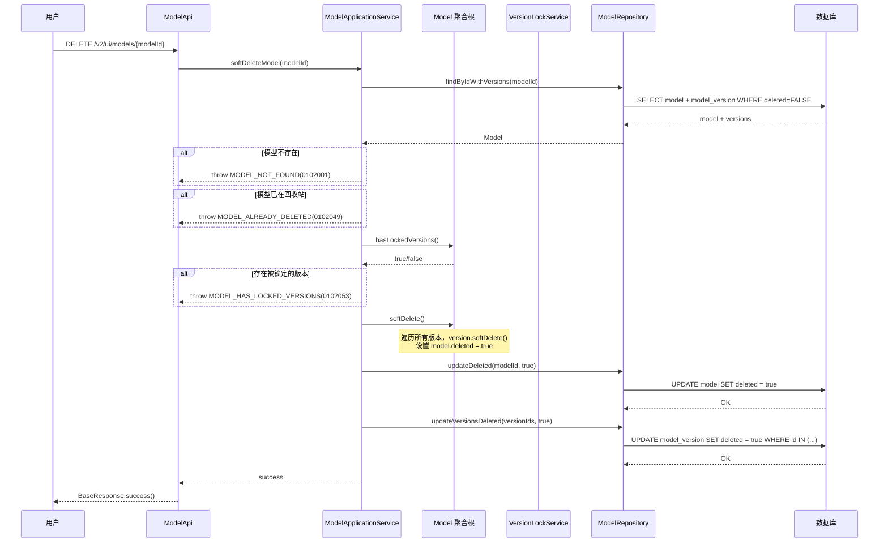
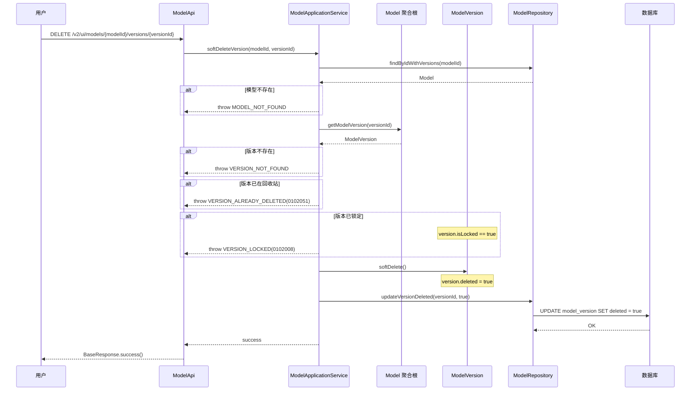
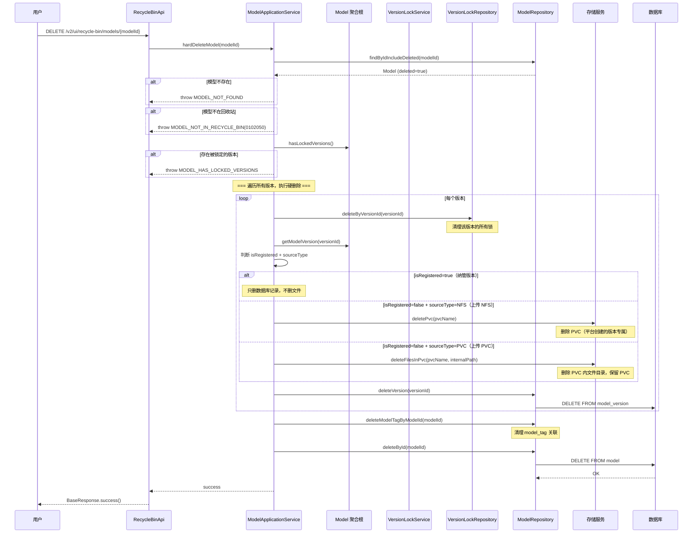
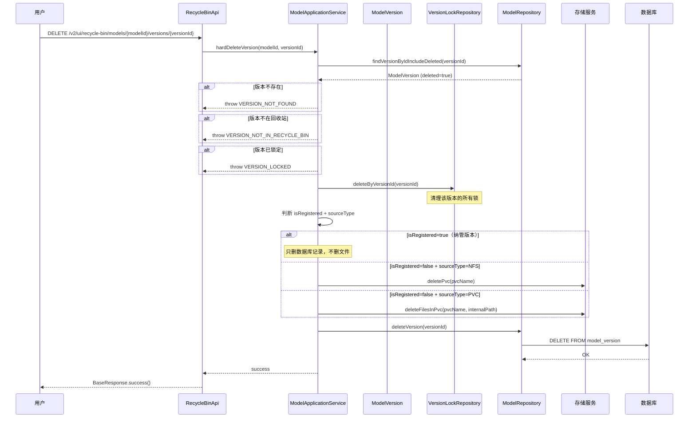
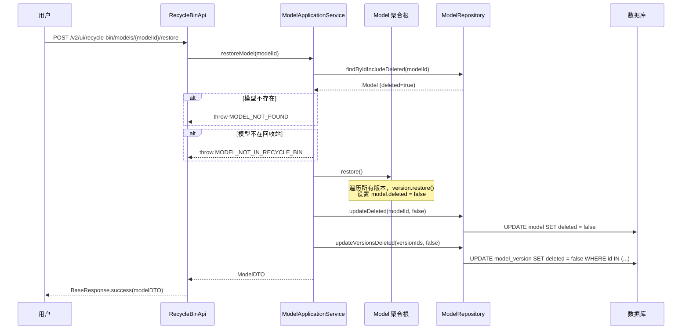
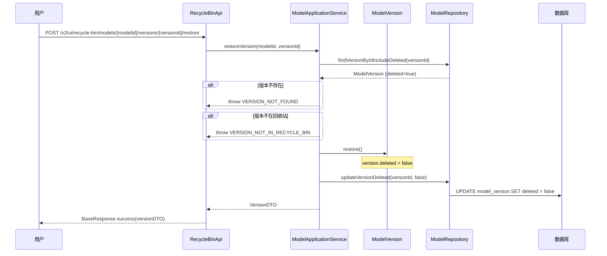

# Feature 6: 删除恢复与回收站 — 特性设计文档

> **文档类型**: 特性设计文档
> **文档版本**: v1.0
> **编写日期**: 2026-04-28
> **适用范围**: ModelLite 平台模型仓库模块 Feature 6
> **目标读者**: 后端开发工程师

---

## 1. 特性概述

### 1.1 目标

实现模型和版本的删除恢复能力，包括软删除（进入回收站）、硬删除（彻底删除）、恢复（从回收站恢复），以及回收站管理。删除操作前必须检查版本锁状态，保护正在被训推任务使用的权重版本不被误删。

### 1.2 范围

**IN（包含）**:
- Model 聚合根的 softDelete/hardDelete/restore 方法
- ModelVersion 实体的 softDelete/hardDelete/restore 方法
- ModelApplicationService 删除恢复相关的应用服务
- ModelRepository 删除恢复相关的仓储方法（含回收站查询）
- 软删除的人机接口（模型级删除、版本级删除）
- 硬删除的人机接口（从回收站删除模型、删除版本）
- 恢复的人机接口（从回收站恢复模型、恢复版本）
- 回收站列表查询接口（全局回收站，RBAC 过滤）
- 删除前锁校验（调用 Feature 5 的 VersionLockService.hasActiveLocks）
- 硬删除时的存储清理（根据 isRegistered 和 sourceType 区分处理）

**OUT（不包含）**:
- 版本锁管理 — Feature 5
- 操作日志上报 — Feature 8
- 回收站自动清理 — 不实现，完全依赖用户手动硬删除
- 空版本（NoWeight）自动清理 — 不实现，依赖用户手动删除

### 1.3 依赖关系

| 依赖项 | 类型 | 说明 |
|--------|------|------|
| Feature 1: 基础设施与通用能力 | 特性 | 数据库 Schema（model/model_version 的 deleted 字段）、错误码定义（0102001-0102009）、部分索引设计 |
| Feature 3: 模型与版本生命周期 | 特性 | Model 聚合、ModelVersion 实体、ModelRepository、ModelApplicationService |
| Feature 5: 版本锁管理 | 特性 | VersionLockService.hasActiveLocks 方法（删除前锁校验）、VersionLockRepository.deleteByVersionId（硬删除时清理锁） |
| com.huawei.modellite.common 公共模块 | 外部依赖 | 提供 ModelLiteException、BaseResponse 等 |

### 1.4 需求追溯

| 需求编号 | 需求名称 | 本特性覆盖范围 |
|----------|----------|----------------|
| REQ-DELETE-001 | 模型软删除 | 完整实现（模型级删除级联删除所有版本、版本级删除，删除前锁校验） |
| REQ-DELETE-002 | 模型硬删除 | 完整实现（删除数据库记录 + 存储文件，删除前锁校验，纳管版本只删记录） |
| REQ-DELETE-003 | 模型恢复 | 完整实现（恢复到软删除前状态） |
| REQ-RECYCLE-001 | 回收站管理 | 完整实现（全局列表、RBAC 过滤、查看/恢复/硬删除） |

### 1.5 设计决策记录

| 决策编号 | 决策内容 | 决策理由 |
|----------|----------|----------|
| F6-01 | 硬删除 PVC 处理策略：纳管版本只删记录；上传 NFS 模式删 PVC；上传 PVC 模式删文件保留 PVC | 根据 isRegistered 和 sourceType 区分：纳管是用户资产只引用，上传 NFS 是平台创建的版本专属 PVC，上传 PVC 是用户提供可能共享 |
| F6-02 | 模型级删除：只要有一个版本被锁定，整个模型都不能删除 | 简化逻辑，用户需要先等任务结束解锁再删除 |
| F6-03 | 软删除后名称仍唯一（方案 B），恢复无需名称校验 | 模型是稳定资产，误删恢复场景更重要；需同步修改 Feature 1/3 设计（见 §1.6） |
| F6-04 | 不实现回收站自动清理 | 完全依赖用户手动硬删除，避免自动删除用户资产 |
| F6-05 | 不实现空版本（NoWeight）自动清理 | 避免平台自动删除用户可能还在使用的版本 |
| F6-06 | 硬删除时级联清理版本锁 | VersionLockRepository.deleteByVersionId 删除版本的所有锁 |

### 1.6 设计变更影响说明

> **重要**：决策 F6-03（方案 B）会影响 Feature 1 和 Feature 3 的设计，需后续统一更新。

| 影响文档 | 影响内容 | 修改说明 |
|----------|----------|----------|
| Feature 1 §2.3 | 唯一约束 `uk_model_name` | 从部分索引 `WHERE deleted=FALSE` 改为全局唯一索引（无 WHERE 条件） |
| Feature 3 §3.5 | existsByCategoryAndTypeAndName 方法 | 查询条件去掉 `deleted=FALSE`（全局唯一约束保证） |
| Feature 3 §4.1.1 | 创建模型错误提示 | 优化提示：区分"名称已存在（未删除）"和"名称已存在（回收站）" |

---

## 2. 数据库设计

### 2.1 新增/变更表 DDL

> 本特性不新增表，使用 Feature 1 已创建的 model 和 model_version 表的 deleted 字段。无 DDL 变更。

### 2.2 deleted 字段说明

#### model 表

| 字段名 | 类型 | 默认值 | 说明 |
|--------|------|--------|------|
| deleted | BOOLEAN | FALSE | 软删除标记；TRUE 表示已移入回收站 |

**业务规则**:
- 软删除：`UPDATE model SET deleted = TRUE WHERE id = ?`
- 硬删除：`DELETE FROM model WHERE id = ?`
- 恢复：`UPDATE model SET deleted = FALSE WHERE id = ?`
- 模型级软删除级联：同时更新所有 model_version.deleted = TRUE

#### model_version 表

| 字段名 | 类型 | 默认值 | 说明 |
|--------|------|--------|------|
| deleted | BOOLEAN | FALSE | 软删除标记；TRUE 表示已移入回收站 |

**业务规则**:
- 版本级软删除：仅更新该版本的 deleted = TRUE，不影响其他版本
- 模型级软删除级联：所有版本的 deleted = TRUE
- 硬删除：`DELETE FROM model_version WHERE id = ?`
- 恢复：`UPDATE model_version SET deleted = FALSE WHERE id = ?`

### 2.3 索引与查询影响

> 当前设计使用部分索引 `WHERE deleted = FALSE`，回收站查询需使用反向条件。

| 查询场景 | 索引使用 | SQL 条件 |
|----------|---------|----------|
| 正常模型列表 | idx_model_* | `WHERE deleted = FALSE` |
| 回收站列表 | 全表扫描（小数据量） | `WHERE deleted = TRUE` |
| 版本列表（正常） | idx_version_model_id | `WHERE deleted = FALSE` |
| 版本列表（回收站） | idx_version_model_id | `WHERE deleted = TRUE` |

> **性能考虑**：回收站数据量通常较小，无需专门优化索引。如后续需要，可新增 `idx_model_deleted` 索引。

---

## 3. 领域模型设计

### 3.1 Model 聚合根新增方法

> 本特性在 Feature 3 已定义的 Model 聚合根上新增删除恢复方法。

**包路径**: `com.huawei.modellite.repository.modelweight.domain.aggregate.model`

| 方法名 | 参数 | 返回类型 | 说明 | 业务规则 |
|--------|------|----------|------|----------|
| softDelete | — | void | 软删除模型（级联删除所有版本） | 前置：所有版本未锁定；后置：deleted=true，所有版本 deleted=true |
| hardDelete | — | void | 硬删除模型（仅供领域服务调用） | 前置：已软删除；后置：聚合根销毁（数据库删除） |
| restore | — | void | 恢复模型（级联恢复所有版本） | 前置：已软删除；后置：deleted=false，所有版本 deleted=false |
| hasLockedVersions | — | boolean | 检查是否有被锁定的版本 | 用于删除前校验 |

#### 关键方法伪代码

**Model.softDelete**:
```java
public void softDelete() {
    // 1. 检查是否有被锁定的版本
    if (hasLockedVersions()) {
        throw new ModelLiteException(ErrorCode.VERSION_LOCKED, 
                "存在被锁定的版本，无法删除。请等待任务结束后再删除。");
    }
    
    // 2. 级联软删除所有版本
    for (ModelVersion version : versions) {
        version.softDelete();
    }
    
    // 3. 标记模型已删除
    this.deleted = true;
    this.updateTime = DateTime.now();
}
```

**Model.hasLockedVersions**:
```java
public boolean hasLockedVersions() {
    return versions.stream().anyMatch(v -> v.isLocked());
}
```

**Model.restore**:
```java
public void restore() {
    // 1. 级联恢复所有版本
    for (ModelVersion version : versions) {
        version.restore();
    }
    
    // 2. 标记模型已恢复
    this.deleted = false;
    this.updateTime = DateTime.now();
}
```

### 3.2 ModelVersion 实体新增方法

| 方法名 | 参数 | 返回类型 | 说明 | 业务规则 |
|--------|------|----------|------|----------|
| softDelete | — | void | 软删除版本 | 前置：未锁定；后置：deleted=true |
| hardDelete | — | void | 硬删除版本（仅供领域服务调用） | 前置：已软删除；后置：实体销毁（数据库删除） |
| restore | — | void | 恢复版本 | 前置：已软删除；后置：deleted=false |

#### 关键方法伪代码

**ModelVersion.softDelete**:
```java
public void softDelete() {
    if (this.isLocked) {
        throw new ModelLiteException(ErrorCode.VERSION_LOCKED, 
                "版本已锁定，无法删除");
    }
    this.deleted = true;
    this.updateTime = DateTime.now();
}
```

**ModelVersion.restore**:
```java
public void restore() {
    this.deleted = false;
    this.updateTime = DateTime.now();
}
```

### 3.3 领域服务

本特性核心逻辑在聚合根方法中实现。应用服务层负责编排跨聚合操作（锁校验、存储清理、锁清理）。

### 3.4 仓储接口新增方法

#### ModelRepository

**包路径**: `com.huawei.modellite.repository.modelweight.domain.repository`

| 方法名 | 参数 | 返回类型 | 说明 |
|--------|------|----------|------|
| findDeleted | ModelQueryCondition | PageResult\<Model\> | 查询回收站中的模型（WHERE deleted=TRUE） |
| findDeletedByResourceGroups | List\<String\> resourceGroups, ModelQueryCondition condition | PageResult\<Model\> | 按资源组过滤回收站模型（RBAC） |
| findByIdIncludeDeleted | UUID modelId | Optional\<Model\> | 按 ID 查询模型（含已删除，用于恢复/硬删除） |
| updateDeleted | UUID modelId, boolean deleted | void | 更新 deleted 字段 |
| deleteById | UUID modelId | void | 硬删除模型（物理删除） |

#### ModelVersionRepository（通过 ModelRepository 操作）

| 方法名 | 参数 | 返回类型 | 说明 |
|--------|------|----------|------|
| findDeletedByModelId | UUID modelId | List\<ModelVersion\> | 查询模型在回收站中的版本 |
| findByIdIncludeDeleted | UUID versionId | Optional\<ModelVersion\> | 按 ID 查询版本（含已删除） |
| updateDeletedByVersionId | UUID versionId, boolean deleted | void | 更新版本 deleted 字段 |
| deleteByVersionId | UUID versionId | void | 硬删除版本 |

### 3.5 业务不变量

| 不变量名 | 说明 | 强制方式 |
|----------|------|----------|
| 删除前锁校验 | 软删除和硬删除前必须检查版本锁状态，锁定版本禁止删除 | Model.softDelete / 应用服务层校验 |
| 模型级删除级联 | 模型级软删除级联删除所有版本，恢复级联恢复所有版本 | Model.softDelete / Model.restore 方法保证 |
| 版本级删除独立 | 版本级删除不影响模型和其他版本 | 应用服务层单独操作版本 |
| 硬删除必须已软删除 | 硬删除只能从回收站执行，不能直接硬删除未删除的模型/版本 | 应用服务层校验 deleted=true |
| 纳管版本不删文件 | isRegistered=true 的版本硬删除只删数据库记录，不删存储文件 | 应用服务层根据 isRegistered 判断 |
| 硬删除级联清理锁 | 硬删除版本时清理该版本的所有锁 | 应用服务调用 VersionLockRepository.deleteByVersionId |

### 3.6 错误码定义

> Feature 1 已定义的错误码（本特性复用）:

| 错误码 | 枚举名 | HTTP 状态码 | 说明 | 来源 |
|--------|--------|-------------|------|------|
| 0102001 | MODEL_NOT_FOUND | 404 | 模型不存在 | Feature 1 |
| 0102006 | VERSION_NOT_FOUND | 404 | 版本不存在 | Feature 1 |
| 0102008 | VERSION_LOCKED | 400 | 版本已锁定，禁止删除 | Feature 1 |

> 本特性新增错误码:

| 错误码 | 枚举名 | HTTP 状态码 | 说明 |
|--------|--------|-------------|------|
| 0102049 | MODEL_ALREADY_DELETED | 409 | 模型已在回收站中 |
| 0102050 | MODEL_NOT_IN_RECYCLE_BIN | 400 | 模型不在回收站中，无法硬删除/恢复 |
| 0102051 | VERSION_ALREADY_DELETED | 409 | 版本已在回收站中 |
| 0102052 | VERSION_NOT_IN_RECYCLE_BIN | 400 | 版本不在回收站中，无法硬删除/恢复 |
| 0102053 | MODEL_HAS_LOCKED_VERSIONS | 400 | 模型存在被锁定的版本，无法删除 |

---

## 4. 接口设计

### 4.1 人机接口（User API）

#### 4.1.1 软删除模型（模型级删除）

| 属性 | 值 |
|------|-----|
| URL | `DELETE /v2/ui/models/{modelId}` |
| Method | DELETE |
| 描述 | 软删除模型，级联删除所有版本，进入回收站 |

**Path Parameters**:

| 参数名 | 类型 | 必填 | 说明 |
|--------|------|------|------|
| modelId | UUID | Y | 模型 ID |

**Response Body**（成功）:
```json
{
    "code": 0,
    "message": "success",
    "data": null,
    "timestamp": "2026-04-28T10:00:00Z",
    "requestId": "req-uuid-xxx"
}
```

**错误码**:

| 错误码 | HTTP 状态码 | 说明 |
|--------|-------------|------|
| 0102001 | 404 | 模型不存在 |
| 0102049 | 409 | 模型已在回收站中 |
| 0102053 | 400 | 存在被锁定的版本，无法删除 |
| 0102008 | 400 | 版本已锁定（单个版本级删除时） |

**业务规则**:
- **前置条件**: 模型存在、不在回收站中、所有版本未锁定
- **级联删除**: 所有版本的 deleted=true
- **RBAC**: 只有模型所属资源组的用户可删除
- **回收站可见**: 软删除后进入回收站，其他用户（有权限）可看到

---

#### 4.1.2 软删除版本（版本级删除）

| 属性 | 值 |
|------|-----|
| URL | `DELETE /v2/ui/models/{modelId}/versions/{versionId}` |
| Method | DELETE |
| 描述 | 软删除指定版本，不影响模型和其他版本 |

**Path Parameters**:

| 参数名 | 类型 | 必填 | 说明 |
|--------|------|------|------|
| modelId | UUID | Y | 模型 ID |
| versionId | UUID | Y | 版本 ID |

**Response Body**（成功）:
```json
{
    "code": 0,
    "message": "success",
    "data": null,
    "timestamp": "2026-04-28T10:00:00Z",
    "requestId": "req-uuid-xxx"
}
```

**错误码**:

| 错误码 | HTTP 状态码 | 说明 |
|--------|-------------|------|
| 0102001 | 404 | 模型不存在 |
| 0102006 | 404 | 版本不存在 |
| 0102051 | 409 | 版本已在回收站中 |
| 0102008 | 400 | 版本已锁定 |

**业务规则**:
- **前置条件**: 版本存在、不在回收站中、未锁定
- **独立删除**: 不影响模型和其他版本
- **RBAC**: 只有模型所属资源组的用户可删除

---

#### 4.1.3 硬删除模型（从回收站删除）

| 属性 | 值 |
|------|-----|
| URL | `DELETE /v2/ui/recycle-bin/models/{modelId}` |
| Method | DELETE |
| 描述 | 从回收站彻底删除模型，不可恢复 |

**Path Parameters**:

| 参数名 | 类型 | 必填 | 说明 |
|--------|------|------|------|
| modelId | UUID | Y | 模型 ID |

**Response Body**（成功）:
```json
{
    "code": 0,
    "message": "success",
    "data": null,
    "timestamp": "2026-04-28T10:00:00Z",
    "requestId": "req-uuid-xxx"
}
```

**错误码**:

| 错误码 | HTTP 状态码 | 说明 |
|--------|-------------|------|
| 0102001 | 404 | 模型不存在 |
| 0102050 | 400 | 模型不在回收站中 |
| 0102053 | 400 | 存在被锁定的版本（极端情况：软删除后版本仍被锁定） |
| 0102008 | 400 | 版本已锁定 |

**业务规则**:
- **前置条件**: 模型存在、在回收站中（deleted=true）、所有版本未锁定
- **物理删除**: 删除数据库记录 + 存储文件（根据 isRegistered 和 sourceType）
- **级联清理**: 删除所有版本 + 清理所有版本锁 + 清理 model_tag 关联
- **RBAC**: 只有模型所属资源组的用户可硬删除

---

#### 4.1.4 硬删除版本（从回收站删除）

| 属性 | 值 |
|------|-----|
| URL | `DELETE /v2/ui/recycle-bin/models/{modelId}/versions/{versionId}` |
| Method | DELETE |
| 描述 | 从回收站彻底删除指定版本，不可恢复 |

**Path Parameters**:

| 参数名 | 类型 | 必填 | 说明 |
|--------|------|------|------|
| modelId | UUID | Y | 模型 ID |
| versionId | UUID | Y | 版本 ID |

**Response Body**（成功）:
```json
{
    "code": 0,
    "message": "success",
    "data": null,
    "timestamp": "2026-04-28T10:00:00Z",
    "requestId": "req-uuid-xxx"
}
```

**错误码**:

| 错误码 | HTTP 状态码 | 说明 |
|--------|-------------|------|
| 0102001 | 404 | 模型不存在 |
| 0102006 | 404 | 版本不存在 |
| 0102052 | 400 | 版本不在回收站中 |
| 0102008 | 400 | 版本已锁定 |

**业务规则**:
- **前置条件**: 版本存在、在回收站中、未锁定
- **物理删除**: 删除数据库记录 + 存储文件（根据 isRegistered 和 sourceType）
- **清理锁**: 删除该版本的所有锁
- **RBAC**: 只有模型所属资源组的用户可硬删除

---

#### 4.1.5 恢复模型（从回收站恢复）

| 属性 | 值 |
|------|-----|
| URL | `POST /v2/ui/recycle-bin/models/{modelId}/restore` |
| Method | POST |
| 描述 | 从回收站恢复模型，级联恢复所有版本 |

**Path Parameters**:

| 参数名 | 类型 | 必填 | 说明 |
|--------|------|------|------|
| modelId | UUID | Y | 模型 ID |

**Response Body**（成功）:
```json
{
    "code": 0,
    "message": "success",
    "data": {
        "id": "uuid-model-001",
        "name": "glm-5-9b",
        "deleted": false,
        "versionCount": 3,
        "restoreTime": "2026-04-28T10:00:00Z"
    },
    "timestamp": "2026-04-28T10:00:00Z",
    "requestId": "req-uuid-xxx"
}
```

**错误码**:

| 错误码 | HTTP 状态码 | 说明 |
|--------|-------------|------|
| 0102001 | 404 | 模型不存在 |
| 0102050 | 400 | 模型不在回收站中 |

**业务规则**:
- **前置条件**: 模型存在、在回收站中
- **级联恢复**: 所有版本的 deleted=false
- **无需名称校验**: 方案 B 保证名称全局唯一，恢复不会冲突
- **RBAC**: 只有模型所属资源组的用户可恢复

---

#### 4.1.6 恢复版本（从回收站恢复）

| 属性 | 值 |
|------|-----|
| URL | `POST /v2/ui/recycle-bin/models/{modelId}/versions/{versionId}/restore` |
| Method | POST |
| 描述 | 从回收站恢复指定版本 |

**Path Parameters**:

| 参数名 | 类型 | 必填 | 说明 |
|--------|------|------|------|
| modelId | UUID | Y | 模型 ID |
| versionId | UUID | Y | 版本 ID |

**Response Body**（成功）:
```json
{
    "code": 0,
    "message": "success",
    "data": {
        "id": "uuid-version-001",
        "versionNumber": 1,
        "deleted": false,
        "restoreTime": "2026-04-28T10:00:00Z"
    },
    "timestamp": "2026-04-28T10:00:00Z",
    "requestId": "req-uuid-xxx"
}
```

**错误码**:

| 错误码 | HTTP 状态码 | 说明 |
|--------|-------------|------|
| 0102001 | 404 | 模型不存在 |
| 0102006 | 404 | 版本不存在 |
| 0102052 | 400 | 版本不在回收站中 |

**业务规则**:
- **前置条件**: 版本存在、在回收站中
- **独立恢复**: 不影响模型和其他版本
- **RBAC**: 只有模型所属资源组的用户可恢复

---

#### 4.1.7 查询回收站列表

| 属性 | 值 |
|------|-----|
| URL | `GET /v2/ui/recycle-bin` |
| Method | GET |
| 描述 | 查询回收站中的模型和版本列表（全局回收站，RBAC 过滤） |

**Query Parameters**:

| 参数名 | 类型 | 必填 | 默认值 | 说明 |
|--------|------|------|--------|------|
| type | String | N | "model" | 筛选类型：model / version |
| resourceGroup | String | N | — | 按资源组筛选 |
| keyword | String | N | — | 名称模糊搜索 |
| page | Integer | N | 1 | 页码 |
| pageSize | Integer | N | 50 | 每页条数 |
| sortBy | String | N | "deleteTime" | 排序字段：deleteTime / createTime |
| sortOrder | String | N | "desc" | 排序方向：asc / desc |

**Response Body**（成功 — 模型列表）:
```json
{
    "code": 0,
    "message": "success",
    "data": {
        "items": [
            {
                "id": "uuid-model-001",
                "name": "glm-5-9b",
                "categoryId": "uuid-category-001",
                "categoryName": "TextGeneration",
                "typeId": "uuid-type-001",
                "typeName": "glm-5",
                "resourceGroup": "team-alpha",
                "versionCount": 3,
                "deleted": true,
                "deleteTime": "2026-04-27T10:00:00Z",
                "deleteUser": "user-001",
                "createTime": "2026-04-20T10:00:00Z"
            }
        ],
        "total": 5,
        "page": 1,
        "pageSize": 50,
        "totalPages": 1
    },
    "timestamp": "2026-04-28T10:00:00Z",
    "requestId": "req-uuid-xxx"
}
```

**Response Body**（成功 — 版本列表，type=version）:
```json
{
    "code": 0,
    "message": "success",
    "data": {
        "items": [
            {
                "id": "uuid-version-001",
                "modelId": "uuid-model-001",
                "modelName": "glm-5-9b",
                "versionNumber": 1,
                "status": "Available",
                "isRegistered": false,
                "isLocked": false,
                "resourceGroup": "team-alpha",
                "deleted": true,
                "deleteTime": "2026-04-27T10:00:00Z",
                "deleteUser": "user-001",
                "createTime": "2026-04-20T10:00:00Z"
            }
        ],
        "total": 8,
        "page": 1,
        "pageSize": 50,
        "totalPages": 1
    },
    "timestamp": "2026-04-28T10:00:00Z",
    "requestId": "req-uuid-xxx"
}
```

**业务规则**:
- **全局回收站**: 查询 deleted=true 的模型/版本
- **RBAC 过滤**: 普通用户只能看到自己资源组 + public 资源组；admin 可看到全部
- **排序**: 默认按删除时间降序（最新删除的在前面）
- **deleteTime/deleteUser**: 从 updateTime 和操作日志推断（或新增字段记录）

---

## 5. 核心业务流程

### 5.1 软删除模型流程



**流程说明**:
1. 查询模型及其所有版本（不含已删除的）
2. 检查是否已在回收站
3. 检查是否有被锁定的版本（hasLockedVersions）
4. 执行软删除（聚合根方法，级联删除所有版本）
5. 更新数据库 deleted 字段

### 5.2 软删除版本流程



**流程说明**:
1. 查询模型和版本
2. 检查版本状态（已在回收站、已锁定）
3. 执行软删除
4. 更新数据库（仅该版本）

### 5.3 硬删除模型流程



**流程说明**:
1. 查询模型（含已删除）
2. 检查是否在回收站
3. 检查是否有被锁定的版本
4. 遍历所有版本：
   - 清理版本锁
   - 根据类型清理存储（纳管不删、上传 NFS 删 PVC、上传 PVC 删文件）
   - 删除版本记录
5. 清理 model_tag 关联
6. 删除模型记录

### 5.4 硬删除版本流程



### 5.5 恢复模型流程



**流程说明**:
1. 查询模型（含已删除）
2. 检查是否在回收站
3. 执行恢复（级联恢复所有版本）
4. 更新数据库 deleted=false

> **方案 B 保证**: 恢复无需名称校验，因为名称全局唯一（软删除后名称仍被占用）。

### 5.6 恢复版本流程



### 5.7 硬删除存储清理策略

```mermaid
flowchart TD
    A[硬删除版本] --> B{isRegistered?}
    
    B -->|true<br/>纳管版本| C[只删数据库记录]
    Note right of C: 文件在用户 NFS/PVC 上<br/>平台只引用，不删除
    
    B -->|false<br/>上传版本| D{sourceType?}
    
    D -->|NFS| E[删除 PVC]
    Note right of E: PVC 是平台创建的<br/>版本专属，可安全删除<br/>命名: pvc-{modelId}-v{versionNumber}
    
    D -->|PVC| F[删除 PVC 内文件目录<br/>保留 PVC]
    Note right of F: PVC 是用户提供的<br/>可能被其他版本共享<br/>只删 internalPath 下文件
    
    C --> G[删除数据库记录]
    E --> G
    F --> G
    
    G --> H[清理版本锁]
    H --> I[完成]
```

**存储清理说明**:

| isRegistered | sourceType | 存储清理动作 |
|--------------|------------|--------------|
| true（纳管） | NFS | 只删数据库记录（文件在用户 NFS 上，平台只挂载引用） |
| true（纳管） | PVC | 只删数据库记录（PVC 是用户提供的，平台只挂载引用） |
| false（上传） | NFS | 删 PVC（平台创建的 PV+PVC，版本专属） |
| false（上传） | PVC | 删 PVC 内文件目录（用户提供的 PVC 可能共享） |

---

## 6. 测试用例

### 6.1 单元测试（领域模型）

#### 6.1.1 Model.softDelete — 正常删除

**Given**:
- Model 有 3 个版本，全部 isLocked=false

**When**:
- 调用 `model.softDelete()`

**Then**:
- model.deleted = true
- 所有版本的 deleted = true
- updateTime 已更新

---

#### 6.1.2 Model.softDelete — 存在锁定版本拒绝

**Given**:
- Model 有 3 个版本，其中 v1.isLocked=true

**When**:
- 调用 `model.softDelete()`

**Then**:
- 抛出 ModelLiteException，ErrorCode = VERSION_LOCKED(0102008)
- 提示"存在被锁定的版本"

---

#### 6.1.3 Model.hasLockedVersions — 有锁定版本

**Given**:
- Model 有 2 个版本，v1.isLocked=false, v2.isLocked=true

**When**:
- 调用 `model.hasLockedVersions()`

**Then**:
- 返回 true

---

#### 6.1.4 Model.hasLockedVersions — 无锁定版本

**Given**:
- Model 有 2 个版本，全部 isLocked=false

**When**:
- 调用 `model.hasLockedVersions()`

**Then**:
- 返回 false

---

#### 6.1.5 Model.restore — 正常恢复

**Given**:
- Model 已软删除（deleted=true），有 3 个版本

**When**:
- 调用 `model.restore()`

**Then**:
- model.deleted = false
- 所有版本的 deleted = false
- updateTime 已更新

---

#### 6.1.6 ModelVersion.softDelete — 正常删除

**Given**:
- ModelVersion，isLocked=false

**When**:
- 调用 `version.softDelete()`

**Then**:
- deleted = true
- updateTime 已更新

---

#### 6.1.7 ModelVersion.softDelete — 已锁定拒绝

**Given**:
- ModelVersion，isLocked=true

**When**:
- 调用 `version.softDelete()`

**Then**:
- 抛出 ModelLiteException，ErrorCode = VERSION_LOCKED(0102008)

---

#### 6.1.8 ModelVersion.restore — 正常恢复

**Given**:
- ModelVersion 已软删除（deleted=true）

**When**:
- 调用 `version.restore()`

**Then**:
- deleted = false
- updateTime 已更新

---

### 6.2 集成测试（仓储）

#### 6.2.1 ModelRepository.findDeleted — 查询回收站模型

**Given**:
- H2 数据库中有 2 个 deleted=true 的模型和 3 个 deleted=false 的模型

**When**:
- 调用 `modelRepository.findDeleted(condition)`

**Then**:
- 返回 2 个模型

---

#### 6.2.2 ModelRepository.findDeletedByResourceGroups — RBAC 过滤

**Given**:
- H2 数据库中：team-a 回收站有 2 个模型，team-b 有 1 个，public 有 1 个

**When**:
- 调用 `modelRepository.findDeletedByResourceGroups(["team-a", "public"], condition)`

**Then**:
- 返回 3 个模型（2 个 team-a + 1 个 public）

---

#### 6.2.3 ModelRepository.findByIdIncludeDeleted — 查询含已删除

**Given**:
- H2 数据库中某模型 deleted=true

**When**:
- 调用 `modelRepository.findByIdIncludeDeleted(modelId)`

**Then**:
- 返回 Optional 包含该模型（deleted=true）

---

#### 6.2.4 ModelRepository.findById — 查询不含已删除

**Given**:
- H2 数据库中某模型 deleted=true

**When**:
- 调用 `modelRepository.findById(modelId)`

**Then**:
- 返回 Optional.empty()

---

#### 6.2.5 ModelRepository.updateDeleted — 更新 deleted 字段

**Given**:
- H2 数据库中某模型 deleted=false

**When**:
- 调用 `modelRepository.updateDeleted(modelId, true)`
- 再调用 `modelRepository.findByIdIncludeDeleted(modelId)`

**Then**:
- model.deleted = true

---

#### 6.2.6 ModelRepository.deleteById — 硬删除模型

**Given**:
- H2 数据库中某模型 deleted=true

**When**:
- 调用 `modelRepository.deleteById(modelId)`
- 再调用 `modelRepository.findByIdIncludeDeleted(modelId)`

**Then**:
- 返回 Optional.empty()

---

### 6.3 API 测试（接口层）

#### 6.3.1 DELETE /v2/ui/models/{modelId} — 软删除成功

**Given**:
- 数据库中存在模型（id=modelId），有 3 个版本，全部未锁定

**When**:
- 调用 `DELETE /v2/ui/models/{modelId}`

**Then**:
- HTTP 状态码 = 200
- Response.code = 0
- 数据库 model.deleted = true
- 数据库 model_version.deleted = true（全部版本）

---

#### 6.3.2 DELETE /v2/ui/models/{modelId} — 模型不存在

**Given**:
- 数据库中无该模型

**When**:
- 调用 `DELETE /v2/ui/models/non-existent`

**Then**:
- HTTP 状态码 = 404
- Response.code = 0102001

---

#### 6.3.3 DELETE /v2/ui/models/{modelId} — 存在锁定版本

**Given**:
- 数据库中模型有版本被锁定（isLocked=true）

**When**:
- 调用 `DELETE /v2/ui/models/{modelId}`

**Then**:
- HTTP 状态码 = 400
- Response.code = 0102053

---

#### 6.3.4 DELETE /v2/ui/models/{modelId}/versions/{versionId} — 软删除版本成功

**Given**:
- 数据库中存在版本，未锁定

**When**:
- 调用 `DELETE /v2/ui/models/{modelId}/versions/{versionId}`

**Then**:
- HTTP 状态码 = 200
- 数据库 model_version.deleted = true

---

#### 6.3.5 DELETE /v2/ui/models/{modelId}/versions/{versionId} — 版本已锁定

**Given**:
- 数据库中版本 isLocked=true

**When**:
- 调用软删除接口

**Then**:
- HTTP 状态码 = 400
- Response.code = 0102008

---

#### 6.3.6 DELETE /v2/ui/recycle-bin/models/{modelId} — 硬删除成功

**Given**:
- 数据库中模型 deleted=true，有 2 个版本
- 版本 isRegistered=false, sourceType=NFS

**When**:
- 调用 `DELETE /v2/ui/recycle-bin/models/{modelId}`

**Then**:
- HTTP 状态码 = 200
- 数据库 model 和 model_version 记录被删除
- PVC 被删除（NFS 模式）

---

#### 6.3.7 DELETE /v2/ui/recycle-bin/models/{modelId} — 模型不在回收站

**Given**:
- 数据库中模型 deleted=false

**When**:
- 调用硬删除接口

**Then**:
- HTTP 状态码 = 400
- Response.code = 0102050

---

#### 6.3.8 DELETE /v2/ui/recycle-bin/models/{modelId} — 纳管版本只删记录

**Given**:
- 数据库中模型 deleted=true
- 版本 isRegistered=true（纳管）

**When**:
- 调用硬删除接口

**Then**:
- HTTP 状态码 = 200
- 数据库记录被删除
- PVC 不被删除（用户资产）

---

#### 6.3.9 POST /v2/ui/recycle-bin/models/{modelId}/restore — 恢复成功

**Given**:
- 数据库中模型 deleted=true

**When**:
- 调用 `POST /v2/ui/recycle-bin/models/{modelId}/restore`

**Then**:
- HTTP 状态码 = 200
- Response.data.deleted = false
- 数据库 model.deleted = false

---

#### 6.3.10 POST /v2/ui/recycle-bin/models/{modelId}/restore — 模型不在回收站

**Given**:
- 数据库中模型 deleted=false

**When**:
- 调用恢复接口

**Then**:
- HTTP 状态码 = 400
- Response.code = 0102050

---

#### 6.3.11 GET /v2/ui/recycle-bin — 查询回收站列表

**Given**:
- 数据库中：team-a 回收站有 2 个模型，team-b 有 1 个
- 当前用户属于 team-a（非 admin）

**When**:
- 调用 `GET /v2/ui/recycle-bin?type=model`

**Then**:
- HTTP 状态码 = 200
- Response.data.total = 2（仅 team-a 的模型）

---

#### 6.3.12 GET /v2/ui/recycle-bin?type=version — 查询版本回收站

**Given**:
- 数据库中有 5 个 deleted=true 的版本

**When**:
- 调用 `GET /v2/ui/recycle-bin?type=version`

**Then**:
- HTTP 状态码 = 200
- Response.data.items 包含版本列表

---

#### 6.3.13 GET /v2/ui/recycle-bin — Admin 可见全部

**Given**:
- 数据库中：team-a 回收站有 2 个，team-b 有 1 个
- 当前用户是 admin

**When**:
- 调用 `GET /v2/ui/recycle-bin`

**Then**:
- Response.data.total = 3（全部资源组）

---

### 6.4 存储清理测试

#### 6.4.1 硬删除上传版本（NFS 模式）— 删除 PVC

**Given**:
- 版本 isRegistered=false, sourceType=NFS
- PVC 命名 pvc-{modelId}-v{versionNumber}

**When**:
- 执行硬删除

**Then**:
- PVC 被删除
- PV 被删除（NFS 对接的 PV）

---

#### 6.4.2 硬删除上传版本（PVC 模式）— 保留 PVC

**Given**:
- 版本 isRegistered=false, sourceType=PVC
- 用户提供的 PVC 名为 source-pvc

**When**:
- 执行硬删除

**Then**:
- PVC 内的文件目录被删除
- PVC 本身保留

---

#### 6.4.3 硬删除纳管版本 — 不删存储

**Given**:
- 版本 isRegistered=true

**When**:
- 执行硬删除

**Then**:
- 只删除数据库记录
- 不删除任何存储（文件在用户 NFS/PVC 上）

---

**文档结束**