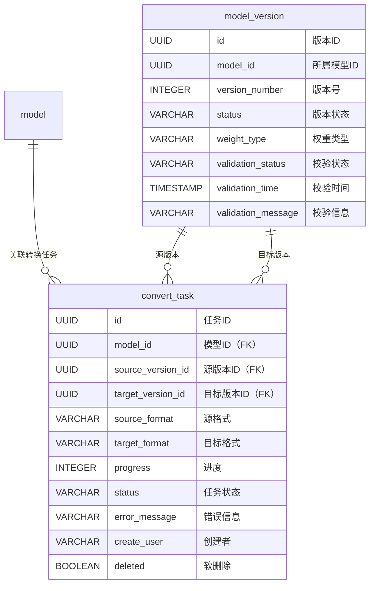
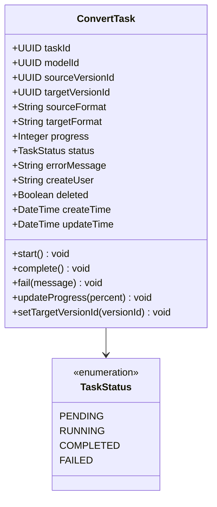
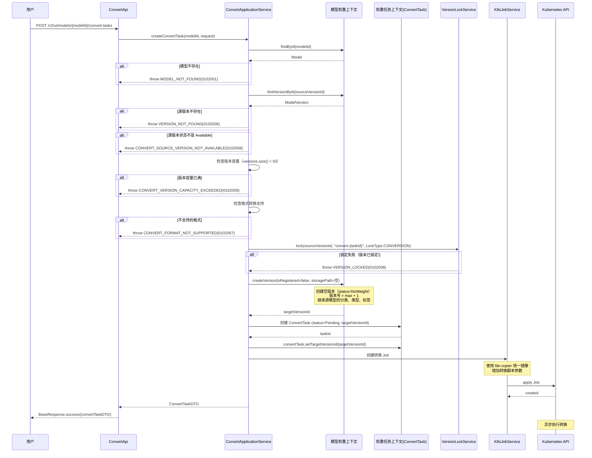
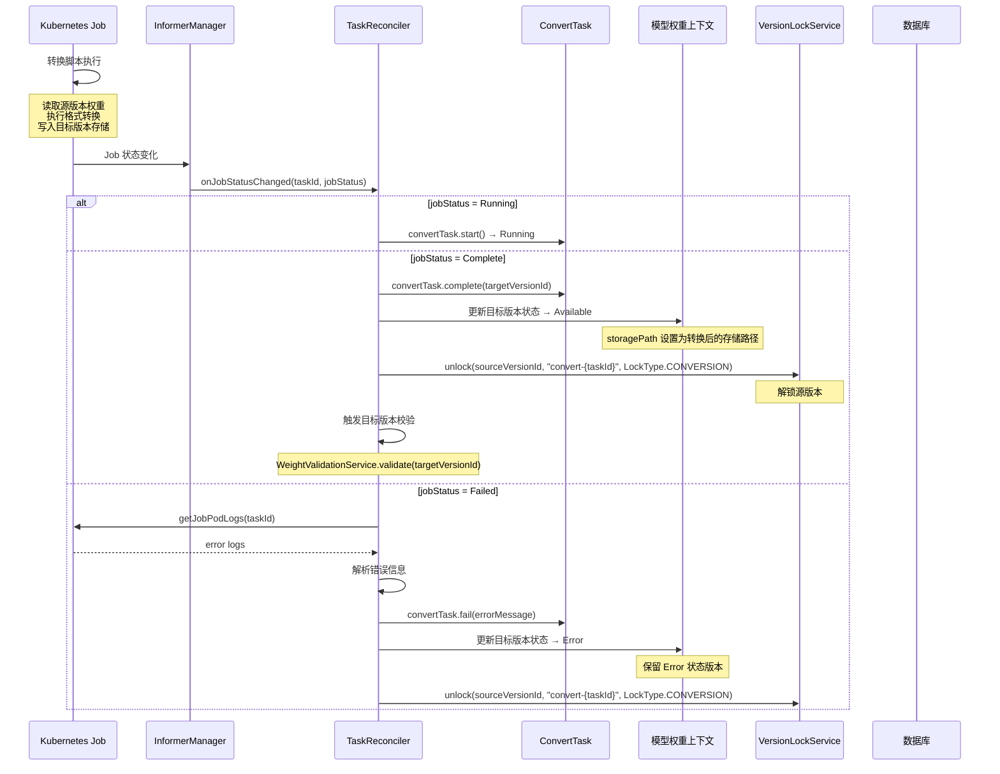
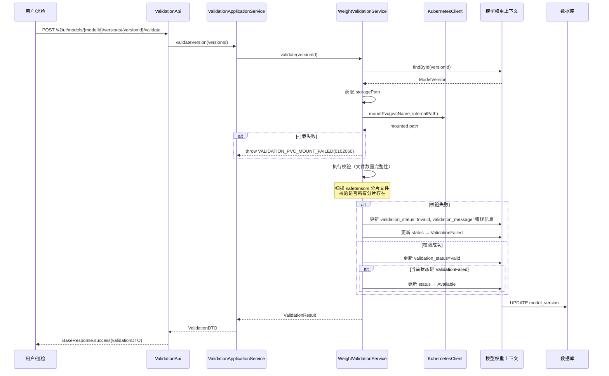
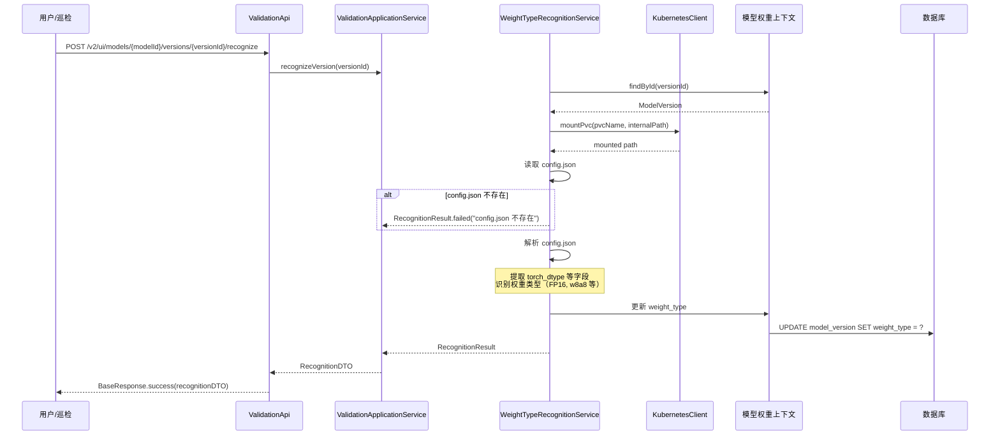
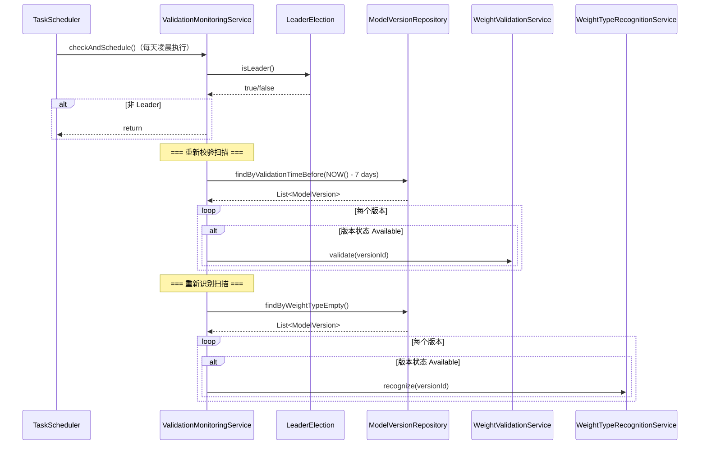
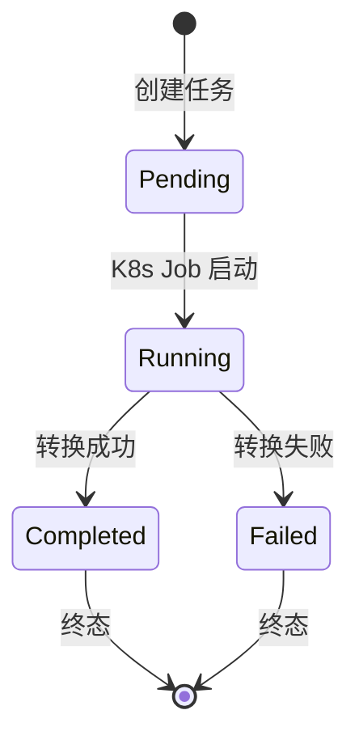
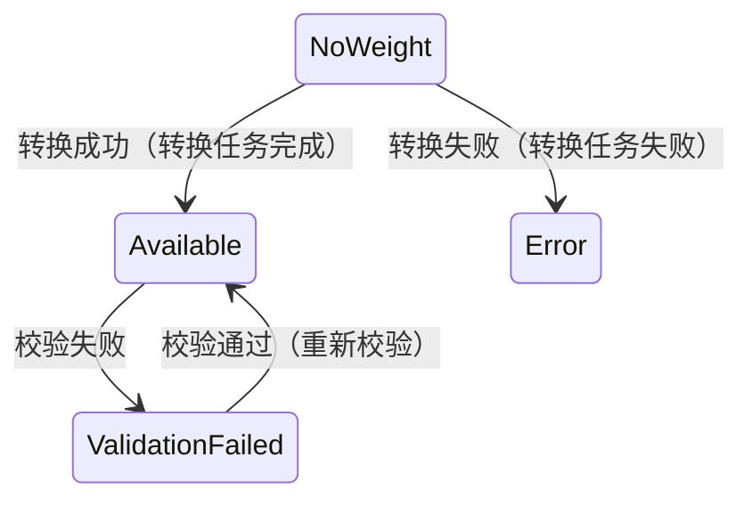

# Feature 7: 校验识别与转换 — 特性设计文档

> **文档类型**: 特性设计文档
> **文档版本**: v1.0
> **编写日期**: 2026-04-28
> **适用范围**: ModelLite 平台模型仓库模块 Feature 7
> **目标读者**: 后端开发工程师

---

## 1. 特性概述

### 1.1 目标

实现模型权重的校验、识别和转换能力。包括权重完整性校验（文件数量）、权重类型识别（解析 config.json）、权重格式转换（Megatron → Safetensors）。校验和识别在导入后自动触发，支持定期重新校验和手动触发。转换任务通过 K8s Job 异步执行，转换过程中锁定源版本。

### 1.2 范围

**IN（包含）**:
- WeightValidationService 领域服务（权重完整性校验）
- WeightTypeRecognitionService 领域服务（权重类型识别）
- ConvertTask 聚合根的领域模型实现
- ConvertTaskRepository 仓储接口与 MyBatis 实现
- ConvertApplicationService 应用服务
- 转换任务的人机接口（创建转换任务、查看任务、删除任务）
- 手动触发校验/识别的人机接口
- K8s Job 集成：转换 Job 模板、状态回调
- Leader Election 定期巡检（重新校验、重新识别）
- model_version 表新增校验相关字段
- 转换时源版本锁定（CONVERSION 锁类型）
- 转换完成后创建新版本（继承元数据）

**OUT（不包含）**:
- 上传任务的创建和管理 — Feature 4
- 版本锁管理（除 CONVERSION 类型外）— Feature 5
- 操作日志上报 — Feature 8
- SHA256 校验等扩展校验能力 — 未来扩展
- 其他格式转换（除 Megatron → Safetensors 外）— 未来扩展

### 1.3 依赖关系

| 依赖项 | 类型 | 说明 |
|--------|------|------|
| Feature 1: 基础设施与通用能力 | 特性 | 数据库 Schema（convert_task 表）、枚举定义（TaskStatus）、索引设计、错误码定义、文件后缀白名单 ConfigMap |
| Feature 3: 模型与版本生命周期 | 特性 | Model 聚合（版本创建）、ModelRepository、版本状态机 |
| Feature 4: 权重导入 | 特性 | K8s Job 集成模式、file-copier 镜像（转换任务复用） |
| Feature 5: 版本锁管理 | 特性 | VersionLockService（锁定/解锁源版本）、CONVERSION 锁类型 |
| Feature 6: 删除恢复 | 特性 | 版本删除逻辑（Error 状态版本可删除） |
| K8s 集群 | 外部系统 | 运行转换 K8s Job |
| file-copier 镜像 | 外部依赖 | 统一镜像（rsync + 进度输出 + CIFS 挂载 + 转换脚本），需增加转换脚本 |
| com.huawei.modellite.common 公共模块 | 外部依赖 | 提供 ModelLiteException、BaseResponse 等 |

### 1.4 需求追溯

| 需求编号 | 需求名称 | 本特性覆盖范围 |
|----------|----------|----------------|
| REQ-INFO-001 | 权重类型识别 | 完整实现（导入后自动触发、定期重新识别、手动触发） |
| REQ-INFO-002 | 权重文件完整性校验 | 完整实现（导入后自动触发、定期重新校验、手动触发） |
| REQ-CONVERT-001 | 权重格式转换 | 完整实现（Megatron → Safetensors，异步 K8s Job，锁定源版本） |
| REQ-CONVERT-002 | 转换任务管理 | 完整实现（查看任务、删除任务） |

### 1.5 设计决策记录

| 决策编号 | 决策内容 | 决策理由 |
|----------|----------|----------|
| F7-01 | 校验和识别在平台内直接执行，不使用 K8s Job | 执行时间短（秒级到分钟级），文件已在平台 PVC 内，可直接挂载访问判断权重状态 |
| F7-02 | 校验结果存储在 model_version 表新增字段，不新增独立表格 | 简化逻辑，避免过度设计 |
| F7-03 | 定期重新校验/识别使用 Leader Election 定时巡检 | 统一的巡检机制，扫描需要重新校验的版本 |
| F7-04 | 转换任务复用 file-copier 统一镜像，增加转换脚本 | 统一镜像管理，减少维护成本 |
| F7-05 | 转换任务创建时先创建空版本（NoWeight），转换完成后更新状态 | 与上传任务逻辑一致，版本号在任务创建时分配 |
| F7-06 | 转换后权重存储路径与上传逻辑类似（新 PVC 或 PVC 子目录） | 转换后权重是独立的新版本，应有独立存储 |
| F7-07 | 转换失败保留目标版本标记 Error 状态 | 便于排查问题，与上传失败保持一致 |
| F7-08 | 校验失败版本状态变为 ValidationFailed | 明确告知用户权重有问题，与上传后校验一致 |
| F7-09 | 转换任务锁定源版本使用 CONVERSION 锁类型 | 区分外部任务锁和内部流程锁 |

---

## 2. 数据库设计

### 2.1 新增/变更表 DDL

> 本特性涉及的 convert_task 表已在 Feature 1 中创建，DDL 不变更。
> 本特性新增 model_version 表的校验相关字段。

#### model_version 表新增字段

```sql
-- 新增校验相关字段
ALTER TABLE model_version ADD COLUMN validation_status VARCHAR(20) DEFAULT 'Unknown';
ALTER TABLE model_version ADD COLUMN validation_time TIMESTAMP WITH TIME ZONE DEFAULT NULL;
ALTER TABLE model_version ADD COLUMN validation_message VARCHAR(500) DEFAULT NULL;

COMMENT ON COLUMN model_version.validation_status IS '校验状态：Valid / Invalid / Unknown';
COMMENT ON COLUMN model_version.validation_time IS '最近校验时间';
COMMENT ON COLUMN model_version.validation_message IS '校验失败时的错误信息';
```

**字段说明**:

| 字段名 | 类型 | 默认值 | 说明 |
|--------|------|--------|------|
| validation_status | VARCHAR(20) | 'Unknown' | 校验状态：Valid（通过）、Invalid（失败）、Unknown（未校验） |
| validation_time | TIMESTAMP | NULL | 最近校验时间（最后一次校验执行时间） |
| validation_message | VARCHAR(500) | NULL | 校验失败时的错误信息（如"文件数量不完整：缺少 shard-00002.safetensors"） |

#### convert_task 表（Feature 1 已创建）

**DDL**: 见 Feature 1 §2.1。

**本特性新增业务规则**:
- 任务创建时 target_version_id 为 NULL，同时创建空版本后回填
- 转换失败时 target_version_id 对应版本状态为 Error
- 任务终态后清理 K8s Job 资源

### 2.2 表关系图（ER 图）



### 2.3 索引设计

> 索引已在 Feature 1 §2.3 中定义。本特性新增一个索引用于定期巡检。

| 表名 | 索引名 | 索引类型 | 索引字段 | 说明 | 状态 |
|------|--------|----------|----------|------|------|
| model_version | idx_version_validation_time | B-tree | validation_time WHERE deleted=FALSE | Leader 巡检扫描需要重新校验的版本 | **本特性新增** |
| convert_task | idx_convert_model | B-tree | model_id WHERE deleted=FALSE | 查询模型的转换任务 | Feature 1 已创建 |
| convert_task | idx_convert_status | B-tree | status WHERE deleted=FALSE | 按状态筛选 | Feature 1 已创建 |

**新增索引 DDL**:

```sql
CREATE INDEX idx_version_validation_time ON model_version(validation_time) WHERE deleted = FALSE;
```

### 2.4 数据字典

#### convert_task 表

| 字段名 | 类型 | 是否必填 | 默认值 | 取值范围/说明 |
|--------|------|----------|--------|---------------|
| id | UUID | Y | 应用侧生成 | 任务 ID，UUID v4 |
| model_id | UUID | Y | — | 模型 ID（外键引用 model.id） |
| source_version_id | UUID | Y | — | 源版本 ID（外键引用 model_version.id） |
| target_version_id | UUID | N | NULL | 目标版本 ID（任务创建时为 NULL，版本创建后回填） |
| source_format | VARCHAR(50) | Y | — | 源格式：如 `Megatron` |
| target_format | VARCHAR(50) | Y | — | 目标格式：如 `Safetensors` |
| progress | INTEGER | N | 0 | 进度百分比，取值 0-100 |
| status | VARCHAR(20) | Y | 'Pending' | 任务状态：`Pending` / `Running` / `Completed` / `Failed` |
| error_message | VARCHAR(2000) | N | NULL | 失败时的错误信息 |
| create_user | VARCHAR(100) | Y | — | 创建用户标识 |
| deleted | BOOLEAN | Y | FALSE | 软删除标记 |
| create_time | TIMESTAMP WITH TIME ZONE | Y | NOW() | 创建时间 |
| update_time | TIMESTAMP WITH TIME ZONE | Y | NOW() | 更新时间 |

#### ValidationStatus 枚举

| 枚举值 | 说明 |
|--------|------|
| Valid | 校验通过 |
| Invalid | 校验失败 |
| Unknown | 未校验（默认值） |

---

## 3. 领域模型设计

### 3.1 类图

#### ConvertTask 聚合



### 3.2 核心类定义

#### ConvertTask（聚合根）

**包路径**: `com.huawei.modellite.repository.modelweight.domain.aggregate.converttask`

| 字段名 | 类型 | 说明 | 约束 |
|--------|------|------|------|
| taskId | UUID | 任务唯一标识 | 创建后不可修改 |
| modelId | UUID | 关联模型 ID | 创建后不可修改 |
| sourceVersionId | UUID | 源版本 ID | 创建后不可修改 |
| targetVersionId | UUID | 目标版本 ID | 初始为 NULL，版本创建后回填 |
| sourceFormat | String | 源格式 | 创建后不可修改，如 "Megatron" |
| targetFormat | String | 目标格式 | 创建后不可修改，如 "Safetensors" |
| progress | Integer | 进度百分比 | 取值 0-100 |
| status | TaskStatus | 任务状态 | 状态机驱动 |
| errorMessage | String | 错误信息 | 仅 Failed 状态时有值 |
| createUser | String | 创建用户 | 创建后不可修改 |
| deleted | Boolean | 软删除标记 | 默认 false |
| createTime | DateTime | 创建时间 | 自动填充 |
| updateTime | DateTime | 更新时间 | 自动填充 |

**方法定义**:

| 方法名 | 参数 | 返回类型 | 说明 | 业务规则 |
|--------|------|----------|------|----------|
| createConvertTask（静态工厂） | taskId, modelId, sourceVersionId, sourceFormat, targetFormat, createUser | ConvertTask | 创建转换任务 | 前置：sourceFormat 和 targetFormat 有效；后置：status=Pending, targetVersionId=null |
| start | — | void | 启动任务 | 前置：status=Pending；后置：status=Running |
| complete | targetVersionId | void | 完成任务 | 前置：status=Running；后置：status=Completed, targetVersionId 设置，progress=100 |
| fail | message: String | void | 标记失败 | 前置：status=Running；后置：status=Failed, errorMessage=message |
| updateProgress | percent: Integer | void | 更新进度 | 前置：status=Running；校验：percent 0-100 |
| setTargetVersionId | versionId: UUID | void | 设置目标版本 ID | 在版本创建后调用 |
| isTerminal | — | boolean | 是否终态 | status ∈ {Completed, Failed} 返回 true |

#### 关键方法伪代码

**ConvertTask.start**:
```java
public void start() {
    if (this.status != TaskStatus.PENDING) {
        throw new ModelLiteException(ErrorCode.CONVERT_TASK_STATUS_CONFLICT,
                "只有 Pending 状态的任务才能启动");
    }
    this.status = TaskStatus.RUNNING;
    this.updateTime = DateTime.now();
}
```

**ConvertTask.complete**:
```java
public void complete(UUID targetVersionId) {
    if (this.status != TaskStatus.RUNNING) {
        throw new ModelLiteException(ErrorCode.CONVERT_TASK_STATUS_CONFLICT,
                "只有 Running 状态的任务才能完成");
    }
    this.status = TaskStatus.COMPLETED;
    this.targetVersionId = targetVersionId;
    this.progress = 100;
    this.updateTime = DateTime.now();
}
```

**ConvertTask.fail**:
```java
public void fail(String message) {
    if (this.status != TaskStatus.RUNNING) {
        throw new ModelLiteException(ErrorCode.CONVERT_TASK_STATUS_CONFLICT,
                "只有 Running 状态的任务才能标记失败");
    }
    this.status = TaskStatus.FAILED;
    this.errorMessage = message;
    this.updateTime = DateTime.now();
}
```

### 3.3 领域服务

#### WeightValidationService

**包路径**: `com.huawei.modellite.repository.modelweight.domain.service`

**职责**: 权重完整性校验。检查权重文件数量是否齐全（如分片 safetensors 文件是否全部存在）。

| 方法名 | 参数 | 返回类型 | 说明 |
|--------|------|----------|------|
| validate | UUID versionId | ValidationResult | 执行权重完整性校验 |
| validateAll | List\<UUID\> versionIds | Map\<UUID, ValidationResult\> | 批量校验（用于巡检） |

**ValidationResult 值对象**:

| 字段名 | 类型 | 说明 |
|--------|------|------|
| status | ValidationStatus | Valid / Invalid |
| message | String | 校验失败时的错误信息 |
| validationTime | DateTime | 校验执行时间 |

**校验逻辑伪代码**:
```java
public ValidationResult validate(UUID versionId) {
    // 1. 获取版本的存储路径
    ModelVersion version = modelVersionRepository.findById(versionId)
        .orElseThrow(() -> new ModelLiteException(ErrorCode.VERSION_NOT_FOUND));
    
    StoragePath storagePath = version.getStoragePath();
    if (storagePath == null || storagePath.isEmpty()) {
        return ValidationResult.unknown("存储路径未设置");
    }
    
    // 2. 挂载 PVC（平台内直接访问）
    String pvcName = storagePath.getPvcName();
    String internalPath = storagePath.getInternalPath();
    
    // 3. 执行校验
    //    - 检查目录存在
    //    - 扫描文件列表
    //    - 校验分片文件完整性（如 model-00001-of-00005.safetensors 到 model-00005-of-00005.safetensors）
    ValidationResult result = doValidation(pvcName, internalPath);
    
    // 4. 更新版本校验状态
    version.setValidationStatus(result.getStatus());
    version.setValidationTime(result.getValidationTime());
    version.setValidationMessage(result.getMessage());
    
    // 5. 更新版本状态（如果校验失败）
    if (result.getStatus() == ValidationStatus.INVALID) {
        version.setStatus(VersionStatus.VALIDATION_FAILED);
    } else if (version.getStatus() == VersionStatus.VALIDATION_FAILED) {
        // 校验通过后恢复 Available
        version.setStatus(VersionStatus.AVAILABLE);
    }
    
    modelVersionRepository.update(version);
    
    return result;
}
```

**分片文件完整性校验逻辑**:
```java
private ValidationResult doValidation(String pvcName, String internalPath) {
    // 挂载 PVC（KubernetesClient 获取 PVC，通过 Java 文件 API 访问）
    Path weightDir = mountPvc(pvcName, internalPath);
    
    if (!weightDir.exists()) {
        return ValidationResult.invalid("权重目录不存在");
    }
    
    // 扫描 safetensors 分片文件
    List<String> safetensorsFiles = listFiles(weightDir, "*.safetensors");
    
    // 检查分片完整性：找到最大的 shard index
    int maxShardIndex = parseMaxShardIndex(safetensorsFiles);
    // 例如找到 model-00005-of-00005.safetensors，则 maxShardIndex = 5
    
    // 校验是否所有分片都存在
    for (int i = 1; i <= maxShardIndex; i++) {
        String expectedFile = String.format("model-%05d-of-%05d.safetensors", i, maxShardIndex);
        if (!safetensorsFiles.contains(expectedFile)) {
            return ValidationResult.invalid("文件数量不完整：缺少 " + expectedFile);
        }
    }
    
    return ValidationResult.valid();
}
```

#### WeightTypeRecognitionService

**包路径**: `com.huawei.modellite.repository.modelweight.domain.service`

**职责**: 权重类型识别。解析权重目录中的 config.json 文件，识别数据精度类型（FP16、w8a8 等）。

| 方法名 | 参数 | 返回类型 | 说明 |
|--------|------|----------|------|
| recognize | UUID versionId | RecognitionResult | 执行权重类型识别 |
| recognizeAll | List\<UUID\> versionIds | Map\<UUID, RecognitionResult\> | 批量识别（用于巡检） |

**RecognitionResult 值对象**:

| 字段名 | 类型 | 说明 |
|--------|------|------|
| weightType | String | 识别结果（如 "FP16"、"w8a8"、"Unknown"） |
| success | boolean | 是否识别成功 |
| message | String | 失败时的错误信息 |

**识别逻辑伪代码**:
```java
public RecognitionResult recognize(UUID versionId) {
    ModelVersion version = modelVersionRepository.findById(versionId)
        .orElseThrow(() -> new ModelLiteException(ErrorCode.VERSION_NOT_FOUND));
    
    StoragePath storagePath = version.getStoragePath();
    if (storagePath == null || storagePath.isEmpty()) {
        return RecognitionResult.failed("存储路径未设置");
    }
    
    // 挂载 PVC
    Path weightDir = mountPvc(storagePath.getPvcName(), storagePath.getInternalPath());
    
    // 查找 config.json
    Path configFile = weightDir.resolve("config.json");
    if (!configFile.exists()) {
        return RecognitionResult.failed("config.json 不存在");
    }
    
    // 解析 config.json
    try {
        JsonObject config = parseJson(configFile);
        String weightType = extractWeightType(config);
        // 从 config.json 中提取精度类型
        // 例如：torch_dtype 字段、"w8a8" 字段等
        
        // 更新版本 weight_type 字段
        version.setWeightType(weightType);
        modelVersionRepository.update(version);
        
        return RecognitionResult.success(weightType);
    } catch (Exception e) {
        return RecognitionResult.failed("config.json 解析失败：" + e.getMessage());
    }
}
```

#### ValidationMonitoringService

**包路径**: `com.huawei.modellite.repository.modelweight.domain.service`

**职责**: 定期巡检，扫描需要重新校验/识别的版本。仅 Leader 节点执行。

| 方法名 | 参数 | 返回类型 | 说明 |
|--------|------|----------|------|
| scanAndValidate | thresholdDays | void | 扫描校验时间超过 thresholdDays 的版本，触发重新校验 |
| scanAndRecognize | thresholdDays | void | 扫描 weightType 为空或识别失败的版本，触发重新识别 |
| checkAndSchedule | — | void | Leader 巡检主入口 |

**巡检主流程伪代码**:
```java
public void checkAndSchedule() {
    if (!leaderElection.isLeader()) {
        return;
    }
    
    // 1. 扫描需要重新校验的版本（validation_time < NOW() - 7 days）
    scanAndValidate(7);
    
    // 2. 扫描需要重新识别的版本（weight_type 为空）
    scanAndRecognize(7);
}

public void scanAndValidate(int thresholdDays) {
    DateTime threshold = DateTime.now().minusDays(thresholdDays);
    List<ModelVersion> toValidate = modelVersionRepository.findByValidationTimeBefore(threshold);
    
    for (ModelVersion version : toValidate) {
        if (version.getStatus() == VersionStatus.AVAILABLE) {
            // 只校验 Available 状态的版本
            weightValidationService.validate(version.getVersionId());
        }
    }
}

public void scanAndRecognize(int thresholdDays) {
    List<ModelVersion> toRecognize = modelVersionRepository.findByWeightTypeEmpty();
    
    for (ModelVersion version : toRecognize) {
        if (version.getStatus() == VersionStatus.AVAILABLE) {
            weightTypeRecognitionService.recognize(version.getVersionId());
        }
    }
}
```

### 3.4 仓储接口

#### ConvertTaskRepository

**包路径**: `com.huawei.modellite.repository.modelweight.domain.repository`

| 方法名 | 参数 | 返回类型 | 说明 |
|--------|------|----------|------|
| save | ConvertTask | void | 保存转换任务 |
| findById | UUID taskId | Optional\<ConvertTask\> | 按 ID 查找任务 |
| findByModelId | UUID modelId | List\<ConvertTask\> | 查询模型的转换任务（按创建时间倒序） |
| findBySourceVersionId | UUID sourceVersionId | List\<ConvertTask\> | 查询源版本的转换任务 |
| findByStatus | TaskStatus status | List\<ConvertTask\> | 按状态查询任务 |
| update | ConvertTask | void | 更新任务 |
| deleteById | UUID taskId | void | 软删除任务 |

#### ModelVersionRepository 新增方法

| 方法名 | 参数 | 返回类型 | 说明 |
|--------|------|----------|------|
| findByValidationTimeBefore | DateTime threshold | List\<ModelVersion\> | 查询校验时间早于阈值的版本 |
| findByWeightTypeEmpty | — | List\<ModelVersion\> | 查询 weight_type 为空的版本 |
| updateValidationStatus | UUID versionId, ValidationStatus status, String message | void | 更新校验状态 |
| updateWeightType | UUID versionId, String weightType | void | 更新权重类型 |

### 3.5 业务不变量

| 不变量名 | 说明 | 强制方式 |
|----------|------|----------|
| 任务状态机 | 任务状态变更必须遵循状态机规则 | 代码校验（聚合根方法内） |
| 终态不可变更 | Completed/Failed 状态的任务不允许状态变更 | 代码校验（聚合根方法内） |
| 转换锁定源版本 | 转换过程中源版本必须锁定 | 应用服务调用 VersionLockService.lock |
| 转换完成解锁源版本 | 转换完成后（成功或失败）解锁源版本 | 应用服务调用 VersionLockService.unlock |
| 目标版本继承元数据 | 目标版本继承源模型的分类、类型、标签 | 应用服务创建版本时复制元数据 |
| 校验失败状态变更 | 校验失败版本状态变为 ValidationFailed | WeightValidationService 保证 |
| 校验通过恢复状态 | 校验通过后 ValidationFailed 状态恢复为 Available | WeightValidationService 保证 |

### 3.6 错误码定义

> Feature 1 已定义的错误码（本特性复用）:

| 错误码 | 枚举名 | HTTP 状态码 | 说明 | 来源 |
|--------|--------|-------------|------|------|
| 0102001 | MODEL_NOT_FOUND | 404 | 模型不存在 | Feature 1 |
| 0102006 | VERSION_NOT_FOUND | 404 | 版本不存在 | Feature 1 |
| 0102008 | VERSION_LOCKED | 400 | 版本已锁定 | Feature 1 |

> 本特性新增错误码:

| 错误码 | 枚举名 | HTTP 状态码 | 说明 |
|--------|--------|-------------|------|
| 0102054 | CONVERT_TASK_NOT_FOUND | 404 | 转换任务不存在 |
| 0102055 | CONVERT_TASK_STATUS_CONFLICT | 409 | 任务状态不允许此操作 |
| 0102056 | CONVERT_TASK_ALREADY_TERMINATED | 409 | 任务已终态，无法操作 |
| 0102057 | CONVERT_FORMAT_NOT_SUPPORTED | 400 | 不支持的格式转换 |
| 0102058 | CONVERT_SOURCE_VERSION_NOT_AVAILABLE | 400 | 源版本状态不是 Available |
| 0102059 | CONVERT_VERSION_CAPACITY_EXCEEDED | 400 | 版本数量超出限制（≥50） |
| 0102060 | VALIDATION_PVC_MOUNT_FAILED | 500 | PVC 挂载失败，无法执行校验 |

---

## 4. 接口设计

### 4.1 人机接口（User API）

#### 4.1.1 创建转换任务

| 属性 | 值 |
|------|-----|
| URL | `POST /v2/ui/models/{modelId}/convert-tasks` |
| Method | POST |
| 描述 | 创建权重格式转换任务，将源版本权重转换为新格式并保存为新版本 |

**Path Parameters**:

| 参数名 | 类型 | 必填 | 说明 |
|--------|------|------|------|
| modelId | UUID | Y | 模型 ID |

**Request Body**:
```json
{
    "sourceVersionId": "uuid-version-001",    // 源版本 ID，必填
    "sourceFormat": "Megatron",               // 源格式，必填
    "targetFormat": "Safetensors"             // 目标格式，必填
}
```

**Response Body**（成功）:
```json
{
    "code": 0,
    "message": "success",
    "data": {
        "taskId": "uuid-task-new",
        "modelId": "uuid-model-001",
        "sourceVersionId": "uuid-version-001",
        "sourceVersionNumber": 1,
        "targetVersionId": null,
        "sourceFormat": "Megatron",
        "targetFormat": "Safetensors",
        "progress": 0,
        "status": "Pending",
        "createTime": "2026-04-28T10:00:00Z"
    },
    "timestamp": "2026-04-28T10:00:00Z",
    "requestId": "req-uuid-xxx"
}
```

**错误码**:

| 错误码 | HTTP 状态码 | 说明 |
|--------|-------------|------|
| 0102001 | 404 | 模型不存在 |
| 0102006 | 404 | 源版本不存在 |
| 0102057 | 400 | 不支持的格式转换 |
| 0102058 | 400 | 源版本状态不是 Available |
| 0102059 | 400 | 版本数量超出限制（≥50） |
| 0102008 | 400 | 源版本已锁定（无法锁定） |
| 0102041 | 500 | K8s Job 提交失败 |

**业务规则**:
- **前置条件**: 模型存在、源版本存在且状态 Available、源版本未锁定、版本容量未满（<50）、格式转换支持
- **锁定源版本**: 自动锁定源版本（CONVERSION 类型）
- **创建空版本**: 创建目标版本（status=NoWeight，分配版本号）
- **提交 K8s Job**: 创建转换 Job（使用统一 file-copier 镜像 + 转换脚本）
- **继承元数据**: 目标版本继承源模型的分类、类型、标签

---

#### 4.1.2 查询转换任务详情

| 属性 | 值 |
|------|-----|
| URL | `GET /v2/ui/models/{modelId}/convert-tasks/{taskId}` |
| Method | GET |
| 描述 | 查询指定转换任务的详情 |

**Response Body**（成功）:
```json
{
    "code": 0,
    "message": "success",
    "data": {
        "taskId": "uuid-task-001",
        "modelId": "uuid-model-001",
        "sourceVersionId": "uuid-version-001",
        "sourceVersionNumber": 1,
        "targetVersionId": "uuid-version-002",
        "targetVersionNumber": 2,
        "sourceFormat": "Megatron",
        "targetFormat": "Safetensors",
        "progress": 65,
        "status": "Running",
        "errorMessage": null,
        "createUser": "user-001",
        "createTime": "2026-04-28T10:00:00Z",
        "updateTime": "2026-04-28T10:30:00Z"
    },
    "timestamp": "2026-04-28T10:30:00Z",
    "requestId": "req-uuid-xxx"
}
```

**错误码**:

| 错误码 | HTTP 状态码 | 说明 |
|--------|-------------|------|
| 0102001 | 404 | 模型不存在 |
| 0102054 | 404 | 转换任务不存在 |

---

#### 4.1.3 查询模型的转换任务列表

| 属性 | 值 |
|------|-----|
| URL | `GET /v2/ui/models/{modelId}/convert-tasks` |
| Method | GET |
| 描述 | 查询模型的所有转换任务 |

**Query Parameters**:

| 参数名 | 类型 | 必填 | 默认值 | 说明 |
|--------|------|------|--------|------|
| status | String | N | — | 按状态筛选：Pending / Running / Completed / Failed |

**Response Body**（成功）:
```json
{
    "code": 0,
    "message": "success",
    "data": [
        {
            "taskId": "uuid-task-001",
            "sourceVersionNumber": 1,
            "targetVersionNumber": 2,
            "sourceFormat": "Megatron",
            "targetFormat": "Safetensors",
            "progress": 100,
            "status": "Completed",
            "createTime": "2026-04-28T10:00:00Z"
        }
    ],
    "timestamp": "2026-04-28T10:00:00Z",
    "requestId": "req-uuid-xxx"
}
```

---

#### 4.1.4 删除转换任务记录

| 属性 | 值 |
|------|-----|
| URL | `DELETE /v2/ui/models/{modelId}/convert-tasks/{taskId}` |
| Method | DELETE |
| 描述 | 删除转换任务记录（软删除，仅删除终态任务） |

**错误码**:

| 错误码 | HTTP 状态码 | 说明 |
|--------|-------------|------|
| 0102001 | 404 | 模型不存在 |
| 0102054 | 404 | 转换任务不存在 |
| 0102055 | 409 | 任务仍在运行中，请先等待完成 |

**业务规则**:
- **前置条件**: 任务为终态（Completed/Failed）
- **软删除**: 设置 deleted=true

---

#### 4.1.5 手动触发校验

| 属性 | 值 |
|------|-----|
| URL | `POST /v2/ui/models/{modelId}/versions/{versionId}/validate` |
| Method | POST |
| 描述 | 手动触发版本权重完整性校验 |

**Response Body**（成功）:
```json
{
    "code": 0,
    "message": "success",
    "data": {
        "versionId": "uuid-version-001",
        "validationStatus": "Valid",
        "validationTime": "2026-04-28T10:00:00Z",
        "validationMessage": null,
        "versionStatus": "Available"
    },
    "timestamp": "2026-04-28T10:00:00Z",
    "requestId": "req-uuid-xxx"
}
```

**错误码**:

| 错误码 | HTTP 状态码 | 说明 |
|--------|-------------|------|
| 0102001 | 404 | 模型不存在 |
| 0102006 | 404 | 版本不存在 |
| 0102060 | 500 | PVC 挂载失败 |

**业务规则**:
- **同步执行**: 在平台内直接执行校验（不使用 K8s Job）
- **更新状态**: 校验失败版本状态变为 ValidationFailed

---

#### 4.1.6 手动触发识别

| 属性 | 值 |
|------|-----|
| URL | `POST /v2/ui/models/{modelId}/versions/{versionId}/recognize` |
| Method | POST |
| 描述 | 手动触发版本权重类型识别 |

**Response Body**（成功）:
```json
{
    "code": 0,
    "message": "success",
    "data": {
        "versionId": "uuid-version-001",
        "weightType": "FP16",
        "recognizeSuccess": true,
        "recognizeMessage": null
    },
    "timestamp": "2026-04-28T10:00:00Z",
    "requestId": "req-uuid-xxx"
}
```

**错误码**:

| 错误码 | HTTP 状态码 | 说明 |
|--------|-------------|------|
| 0102001 | 404 | 模型不存在 |
| 0102006 | 404 | 版本不存在 |
| 0102060 | 500 | PVC 挂载失败 |

---

#### 4.1.7 查询版本的校验/识别信息

| 属性 | 值 |
|------|-----|
| URL | `GET /v2/ui/models/{modelId}/versions/{versionId}/validation` |
| Method | GET |
| 描述 | 查询版本的校验和识别结果 |

**Response Body**（成功）:
```json
{
    "code": 0,
    "message": "success",
    "data": {
        "versionId": "uuid-version-001",
        "versionNumber": 1,
        "weightType": "FP16",
        "validationStatus": "Valid",
        "validationTime": "2026-04-28T10:00:00Z",
        "validationMessage": null
    },
    "timestamp": "2026-04-28T10:00:00Z",
    "requestId": "req-uuid-xxx"
}
```

---

## 5. 核心业务流程

### 5.1 创建转换任务流程



**流程说明**:
1. 查询模型和源版本
2. 校验源版本状态 Available
3. 校验版本容量 < 50
4. 校验格式转换支持
5. 锁定源版本（CONVERSION 类型）
6. 创建空版本（继承元数据）
7. 创建 ConvertTask
8. 提交 K8s Job（转换脚本）
9. 返回任务信息

### 5.2 转换任务执行流程



**流程说明**:
1. K8s Job 执行转换脚本
2. Informer Watch Job 状态变化
3. Running：更新任务状态
4. Complete：
   - 更新任务状态 Completed
   - 更新目标版本状态 Available
   - 解锁源版本
   - 触发目标版本校验
5. Failed：
   - 更新任务状态 Failed
   - 更新目标版本状态 Error（保留）
   - 解锁源版本

### 5.3 校验流程（平台内执行）



**流程说明**:
1. 查询版本信息
2. 挂载 PVC（平台内直接访问）
3. 执行校验（文件数量完整性）
4. 更新校验状态和版本状态
5. 返回校验结果

### 5.4 识别流程（平台内执行）



### 5.5 Leader 定期巡检流程



**巡检规则**:
- 执行频率：每天凌晨一次
- 重新校验条件：validation_time < NOW() - 7 天（超过 7 天未校验）
- 重新识别条件：weight_type 为空或 null
- 仅校验 Available 状态的版本（ValidationFailed 状态需要用户手动触发校验）

### 5.6 ConvertTask 状态机



### 5.7 版本状态变化（本特性范围）



**状态转换规则**:

| 当前状态 | 触发条件 | 目标状态 | 说明 |
|----------|----------|----------|------|
| NoWeight | 转换任务完成 | Available | 转换后的目标版本变为可用 |
| NoWeight | 转换任务失败 | Error | 转换失败保留 Error 状态 |
| Available | 校验失败 | ValidationFailed | 文件不完整 |
| ValidationFailed | 校验通过 | Available | 重新校验成功 |

---

## 6. K8s Job 集成设计（转换任务）

### 6.1 file-copier 统一镜像扩展

**镜像扩展内容**:
- 增加 Megatron → Safetensors 转换脚本
- 增加 `convert.py` 脚本（或其他转换工具）

**转换脚本参数**:
```bash
# 环境变量
CONVERT_MODE=true              # 标识为转换模式（vs 上传模式）
SOURCE_PVC_NAME=...            # 源版本 PVC
SOURCE_INTERNAL_PATH=...       # 源版本内部路径
TARGET_PVC_NAME=...            # 目标版本 PVC
TARGET_INTERNAL_PATH=...       # 目标版本内部路径
SOURCE_FORMAT=Megatron         # 源格式
TARGET_FORMAT=Safetensors      # 目标格式
```

**入口脚本扩展**:
```bash
#!/bin/bash

if [ "$CONVERT_MODE" = "true" ]; then
    # 转换模式
    python3 /app/convert.py \
        --source-path "/source/$SOURCE_INTERNAL_PATH" \
        --target-path "/target/$TARGET_INTERNAL_PATH" \
        --source-format "$SOURCE_FORMAT" \
        --target-format "$TARGET_FORMAT"
    
    echo '{"progress": 100, "phase": "converted"}'
else
    # 上传模式（原有逻辑）
    # 校验 + rsync 拷贝
fi
```

### 6.2 转换 Job 模板

```yaml
apiVersion: batch/v1
kind: Job
metadata:
  name: convert-{taskId}
  labels:
    modlette/convert-task-id: "{taskId}"
    modlette/model-id: "{modelId}"
    app: modlette-file-copier
spec:
  backoffLimit: 0
  activeDeadlineSeconds: 172800          # 48h 超时
  ttlSecondsAfterFinished: 86400
  template:
    spec:
      restartPolicy: Never
      containers:
        - name: file-copier
          image: {modlette-file-copier-image}
          envFrom:
            - configMapRef:
                name: convert-params-{taskId}
          volumeMounts:
            - name: source-pvc
              mountPath: /source
              readOnly: true
            - name: target-pvc
              mountPath: /target
      volumes:
        - name: source-pvc
          persistentVolumeClaim:
            claimName: {sourcePvcName}
            readOnly: true
        - name: target-pvc
          persistentVolumeClaim:
            claimName: {targetPvcName}
```

### 6.3 目标版本存储路径

转换后的权重存储路径与上传逻辑类似：

| 场景 | 目标存储路径 |
|------|-------------|
| 源版本是 NFS 纳管 | 创建新 PVC（命名 `pvc-{modelId}-v{targetVersionNumber}`），转换后权重写入新 PVC |
| 源版本是 PVC 纳管 | 使用源 PVC 的子目录（`internalPath + "-converted-{targetVersionNumber}"`） |
| 源版本是上传（NFS/PVC） | 创建新 PVC 或使用平台 PVC 的子目录 |

**简化方案**：统一创建新 PVC 存储转换后的权重，命名规则 `pvc-{modelId}-v{targetVersionNumber}`。

### 6.4 资源清理策略

| 资源 | 清理时机 | 清理方式 |
|------|----------|----------|
| Job + Pod | 任务完成 24h 后 | `ttlSecondsAfterFinished: 86400` 自动清理 |
| ConfigMap | 任务终态 24h 后 | TaskReconciler 定时扫描清理 |
| 源版本锁 | 任务终态时立即解锁 | TaskReconciler 调用 VersionLockService.unlock |

---

## 7. 测试用例

### 7.1 单元测试（领域模型）

#### 7.1.1 ConvertTask.createConvertTask — 正常创建

**Given**:
- 有效的参数：modelId, sourceVersionId, sourceFormat="Megatron", targetFormat="Safetensors"

**When**:
- 调用 `ConvertTask.createConvertTask(taskId, modelId, sourceVersionId, "Megatron", "Safetensors", "user1")`

**Then**:
- 返回 ConvertTask 对象
- status = Pending
- targetVersionId = null
- progress = 0

---

#### 7.1.2 ConvertTask.start — Pending → Running

**Given**:
- ConvertTask，status = Pending

**When**:
- 调用 `convertTask.start()`

**Then**:
- status = Running

---

#### 7.1.3 ConvertTask.complete — Running → Completed

**Given**:
- ConvertTask，status = Running，targetVersionId = null

**When**:
- 调用 `convertTask.complete(targetVersionId)`

**Then**:
- status = Completed
- targetVersionId 已设置
- progress = 100

---

#### 7.1.4 ConvertTask.fail — Running → Failed

**Given**:
- ConvertTask，status = Running

**When**:
- 调用 `convertTask.fail("转换失败：缺少必要的文件")`

**Then**:
- status = Failed
- errorMessage = "转换失败：缺少必要的文件"

---

#### 7.1.5 ConvertTask.start — Completed 状态拒绝

**Given**:
- ConvertTask，status = Completed

**When**:
- 调用 `convertTask.start()`

**Then**:
- 抛出 ModelLiteException，ErrorCode = CONVERT_TASK_STATUS_CONFLICT(0102055)

---

#### 7.1.6 ConvertTask.setTargetVersionId — 设置目标版本

**Given**:
- ConvertTask，targetVersionId = null

**When**:
- 调用 `convertTask.setTargetVersionId(uuid-version-002)`

**Then**:
- targetVersionId = uuid-version-002

---

### 7.2 集成测试（仓储）

#### 7.2.1 ConvertTaskRepository.save — 保存任务

**Given**:
- H2 内存数据库已初始化

**When**:
- 调用 `convertTaskRepository.save(convertTask)`
- 再调用 `convertTaskRepository.findById(taskId)`

**Then**:
- 查询结果存在
- status = Pending

---

#### 7.2.2 ConvertTaskRepository.findByModelId — 查询模型任务

**Given**:
- H2 数据库中某模型有 2 个转换任务

**When**:
- 调用 `convertTaskRepository.findByModelId(modelId)`

**Then**:
- 返回 2 个任务

---

#### 7.2.3 ConvertTaskRepository.findByStatus — 按状态查询

**Given**:
- H2 数据库中有 1 个 Running 任务和 2 个 Completed 任务

**When**:
- 调用 `convertTaskRepository.findByStatus(TaskStatus.RUNNING)`

**Then**:
- 返回 1 个任务

---

#### 7.2.4 ModelVersionRepository.findByValidationTimeBefore — 查询需要校验的版本

**Given**:
- H2 数据库中有 3 个版本的 validation_time < NOW() - 7 days

**When**:
- 调用 `modelVersionRepository.findByValidationTimeBefore(DateTime.now().minusDays(7))`

**Then**:
- 返回 3 个版本

---

#### 7.2.5 ModelVersionRepository.findByWeightTypeEmpty — 查询未识别的版本

**Given**:
- H2 数据库中有 2 个版本的 weight_type 为 null

**When**:
- 调用 `modelVersionRepository.findByWeightTypeEmpty()`

**Then**:
- 返回 2 个版本

---

### 7.3 集成测试（领域服务）

#### 7.3.1 WeightValidationService.validate — 校验成功

**Given**:
- 版本存在，存储路径有完整的分片文件（model-00001-of-00003 到 model-00003-of-00003）

**When**:
- 调用 `weightValidationService.validate(versionId)`

**Then**:
- 返回 ValidationResult.status = Valid
- 版本 validation_status = Valid
- 版本 validation_time 已更新

---

#### 7.3.2 WeightValidationService.validate — 校验失败（文件不完整）

**Given**:
- 版本存在，存储路径缺少 model-00002-of-00003.safetensors

**When**:
- 调用 `weightValidationService.validate(versionId)`

**Then**:
- 返回 ValidationResult.status = Invalid
- 版本 validation_status = Invalid
- 版本 validation_message = "文件数量不完整：缺少 model-00002-of-00003.safetensors"
- 版本 status = ValidationFailed

---

#### 7.3.3 WeightValidationService.validate — 恢复 Available 状态

**Given**:
- 版本当前 status = ValidationFailed
- 存储路径文件完整

**When**:
- 调用校验

**Then**:
- 版本 status = Available（恢复）
- validation_status = Valid

---

#### 7.3.4 WeightTypeRecognitionService.recognize — 识别成功

**Given**:
- 版本存在，存储路径有 config.json，torch_dtype = "float16"

**When**:
- 调用 `weightTypeRecognitionService.recognize(versionId)`

**Then**:
- 返回 RecognitionResult.weightType = "FP16"
- 版本 weight_type = "FP16"

---

#### 7.3.5 WeightTypeRecognitionService.recognize — config.json 不存在

**Given**:
- 版本存在，存储路径无 config.json

**When**:
- 调用识别

**Then**:
- 返回 RecognitionResult.success = false
- RecognitionResult.message = "config.json 不存在"

---

### 7.4 API 测试（接口层）

#### 7.4.1 POST /v2/ui/models/{modelId}/convert-tasks — 创建转换任务成功

**Given**:
- 数据库中存在模型和源版本（status=Available，isLocked=false）
- 请求参数:
```json
{
    "sourceVersionId": "uuid-version-001",
    "sourceFormat": "Megatron",
    "targetFormat": "Safetensors"
}
```

**When**:
- 调用 `POST /v2/ui/models/{modelId}/convert-tasks`

**Then**:
- HTTP 状态码 = 200
- Response.data.taskId 不为空
- Response.data.status = "Pending"
- 数据库 convert_task 新增 1 条
- 数据库 model_version 新增 1 条（status=NoWeight）
- 源版本被锁定（isLocked=true，version_lock 表新增 CONVERSION 类型锁）

---

#### 7.4.2 POST /v2/ui/models/{modelId}/convert-tasks — 源版本已锁定

**Given**:
- 源版本 isLocked=true

**When**:
- 调用创建转换任务接口

**Then**:
- HTTP 状态码 = 400
- Response.code = 0102008

---

#### 7.4.3 POST /v2/ui/models/{modelId}/convert-tasks — 版本容量已满

**Given**:
- 模型已有 50 个版本

**When**:
- 调用创建转换任务接口

**Then**:
- HTTP 状态码 = 400
- Response.code = 0102059

---

#### 7.4.4 GET /v2/ui/models/{modelId}/convert-tasks/{taskId} — 查询任务详情

**Given**:
- 数据库中存在转换任务（status=Running）

**When**:
- 调用查询接口

**Then**:
- HTTP 状态码 = 200
- Response.data.status = "Running"

---

#### 7.4.5 DELETE /v2/ui/models/{modelId}/convert-tasks/{taskId} — 删除终态任务

**Given**:
- 数据库中存在 Completed 状态的转换任务

**When**:
- 调用删除接口

**Then**:
- HTTP 状态码 = 200
- 数据库 convert_task.deleted = true

---

#### 7.4.6 DELETE /v2/ui/models/{modelId}/convert-tasks/{taskId} — 删除运行中任务拒绝

**Given**:
- 数据库中存在 Running 状态的转换任务

**When**:
- 调用删除接口

**Then**:
- HTTP 状态码 = 409
- Response.code = 0102055

---

#### 7.4.7 POST /v2/ui/models/{modelId}/versions/{versionId}/validate — 手动校验成功

**Given**:
- 版本存在，文件完整

**When**:
- 调用手动校验接口

**Then**:
- HTTP 状态码 = 200
- Response.data.validationStatus = "Valid"

---

#### 7.4.8 POST /v2/ui/models/{modelId}/versions/{versionId}/validate — 校验失败

**Given**:
- 版本存在，文件不完整

**When**:
- 调用手动校验接口

**Then**:
- HTTP 状态码 = 200
- Response.data.validationStatus = "Invalid"
- 版本 status = ValidationFailed

---

#### 7.4.9 POST /v2/ui/models/{modelId}/versions/{versionId}/recognize — 手动识别成功

**Given**:
- 版本存在，有 config.json

**When**:
- 调用手动识别接口

**Then**:
- HTTP 状态码 = 200
- Response.data.weightType 不为空

---

#### 7.4.10 GET /v2/ui/models/{modelId}/versions/{versionId}/validation — 查询校验识别信息

**Given**:
- 版本存在，已校验和识别

**When**:
- 调用查询接口

**Then**:
- HTTP 状态码 = 200
- Response.data 包含 weightType, validationStatus, validationTime

---

### 7.5 Leader 巡检测试

#### 7.5.1 ValidationMonitoringService.checkAndSchedule — Leader 执行

**Given**:
- LeaderElection.isLeader() = true
- H2 数据库中有 3 个版本的 validation_time 超过 7 天

**When**:
- 调用 `validationMonitoringService.checkAndSchedule()`

**Then**:
- 3 个版本被重新校验
- validation_time 更新为当前时间

---

#### 7.5.2 ValidationMonitoringService.checkAndSchedule — 非 Leader 不执行

**Given**:
- LeaderElection.isLeader() = false

**When**:
- 调用巡检

**Then**:
- 方法直接返回，不执行任何操作

---

**文档结束**