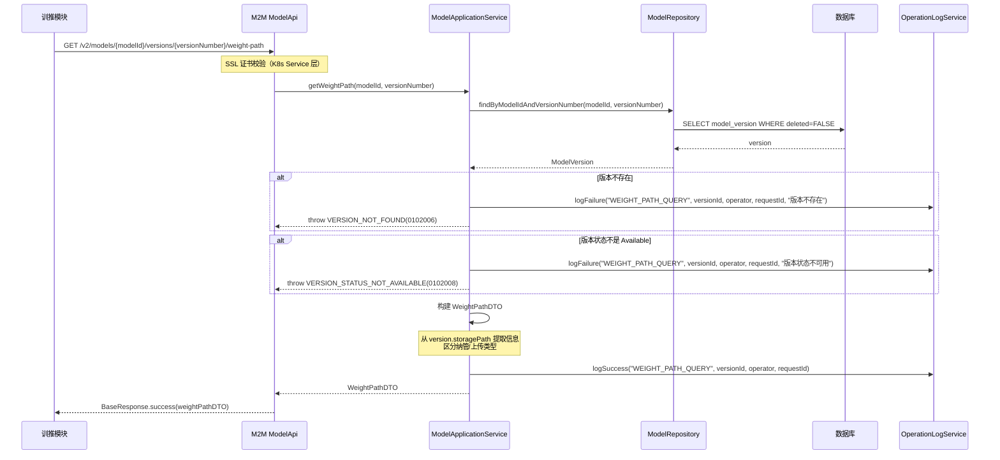
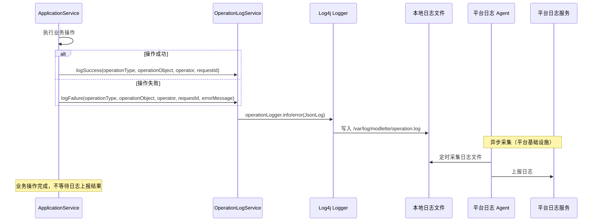

# Feature 8: 机机接口与运维 — 特性设计文档

> **文档类型**: 特性设计文档
> **文档版本**: v1.0
> **编写日期**: 2026-04-29
> **适用范围**: ModelLite 平台模型仓库模块 Feature 8
> **目标读者**: 后端开发工程师

---

## 1. 特性概述

### 1.1 目标

实现模型仓库的机机接口（M2M API）和操作日志上报能力。提供查询权重路径的 M2M 接口，供训推任务 Pod 挂载使用；记录关键操作日志并上报到平台统一日志服务；提供运维监控接口。

### 1.2 范围

**IN（包含）**:
- 查询权重路径 M2M 接口（REQ-M2M-001）
- 操作日志上报机制（REQ-LOG-001）
- 操作日志上报的触发点（各 Feature 操作成功/失败后上报）
- M2M 接口 SSL 证书校验配置（K8s Service 层）
- 运维监控接口（健康检查、统计信息）
- 操作者身份提取（从 SSL 证书或 Gateway Header）

**OUT（不包含）**:
- 其他 M2M 接口（创建模型、修改模型等）— 暂不实现，推理/训练模块通过人机接口操作
- 平台日志服务的具体实现 — 由平台统一日志服务负责
- SSL 证书管理 — 由平台安全模块负责
- 权限校验逻辑 — 各 Feature 内部已实现

### 1.3 依赖关系

| 依赖项 | 类型 | 说明 |
|--------|------|------|
| Feature 1-7 | 特性 | 各 Feature 的业务逻辑完成后触发操作日志上报 |
| 平台统一日志服务 | 外部系统 | 接收操作日志上报 |
| K8s Service 配置 | 外部依赖 | SSL 双向认证配置 |
| com.huawei.modellite.common 公共模块 | 外部依赖 | 提供 ModelLiteException、BaseResponse 等 |

### 1.4 需求追溯

| 需求编号 | 需求名称 | 本特性覆盖范围 |
|----------|----------|----------------|
| REQ-M2M-001 | 机机接口 — 查询权重路径 | 完整实现（返回 PVC 名称、内部路径、只读标记、存储类型等） |
| REQ-LOG-001 | 操作日志记录 | 完整实现（记录关键操作、上报到平台日志服务） |

### 1.5 设计决策记录

| 决策编号 | 决策内容 | 决策理由 |
|----------|----------|----------|
| F8-01 | 只实现 REQ-M2M-001（查询权重路径）M2M 接口，其他 M2M 接口暂不实现 | 推理/训练模块主要需要查询路径用于挂载；其他操作可通过人机接口 |
| F8-02 | 沿用现有的操作日志上报方式 | 利用平台现有日志上报基础设施 |
| F8-03 | SSL 证书校验在 K8s Service 层配置 | 统一的认证层，应用层不处理证书解析 |
| F8-04 | 查询权重路径接口返回完整存储信息（PVC、只读标记、源类型、NFS 信息） | 便于推理模块理解存储位置和挂载方式 |
| F8-05 | 操作日志在操作成功/失败后立即上报 | 及时记录，便于审计追溯 |
| F8-06 | 操作失败也上报日志（记录失败原因） | 完整记录操作历史，便于问题排查 |

---

## 2. M2M 接口设计

### 2.1 接口总览

| Feature | M2M 接口路径 | 说明 | 状态 |
|---------|-------------|------|------|
| **Feature 8** | `GET /v2/models/{modelId}/versions/{versionNumber}/weight-path` | 查询权重路径（本特性实现） | **新增** |
| Feature 4 | `POST /v2/models/{modelId}/versions/archive` | 训练归档 | 已实现 |
| Feature 5 | `POST /v2/models/{modelId}/versions/{versionNumber}/locks` | 锁定版本 | 已实现 |
| Feature 5 | `DELETE /v2/models/{modelId}/versions/{versionNumber}/locks` | 解锁版本 | 已实现 |
| Feature 5 | `POST /v2/models/{modelId}/versions/{versionNumber}/locks/renew` | 续约锁 | 已实现 |
| Feature 5 | `GET /v2/models/{modelId}/versions/{versionNumber}/locks` | 查询版本锁列表 | 已实现 |
| Feature 5 | `GET /v2/locks?lockerId={lockerId}` | 查询任务持有的锁 | 已实现 |

### 2.2 查询权重路径接口

| 属性 | 值 |
|------|-----|
| URL | `GET /v2/models/{modelId}/versions/{versionNumber}/weight-path` |
| Method | GET |
| 描述 | 查询模型权重版本的存储路径信息，供训推任务 Pod 挂载使用 |

**Path Parameters**:

| 参数名 | 类型 | 必填 | 说明 |
|--------|------|------|------|
| modelId | UUID | Y | 模型 ID |
| versionNumber | Integer | Y | 版本号 |

**Response Body**（成功 — NFS 纳管版本）:
```json
{
    "code": 0,
    "message": "success",
    "data": {
        "pvcName": "pvc-model-001-v3",
        "internalPath": "/weights",
        "isReadOnly": true,
        "isRegistered": true,
        "sourceType": "NFS",
        "nfsServer": "10.0.1.100",
        "nfsPath": "/data/models/glm-5/v3"
    },
    "timestamp": "2026-04-29T10:00:00Z",
    "requestId": "req-uuid-xxx"
}
```

**Response Body**（成功 — PVC 纳管版本）:
```json
{
    "code": 0,
    "message": "success",
    "data": {
        "pvcName": "user-pvc-name",
        "internalPath": "/models/glm-5/v3",
        "isReadOnly": true,
        "isRegistered": true,
        "sourceType": "PVC"
    },
    "timestamp": "2026-04-29T10:00:00Z",
    "requestId": "req-uuid-xxx"
}
```

**Response Body**（成功 — 上传版本）:
```json
{
    "code": 0,
    "message": "success",
    "data": {
        "pvcName": "pvc-model-001-v3",
        "internalPath": "/weights",
        "isReadOnly": false,
        "isRegistered": false
    },
    "timestamp": "2026-04-29T10:00:00Z",
    "requestId": "req-uuid-xxx"
}
```

**错误码**:

| 错误码 | HTTP 状态码 | 说明 |
|--------|-------------|------|
| 0102001 | 404 | 模型不存在 |
| 0102006 | 404 | 版本不存在 |
| 0102008 | 400 | 版本状态不是 Available（NoWeight/Uploading/Error 等） |

**业务规则**:
- **认证方式**: SSL 证书校验（K8s Service 层配置双向认证）
- **权限校验**: 调用方需有访问该模型版本的权限（由平台统一权限模块处理）
- **返回条件**: 版本状态必须是 Available（其他状态版本无法用于训推）
- **存储类型区分**:
  - 纳管版本（isRegistered=true）：返回 sourceType 和 NFS 相关信息（NFS 纳管时）
  - 上传版本（isRegistered=false）：只返回 PVC 信息
- **只读标记**: 纳管版本 isReadOnly=true，上传版本 isReadOnly=false

---

### 2.3 SSL 证书校验配置

**配置位置**: K8s Service 层

**配置内容**:
```yaml
apiVersion: v1
kind: Service
metadata:
  name: modlette-repository-m2m
  annotations:
    # SSL 双向认证配置（由平台运维配置）
    service.beta.kubernetes.io/aws-load-balancer-ssl-cert: "{server-cert-arn}"
    service.beta.kubernetes.io/aws-load-balancer-ssl-ports: "443"
spec:
  type: LoadBalancer
  ports:
    - name: m2m
      port: 443
      targetPort: 8080
  selector:
    app: modlette-repository
```

> **说明**: SSL 双向认证的具体配置由平台运维负责，模型仓库模块只需确保 M2M 接口在独立端口或独立 Service 上暴露。

---

## 3. 操作日志设计

### 3.1 操作日志内容规范

**日志字段**:

| 字段名 | 类型 | 说明 | 来源 |
|--------|------|------|------|
| timestamp | DateTime | 操作时间 | 系统自动生成 |
| module | String | 模块标识 | 固定值 "model-repository" |
| operator | String | 操作者身份 | Gateway Header 或 SSL 证书 |
| operationType | String | 操作类型 | 如 "MODEL_CREATE", "VERSION_DELETE" |
| operationObject | String | 操作对象 | 如 "model:uuid-xxx", "version:uuid-xxx:versionNumber=3" |
| result | String | 操作结果 | "SUCCESS" / "FAILED" |
| errorMessage | String | 失败原因 | 仅失败时有值 |
| requestId | String | 请求 ID | 请求上下文 |

**操作类型枚举**:

| 操作类型 | 说明 | 所属 Feature |
|----------|------|--------------|
| MODEL_CREATE | 模型创建 | Feature 3 |
| MODEL_MODIFY | 模型修改 | Feature 3 |
| MODEL_SOFT_DELETE | 模型软删除 | Feature 6 |
| MODEL_HARD_DELETE | 模型硬删除 | Feature 6 |
| MODEL_RESTORE | 模型恢复 | Feature 6 |
| VERSION_CREATE | 版本创建 | Feature 3/4 |
| VERSION_SOFT_DELETE | 版本软删除 | Feature 6 |
| VERSION_HARD_DELETE | 版本硬删除 | Feature 6 |
| VERSION_RESTORE | 版本恢复 | Feature 6 |
| VERSION_LOCK | 版本锁定 | Feature 5 |
| VERSION_UNLOCK | 版本解锁 | Feature 5 |
| VERSION_LOCK_RENEW | 版本锁续约 | Feature 5 |
| UPLOAD_TASK_CREATE | 上传任务创建 | Feature 4 |
| UPLOAD_TASK_PAUSE | 上传任务暂停 | Feature 4 |
| UPLOAD_TASK_RESUME | 上传任务恢复 | Feature 4 |
| UPLOAD_TASK_CANCEL | 上传任务取消 | Feature 4 |
| UPLOAD_TASK_DELETE | 上传任务删除 | Feature 4 |
| CONVERT_TASK_CREATE | 转换任务创建 | Feature 7 |
| CONVERT_TASK_DELETE | 转换任务删除 | Feature 7 |
| WEIGHT_PATH_QUERY | 权重路径查询 | Feature 8 |
| TRAINING_ARCHIVE | 训练归档 | Feature 4 |
| CATEGORY_CREATE | 分类创建 | Feature 2 |
| CATEGORY_DELETE | 分类删除 | Feature 2 |
| MODEL_TYPE_CREATE | 模型类型创建 | Feature 2 |
| MODEL_TYPE_DELETE | 模型类型删除 | Feature 2 |
| TAG_ADD | 标签添加 | Feature 2/3 |
| TAG_REMOVE | 标签移除 | Feature 2/3 |

### 3.2 操作日志上报方式

**上报方式**: 沿用平台现有日志上报机制（由平台统一日志服务采集）

**实现方式**:
- 使用 Log4j 记录操作日志到本地文件
- 平台日志服务通过 Agent 采集日志文件
- 日志格式符合平台日志规范（JSON 格式）

**Log4j 配置**:
```xml
<!-- 操作日志单独输出 -->
<Appenders>
    <RollingFile name="OperationLog" fileName="/var/log/modlette/operation.log"
                 filePattern="/var/log/modlette/operation-%d{yyyy-MM-dd}.log">
        <JsonLayout compact="true" properties="true">
            <KeyValuePair key="module" value="model-repository"/>
        </JsonLayout>
        <Policies>
            <TimeBasedTriggeringPolicy interval="1" modulate="true"/>
        </Policies>
    </RollingFile>
</Appenders>

<Loggers>
    <Logger name="OperationLog" level="info" additivity="false">
        <AppenderRef ref="OperationLog"/>
    </Logger>
</Loggers>
```

### 3.3 操作日志上报触发点

**触发时机**: 操作成功或失败后立即上报

**实现方式**: 各 Feature 的应用服务层调用 `OperationLogService` 上报日志

**上报点清单**:

| Feature | 操作 | 上报时机 | 日志内容 |
|---------|------|----------|----------|
| Feature 2 | 分类/类型创建/删除 | 操作完成后 | operator, operationType, objectId, result |
| Feature 2/3 | 标签添加/移除 | 操作完成后 | operator, operationType, objectId, result |
| Feature 3 | 模型创建/修改 | 操作完成后 | operator, operationType, objectId, result |
| Feature 3 | 版本创建 | 操作完成后 | operator, operationType, objectId, result |
| Feature 4 | 上传任务创建/暂停/恢复/取消/删除 | 操作完成后 | operator, operationType, taskId, result |
| Feature 4 | 训练归档 | 操作完成后 | operator, operationType, versionId, result |
| Feature 5 | 版本锁定/解锁/续约 | 操作完成后 | operator, operationType, versionId, lockerId, result |
| Feature 6 | 模型/版本软删除/硬删除/恢复 | 操作完成后 | operator, operationType, objectId, result |
| Feature 7 | 转换任务创建/删除 | 操作完成后 | operator, operationType, taskId, result |
| Feature 8 | 权重路径查询 | 查询完成后 | operator, operationType, versionId, result |

### 3.4 OperationLogService

**包路径**: `com.huawei.modellite.repository.modelweight.infrastructure.log`

**职责**: 封装操作日志上报逻辑

| 方法名 | 参数 | 返回类型 | 说明 |
|--------|------|----------|------|
| logSuccess | operationType, operationObject, operator, requestId | void | 记录成功操作日志 |
| logFailure | operationType, operationObject, operator, requestId, errorMessage | void | 记录失败操作日志 |
| logWithDetails | operationType, operationObject, operator, requestId, result, errorMessage, details | void | 记录完整操作日志 |

**实现伪代码**:
```java
public class OperationLogService {
    private static final Logger operationLogger = LogManager.getLogger("OperationLog");
    
    public void logSuccess(String operationType, String operationObject, 
                          String operator, String requestId) {
        OperationLog log = OperationLog.builder()
            .timestamp(DateTime.now())
            .module("model-repository")
            .operator(operator)
            .operationType(operationType)
            .operationObject(operationObject)
            .result("SUCCESS")
            .requestId(requestId)
            .build();
        
        operationLogger.info(JsonUtils.toJson(log));
    }
    
    public void logFailure(String operationType, String operationObject,
                          String operator, String requestId, String errorMessage) {
        OperationLog log = OperationLog.builder()
            .timestamp(DateTime.now())
            .module("model-repository")
            .operator(operator)
            .operationType(operationType)
            .operationObject(operationObject)
            .result("FAILED")
            .errorMessage(errorMessage)
            .requestId(requestId)
            .build();
        
        operationLogger.error(JsonUtils.toJson(log));
    }
}
```

### 3.5 操作者身份提取

**提取方式**:

| 接口类型 | 提取方式 | 来源 |
|----------|----------|------|
| 人机接口（User API） | Gateway Header | `X-User-Id` 或 `X-User-Name` |
| 机机接口（M2M API） | SSL 证书 CN | 证书 Common Name（如 "training-module"） |

**实现伪代码**:
```java
public class OperatorExtractor {
    
    public String extractOperator(HttpServletRequest request) {
        // 1. 尝试从 Header 获取（人机接口）
        String userId = request.getHeader("X-User-Id");
        if (userId != null) {
            return userId;
        }
        
        // 2. 尝试从 SSL 证书获取（机机接口）
        X509Certificate[] certs = (X509Certificate[]) request.getAttribute(
            "javax.servlet.request.X509Certificate");
        if (certs != null && certs.length > 0) {
            String cn = certs[0].getSubjectX500Principal().getName();
            // 解析 CN，如 "CN=training-module,OU=..."
            return extractCN(cn);
        }
        
        // 3. 默认值
        return "unknown";
    }
    
    private String extractCN(String dn) {
        // 解析 X500 Name，提取 CN 字段
        // ...
    }
}
```

---

## 4. 运维监控接口

### 4.1 健康检查接口

| 属性 | 值 |
|------|-----|
| URL | `GET /v2/ui/health` |
| Method | GET |
| 描述 | 检查模型仓库服务健康状态 |

**Response Body**（成功）:
```json
{
    "status": "UP",
    "components": {
        "database": "UP",
        "kubernetes": "UP"
    },
    "timestamp": "2026-04-29T10:00:00Z"
}
```

---

### 4.2 统计信息接口

| 属性 | 值 |
|------|-----|
| URL | `GET /v2/ui/statistics` |
| Method | GET |
| 描述 | 查询模型仓库的统计信息（运维监控） |

**Response Body**（成功）:
```json
{
    "code": 0,
    "message": "success",
    "data": {
        "totalModels": 120,
        "totalVersions": 350,
        "availableVersions": 300,
        "validationFailedVersions": 5,
        "uploadingVersions": 10,
        "totalUploadTasks": 15,
        "runningUploadTasks": 3,
        "totalConvertTasks": 8,
        "runningConvertTasks": 2,
        "lockedVersions": 20,
        "recycleBinModels": 15,
        "recycleBinVersions": 25
    },
    "timestamp": "2026-04-29T10:00:00Z",
    "requestId": "req-uuid-xxx"
}
```

**业务规则**:
- **RBAC**: 只有 admin 用户可查看统计信息
- **统计维度**: 模型总数、版本总数、各状态版本数、任务数、锁数、回收站数据

---

### 4.3 资源组统计接口

| 属性 | 值 |
|------|-----|
| URL | `GET /v2/ui/statistics/resource-groups` |
| Method | GET |
| 描述 | 查询各资源组的模型/版本统计 |

**Response Body**（成功）:
```json
{
    "code": 0,
    "message": "success",
    "data": [
        {
            "resourceGroup": "team-alpha",
            "modelCount": 50,
            "versionCount": 150
        },
        {
            "resourceGroup": "team-beta",
            "modelCount": 30,
            "versionCount": 80
        },
        {
            "resourceGroup": "public",
            "modelCount": 40,
            "versionCount": 120
        }
    ],
    "timestamp": "2026-04-29T10:00:00Z",
    "requestId": "req-uuid-xxx"
}
```

---

## 5. 核心业务流程

### 5.1 查询权重路径流程



**流程说明**:
1. 训推模块调用 M2M 接口查询权重路径
2. SSL 证书校验（K8s Service 层）
3. 查询版本信息
4. 校验版本状态是 Available
5. 构建返回信息（区分纳管/上传类型）
6. 上报操作日志（成功）
7. 返回权重路径信息

### 5.2 操作日志上报流程



**流程说明**:
1. 应用服务执行业务操作
2. 操作完成后调用 OperationLogService 上报日志
3. Log4j 写入本地日志文件
4. 平台日志 Agent 异步采集并上报（不阻塞业务）

---

## 6. 测试用例

### 6.1 API 测试（M2M 接口）

#### 6.1.1 GET /v2/models/{modelId}/versions/{versionNumber}/weight-path — NFS 纳管版本

**Given**:
- 数据库中存在 NFS 纳管版本（isRegistered=true, sourceType=NFS）
- 版本状态 Available

**When**:
- 调用 `GET /v2/models/{modelId}/versions/3/weight-path`

**Then**:
- HTTP 状态码 = 200
- Response.data.pvcName = "pvc-{modelId}-v3"
- Response.data.isReadOnly = true
- Response.data.isRegistered = true
- Response.data.sourceType = "NFS"
- Response.data.nfsServer 和 nfsPath 有值

---

#### 6.1.2 GET /v2/models/{modelId}/versions/{versionNumber}/weight-path — PVC 纳管版本

**Given**:
- 数据库中存在 PVC 纳管版本（isRegistered=true, sourceType=PVC）

**When**:
- 调用查询接口

**Then**:
- Response.data.pvcName = 用户提供的 PVC 名称
- Response.data.isReadOnly = true
- Response.data.sourceType = "PVC"
- Response.data 无 nfsServer/nfsPath

---

#### 6.1.3 GET /v2/models/{modelId}/versions/{versionNumber}/weight-path — 上传版本

**Given**:
- 数据库中存在上传版本（isRegistered=false）

**When**:
- 调用查询接口

**Then**:
- Response.data.pvcName = 平台 PVC 名称
- Response.data.isReadOnly = false
- Response.data.isRegistered = false
- Response.data 无 sourceType

---

#### 6.1.4 GET /v2/models/{modelId}/versions/{versionNumber}/weight-path — 版本不存在

**Given**:
- 数据库中无该版本

**When**:
- 调用查询接口

**Then**:
- HTTP 状态码 = 404
- Response.code = 0102006

---

#### 6.1.5 GET /v2/models/{modelId}/versions/{versionNumber}/weight-path — 版本状态不可用

**Given**:
- 版本状态 NoWeight 或 Uploading

**When**:
- 调用查询接口

**Then**:
- HTTP 状态码 = 400
- Response.code = 0102008

---

### 6.2 运维监控接口测试

#### 6.2.1 GET /v2/ui/health — 健康检查

**When**:
- 调用 `GET /v2/ui/health`

**Then**:
- HTTP 状态码 = 200
- Response.status = "UP"

---

#### 6.2.2 GET /v2/ui/statistics — 统计信息

**Given**:
- 当前用户是 admin

**When**:
- 调用 `GET /v2/ui/statistics`

**Then**:
- HTTP 状态码 = 200
- Response.data.totalModels 有值
- Response.data.totalVersions 有值

---

#### 6.2.3 GET /v2/ui/statistics — 非admin拒绝

**Given**:
- 当前用户非 admin

**When**:
- 调用统计接口

**Then**:
- HTTP 状态码 = 403

---

### 6.3 操作日志测试

#### 6.3.1 操作成功日志上报

**Given**:
- 执行模型创建操作，成功

**When**:
- 调用 `OperationLogService.logSuccess("MODEL_CREATE", "model:uuid-xxx", "user-001", "req-xxx")`

**Then**:
- 日志文件 /var/log/modlette/operation.log 新增一条 JSON 日志
- 日志内容包含：module, operator, operationType, result="SUCCESS"

---

#### 6.3.2 操作失败日志上报

**Given**:
- 执行模型创建操作，失败（名称重复）

**When**:
- 调用 `OperationLogService.logFailure("MODEL_CREATE", "model:uuid-xxx", "user-001", "req-xxx", "模型名称已存在")`

**Then**:
- 日志文件新增一条 JSON 日志
- 日志内容包含：result="FAILED", errorMessage="模型名称已存在"

---

#### 6.3.3 M2M 接口日志上报

**Given**:
- 训练模块调用查询权重路径接口

**When**:
- 查询成功

**Then**:
- 日志 operator = SSL 证书 CN（如 "training-module"）
- operationType = "WEIGHT_PATH_QUERY"

---

**文档结束**